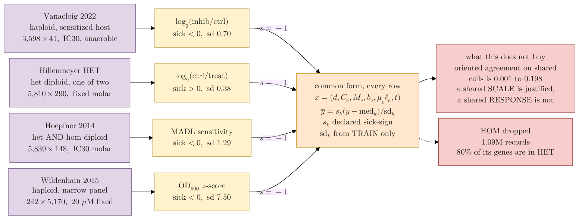

## 2026.09.27 - One row per dataset: what it measures, what it reports, how it joins

Read left to right, one row per served dataset. The left column is what the record IS, the
middle is what it REPORTS, and the right is the common form both are mapped into. The common
form is the same for every row, which is what "unified" means here: one input tuple and one
scalar target, with the per-source differences absorbed by a token rather than by a separate
model.

The figure carries the structure; the per-dataset numbers are in the companion table (t11 of
`notes-tex/031-unified-representation`, generated from `dataset_distributions.csv` and
`cross_dataset_pair_overlap.csv`). Keeping the counts out of the boxes is what lets the
diagram render at a readable size across the text block.

Every quantity is measured by a script under
`experiments/031-env-chemgen-inhibitor-tolerance/scripts/`. The three operations in the right
column are the only per-source transformations, and each exists because something was
measured, not because a dataset felt different:

- **orient** multiplies by the source's declared sick-sign. Without it two records measuring
  the same gene under the same compound carry opposite labels. Measured in
  `dataset_joinability.py`: the declared polarity predicts all 10 pairwise correlation signs,
  and Hillenmeyer HET against Hoepfner reads -0.118 over 170,837 shared cells as served.
- **standardize** divides by the source's own training-split standard deviation. The served
  standard deviations span 0.38 to 7.50, a factor of 20, so a pooled squared-error loss
  without this is a Wildenhain loss.
- **token** is the per-entry source one-hot. It carries the residual scale and offset and
  every physical field, because each physical field is constant within a dataset
  (`physical_axis_coverage.py`).

Mermaid escapes a literal `<` into `&lt;` before KaTeX sees it, which prints as `lt;`. The
comparisons below are written `\lt` and `\gt` for that reason.

Render with
`bash notes/assets/publish/scripts/mermaid_pdf.sh notes/experiments.031-env-chemgen-inhibitor-tolerance.mermaid.dataset-unification.md`.

**What the diagram asserts, and the evidence.**

- The four rows map onto ONE input tuple with no per-source input branch. The only per-source
  objects are a scalar sign, a scalar scale and a token.
- The sign is not a convenience. As served, Hillenmeyer HET and Hoepfner correlate at -0.118
  over 170,837 shared (gene, compound) cells, and Hillenmeyer HOM and Hoepfner at -0.198 over
  100,276. Pooling without orienting trains on contradictory labels at that scale.
- Standardizing uses the TRAIN split's statistics per source, never the full dataset, so no
  held-out value informs the scale.
- The last box is the honest limit. After orienting, the best cross-dataset agreement on
  shared cells is 0.198 and the median is 0.068, so these datasets agree about a gene's
  general fragility far more than about its response to a particular compound. That is why
  the expected gain is a gene prior and a wider compound space rather than more labels for
  the same task.

**A note on how this file was nearly lost.** `dendron-cli note write` on an EXISTING note
replaces it with a bare frontmatter stub. It is for new notes only; an existing note is edited
in place. The rendered PDF, SVG and PNG under `notes/assets/pdf-output/` survived, so the
figure was recoverable, but the source would not have been.
