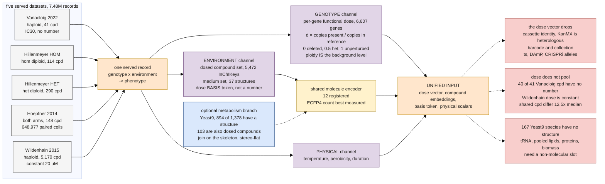

## 2026.09.27 - One input representation for five chemogenomic datasets

Every quantity in this diagram is measured, from the scripts under
`experiments/031-env-chemgen-inhibitor-tolerance/scripts/`. The five datasets differ on ploidy,
on compound panel and on dose regime, and the diagram shows which of those three a single input
representation can absorb and which it cannot. Render with
`bash notes/assets/publish/scripts/mermaid_pdf.sh notes/experiments.031-env-chemgen-inhibitor-tolerance.mermaid.unified-input.md`.

Colors follow the draw.io palette: gray = a served dataset, purple = a per-record input channel,
yellow = a fixed table, orange = computation, blue = an optional branch, red = what the
representation cannot carry.

**What the diagram asserts, and the evidence.**

- The genotype channel is lossless for these five on the dosage axis, because every perturbation in
  all five is either a full deletion or a one-of-two engineered copy-number variant. Verified
  against the built stores.
- Ploidy needs no separate feature because the vector's background level is the ploidy, so a
  haploid deletion at 0 against a background of 1 stays distinguishable from a homozygous diploid
  deletion at 0 against a background of 2.
- The channel is learnable, not merely expressible: Hoepfner supplies 648,977 gene-by-compound
  cells measured both heterozygous and homozygous.
- Dose enters as a basis token rather than a number, because the three regimes are not
  convertible. Hoepfner is the only dataset carrying both a molar value and an IC30 basis, and it
  shares two compounds with Vanacloig, so it cannot calibrate the panel.
- The medium and the metabolite branch share the compound encoder because 30 of 37 media
  components are Yeast9 metabolites.
