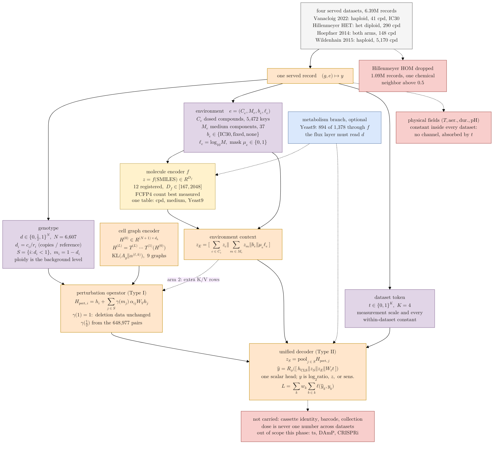

## 2026.09.27 - One input representation and one decoder for four chemogenomic datasets

Every quantity in this diagram is measured, from the scripts under
`experiments/031-env-chemgen-inhibitor-tolerance/scripts/`. The boxes carry the tensor each
channel is, in the notation of the cell graph transformer notes
([[torchcell.models.equivariant_cell_graph_transformer.mermaid.type-i-ii]]): $N$ genes,
$d_h$ the hidden width, $S$ the perturbed set, $H_{\mathrm{pert}}$ the Type I output, $R_\phi$
a Type II readout. Render with
`bash notes/assets/publish/scripts/mermaid_pdf.sh notes/experiments.031-env-chemgen-inhibitor-tolerance.mermaid.unified-input.md`.

Colors follow the draw.io palette: gray = the served records, purple = a per-record input
channel, yellow = a fixed table, orange = computation, blue = an optional branch, red = what
the representation cannot carry or deliberately drops.

The two decisions taken on 2026.09.27 are drawn in: the Hillenmeyer homozygous arm is dropped,
and the functional dose scales the existing cross-attention perturbation operator through
$\gamma(m_j)$ rather than entering as a separate feature. The physical fields have no channel
because, measured across the five datasets, every one of them is constant within a dataset
(`physical_axis_coverage.py`), so the dataset token already carries them.

Layout note: the top-level direction is `TB` and the four datasets are lines inside ONE box
rather than four boxes. Five parallel source boxes put five labels on one rank and rendered at
a 4.5-to-1 aspect ratio, which at text width prints the math near 1.5 pt.

**What the diagram asserts, and the evidence.**

- The genotype channel is lossless for these datasets on the dosage axis, because every
  perturbation is either a full deletion or a one-of-two engineered copy-number variant
  (`audit_ploidy_representation.py`, read from the built stores).
- Ploidy needs no separate feature because the vector's background level is the ploidy, so a
  haploid deletion at 0 against a background of 1 stays distinguishable from a homozygous diploid
  deletion at 0 against a background of 2.
- The operator scaling reproduces the present model exactly when $\gamma(1) = 1$, since every
  record in every current dataset is a deletion with $m_j = 1$. What $\gamma(\tfrac{1}{2})$ should
  be is learned from Hoepfner's 648,977 gene-by-compound cells measured in both arms.
- Dose enters as a basis token and a masked log molar value rather than one number, because the
  three regimes are not convertible (`environment_axis_coverage.py`).
- The physical fields are constant within every dataset: temperature is stated for 1 to 2 percent
  of Hillenmeyer records and is 30 C everywhere else, only Vanacloig is anaerobic, pH is stated
  only in Vanacloig and 2 percent of Hillenmeyer HOM (`physical_axis_coverage.py`). A channel for
  them would be the dataset token under another name.
- The medium and the metabolite branch share the compound encoder because 30 of 37 media
  components are Yeast9 metabolites (`yeast9_molecule_coverage.py`).
- The dataset token at the readout is the mechanism smoke-tested in experiment 030 (GilaHyper job
  2867): a synthetic per-source offset of 0.3 was recovered as 0.285.
