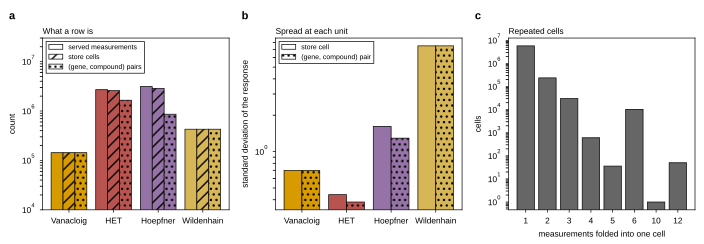
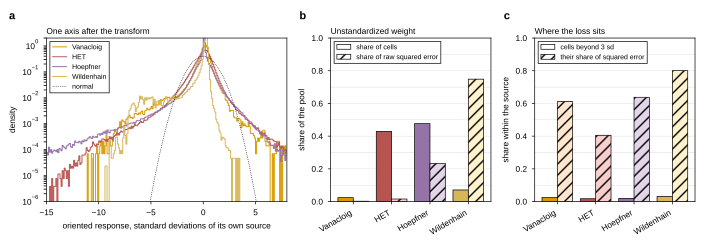
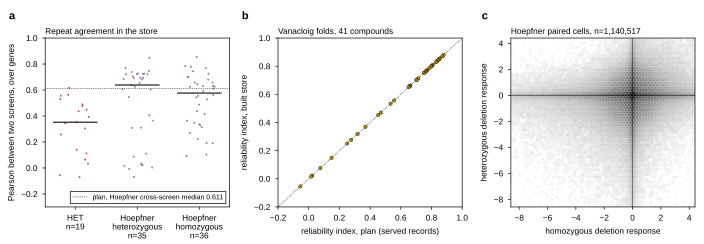

## 2026.09.29 - The three figures of the post-query analysis

Drawn from the tables [[experiments.033-env-chemgen-pooled.scripts.store_against_plan]]
wrote, on the full store (slurm 3004). `--stable` writes the names below, which
`notes-tex/033-post-query-analysis` converts with `make plots`.

