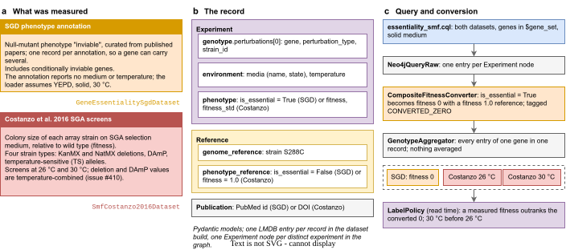

## 2026.09.29 - Showcase group 1: essentiality and single-mutant fitness

Experiment 034 generates every table, figure, record dump and query result on the public showcase pages (`docs/source/showcase/`), per Decision 8 of [[plan.data-release-program.2026.09.29]] and issue #470. Group 1 is gene essentiality (`GeneEssentialitySgdDataset`) with Costanzo 2016 single-mutant fitness (`SmfCostanzo2016Dataset`).

- [[experiments.034-showcase-datasets.scripts.essentiality_smf]]: reads the two dev-tree stores, writes the record dumps, summary tables, figures and provenance table.
- [[experiments.034-showcase-datasets.scripts.query_essentiality_smf]]: runs the supported query `torchcell/knowledge_graphs/queries/essentiality_smf.cql` against the served release under slurm (job 3029) and writes the query fragment.
- Diagram: `notes/assets/drawio/showcase-essentiality-smf.drawio`, exported to `notes/assets/images/034-showcase-datasets/showcase-essentiality-smf.{svg,png,pdf}`.

Layout: `scripts/` (generators and the slurm launcher), `results/` (the JSON every fragment is printed from), `slurm/output/` (git-ignored logs). Fragments land in `docs/source/showcase/_generated/<page>/`; SVGs are copied there from `ASSET_IMAGES_DIR/034-showcase-datasets/`.
