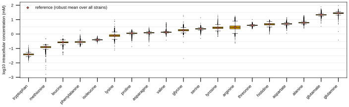
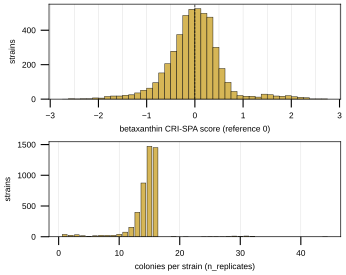
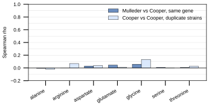

## 2026.09.29 - Store summaries for the amino-acid + betaxanthin page

Reads the dev-tree stores `amino_acid_mulleder2016`, `amino_acid_cooper2010` and `betaxanthin_cachera2023` under `$DATA_ROOT/data/torchcell/` read-only (all three `fresh` under `python -m torchcell.provenance.build_manifest` on 2026-09-29; none rebuilt), the committed query result `experiments/034-showcase-datasets/results/amino_acid_betaxanthin_query.json`, and the query job's cached raw LMDB (`$DATA_ROOT/data/torchcell/showcase_amino_acid_betaxanthin/raw/lmdb`; the script never opens Neo4j). Writes `record_mulleder.md`, `record_cooper.md`, `record_cachera.md`, `summary_tables.md`, `served_vs_dev.md`, `cachera_sources.md`, `figures.md` and `provenance.md` to `docs/source/datasets/scerevisiae/_generated/amino-acid-betaxanthin/`, and `experiments/034-showcase-datasets/results/amino_acid_betaxanthin_summary.json`.

Measured (summary JSON of the 2026.09.29 run):

- Stores: Mulleder 4,678 records, 19 keys, mM; Cooper 4,313 records over 4,291 genes, 17 keys, linear ratio to the plate mean; Cachera 4,719 records, one key, 38 with a NaN SE.
- Served vs dev: only Cooper's content sha256 equals the release's. Mulleder differs only in `environment.media` (dev `SM_AGAR`, served `SM` stub); Cachera only in `perturbed_gene_name` (3,930 records, issue #195 renames). No phenotype field differs. 13 Cachera deletions are of genes outside `SCerevisiaeGenome.gene_set`, which is the gap between 4,719 served and 4,706 returned.
- Mulleder vs Cooper, Spearman per shared single-amino-acid key over about 3,750 to 4,070 genes: -0.006 to 0.059. Cooper's own duplicate strains (39 to 47 pairs from the build ledger): -0.021 to 0.133. Both are near zero; why is not measured.
- The Cachera deletions of *ARO4* (YBR249C) and *ARO7* (YPR060C) have the cassette's own gene set as their `GenotypeAggregator` key, so they share one processed record.
- The Cachera paper OCR (sha256 `5fb7310d...`) places the screen on "YPD-G418" (line 117), calls the readout a geometric mean of HSV Value and Saturation (line 58), and holds no line with a degree sign or the word "temperature"; the loader stores SC, solid, 30 C and a fluorescence `measurement_type`. No issue filed yet.

