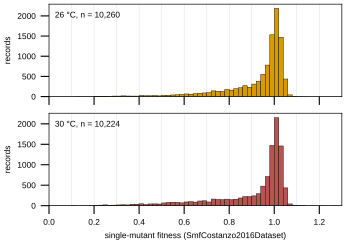
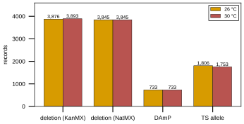

## 2026.09.29 - Store summaries for the essentiality + SMF page

Reads `$DATA_ROOT/data/torchcell/gene_essentiality_sgd/processed/lmdb` and `$DATA_ROOT/data/torchcell/smf_costanzo2016/processed/lmdb` read-only, resolving interned `$ref` pointers the way `ExperimentDataset.get_single_item` does. Writes `record_essentiality.md`, `record_smf.md`, `summary_tables.md`, `figures.md` and `provenance.md` to `docs/source/showcase/_generated/essentiality-smf/`, and `experiments/034-showcase-datasets/results/essentiality_smf_summary.json`.

Measured from the stores (results JSON of the 2026.09.29 run):

- Essentiality: 1,329 records, 1,140 genes, all `is_essential = True`, 113 PubMed ids; the converter would emit 1,329 fitness-0 records and drop none.
- SMF: 20,484 records, 5,493 genes, 10,277 strain ids; 8,454 strains carry identical 26 C and 30 C records (3,876 KanMX, 3,845 NatMX, 733 DAmP; issue #410), 1,753 TS strains carry two different values, 70 strains appear at one temperature.
- Overlap: 907 of the 1,140 SGD-essential genes have at least one SMF record, 233 have none. At 30 C, 20 KanMX and 23 NatMX deletion strains of SGD-essential genes carry a measured fitness (medians 0.9515 and 0.9503).

Per-strain-type tables use 30 C: deletion and DAmP values are temperature-combined in the source, so the 30 C record holds that value once, and 30 C is the first Costanzo source in the default `LabelPolicy`.

