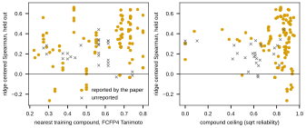

## 2026.09.29 - Vanacloig alone, compound-cold: design and the first finished arm

The first modeling experiment of the inhibitor-tolerance line. The question is whether the
cell graph transformer predicts Vanacloig 2022 for a compound it has not seen once the
compound reaches the readout. Plan: `notes-tex/031-unified-representation` (PR #436). Store
check: `notes-tex/033-post-query-analysis` (PR #455). This branch is PR #473.

**Inputs, by path.** The cell table of experiment 033
(`$DATA_ROOT/experiments/033-env-chemgen-pooled/cell_table/cell_table.parquet`, slurm 2988)
and the FCFP4 table of experiment 031 (`results/embeddings/fcfp4_count.npz`). 143,218 cells,
3,598 queried genes, 41 compounds.

**Strain.** Every strain is the queried deletion plus the three host deletions (PDR1, PDR3,
SNQ2), so the perturbation set has four genes and three are constant. The library is not
BY4741: Piotrowski 2017 builds the host deletions in the SGA query strain Y7092 (Y13206)
and crosses it to the MATa deletion array, so each strain is a haploid segregant of two
S288C-derived parents. The selection Piotrowski describes (canavanine and thialysine)
implies the query strain's `can1` and `lyp1` deletions are present as well, which the
loader does not record, and no SGA-derived loader does. The background is constant across
the library, so none of this changes a Vanacloig-only result.

**Split and score.** Five grouped folds over compounds
([[experiments.035-env-chemgen-vanacloig-cgt.scripts.vanacloig_data]]); every compound is
tested once; four validation compounds per fold pick the epoch. Per held-out compound,
Spearman over its genes, raw and centered, beside the compound's ceiling. Each side of the
centered score is centered by its OWN mean over the training compounds. Subtracting the
measured gene mean from the prediction rewarded an untrained model: 0.356 centered and
-0.001 raw at 60 steps (slurm 3009).

**Same-fold references**
([[experiments.035-env-chemgen-vanacloig-cgt.scripts.baselines_same_folds]]), median
Spearman over the 41 test compounds, 28 or 29 training compounds per fold:

| model | raw | centered |
|---|---|---|
| gene mean | 0.209 | undefined |
| ridge on FCFP4 | 0.286 | 0.316 |

These agree with the 031 leave-one-compound-out values (0.212, 0.311).

**Arms** ([[experiments.035-env-chemgen-vanacloig-cgt.scripts.train_vanacloig_cgt]]): the
encoder is used unchanged and the readout is built in the experiment, `[h_CLS ; z_S ; z_E]`
with `z_S` the sum of the perturbed embeddings over the four genes and `z_E` a projection of
`log1p` of the fingerprint. Model half from the 025 replication config; batch 256, 12 epochs,
AdamW with a one-cycle schedule to 5e-4. Batch 512 with the graph prior ran out of memory at
44 GB (slurm 3010).

| arm | launch | slurm | state on 2026.09.29 16:40 |
|---|---|---|---|
| `embedding_env`, no encoder | CPU | 3020 | finished, 5 folds |
| `cgt_env`, graph prior 1 | GPU | 3016 | partial, fold 0 at epoch 2 of 12 |
| `cgt_env`, graph prior 0 | GPU | 3017 | partial, fold 0 at epoch 3 of 12 |
| `cgt_genes`, floor, folds 0 and 1 | GPU | 3019 | queued |

**Finished: the embedding table is below ridge.** `embedding_env` over all 41 test compounds
at the validation-selected epoch
([[experiments.035-env-chemgen-vanacloig-cgt.scripts.summarize_round]],
`results/round_summary.csv`): median Spearman 0.134 centered against ridge 0.316 on the same
compounds, above ridge on 14 of 41; 0.190 raw against ridge 0.286 and gene mean 0.209. Per
fold the centered median runs from 0.005 to 0.318. Validation loss is unstable: the last
epoch's validation MSE is 9.12 on fold 3 and 1.12 on fold 1 against 0.30 to 0.54 on the
others.

**Observed, not explained.** Sodium glyoxylate has a reliability index at or below zero, so
its ceiling is recorded as zero, and both the embedding arm (0.402) and ridge (0.316) score
it well above zero on the centered target.

## 2026.09.29 - Without the graph prior the encoder collapses every gene token

Measured by [[experiments.035-env-chemgen-vanacloig-cgt.scripts.diagnose_token_collapse]]
(slurm 3024, `results/token_collapse.csv`) on 512 sampled genes and 512 sampled strains per
checkpoint. "Across share" is the fraction of the tokens' total squared norm that varies
across rows: 1 is every row distinct, 0 is every row identical.

| model | gene tokens, across share | strain summary, across share | prediction sd over strains | over compounds |
|---|---|---|---|---|
| transformer at initialization | 0.073 | 0.005 | 0.011 | 0.001 |
| transformer, prior 0, fold 0 | 0.0000 | 0.0000 | 0.0000 | 0.539 |
| transformer, prior 0, fold 1 | 0.0002 | 0.0000 | 0.0000 | 0.119 |
| transformer, prior 1, fold 0 (epoch 10 of 12) | 0.399 | 0.562 | 0.031 | 0.418 |
| embedding table, 5 folds | none | 0.28 | 0.07 to 0.57 | 0.19 to 0.71 |

Without the prior, training drives all 6,607 gene tokens onto one vector: the strain
summary is identical for every strain and the prediction is one value per compound. That is
the round-1 symptom: train MSE flat at 0.60 (fold 0) and 0.975 (fold 1), within-compound raw
Spearman near zero. Fold 0 of that arm was selected at 0.063 centered. The arm was cancelled
after fold 1 (slurm 3017), and the genes-only floor with it (slurm 3019), since neither could
be read while the encoder collapses.

With the prior at 1 the tokens stay distinct, and fold 0 was still improving at epoch 10 of
12 (test centered median 0.129, raw 0.024). Its prediction still varies 14 times more over
compounds than over strains.

Hypothesis (untested): the encoder starts near collapse, with gene tokens at a mean cosine of
0.93 at initialization, and nothing but the graph prior pushes them apart, because a readout
that can fit the compound effect alone gets most of its loss reduction without them.

**Next arm, launched.** The prior at 1 plus an identity skip: the strain's genes summed from
the encoder's input embedding table, passed to the readout beside the transformer summary
(`model.identity_skip`, slurm 3025). It asks whether the transformer adds anything once strain
identity cannot be lost.

## 2026.09.29 - Model search: best compound-inductive model on Vanacloig alone

**Question.** Which model predicts the Vanacloig gene profile of a compound it has never seen,
from the compound's embedding alone, and does the cell graph transformer beat the simpler
ones? Budget: 48 hours, two GPUs, beside the two round-1 GPU jobs (slurm 3016, 3030) that
finish tonight.

**Data.** 143,218 cells: 3,598 queried genes by 41 compounds, 97% filled, one measurement per
cell (mean of three biological replicates). Median served SE 0.138 against a response sd of
0.699. Median per-compound ceiling 0.834 (square root of the reliability index).

**Protocol, fixed before any result.**

- Compound-cold folds of `vanacloig_data.make_folds`, 5 folds, fold seeds 0, 1 and 2.
- Every choice is nested. The ladder picks options by leave-one-compound-out over the fold's
  non-test compounds. The neural models pick their step on the fold's 4 validation compounds.
  The test compounds never influence a choice.
- The primary target is centered Spearman, per compound, and the headline statistic is its
  median over the 41 compounds.
- Every model is compared PAIRED against two references on the same compounds, with a
  bootstrap interval over compounds (`compare_models.py`). The references are nested ridge on
  FCFP4 (`ladder:krr|linear:fcfp4_count`) and the ladder's whole-pipeline pick
  (`ladder:selected`).
- Test centering for the ladder and the factorized models uses the mean over the fold's
  non-test compounds. Round 1 (`train_vanacloig_cgt.py`, `baselines_same_folds.py`) centered on
  the 28 training compounds, so those numbers are not paired with round 2.

**Rounds.**

1. `baseline_ladder.py`: kernel ridge and nearest-neighbor maps over 12 compound embeddings
   and their kernels (slurm 3034).
2. `train_factorized.py`, `conf/factorized/r2_table.yaml`: a learned gene table times a
   compound encoder, bilinear or MLP head, 5 folds by 3 seeds plus the seed ensemble
   (slurm 3035).
3. The same trainer with the cell graph transformer as the gene encoder,
   `conf/factorized/r2_cgt.yaml`. One encoder pass per strain per step, not per cell.
4. Hypothesis to test if Vanacloig alone plateaus: pretrain the compound encoder on the other
   chemogenomic stores, excluding every Vanacloig compound. Wildenhain has 5,170 compounds on
   242 genes, Hillenmeyer heterozygous has 303 compounds and Hoepfner 148 with InChIKeys.
   Wildenhain shares 10 of the 41 Vanacloig compounds, and Hoepfner and Hillenmeyer 2 each.

## 2026.09.29 - Audit of the ingestion, and what it changes for the scoring

A full reread of the paper, Piotrowski 2017 and the GEO raw counts against the loader and the
cell table (issue #501 holds the report; issue #500 the strain background). The parquet
reproduces the loader's formula exactly, the sign is right (benomyl TUB3 is the most depleted
strain), `response_ses` is the replicate SD over sqrt(3), and every InChIKey matches its
name. Three findings bear on modeling:

- Nine served compounds were never reported by the paper, and their replicate reliability is
  near or below zero (sodium glyoxylate -0.91, sodium butyrate -0.43). They stay in the folds;
  `compare_models.py` reports every model over all 41 and over the 32 published compounds
  (`vanacloig_data.UNREPORTED_COMPOUNDS`).
- The loader normalizes by library size (CPM) where the paper used TMM. That leaves a
  compound-wide offset (crystal violet -2.8 log2 units) that a within-compound Spearman does
  not see; per-compound rank agreement with an edgeR reconstruction is 0.975 median.
- DMSO-delivered compounds carry the vehicle's own profile (r 0.58 to 0.67 with the DMSO
  column) and no DMSO in their environment. Which compounds those are is in the unmirrored
  Table S1.

## 2026.09.29 - Round 2 results: nested ridge on FCFP4 is the bar, and nothing simple beats it

`compare_models.py` over `results/ladder/ladder_r2_scores.csv` (slurm 3034) and
`results/factorized/r2_table` (slurm 3035). Centered Spearman, median over 123
compound-evaluations (41 compounds by fold seeds 0, 1, 2) for the ladder and 41 (fold seed 0)
for the table models. "vs ridge" is the paired mean difference on the same compounds with a
bootstrap 95% interval.

| model | median, all 41 | median, 32 published | vs ridge (95% CI) |
|---|---|---|---|
| ridge on FCFP4 counts, nested penalty | 0.303 | 0.343 | reference |
| kernel ridge, RBF on FCFP4 | 0.297 | 0.327 | +0.006 (-0.014, +0.027) |
| kNN over the mean of all 12 RBF kernels | 0.298 | 0.326 | +0.002 (-0.024, +0.031) |
| ladder's own nested pick, per fold | 0.269 | | -0.018 (-0.044, +0.009) |
| best pretrained embedding (kNN, ChemBERTa-2 MTR) | 0.291 | 0.312 | -0.022 (-0.059, +0.015) |
| gene table x compound MLP, raw FCFP4, seed ensemble | 0.287 | 0.301 | -0.003 (-0.052, +0.046) |
| the same on a 64-dim PCA of FCFP4 | 0.233 | | |

Every other embedding, kernel and table variant is below ridge, most with intervals clear of
zero (`results/compare_models.csv`). The ladder's per-fold pick loses to fixed ridge because
the inner leave-one-compound-out score over 32 compounds is itself noisy enough to pick a worse
model about as often as a better one.

What this says: with 28 to 32 training compounds the compound side is the limit, and a
2,048-dimensional count fingerprint under ridge shrinkage is as good a compound representation
as any pretrained embedding here. The gene side is not the limit: every gene is seen in
training. So the cell graph transformer, which acts on the gene side, is not expected to move
this number (hypothesis, being measured in round 2c, slurm 3038), and the lever is more
compounds (round 3, slurm 3040).

## 2026.09.29 - Rounds 3 to 5, the transformer verdict, and the input audits of the other stores

**Transformer, five folds (`r2_cgt`, slurm 3038).** Cell graph transformer as the gene
encoder of the factorized model, graph prior 1: centered median 0.061, paired -0.229 vs
ridge (CI -0.29 to -0.17, 5 wins of 41). With the identity skip 0.030. The round-1 arm with
the transformer unchanged (slurm 3016) scored 0.134, 0.002 and 0.043 on folds 0 to 2. The
identity-skip round-1 job (3030) was cancelled after fold 0 (0.040, partial).

**Other stores as auxiliary training (`r3`, `r3b`, slurm 3040, 3042).** Shared compound
encoder and gene table, per-source bias and adapter, every Vanacloig compound removed from
the other stores. Over 123 compound-evaluations Wildenhain (5,160 compounds) is -0.008 vs
ridge (CI -0.042, +0.026); its plain mean with ridge +0.013 (CI -0.013, +0.038). Hillenmeyer
and Hoepfner as sources are below that. Graph smoothness on the shared gene table (`r4`,
slurm 3046) is -0.02 to -0.05. A predicted profile in another store as a compound embedding
(`phenotypic_embeddings.py`) is +0.003 at best; inside Wildenhain, structure predicts the
profile's first principal direction at r 0.39 out of fold, the median direction at 0.11.

**Coverage, not model (`similarity_vs_score.py`, slurm 3043).** The ridge score of a held-out
compound tracks its nearest training compound's FCFP4 Tanimoto (Spearman +0.29, n 123,
p 0.001). Gamma-valerolactone (-0.20), methylglyoxal (-0.07) and MMS (-0.03) have ceilings
above 0.89 and no analog.

**Input audits of the other stores** (report-only agents, issues carry the `dataset` label):
Wildenhain #504 (33 of 242 strains are essential genes served as haploid deletions; the
served release is the uncited 2016 Scientific Data extension; z is relative to the strain's
own median well), Hillenmeyer #505 (no strain background; HIS3, LYS2, MET15 dosage wrong on the
BY marker loci; 33 arrays where the matrix header and the key file disagree; minimal medium
served as plain SD; merged strains), Hoepfner pending. Vanacloig: #500 and #501.

**Round 6, launched (`train_hit.py`).** Where the molecule enters: readout only, the compound
attending over all gene nodes (a hit distribution), the hit distribution propagated over the
nine networks (the ego net around the molecule's targets), and the deleted gene attending
over the compound as one more perturbation token; each with 0 or 2 layers of message passing
(`r6_mix`, slurm 3053), and a sizing sweep over width, depth, heads, hops and temperature
(`r6_size`, slurm 3054).

## 2026.09.30 - Round 6: where the molecule enters, over 123 compound-evaluations

`train_hit.py`, fold seeds 0 to 2 (slurm 3053, 3057, 3058), sizing on fold seed 0 (3054).
Centered Spearman; "vs ridge" is the paired mean difference on the same compounds with a
bootstrap 95% interval; each arm is the 3-seed ensemble.

| how the molecule enters | message passing | median | vs ridge |
|---|---|---|---|
| attends over all genes, hit mass propagated 2 hops on the nine networks (`hit_prop`) | 2 layers | 0.278 | -0.011 (-0.037, +0.015) |
| deleted gene attends over {itself, compound, null sink} (`gene_attend`) | 2 layers | 0.282 | -0.014 (-0.044, +0.017) |
| readout only | 2 layers | 0.267 | -0.019 (-0.045, +0.008) |
| attends over all genes, no propagation (`hit`) | 2 layers | 0.264 | -0.025 (-0.054, +0.003) |
| `hit_prop` | none | 0.248 | -0.023 (-0.049, +0.002) |
| `hit` | none | 0.265 | -0.029 (-0.054, -0.004) |
| readout only | none | 0.252 | -0.030 (-0.055, -0.004) |
| `gene_attend` | none | 0.251 | -0.031 (-0.062, +0.002) |

Two layers of message passing over the union of the nine networks lift every mixing by
0.01 to 0.02, from significantly below ridge to indistinguishable from it. Among the
mixings at two layers the differences are within 0.01 and inside every interval; the
molecule hitting genes and propagating is the best point estimate, and it is the only arm
that matched ridge on a whole fold seed (0.304 on fold seed 1). Sizing on `hit_prop`: dim 64,
two layers, eight heads, two hops is the best cell; one head (0.214), one hop (0.230), one
layer (0.256), dim 128 (0.237), temperature 0.3 (0.222) and hidden 512 (0.238) are all
below it (fold seed 0, ensembles).

**Stacks (plain mean of saved predictions, `stack_predictions.py`), 123 evaluations:** ridge
plus the ten-seed gene table +0.013 (-0.004, +0.030; 70 of 123 wins); ridge plus
`gene_attend` +0.012 (-0.011, +0.035); ridge plus `hit_prop` +0.005; ridge plus Wildenhain
+0.013 (-0.013, +0.039). The ten-seed gene table alone matches ridge (+0.001).

**Round 7, launched:** ten-seed ensembles of the three level-2 mixings on every fold seed
(`r7a`, slurm 3064) and propagation over one network family at a time: physical, coexpression,
regulatory plus TFLink, STRING experimental plus database (`r7b`, slurm 3065). The launcher
now packs four configs per GPU, since each model uses 2 GB and left the card idle.

## 2026.09.30 - Round 7: ten-seed ensembles and which network carries the hit; the search converges

Slurm 3064 (`r7a`, ten seeds per fold, every fold seed) and 3065 (`r7b`), 123
compound-evaluations each, paired vs ridge.

| model | median | vs ridge |
|---|---|---|
| gene attends over compound, 2 layers, 10 seeds | 0.297 | -0.006 (-0.036, +0.025) |
| readout, 2 layers, 10 seeds | 0.271 | -0.009 (-0.036, +0.017) |
| hit and propagate, 2 layers, 10 seeds | 0.277 | -0.010 (-0.038, +0.014) |
| hit mass propagated over regulatory + TFLink only | 0.276 | -0.007 (-0.033, +0.017) |
| over coexpression only | 0.281 | -0.013 (-0.040, +0.014) |
| over physical only | 0.276 | -0.014 (-0.039, +0.011) |
| over STRING experimental + database only | 0.264 | -0.020 (-0.049, +0.007) |
| ridge + gene-attention ensemble, plain mean | 0.315 | +0.013 (-0.010, +0.037) |
| ridge + ten-seed gene table, plain mean | 0.313 | +0.013 (-0.004, +0.030) |
| ridge + three neural ensembles, plain mean | 0.315 | +0.009 (-0.013, +0.033) |

Ten seeds instead of three move each arm by under 0.01. Which network carries the
molecule's hit mass makes no measurable difference. The best anything reaches is a plain
mean of ridge with a neural ensemble, +0.013 with an interval that includes zero.

**Where this leaves the question.** On Vanacloig alone, compound-cold, every model family
tried (twelve compound embeddings under kernel ridge and nearest neighbors; gene tables;
the cell graph transformer; four ways of letting the molecule reach the genes, with and
without message passing over the nine networks; auxiliary training on four other stores;
phenotypic embeddings; graph smoothness; seed ensembles and stacks) lands within 0.03 of
nested ridge on the raw FCFP4 counts, and none clears it. The two measured facts that
explain it: with 28 to 32 training compounds the score of a held-out compound tracks its
nearest training analog, and even inside Wildenhain's 5,160 compounds structure predicts a
chemical-genetic profile weakly. The gains available are in the data: more compounds in the
same assay, a correctly defined input (#500, #501, #504 to #507), and a dose axis.

## 2026.09.30 - Round 8 setup: the transformer verdict was a training defect, not a verdict

The user's reading of diagram 1 in
[[experiments.035-env-chemgen-vanacloig-cgt.mermaid.cgt-compound]]: a molecule added to the
medium is a perturbation of the cell state, a Type I operator like the deletion operator, and
the factorized model never lets it be one; the compound meets the strain only at the bilinear
head. Before building that operator (stage 2), the 0.061 of round 2 had to be understood,
and two measurements say it was never a converged number.

**Not converged.** Round 2's history (`results/factorized/r2_cgt/cgt_bil_prior1_history.csv`,
replayed to W&B by `wandb_replay_history.py`): validation centered Spearman 0.004 at epoch 1,
0.044 at 10, 0.097 at 20, monotone to the last checkpoint; the selected step was 1,026 to
1,140 of 1,140 in four of five folds; train loss 0.72 to 0.44 and still falling. The flattening
of the last three evals coincides with OneCycle annealing to zero. The table model gets 3,000
full-batch epochs; the transformer got 20.

**The graph prior dominated the loss.** Smoke `smoke_r8.yaml` (slurm 3071, 8 layers, 2 epochs)
with the new per-step logging: penalty 23,256 and 46,815 against a data loss of 0.6 to 0.8;
gradient norm 6,922 to 8,529 under a clip of 10, so the task gradient reached the weights
scaled by about 1/700. `default.yaml` set `graph_reg_lambda: 1.0` after the 025 sweep, where
the data loss was over millions of pairs; 010 trains at 0.001. In round 2's own history the
penalty fell 39,734 to 613 while validation crept up: the model learned the graph prior first
and the task as the prior allowed. The one-layer arm, in addition, had no prior at all
because the regularized layer is index 1 (fixed in `build_encoder`: layer `min(1, L - 1)`,
per-head lambda 1, the single scale `cgt_lambda`).

**Footprint (slurm 3071).** 8 layers at 128 strains per step: 31.4 GB allocated, 34 s per
epoch; at 64 strains 27.7 GB, 53 s. 1 layer: 8.4 GB, 10.5 s. A card is 44.4 GiB and a
process holds 4 to 5 GB over its allocation (jobs 3072 and 3073 OOM'd packing 8 + 1 layers),
so the 8-layer arms run alone and the small arms two per card.

**Round 8** (`r8_small_{a,b}.yaml`, slurm 3074 and 3075; `r8_deep_{a,b}.yaml`, 3078 and 3079
chained behind them): layers in {1, 2, 8} at 9 heads, prior weight in {0, 0.001, 1}, 200
epochs, one fold per process, fold seed 0, every epoch logging train loss, penalty, gradient
norm, learning rate, validation and held-out centered Spearman, the per-compound validation
scores, wall time and peak memory. First live curves (partial, in flight): `L1_lam0_f0`
held-out 0.292 at epoch 9 and 0.258 at 73 with train loss 0.061; `L1_lam1e-3_f0` 0.288 at
epoch 30; the cancelled `L8_lam0_f0` 0.012 at epoch 9. Depth slows learning on its own, so
the 8-layer chain was trimmed to two folds per weight.

**Stage 2, the environment operator** (`head: operator`, `EnvironmentOperator` in
`train_factorized.py`; CPU smoke `smoke_env.yaml` passed): the compound token $e_c$ from the
fingerprint MLP acts on every gene of the strain's post-deletion state $H \in \mathbb{R}^{B
\times N \times d}$ through a per-gene, per-head sigmoid gate, $H + \beta\, a \odot v_c$, with
$\beta$ a ReZero scalar at zero so the model starts as the identity; the readout is invariant
over the genome, the deleted rows summed, the mean over genes and the token, through an MLP
beside the gene bias and compound offset. Both readouts are linear in the update, so the
pooled term is $\overline{a}\, v_c$ and the $B \times C \times N \times d$ state is never
materialized. Round 9 (`r9_operator.yaml`, `r9_control.yaml`, slurm 3080 and 3081 chained
behind the deep chains): operator versus the bilinear head on the same one-layer, prior-0.001
encoder, 100 epochs, five folds on each of fold seeds 0 to 2, for the 123-evaluation paired
comparison against ridge.

## 2026.10.02 - Rounds 8 to 13: trained to saturation, the cell graph transformer ties ridge

Metric throughout: for each held-out compound, the Spearman correlation between predicted
and measured response across the ~3,500 strains after subtracting each strain's mean over
the fitted compounds from both sides (centered Spearman). "Compound-evaluations" counts
held-out compounds over splits; all three fold seeds give 123. Paired differences are
against nested ridge on the same compound-evaluations, with a bootstrap 95% interval
(`compare_models.py`, `results/compare_models.csv`). Curves, losses and wall times are from
`summarize_cgt_rounds.py` (`results/cgt_rounds_curves.csv`,
`results/cgt_rounds_loss_curves.csv`, `results/cgt_rounds_loss_baselines.csv`).

**Correction to the section above.** The prior at weight 1 was not what held round 2 back.
With the prior off, eight layers do not train at all (train loss 0.62 at epoch 200, held-out
0.004); with the prior at weight 1 and 200 epochs the same model reaches the level of the
shallow encoders. Round 2's 0.061 was its 20-epoch budget. The prior is unnecessary only
for encoders of six layers or fewer.

### Depth and the graph prior (round 8)

Fold seed 0, one seed, fit on the training compounds, epoch picked on the 4 validation
compounds, 200 epochs, 9 heads, width 180. Slurm 3074, 3075, 3078, 3113, 3116, 3133, 3135
on two RTX 6000 Ada cards (44 GiB), two processes per card for the no-prior arms and one
for the 8-layer arms.

| layers | prior weight | folds (compound-evaluations) | held-out centered Spearman at the last epoch, mean over folds | mean paired difference in centered Spearman vs ridge, validation-selected epoch (95% CI) | train loss of the last batch at epoch 200 (standardized MSE) | minutes per fold | peak GPU memory (GB) |
|---|---|---|---|---|---|---|---|
| 1 | 0 | 5 (41) | 0.259 | -0.048 (-0.104, +0.012) | 0.028 | 45 | 7.7 |
| 2 | 0 | 5 (41) | 0.254 | -0.072 (-0.130, -0.015) | 0.032 | 44 | 7.7 |
| 3 | 0 | 2 (17) | 0.256 | +0.011 (-0.038, +0.060) | 0.035 | 52 | 7.8 |
| 4 | 0 | 5 (41) | 0.268 | -0.092 (-0.159, -0.023) | 0.037 | 50 | 7.9 |
| 6 | 0 | 2 (17) | 0.262 | -0.011 (-0.077, +0.051) | 0.050 | 49 | 8.0 |
| 8 | 0 | 2 (17) | 0.004 | -0.272 (-0.372, -0.172) | 0.622 | 38 | 8.1 |
| 1 | 0.001 | 5 (41) | 0.270 | -0.053 (-0.112, +0.005) | 0.057 | 108 | 13.2 |
| 2 | 0.001 | 5 (41) | 0.263 | -0.086 (-0.139, -0.028) | 0.042 | 122 | 15.8 |
| 4 | 1 | 5 (41) | **0.271** | -0.048 (-0.099, +0.006) | 0.091 | 100 | 20.9 |
| 8 | 1 | 5 (41) | 0.262 | -0.060 (-0.111, -0.008) | 0.088 | 124 | 31.5 |

The last-epoch column is the one that isolates depth: 0.25 to 0.27 for every arm that
trains. The validation-selected column ranges from +0.011 to -0.092 over the same arms
because each fold picks its epoch on 4 compounds; four layers without the prior has one of
the best last-epoch numbers and the worst selected one. Shallow encoders plateau by epoch
20 to 40; the 8-layer encoder with the prior climbs to about epoch 160. Depth costs time
and memory and buys nothing on this dataset, and the prior more than doubles the cost per
fold.

### Protocol: pool fit, fixed epochs, seeds (round 9 control)

The selector, not the model, was costing the score. The round-9 control is the one-layer,
no-prior encoder with the bilinear head, fit on the whole non-test pool (as ridge is), a
fixed 50 epochs keeping the last, three seeds averaged, on all three fold seeds (slurm 3114).
It moves the same encoder from -0.048 (41 compound-evaluations) to -0.007 (-0.028, +0.015)
on 123.

### How the compound enters (rounds 9 and 10)

Three heads on that encoder under that protocol; diagrams of the first in
[[experiments.035-env-chemgen-vanacloig-cgt.mermaid.cgt-compound]]. The bilinear head
multiplies the strain vector with the compound vector at the readout. The operator
(`EnvironmentOperator`) gates the compound's value onto every gene of the strain's
post-deletion state, each gene independently. The environment encoder
(`EnvironmentEncoder`) puts the compound token in front of the 6,607 wildtype gene tokens
for one further transformer layer, so genes take from the compound and from each other
after it, and reads the strain at its deleted genes' rows. Slurm 3080, 3114, 3134.

| compound enters as | compound-evaluations | median centered Spearman per held-out compound | mean centered Spearman per held-out compound | mean paired difference in centered Spearman vs ridge (95% CI) | compound-evaluations won vs ridge | mean paired difference vs the bilinear head (95% CI) |
|---|---|---|---|---|---|---|
| bilinear factor at the head | 123 | **0.285** | 0.285 | -0.007 (-0.028, +0.015) | 55 | reference |
| gate on each gene (operator) | 123 | 0.270 | 0.266 | -0.025 (-0.066, +0.015) | 53 | -0.019 (-0.053, +0.014) |
| token the genes attend to (environment encoder) | 123 | 0.281 | **0.300** | **+0.008** (-0.026, +0.045) | **56** | **+0.015** (-0.014, +0.047) |

Treating the molecule as a perturbation of the cell state does not separate from treating
it as a factor at the head: the gate is slightly behind, the token slightly ahead, both
intervals through zero. The token version is the only single neural model with a positive
paired mean against ridge.

### Stacks

Plain mean of ridge and a model's saved prediction, no fitted weight (`stack_predictions.py`).

| stack | compound-evaluations | median centered Spearman per held-out compound | mean paired difference in centered Spearman vs ridge (95% CI) | compound-evaluations won vs ridge |
|---|---|---|---|---|
| ridge + environment encoder | 123 | **0.334** | **+0.028** (-0.001, +0.059) | 66 |
| ridge + operator | 123 | 0.321 | +0.013 (-0.014, +0.043) | 59 |
| ridge + ten-seed gene table (round 5) | 123 | 0.313 | +0.013 (-0.003, +0.032) | **70** |
| ridge + bilinear head | 123 | 0.300 | +0.002 (-0.017, +0.020) | 62 |

The ridge and environment-encoder stack is the best result of the experiment and the
closest any model has come to clearing ridge. The same stack with the bilinear head gains
nothing, so the environment encoder's errors are less like ridge's.

### Loss curves and what dominates the loss (rounds 12 and 13)

Until round 11 the trainer logged rank scores and the loss of one batch. It now logs, every
epoch, the standardized MSE over every strain on the fitted, validation and held-out
compounds. Round 12 (slurm 3165) is the one-layer, no-prior arm fit on the training
compounds only, five folds, so its validation loss is out of sample.

| epoch | train loss, standardized MSE over the fitted compounds (mean over 5 folds) | validation loss, standardized MSE on 4 never-fitted compounds | held-out loss, standardized MSE | validation centered Spearman | held-out centered Spearman |
|---|---|---|---|---|---|
| 1 | 0.763 | 2.448 | 1.669 | -0.001 | 0.004 |
| 10 | 0.287 | 2.436 | 1.515 | 0.224 | 0.258 |
| 20 | 0.127 | 2.426 | **1.513** | 0.233 | 0.257 |
| 40 | 0.061 | 2.410 | 1.523 | 0.241 | **0.264** |
| 60 | 0.037 | **2.364** | 1.539 | 0.242 | 0.258 |
| 100 | **0.022** | 2.401 | 1.537 | **0.243** | 0.256 |

The model memorizes the fitted compounds (0.76 to 0.02) while the validation loss stays at
2.4 and the held-out loss moves from 1.67 to 1.54. Rank order on new compounds is learned
within ten epochs and then holds; magnitudes are not learned. Held-out loss by fold against
constant predictors, from the saved predictions:

| fold (fold seed 0) | held-out loss (standardized MSE), global mean | held-out loss, each gene's mean | held-out loss, nested ridge | held-out loss, 1 layer val-selected | held-out loss, 8 layers prior 1 val-selected | held-out loss, bilinear pool fit 3 seeds | held-out loss, environment encoder pool fit 3 seeds |
|---|---|---|---|---|---|---|---|
| 0 | 0.386 | 0.430 | 0.386 | **0.365** | 0.372 | 0.404 | 0.384 |
| 1 | 5.837 | 5.760 | 5.400 | 5.330 | 5.473 | 5.343 | **4.979** |
| 2 | 0.402 | 0.358 | **0.284** | 0.374 | 0.371 | 0.337 | 0.300 |
| 3 | 0.543 | 0.500 | 0.476 | 0.962 | 1.118 | 0.484 | **0.456** |
| 4 | 0.577 | 0.534 | **0.414** | 0.467 | 0.418 | 0.423 | 0.497 |
| mean | 1.549 | 1.516 | 1.392 | 1.500 | 1.551 | 1.398 | **1.323** |

The best model lowers held-out MSE by 13% against predicting each gene's mean. One compound
sets the level: crystal violet has 14.1 times the median compound's response variance and
24.7% of the total (`results/compound_variance_share.csv`); it is in the test set of fold 1
and in the validation set of fold 3, which is where the two validation-selected arms lose
(0.96 and 1.12 against ridge's 0.48). It is also the compound with the normalization offset
in issue #501.

Round 13 (slurm 3168) tested the consequence: z-score each fitted compound's profile across
strains before the fit (`target_scale: per_compound`), otherwise the round-9 control. Null:
median centered Spearman 0.294 against the control's 0.285, mean paired difference against
the control -0.004 (-0.020, +0.010), 63 of 123 won; against ridge -0.011 (-0.036, +0.015).
Crystal violet's own held-out centered Spearman is lower with scaling on every fold seed
(control 0.546, 0.523, 0.556; scaled 0.471, 0.462, 0.428). The dominant compound in the loss was not costing rank accuracy on the others.

### W&B

Saved view, runs grouped by arm, 100 runs per panel, built by `wandb_view.py`:

<https://wandb.ai/zhao-group/torchcell_035-env-chemgen-vanacloig-cgt?nw=sy9905pud6q>

The validation panels plot only arms whose validation compounds were never fitted; an arm
fit on the pool scores about 0.7 on them because it trained on them. Group pages follow
`/groups/<arm>` with the arm names of `results/wandb_views.json`.

### Where this leaves the transformer question

Trained to saturation, the cell graph transformer as the gene encoder ties nested ridge on
Vanacloig alone at any depth from one to eight layers, and no way of injecting the compound
separates from another. The best number is a plain mean of ridge with the environment
encoder, +0.028 with an interval that reaches -0.001. Round 11 (nine seeds of the
environment encoder and of the bilinear control, slurm 3166 and 3169) is the remaining
measurement on whether that gap is real.
