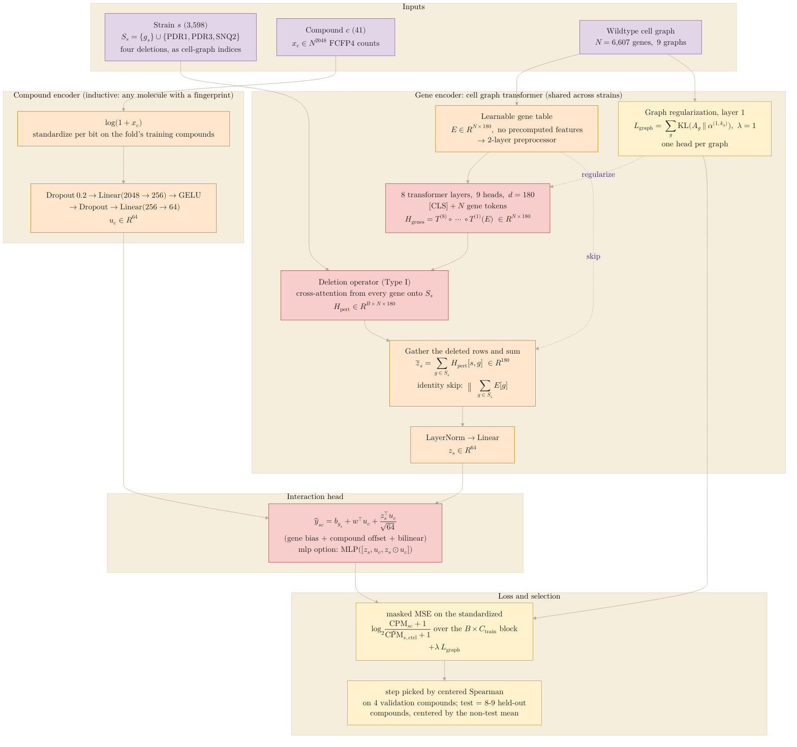
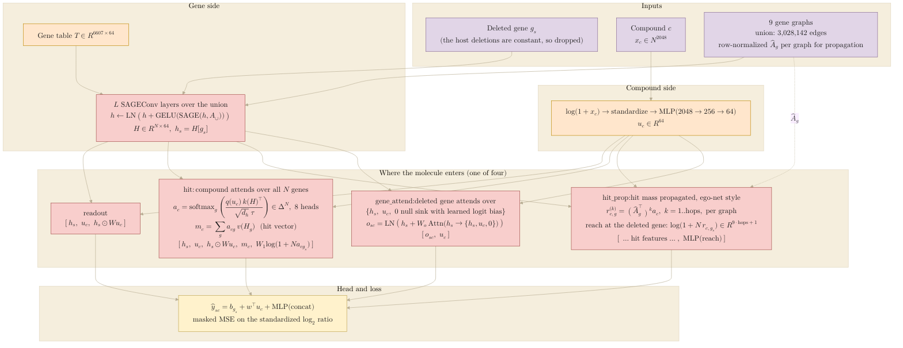

## 2026.09.30 - How the compound meets the genome in the 035 models

Two diagrams, drawn from the code as it ran. The first is the model that combines the
cell graph transformer with the molecular encoder (`train_factorized.py`,
`gene_encoder: cgt`, configs `r2_cgt.yaml`; slurm 3038). The second is the family of
compound mixings in `train_hit.py` (rounds 6 and 7), where the gene side is a lookup
table with SAGEConv message passing and the four `mix` options decide where the molecule
enters. Palette follows [[torchcell.models.equivariant_cell_graph_transformer.mermaid.type-i-ii]]:
purple input, orange embeddings and compound encoder, red transformer and output, yellow
loss and regularization.

Render with `bash notes/assets/publish/scripts/mermaid_pdf.sh notes/experiments.035-env-chemgen-vanacloig-cgt.mermaid.cgt-compound.md`
(two diagrams, so the outputs are `...cgt-compound-1.pdf` and `...cgt-compound-2.pdf`).

### Diagram 1: cell graph transformer as the gene encoder of the factorized model

Per training step a batch of $B$ strains is encoded once each (one transformer pass over
the wildtype graph, then the deletion operator per strain), and every strain is scored
against all $C$ training compounds at once, so the loss is over a $B \times C$ block of
the response matrix. Measured result: median centered Spearman 0.061 over 123 evaluations
against 0.287 for the lookup table in the same trainer, and 0.030 with the identity skip.

### Diagram 2: the four compound mixings of `train_hit.py`

Same compound encoder and same loss. The gene side is a table over all 6,607 cell-graph
genes with `gcn_layers` SAGEConv layers over the union of the nine graphs (3,028,142
undirected edges; `relational` uses one SAGEConv per graph, averaged). `mix` picks where
the molecule enters. Measured (round 6 and 7, two message-passing layers, ten seeds):
`gene_attend` -0.006, `readout` -0.009, `hit_prop` -0.010 against nested ridge, all
intervals through zero; without message passing every mixing is 0.02 to 0.03 below ridge.

What the two diagrams make visible side by side: in diagram 1 the molecule never touches
the graph. It meets the strain only at the bilinear head, after the transformer has
produced a strain vector with no knowledge of which compound is present, so the model is
a low-rank factorization $z_s^{\top} u_c$ whose gene factor happens to be computed by a
transformer. Diagram 2 is where the molecule is allowed to hit genes (`hit`), spread over
the network (`hit_prop`), or be attended to by the deleted gene (`gene_attend`); with two
message-passing layers all three reach ridge and none beats it.
