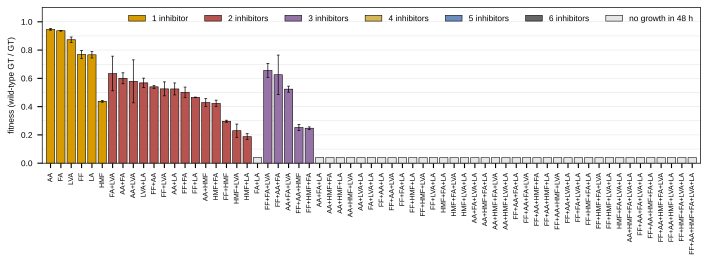
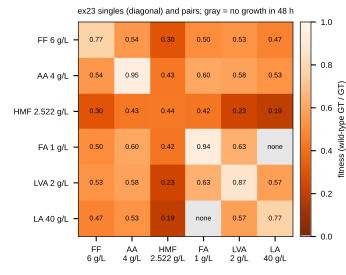
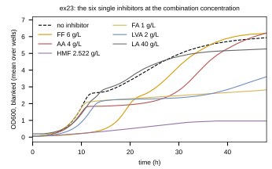
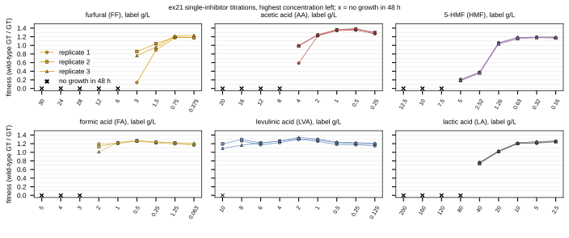
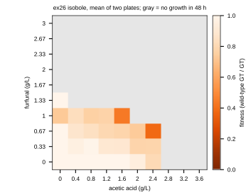

## 2026.10.07 - The 2021 inhibitor runs as a wet-lab validation target

The Bioscreen C runs of 2021 on the MAGIC strain BY4742-iAID6 in YPD, read from the
thesis archive on `/bulk` (`/bulk/thesis/thesis_archive`, 29,438 data files, every one
sha256-verified against its `MANIFEST.tsv` on 2026-10-07). Six sorghum-hydrolysate
inhibitors: furfural (FF), acetic acid (AA), 5-HMF, formic acid (FA), levulinic acid
(LVA), lactic acid (LA). The intent is a prediction target for the chemogenomic models
once they are developed: single inhibitors, their 63 combinations, and two-inhibitor
isoboles, all measured in one strain.

Fitness throughout is the definition of the analysis repo's `process_bsc.py`: the mean
wild-type generation time divided by the well's generation time, so 1 is wild-type growth.
A culture whose curve never rose within the run has no generation time; those wells are
shown as their own category, not dropped. Figures and tables from
[[experiments.039-inhibitor-combinations-wetlab.scripts.plot_inhibitor_runs]].

### ex23: all 63 combinations at one concentration each (the main target)

One concentration per inhibitor (FF 6, AA 4, HMF 2.522, FA 1, LVA 2, LA 40 g/L), three
biological replicates, 200 wells (8 uninhibited controls, 3 blanks). `results/ex23_conditions.csv`.

| number of inhibitors | combinations | grew within 48 h | mean fitness of those that grew |
|---|---|---|---|
| 1 | 6 | 6 | 0.788 |
| 2 | 15 | 14 | 0.465 |
| 3 | 20 | 5 | 0.461 |
| 4 | 15 | 0 | |
| 5 | 6 | 0 | |
| 6 | 1 | 0 | |

Read off the data: HMF is the strongest single inhibitor at its concentration (fitness
0.44), the pair that fails to grow is FA + LA, and every combination of four or more fails.
The target is therefore two-part: growth or no growth over all 63, and a fitness over the
25 that grew.

### ex21: single-inhibitor titrations

Nine concentrations per inhibitor, three biological replicates; wells in blocks of ten
(control, then the titration from the highest concentration down). The concentration
labels are the processing notebook's, verbatim, in g/L; two are out of order there (FF 28
between 24 and 12, FA 1.25 between 0.25 and 0.063) and are kept as recorded, so the x axis
is the titration step. The control wells of this run grew slower (mean generation time
2.62 h) than most low-concentration wells, so fitness exceeds 1 at the low end.
`results/ex21_titration.csv`.

### ex26: the furfural x acetic acid isobole

A 10 x 10 grid (FF 0 to 3 g/L, AA 0 to 3.6 g/L), two plates, 48 of 200 wells grew.
`results/ex26_isobole.csv`. The formic acid x acetic acid (ex27) and HMF x acetic acid
(ex28) isoboles were run but never processed; their raw Bioscreen files are in the archive.

### What a dataset would read

`01_bioscreenc_raw/MV_ex23_Magic_inhibitor_combinations.csv` (OD600 every 15 min, 341
rows x 200 wells, UTF-16), the well map
`multi_knockout/inhibitor_tolerance/1_inhibitor-screen_2021-04-14_205953.xlsx` (volumes of
each stock and of YPD per well), the stock table `02_wet_lab_records/experiments/inhibitors.xlsx`,
and the strain: BY4742-iAID6, the MAGIC background that `CrisprMagicLian2019Dataset`
already carries. Admission as a dataset is a separate decision.
