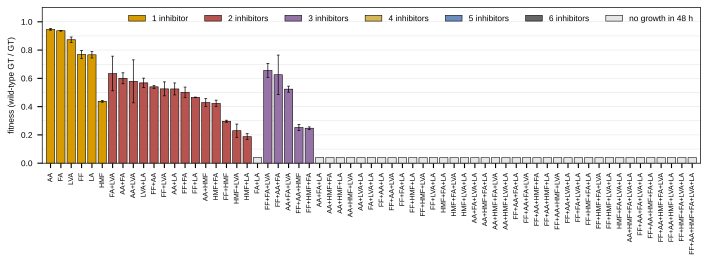
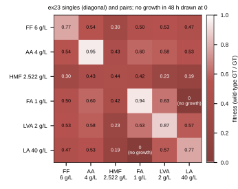
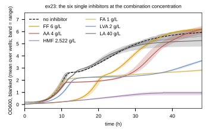
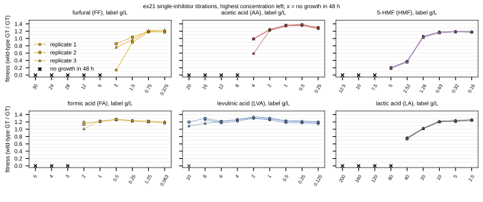
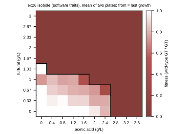
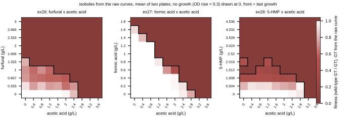

## 2026.10.07 - The 2021 inhibitor runs as a wet-lab validation target

The Bioscreen C runs of 2021 on the MAGIC strain BY4742-iAID6 in YPD, read from the
thesis archive on `/bulk` (`/bulk/thesis/thesis_archive`, 29,438 data files, every one
sha256-verified against its `MANIFEST.tsv` on 2026-10-07). Six sorghum-hydrolysate
inhibitors: furfural (FF), acetic acid (AA), 5-HMF, formic acid (FA), levulinic acid
(LVA), lactic acid (LA). The intent is a prediction target for the chemogenomic models
once they are developed: single inhibitors, their 63 combinations, and two-inhibitor
isoboles, all measured in one strain.

Fitness throughout is the definition of the analysis repo's `process_bsc.py`: the mean
wild-type generation time divided by the well's generation time, so 1 is wild-type growth.
A culture whose curve never rose within the run has no generation time; those wells are
shown as their own category, not dropped. Figures and tables from
[[experiments.039-inhibitor-combinations-wetlab.scripts.plot_inhibitor_runs]].

### ex23: all 63 combinations at one concentration each (the main target)

One concentration per inhibitor (FF 6, AA 4, HMF 2.522, FA 1, LVA 2, LA 40 g/L), three
biological replicates, 200 wells (8 uninhibited controls, 3 blanks). `results/ex23_conditions.csv`.

| number of inhibitors | combinations | grew within 48 h | mean fitness of those that grew |
|---|---|---|---|
| 1 | 6 | 6 | 0.788 |
| 2 | 15 | 14 | 0.465 |
| 3 | 20 | 5 | 0.461 |
| 4 | 15 | 0 | |
| 5 | 6 | 0 | |
| 6 | 1 | 0 | |

Read off the data: HMF is the strongest single inhibitor at its concentration (fitness
0.44), the pair that fails to grow is FA + LA, and every combination of four or more fails.
The target is therefore two-part: growth or no growth over all 63, and a fitness over the
25 that grew.

### ex21: single-inhibitor titrations

Nine concentrations per inhibitor, three biological replicates; wells in blocks of ten
(control, then the titration from the highest concentration down). The concentration
labels are the processing notebook's, verbatim, in g/L; two are out of order there (FF 28
between 24 and 12, FA 1.25 between 0.25 and 0.063) and are kept as recorded, so the x axis
is the titration step. The control wells of this run grew slower (mean generation time
2.62 h) than most low-concentration wells, so fitness exceeds 1 at the low end.
`results/ex21_titration.csv`.

### The isoboles: ex26 furfural, ex27 formic acid and ex28 5-HMF, each against acetic acid

A 10 x 10 grid per run (0 to 9 steps of 10 uL of inhibitor stock in 200 uL: FF 0 to 3,
FA 0 to 1.8, HMF 0 to 4.5, AA 0 to 3.6 g/L, from the design sheet
`BioscreenC_FF_AA_Isobole_exp.xlsx`), two plates each. Grid colors: white at wild-type
growth down through the palette red to its dark red at 0; a well that did not grow is
drawn at 0, the call being "no growth" rather than "missing", and the black front traces
the boundary between the wells that grew and those that did not, the detection limit of
the run.

Only ex26 was processed by the Bioscreen software (`MV_ex26_..._Traits.txt`, 48 of 200
wells grew). `results/ex26_isobole.csv`.

For ex27 and ex28 the generation time is derived here from the raw curves
(`generation_time` in the script: baseline-subtracted OD, growth if the rise is at least
0.3, the rate from the steepest 3 h log-linear stretch). The same derivation on ex26's raw
curves agrees with the software's traits on 98.5% of the 200 grew / no-grew calls and
ranks the 45 wells both call grown with a Spearman of 0.80 (`results/ex26_trait_check.csv`),
so the two unprocessed isoboles are read on a checked footing. Wells grown: ex26 45, ex27
76, ex28 53 of 200 (`results/isoboles_from_raw.csv`).

Formic acid x acetic acid is the cleanest trade-off (a diagonal front from FA 1.6 g/L
alone to AA 2.8 g/L alone). 5-HMF x acetic acid has a ragged front with growth islands at
HMF 2.0 g/L; those wells are read from a single run with the threshold above and would
need a repeat before being trusted.

### What a dataset would read

`01_bioscreenc_raw/MV_ex23_Magic_inhibitor_combinations.csv` (OD600 every 15 min, 341
rows x 200 wells, UTF-16), the well map
`multi_knockout/inhibitor_tolerance/1_inhibitor-screen_2021-04-14_205953.xlsx` (volumes of
each stock and of YPD per well), the stock table `02_wet_lab_records/experiments/inhibitors.xlsx`,
and the strain: BY4742-iAID6, the MAGIC background that `CrisprMagicLian2019Dataset`
already carries. Admission as a dataset is a separate decision.
