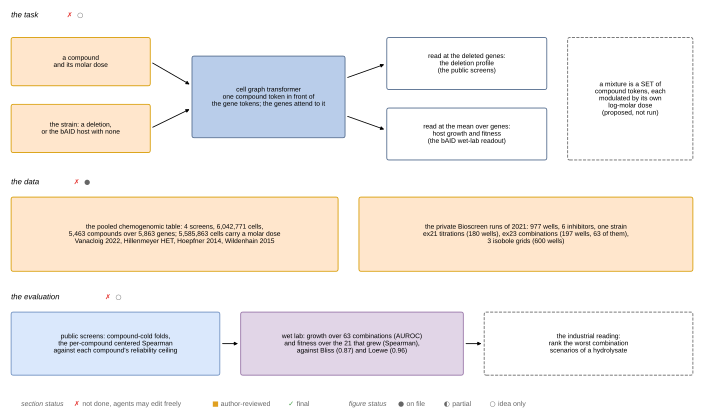
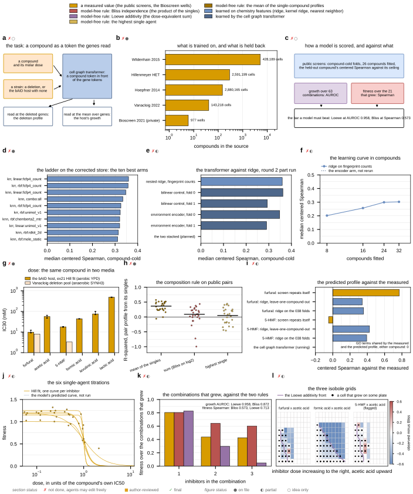
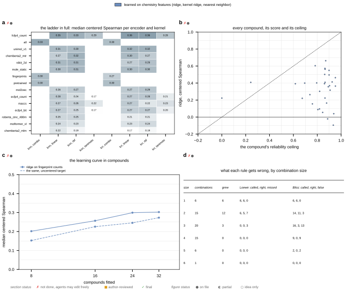
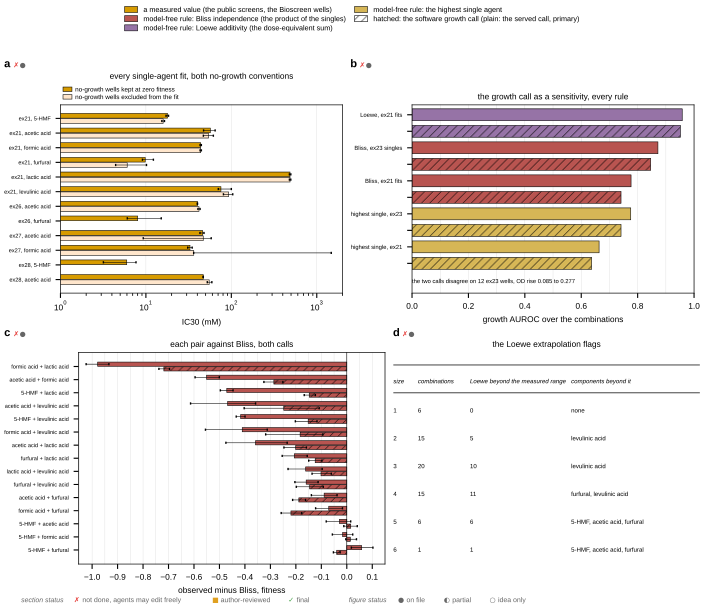
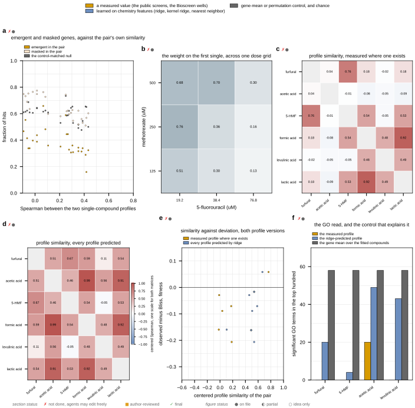

## 2026.10.10 - The figure gate for the hydrolysate panel

`figure_gate_panels.py` draws five mockup sheets for manuscript section R5, drug
exposure, and writes every number their captions print. It is the hydrolysate analog of
`experiments/031-betaxanthin-module/scripts/figure_gate_panels.py` (the metabolism Figure
6 gate) and copies its mechanism: a `Reads` class that opens every result file once, a
`num()` macro recorder whose keys become LaTeX commands with digits spelled out, panel
letters carrying two status symbols, and one sheet-level legend.

**Encoding, two channels.** Color is the SOURCE of a predicted value: a measured value;
a model-free rule, one color per rule (Bliss, Loewe, highest single agent, the mean of
the singles); a learned model (ridge and its kernel and nearest-neighbor siblings, the
cell graph transformer); and gray for a gene-mean or permutation control. Hatch is the
software growth call, drawn only where a panel shows both calls; plain is the served
raw-curve call, which is primary. The kernel and the encoder are written in the label and
never encoded.

**Status marks.** Filled circle, every drawn value is in a committed result file; half
circle, a run is unfinished or a planned arm has no file; open circle, idea only. The
section status beside it is red everywhere, because nothing has been reviewed. None of
the marks means approved.

**Cross-branch reads.** The 033, 035 and 038 result files live on unlanded worktree
branches, so they are read by absolute path and every path is recorded under
`external_sources` in `results/figure_gate_manifest.json`. The 038 factorized round 2
directories are globbed, so a panel fills in as that round writes.

### Sheets

### Outputs

- `$ASSET_IMAGES_DIR/040-inhibitor-synergy-wetlab/gate_*.png` and `.svg` (true size)
- `experiments/040-inhibitor-synergy-wetlab/results/figure_gate_manifest.json`
- `experiments/040-inhibitor-synergy-wetlab/results/figure_gate_numbers.json`
- `notes-tex/wet-lab/hydrolysate-figure-gate/tables/gate_numbers.tex` and
  `gate_figure_names.tex`

The document that places them is `notes-tex/wet-lab/hydrolysate-figure-gate/`; run
`make numbers plots all check` there.
