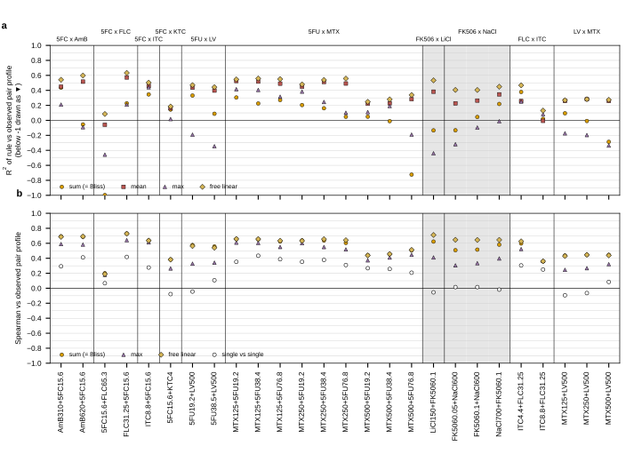
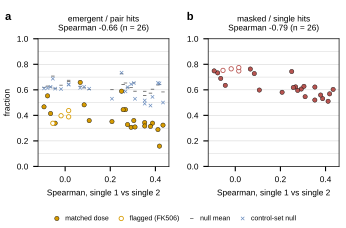
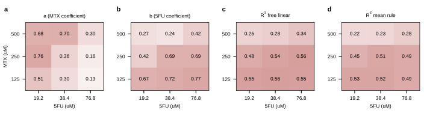

## 2026.10.10 - How HET deletion profiles compose under two-compound mixtures (claim 3)

Script: `experiments/040-inhibitor-synergy-wetlab/scripts/het_mixture_composition.py`.
Results: `experiments/040-inhibitor-synergy-wetlab/results/het_pair_matching.csv`,
`het_rule_fit.csv`, `het_emergent_masked.csv`, `het_near_replicates.csv`, `het_summary.json`.
Pre-registered as claim 3 of [[experiments.040-inhibitor-synergy-wetlab]].

### Method

- **Data.** Hillenmeyer 2008 HET (`HetHillenmeyer2008Dataset`) from the 033 pooled cell table,
  build 002 (`$DATA_ROOT/experiments/033-env-chemgen-pooled/cell_table_002/cell_table.parquet`).
  Response `log2(mean control intensity / treatment intensity)`, positive = fitness defect.
  One value per (gene, environment) is the MEAN over the cell's `responses` list (1 to 4
  values; the 033 flatten keeps every measurement). Matrix: 5,825 genes x 452 environments,
  of which 26 carry two compounds (5,677 to 5,704 genes each).
- **Partner matching.** For each partner, the single-compound environment of that compound
  at the exact dose (log10 molar), else the nearest dose, ties broken by the same generation
  count. A match is reasonable when the dose is within one twofold step (ratio <= 2.05; the
  0.05 absorbs rounding, e.g. 65.3 vs 32.6 uM) and the generations agree. Result: 46 exact,
  2 within twofold (ketoconazole 4 -> 2 uM; fluconazole 65.3 -> 130.6 uM), 4 beyond. The four
  beyond are every pair containing tacrolimus: the pairs carry 0.05 or 0.1 ug/mL (62 to 124
  nM at 804.0 g/mol), the dosed singles are 50 and 100 uM (402 to 804-fold away) and the
  third single has no dose in the release (`03_12_18_10:FK506::::::20gen`). These four are
  flagged and reported separately; every pair and matched single are 20 generations.
- **Rules**, on genes measured in all three environments: sum, mean, max (sicker of the two),
  Bliss product on the fitness scale (f = 2^-y, f12 = f1 f2, back to -log2 f12), and a free
  linear fit y12 = a y1 + b y2 + c. R^2 = 1 - SS_res/SS_tot of the rule as is (no refit, can
  be negative); Spearman is scale-free (so sum and mean share one Spearman).
  **Bliss is identical to the sum on this scale**, -log2(2^-y1 2^-y2) = y1 + y2; the script
  computes it and the maximum absolute difference is 0.0 on all 26 pairs. Bliss therefore
  carries no separate information here and is plotted as the sum.
- **Hits** are |robust z| > 2 within each environment over all of its genes,
  z = (y - median) / (1.4826 MAD); 10.2% of all (gene, environment) cells are hits.
  Emergent = hit in the pair, in neither single; masked = hit in a single, not in the pair.
  Emergent fraction = emergent / pair hits; masked fraction = masked / union of single hits.
- **Nulls** (200 draws per pair, seed 0): two random single-compound YPD environments without
  either partner compound (pool 402 to 412), and a control-set null restricted to singles
  sharing a control set with the pair (pool 160 to 233). Every pair shares a control set with
  both matched singles (26 of 26), so the second null holds the shared control intensity
  fixed. Both nulls also score the sum rule's Spearman against the pair profile.
- **Noise floor.** Only two near-replicate single environments exist (one compound, dose
  within 1%, same generations): 5-FU 38.4 vs 38.5 uM and 76.8 vs 76.9 uM, both at 20
  generations, each pair on DIFFERENT control sets.

### Results

Numbers from `het_summary.json` unless stated.

**Composition rule (n = 26 pairs; unflagged n = 22).** The mean rule has the highest R^2 of
the fixed rules in 24 of 26 pairs (20 of 22 unflagged); the sum wins once (ITC4.4+FLC31.25)
and the max once (ITC8.8+FLC31.25, where every rule is below 0.14). Medians over 26: R^2
sum 0.091, mean 0.365, max 0.050, free linear 0.458; Spearman sum 0.579, max 0.411, free
linear 0.634. Free-linear coefficients: median a 0.529, b 0.593, c 0.014; median a + b 1.06 (computed from `het_rule_fit.csv`)
and an intercept near 0. The sum overshoots the magnitude of the pair profile: its R^2 is
below the mean's in 24 of 26 while its Spearman is the same.

Against chance, the matched singles carry the pair profile: median sum-rule Spearman 0.579
against 0.066 for random singles and 0.114 for control-set-matched random singles; the
observed Spearman exceeds the control-set null in 24 of 26 pairs (empirical p <= 0.05, 200
draws). The two that do not: 5FC15.6+FLC65.3 (Spearman 0.200, the fluconazole single is the
2-fold-off 130.6 uM) and 5FC15.6+KTC4 (0.383, ketoconazole single 2-fold off).

**Emergent and masked genes.** Pooled over 26 pairs: 6,234 emergent of 16,172 pair hits
(0.385); 18,341 masked of 28,279 single-union hits (0.649). Unflagged (22): 0.385 and 0.624.
Median emergent fraction 0.355 against a random-single null of 0.621 and a control-set null
of 0.613; below the control-set null in 24 of 26 pairs (p <= 0.05), the exceptions again
5FC15.6+FLC65.3 and 5FC15.6+KTC4.

The emergent fraction falls with single-profile similarity: Spearman -0.657 (p = 2.6e-4,
n = 26; -0.745, n = 22 unflagged); the masked fraction likewise, -0.786 (p = 2.0e-6, n = 26;
-0.756, n = 22). Single-profile similarity itself is low (median Spearman 0.254).

**Caution on the emergent and masked rates: they sit inside the hit-calling noise.** The two
near-replicates (`het_near_replicates.csv`) agree at Spearman 0.242 and 0.103, and 54% and
64% of one member's hits are not hits in the other. That is larger than the median emergent
fraction (0.355) and comparable to the masked fraction (0.649). So with |z| > 2 on single
arrays, "emergent" and "masked" counts are dominated by measurement noise; the data do not
separate true emergent biology from irreproducibility. Two caveats on the floor itself: n = 2,
and the near-replicates span different control sets while every pair shares its control set
with its singles, so the within-control-set floor (the like-for-like one) is not measured.
The negative trend with similarity is consistent with a mechanical reading (hypothesis,
untested: two similar singles share hits, so their union covers more of the pair's hits and
fewer union hits are left to be masked) and is not by itself evidence of biological
interaction.

**MTX x 5-FU dose grid (n = 9).** The mean is the best fixed rule at all nine dose pairs
(R^2 0.223 to 0.526); the sum ranges -0.724 to 0.305. The free-linear coefficients are not
stable: a (MTX) 0.128 to 0.757, b (5-FU) 0.239 to 0.765, c -0.027 to 0.072, R^2 0.247 to
0.559. The pattern in the grid: at MTX 500 uM the MTX weight is high (0.68, 0.70) and the
5-FU weight low (0.27, 0.24) for the two lower 5-FU doses, while at MTX 125 uM the 5-FU
weight dominates (0.67 to 0.77) and the MTX weight drops as 5-FU rises (0.51, 0.30, 0.13).
Hypothesis (untested): the weight follows whichever partner is relatively stronger at that
dose ratio; no single-agent potency was computed here to test it. R^2 is lowest at MTX 500
(0.25 to 0.34).

Figure 1. R^2 (a) and Spearman (b) of each rule against the observed pair profile, per
two-compound environment, grouped by pair family (vertical rules); gray = flagged
tacrolimus pairs (no single within twofold of the pair dose). Open circles in (b): Spearman
between the two matched single profiles. R^2 below -1 drawn as a down triangle at the floor.
HET, 5,677 to 5,704 genes per pair.

Figure 2. Emergent fraction (a) and masked fraction (b) against single-profile similarity,
n = 26 pairs; open = flagged tacrolimus pairs. Dashes and crosses in (a): mean of 200 random
single pairs (all YPD singles without either partner; control-set-matched singles).

Figure 3. Methotrexate x 5-fluorouracil grid: free-linear coefficients a (MTX, a) and b
(5-FU, b), free-linear R^2 (c) and the mean rule's R^2 (d), per dose pair (n = 9).

### Composition rule to carry to the inhibitor combinations

On HET, the profile under a two-compound mixture is best approximated by a weighted average
of the two single profiles at the same doses, y12 ~ a y1 + b y2 with a + b near 1 (median a
0.53, b 0.59, intercept near 0), not by the sum (equivalently Bliss on the fitness scale),
which overshoots magnitude, and not by the max. The fixed mean rule recovers a median R^2 of
0.365 (free linear 0.458), so a little over half of the pair profile's variance is not
captured by any rule of the singles; whether that remainder is interaction or measurement
noise cannot be told from these data, since the hit-level emergent rate does not exceed the
near-replicate discordance (n = 2). The weights move with the dose ratio (MTX x 5-FU grid), so
"mean" is a default, not a constant. Carrying this to the six sorghum-hydrolysate inhibitors
(compose Vanacloig single profiles by their weighted mean) is a **labeled hypothesis
(untested)**: HET is a heterozygous diploid pool in aerobic YPD read as log2 depletion over 20
generations, while the inhibitor profiles are haploid homozygous deletions in anaerobic SYNH3
at IC30 (Vanacloig 2022), and no two-compound inhibitor screen exists to check it. The
composition rule is also a statement about deletion-profile shape, not about the host's growth
response, which is what claim 1 scores.

### Not done

- Within-control-set noise floor (no near-replicate pair shares a control set).
- Tacrolimus pairs have no single at a usable dose; their rows are kept but flagged.
- No per-pair dose-potency of the singles was computed, so the dose-ratio reading of the
  grid weights is a hypothesis.
