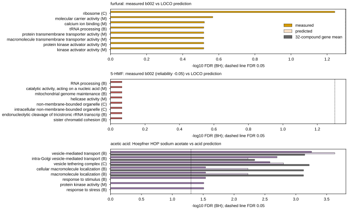
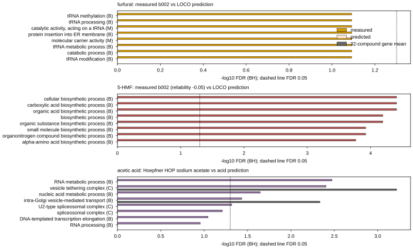

## 2026.10.10 - Composed profiles, nominated genes and GO enrichment (claim 4, post-analysis)

Script: `experiments/040-inhibitor-synergy-wetlab/scripts/inhibitor_nominations.py`, reading the
outputs of [[experiments.040-inhibitor-synergy-wetlab.scripts.inhibitor_profiles]]. Outputs in
`experiments/040-inhibitor-synergy-wetlab/results/`: `nominations_{sum,mean,max,min}.csv`,
`nominations_summary.csv`, `go_singles.csv`, `go_overlap_measured_vs_predicted.csv`,
`go_combinations.csv`, `go_combinations_summary.csv`, `go_summary.json`.

**Every nomination here is a hypothesis for a future screen; none is validated.** No in-house
screen under any combination exists.

### Method

- Each single column (target raw) becomes a z score within itself; a combination's composed
  profile is sum, mean, min (most sick member decides) or max (least sick member decides) of the
  members' z. Sum and mean order genes identically within a combination. The rule is chosen later
  by the HET analysis (claim 3); all four are written.
- Categories per combination (15 pairs, 20 triples), sensitive z < -2, resistant z > 2: core
  (sensitive in at least 4 of 6 singles), specific (sensitive in exactly one single, a member),
  conflict (sensitive in one member, resistant in another), composed top 100. Each row carries all
  six z and per-member evidence (measured source with its reliability, or predicted with its
  compound-cold check; formic and lactic acid get the LOCO median 0.387 over 32 compounds).
- GO: S288C GFF `Ontology_term` annotations from the torchcell genome
  (`SCerevisiaeGenome.go_genes`), propagated to is_a ancestors in `DATA_ROOT/data/go/go.obo`
  (release 2024-01-17, sha256 in `go_summary.json`). Background: the 3587 build-002 Vanacloig
  genes (all annotated); 2292 terms with 5 to 500 background genes. One-sided hypergeometric, BH
  per set, FDR < 0.05. Sets: top 100 most sensitive genes of each measured and predicted single
  (raw and centered), the core set, each pair's composed top 100 under each rule. Control: the
  build-002 gene mean over the 32 compounds (what a model with no compound-specific signal
  outputs).

### Results

Nomination counts (`nominations_summary.csv`, rule sum): core is 68 genes in `best_available`
(60 to 68 per combination, depending on which genes every member carries; Hoepfner covers 3453 of
3587) and 105 in `all_predicted`. Conflict genes are 5 to 13 per pair in `best_available` and 1 in
`all_predicted`: predicted profiles are too alike to disagree. The core set's top genes (YPT6, RIC1,
VPS63, COG5, GOS1, SNF6, DEG1) are the Golgi-transport and chromatin genes that are sick under most
Vanacloig compounds.

GO, measured against predicted for the same compound (`go_overlap_measured_vs_predicted.csv`,
top 100 genes, significant terms at FDR 0.05):

| compound | target | shared top genes | sig. measured | sig. predicted | shared | sig. control | measured terms also in control |
|---|---|---|---|---|---|---|---|
| furfural (b002) | raw | 19 | 0 | 20 | 0 | 58 | 0 |
| 5-HMF (b002, noise) | raw | 22 | 0 | 4 | 0 | 58 | 0 |
| acetic acid (Hoepfner NaOAc) | raw | 10 | 20 | 49 | 11 | 58 | 11 |
| levulinic acid (suppl., b001) | raw | 24 | 0 | 43 | 0 | 58 | 0 |
| furfural | centered | 15 | 0 | 13 | 0 | | |
| 5-HMF | centered | 43 | 15 | 6 | 0 | | |
| acetic acid | centered | 15 | 5 | 5 | 0 | | |
| levulinic acid (suppl.) | centered | 38 | 11 | 0 | 0 | | |

- **The predicted profiles do not recover the measured compound's biology.** Measured furfural's
  top 100 genes carry no term at FDR 0.05 (best: ribosome, FDR 0.057). The 11 terms acetic acid
  prediction shares with the Hoepfner profile are all in the gene-mean control too (vesicle
  transport, vesicle tethering complex), so the shared signal is the generic stress component, not
  acetate. Predicted terms are mostly control terms (furfural 19 of 20, levulinic acid 40 of 43,
  acetic acid 48 of 49). Centered, no compound shares a single significant term between measured
  and predicted.
- Composed pairs (`go_combinations_summary.csv`): `best_available` pairs with furfural carry 0 to 5
  significant terms; pairs of predicted columns carry 8 to 54, dominated by Swr1 complex, SWI/SNF,
  and Golgi vesicle transport, the control's top terms. Core set: 46 terms (`best_available`), 40
  (`all_predicted`).

Top eight terms of each measured profile's top 100 genes by measured FDR, raw and centered;
-log10 BH FDR for the measured profile, the prediction, and the 32-compound gene-mean control. A
zero bar means the term was neither significant nor among that set's ten best.

### Caveats

- Nominations from predicted columns are mostly the generic Vanacloig stress genes; GO enrichment of
  a nominated set is not evidence of compound biology unless it exceeds the gene-mean control.
- The 5-HMF measured profile is noise; formic and lactic acid are never-screened predictions at the
  ridge bar; the acetate column is a cross-screen salt profile.
- Hypothesis (untested): the pairs whose composed sets differ from the control (the furfural pairs
  in `best_available`) are where a combination screen would be informative.
