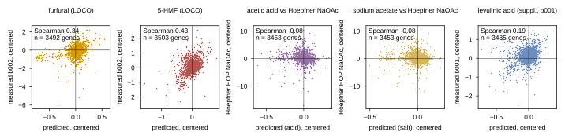
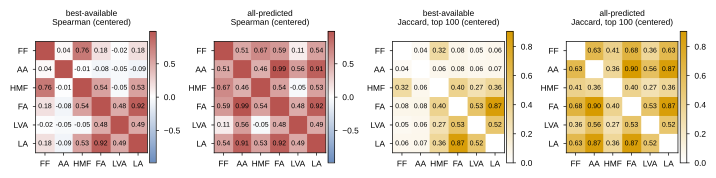
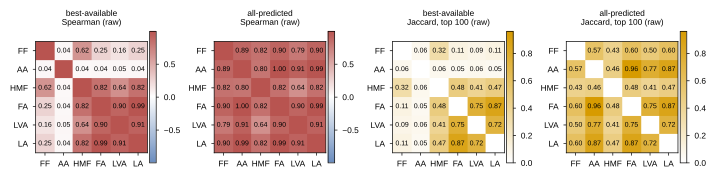

## 2026.10.10 - Measured and compound-cold predicted profiles of the six inhibitors (claim 2 inputs)

Script: `experiments/040-inhibitor-synergy-wetlab/scripts/inhibitor_profiles.py`. Outputs in
`experiments/040-inhibitor-synergy-wetlab/results/`: `profile_predicted_vs_measured.csv`,
`profile_matrix.csv` (+ `.json`, which names the source of every column), `profile_all.csv`,
`profile_similarity.csv`, `profile_fingerprint_check.csv`.

**Sign.** Every value is `log2(inhibitor/control)`: NEGATIVE = the deletion is sick. Hoepfner's
adjusted MADL score has the same sign. `profile_matrix.csv` columns are
`<version>|<target>|<inhibitor>`, names exactly as the private loader serves them: furfural, acetic
acid, 5-(hydroxymethyl)furfural, formic acid, levulinic acid, lactic acid (abbreviations FF, AA,
HMF, FA, LVA, LA in the figures).

### Method

- **Measured.** Build 002 of the 033 cell table (TMM, the 32 published Vanacloig compounds) holds
  only furfural and 5-HMF of the six. Levulinic acid and sodium acetate were dropped from build 002
  as unreported compounds (#501). Acetic acid takes the Hoepfner 2014 HOP sodium acetate profile
  (homozygous diploid deletions, YPD, aerobic; mean of 125 and 150 mM; centered by the gene's mean
  over all 277 HOP columns). Build 001 (CPM) still serves levulinic acid and sodium acetate; they
  are read for supplementary comparison rows only and enter no matrix.
- **Predicted.** 038's nested ridge (`krr | linear:fcfp4_count`, functions imported from 038
  `baseline_ladder.py`): (lambda, rank, clip) chosen by leave-one-compound-out inside the fitted
  pool on the centered target. Furfural and 5-HMF: leave-one-compound-out over the 32 (31 fitted).
  Levulinic, acetic, formic and lactic acid and sodium acetate: fit on all 32 (chosen lam=0.1,
  inner centered Spearman 0.353), predicted from their FCFP4 counts.
- **Fingerprint recipe** (031 `FCFP4Count`: RDKit Morgan radius 2, 2048 bits, feature atom
  invariants, counts, float32, curated identity-table SMILES) re-featurized 35 compounds (the 32,
  plus acetic acid, levulinic acid, sodium acetate) and reproduced every 031 npz row exactly
  (`profile_fingerprint_check.csv`). Formic acid `OC=O` -> BDAGIHXWWSANSR-UHFFFAOYSA-N; lactic acid
  `CC(O)C(=O)O` (no stereo: the stock sheet does not state the enantiomer) ->
  JVTAAEKCZFNVCJ-UHFFFAOYSA-N; acetic acid `CC(=O)O` -> QTBSBXVTEAMEQO-UHFFFAOYSA-N. The loader
  carries no SMILES or InChIKey for formic or lactic acid (identity gaps); these two are assigned
  here.
- **Matrices.** `all_predicted`: every column a prediction. `best_available`: furfural measured
  (replicate reliability 0.769 >= 0.5), acetic acid = Hoepfner HOP sodium acetate (cross-screen,
  salt for acid), 5-HMF predicted (reliability -0.048 < 0.5), levulinic, formic, lactic acid
  predicted. The 0.5 threshold is a choice, not a sourced value.
- **Similarity** (`profile_similarity.csv`, one row per sorted pair and matrix version): Spearman
  over shared genes and Jaccard of the 100 most sensitive genes, raw and centered;
  `vanacloig_a/b` map to the Vanacloig name (acetic acid -> sodium acetate; formic and lactic acid
  have none).

### Results

Compound-cold checks (centered Spearman, predicted vs measured; raw in parentheses):

| comparison | n genes | centered | raw | measured reliability |
|---|---|---|---|---|
| LOCO over all 32 compounds, median (IQR) | 32 compounds | 0.387 (0.241 to 0.482) | 0.346 | |
| furfural, LOCO vs build 002 | 3492 | 0.341 | (0.258) | 0.769 |
| 5-HMF, LOCO vs build 002 | 3503 | 0.425 | (0.260) | -0.048 |
| acetic acid predicted vs Hoepfner HOP NaOAc | 3453 | -0.084 | (0.043) | dose agreement 0.676, n=4469 |
| sodium acetate predicted vs Hoepfner HOP NaOAc | 3453 | -0.079 | (0.047) | |
| acetic acid predicted vs sodium acetate predicted | 3587 | 0.932 | (0.990) | |
| suppl.: levulinic acid predicted vs build 001 | 3485 | 0.190 | (0.255) | 0.147 |
| suppl.: Vanacloig b001 NaOAc vs Hoepfner HOP NaOAc | 3376 | -0.011 | (0.034) | 0.370 (b001) |

- The LOCO median (0.387) sits above the 038 bar (0.359, 5-fold, 96 evaluations) with 31 instead
  of 25 to 26 fitted compounds; 038's own fold mean for furfural is 0.357 and for 5-HMF 0.392
  (krr linear:fcfp4_count, three fold seeds), so the reimplementation reproduces it.
- 5-HMF's 0.425 is agreement with a profile whose replicate reliability is below zero; it is a
  score against noise plus the shared stress component, not evidence the HMF biology is predicted.
- **Acid vs salt.** The acetic acid and sodium acetate predictions are nearly the same profile
  (0.932 centered), so the salt-for-acid substitution changes little on the prediction side. Neither
  prediction agrees with the measured Hoepfner acetate profile (-0.08 centered), and the two measured
  acetate profiles (Vanacloig b001, Hoepfner HOP) do not agree with each other either (0.034 raw).
  The acetate measurement is screen-specific; which screen bAID in YPD resembles is untested.
- Build 001 and build 002 give the same furfural profile (raw Spearman 0.99998, n=3492), so the
  CPM-to-TMM change is not what separates them.

Pair similarity: in `all_predicted`, the three small acids are near-duplicates (centered Spearman:
acetic/formic 0.986, formic/lactic 0.924, acetic/lactic 0.913). This is fingerprint similarity
passed through a ridge fit on 32 compounds, none of them a C1 to C3 acid: it is not measured
biology, and any claim-2 test that uses predicted acid profiles inherits it. In `best_available`
the Hoepfner acetate column is near zero against everything (|centered Spearman| <= 0.09).

Predicted (x) against measured (y), centered, one point per deletion strain. Last panel is the
supplementary build-001 levulinic acid row.

Six by six similarity, centered and raw, both matrix versions; Spearman (diverging) and top-100
Jaccard (sequential).

### Caveats

- The measured 5-HMF profile is noise (replicate reliability -0.048); it is shown, not used.
- Formic and lactic acid were never screened: their profiles are predictions at the ridge bar
  (median centered Spearman about 0.36 to 0.39 on compounds that were screened), from structures
  unlike anything in the fitted 32.
- The acetate column of `best_available` is a different screen (Hoepfner HOP: diploid homozygous
  deletions, YPD, aerobic, MADL scale) for a different chemical form (salt for acid). Compare it by
  rank only.
- Vanacloig is anaerobic SYNH3 at IC30 on a sensitized host; bAID runs are aerobic YPD.
