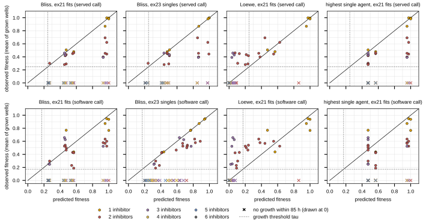
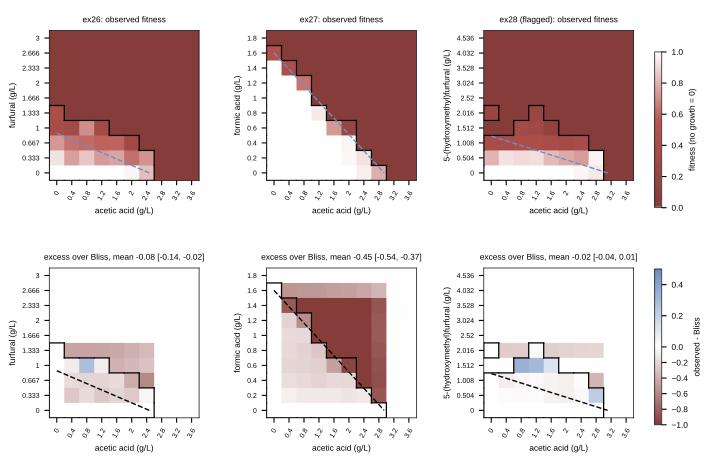
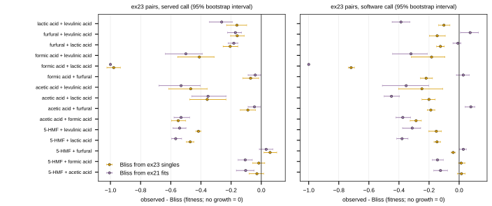

## 2026.10.10 - Bliss, Loewe and highest single agent against ex23 and the isoboles

Rules predict combination fitness on the ex23 scale (WT = 1):

- **Bliss:** the product of the single-agent fractions, either from the ex21 Hill fits (`bliss_ex21`) or from the observed ex23 singles (`bliss_ex23`).
- **Loewe:** the E that solves sum d_i / D_i(E) = 1 on the ex21 fits.
- **Highest single agent:** the lowest single fraction.

Every score is computed under both growth calls, each on its own scale (see [[experiments.040-inhibitor-synergy-wetlab.scripts.wetlab_table]]). The growth threshold tau is the lowest fitness of any grown inhibited ex23 well: 0.248 for the served call, 0.171 for the software call. A rule predicts growth when its prediction is at least tau. The software call, and `bliss_ex21` under it, mix scales: the ex21 fits are on the served raw-curve scale.

**Growth over all 63 combinations** (`results/mixture_scores.csv`; positives: 21 served, 25 software):

| rule | call | TP | FP | TN | FN | accuracy | AUROC |
|---|---|---|---|---|---|---|---|
| Bliss, ex21 fits | served | 21 | 42 | 0 | 0 | 0.333 | 0.777 |
| Bliss, ex23 singles | served | 20 | 27 | 15 | 1 | 0.556 | 0.872 |
| Loewe, ex21 fits | served | 11 | 1 | 41 | 10 | 0.825 | 0.958 |
| HSA, ex21 fits | served | 21 | 42 | 0 | 0 | 0.333 | 0.663 |
| Bliss, ex21 fits | software | 25 | 38 | 0 | 0 | 0.397 | 0.741 |
| Bliss, ex23 singles | software | 25 | 38 | 0 | 0 | 0.397 | 0.846 |
| Loewe, ex21 fits | software | 15 | 1 | 37 | 10 | 0.825 | 0.952 |
| HSA, ex21 fits | software | 25 | 38 | 0 | 0 | 0.397 | 0.637 |

**Fitness over the combinations that grew** (observed = mean of grown wells; n = 21 served, 25 software). The mean signed error is observed minus predicted.

| rule | call | Spearman | RMSE | mean signed error |
|---|---|---|---|---|
| Bliss, ex21 fits | served | 0.717 | 0.259 | -0.167 |
| Bliss, ex23 singles | served | 0.573 | 0.235 | -0.142 |
| Loewe, ex21 fits | served | 0.713 | 0.208 | +0.128 |
| Bliss, ex21 fits | software | 0.525 | 0.238 | -0.118 |
| Bliss, ex23 singles | software | 0.865 | 0.137 | -0.097 |
| Loewe, ex21 fits | software | 0.646 | 0.279 | +0.185 |

Restricted to two or more inhibitors (57 combinations; 15 grew served, 19 software): Bliss from ex23 singles has AUROC 0.844 served and 0.817 software; Loewe has 0.944 and 0.939. Rows by number of inhibitors are in the CSV. The three-inhibitor rows rest on 3 (served) or 5 (software) grown combinations, so their Spearman values are not interpretable.

The measured pattern under both calls:

- **The data sit between the two reference rules.** Bliss and highest single agent predict growth for nearly every combination, while observed growth fails at 42 (served) or 38 (software) of 63. Bliss overestimates the fitness of grown combinations (negative signed error). Loewe predicts the no-growth set well but underestimates the fitness of combinations that did grow (positive signed error).
- **Loewe's extrapolation is substantial.** For 33 of 63 combinations, the Loewe E lies beyond at least one component's tested ex21 range (furfural, acetic acid, 5-HMF or levulinic acid), so those Loewe values are extrapolations of the Hill fit.

**Pairs** (`results/pair_deviation.csv`, keyed by the sorted loader compound names). Observed is the mean of 3 wells with no growth = 0, minus Bliss from the ex23 singles, with a 95% interval from 2000 resamples of replicate wells.

- **Served call:** 12 of 15 pairs are synergistic (interval below 0), 2 additive (5-HMF + acetic acid, 5-HMF + formic acid) and 1 antagonistic (5-HMF + furfural, +0.058 [+0.018, +0.103]).
- **Software call:** 13 synergistic and 2 additive (the same two). 5-HMF + furfural flips to synergy (-0.040 [-0.052, -0.026]).
- **Largest deviation:** formic acid + lactic acid, which grew in no well under either call (-0.978 served, -0.718 software).
- **The HMF combinations shrink under the software call.** 5-HMF + lactic acid moves from -0.471 to -0.147, and 5-HMF + levulinic acid from -0.417 to -0.152. These are pairs whose wells the served call reads as no growth.

**Isoboles** (served call; `results/isobole_summary.csv`, `results/isobole_cells.csv`). Excess over the empirical Bliss surface built from each grid's own axes, mean over the 81 interior cells, 95% interval from 2000 resamples of the two plate wells per cell:

| run | pair | mean excess [95%] | call | interior cells: Bliss predicts growth, none observed | Loewe predicts growth, none observed | Loewe predicts none, growth observed [95%] |
|---|---|---|---|---|---|---|
| ex26 | furfural x acetic acid | -0.082 [-0.142, -0.017] | synergy | 1 | 0 | 10 [5, 11] |
| ex27 | formic acid x acetic acid | -0.446 [-0.536, -0.367] | synergy | 31 | 0 | 3 [1, 3] |
| ex28 (flagged) | 5-HMF x acetic acid | -0.017 [-0.043, 0.007] | additive | 3 | 0 | 12 [12, 13] |

- **In all three grids, every interior cell where Loewe predicts growth did grow.** Growth observed where Loewe predicts none counts 10, 3 and 12 cells, so relative to Loewe the grids lean antagonistic, and relative to Bliss they lean synergistic (strongly for formic x acetic acid). The observed front of formic x acetic acid follows the Loewe line closely (figure).
- **ex28 is flagged:** a single run with growth islands at 5-HMF 2.0 g/L (039). It is analyzed, not trusted.
- **Interpretation (hypothesis, untested):** the steep single-agent curves (h at or near the bound) are what separate the Bliss and Loewe predictions here.

Observed vs predicted fitness for the 63 ex23 combinations, by rule (columns) and growth call (rows). x marks are combinations with no growth within 85 h, drawn at 0. Dashed lines mark the call's tau.

Top row: observed fitness (mean of two plates, no growth = 0), with the black front around the cells that grew and the dashed blue Loewe additive front at the run's tau (from the grid-axis Hill fits). Bottom row: observed minus the empirical Bliss surface.

Observed minus Bliss for the 15 ex23 pairs under each call, with Bliss from the ex23 singles (orange) and from the ex21 fits (purple, with fit-draw uncertainty). Bars are 95% bootstrap intervals.
