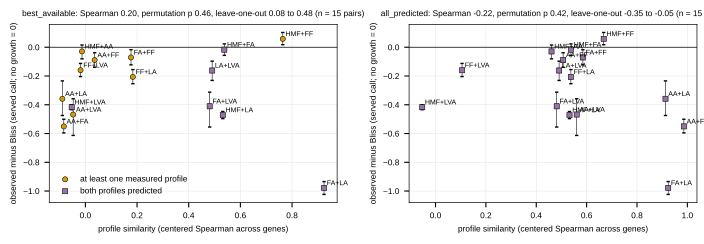

## 2026.10.10 - Claim 2: profile similarity against the pair deviation from Bliss

Join of `results/pair_deviation.csv` (mixture_rules.py, observed minus Bliss from the ex23
singles, both growth calls) with `results/profile_similarity.csv` (inhibitor_profiles.py)
over the 15 pairs; Spearman with a 10,000-draw permutation p and the leave-one-pair-out
range. The pre-registered expectation was a NEGATIVE association in the sense "dissimilar
profiles deviate more": similar profiles (shared targets) were expected to be additive.
Output `results/similarity_vs_deviation.csv`, per-pair table
`results/similarity_vs_deviation_pairs.csv`, isoboles `results/similarity_vs_deviation_isoboles.csv`.

| profile matrix | similarity | growth call | Spearman (n = 15 pairs) | permutation p | leave-one-out range |
|---|---|---|---|---|---|
| best_available (furfural and acetate measured, four predicted) | centered Spearman | served | 0.204 | 0.462 | 0.081 to 0.481 |
| best_available | centered Spearman | software | 0.311 | 0.263 | 0.226 to 0.613 |
| best_available | top-100 Jaccard | served | -0.269 | 0.328 | -0.426 to -0.099 |
| all_predicted (every profile ridge FCFP4) | centered Spearman | served | -0.225 | 0.425 | -0.354 to -0.051 |
| all_predicted | centered Spearman | software | -0.525 | 0.050 | -0.662 to -0.420 |
| all_predicted | raw Spearman | served | -0.493 | 0.066 | -0.653 to -0.380 |
| all_predicted | raw Spearman | software | **-0.686** | **0.006** | -0.771 to -0.618 |
| all_predicted | top-100 Jaccard | software | **-0.709** | **0.005** | -0.780 to -0.648 |

Reading. With the measured profiles in the matrix nothing is significant (every p above
0.26) and the sign flips between measures, so claim 2 as pre-registered is not supported.
The only association is in the all-predicted matrix and it runs the OTHER way: the more
similar two predicted profiles, the more synergistic the pair. Those similar pairs are the
small acids (acetic, formic, lactic, levulinic; predicted-profile Spearman 0.91 to 0.99,
which is fingerprint similarity carried through the ridge fit), and they are also the
strongly synergistic pairs (formic + lactic grew in no well; acetic + formic -0.55; acetic +
levulinic -0.47, served call). So the association says "weak-acid pairs synergize", a
chemistry-class statement the fingerprint already encodes, not a chemogenomic one; and it
depends on the growth call (served p 0.07 to 0.43). The three isoboles cannot separate the
two readings: furfural x acetic acid (similarity 0.04 best-available, 0.51 all-predicted)
is mildly synergistic (-0.08), formic x acetic acid (-0.08, 0.99) strongly so (-0.45).

