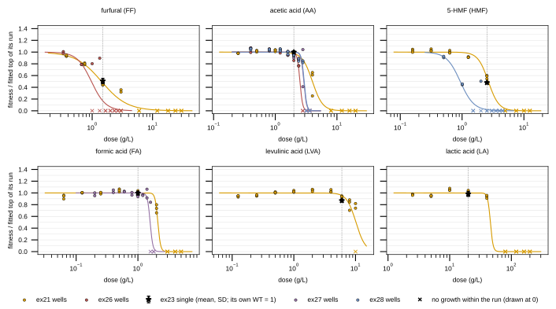

## 2026.10.10 - Hill fits per compound and run

Model: `f(d) = top / (1 + (d / IC50)^h)`, least squares on the dosed wells, with `top` fitted. ex21's uninhibited wells grew slower than its low-dose wells, so ex21 is never normalized by them; their mean fitness is 1.012 (17 of 18 grew), while the fitted ex21 tops run 1.00 to 1.25. IC50 and IC30 are relative to the fitted top. Intervals are 95% percentiles of 1000 resamples of replicate wells within each dose. The primary variant puts non-growing wells at fitness 0; the `excluded` variant drops them. Both are in `results/single_agent_fits.csv`.

Primary (zero) fits, ex21 (n = 27 wells each):

| inhibitor | top | h | IC50 g/L [95%] | IC30 g/L | IC30 mM [95%] |
|---|---|---|---|---|---|
| furfural | 1.187 | 2.05 | 1.43 [1.38, 1.53] | 0.94 | 9.8 [9.1, 12.2] |
| acetic acid | 1.217 | 5.29 | 4.00 [3.30, 4.37] | 3.41 | 56.7 [47.3, 64.6] |
| 5-HMF | 1.002 | 5.16 | 2.66 [2.59, 2.70] | 2.26 | 17.9 [17.2, 18.4] |
| formic acid | 1.152 | 20 (bound) | 2.10 [2.07, 2.14] | 2.02 | 43.8 [43.1, 44.6] |
| levulinic acid | 1.185 | 5.78 | 10.2 [8.6, 16.2] | 8.78 | 75.6 [70.4, 100.0] |
| lactic acid | 1.252 | 20 (bound) | 45.7 [44.9, 46.7] | 43.8 | 486 [478, 497] |

Caveats:

- **h = 20 marks a cliff.** h at its upper bound (formic acid and lactic acid in ex21, and most isobole axes) means growth falls from near-top to none between two adjacent tested doses. IC50 is then located only within that dose interval, and the bootstrap interval understates that uncertainty because resampling cannot move the cliff between doses.
- **The excluded variant is unidentifiable where most wells failed to grow:** ex26 furfural (6 wells fitted) and ex28 5-HMF (5 wells fitted).
- **Levulinic acid is extrapolated.** Its fitted ex21 IC50 (10.2 g/L) sits at the highest dose tested (10 g/L).

Acetic acid across runs (zero variant): IC50 4.00 g/L in ex21 (72 h), 2.51 in ex26, 2.90 in ex27 and 2.94 in ex28 (96 h, 18 wells each). The three isobole axes agree within about 0.4 g/L. ex21 sits higher, and its interval [3.30, 4.37] does not overlap any isobole interval. The run lengths and the ex21 control anomaly differ between the two, so the source of the offset is not identified here.

Check against the ex23 singles (`results/single_agent_ex23_check.csv`, 3 wells each, served call): the ex21 fit at the ex23 dose agrees within the 95% interval for furfural (+0.03), acetic acid (+0.02), formic acid (0.00) and lactic acid (-0.02). Observed fitness is lower than predicted for 5-HMF (-0.09 [-0.12, -0.05]) and levulinic acid (-0.09 [-0.14, -0.04]). Under the software call, on the software's own scale, the furfural single reads 0.77 against the predicted 0.47, and lactic acid 0.77 against 1.00. The two calls disagree on singles too, since their fitness scales differ.

Vanacloig IC30 (`results/vanacloig_ic30.csv`). This is a cross-medium potency comparison, not a replication: Vanacloig 2022 used anaerobic SYNH3 at 48 h with the haploid deletion pool at IC30; the Bioscreen used aerobic YPD at 72 h with bAID, through the ex21 Hill fit.

- **Furfural:** Vanacloig 8.0 mM, ex21 9.8 mM [9.1, 12.2] (ratio 1.23).
- **5-HMF:** Vanacloig 3.3 mM, ex21 17.9 mM [17.2, 18.4] (ratio 5.4).
- **Levulinic acid** has no condition in the corrected Vanacloig store (dropped in build 002 as an unreported token). The script reads the store at stride 1000 (34 condition blocks, all longer than 1000 records) and finds no levulinic acid block.

Each source's wells divided by its own fitted top, with its Hill curve. Stars are the ex23 singles (mean and SD of 3 wells, ex23 WT = 1). x marks are wells that did not grow within their run, drawn at 0. The dashed vertical line is the ex23 dose.
