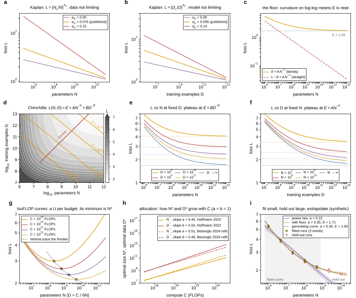
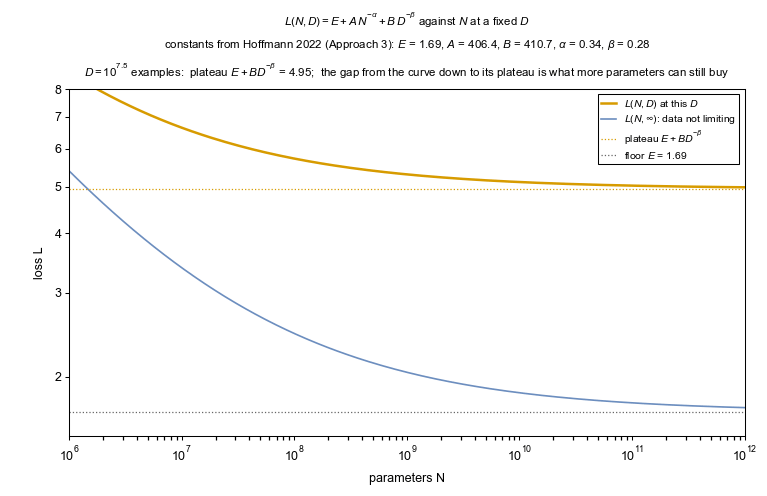
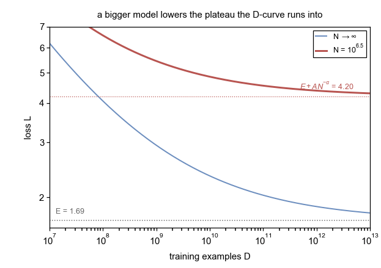
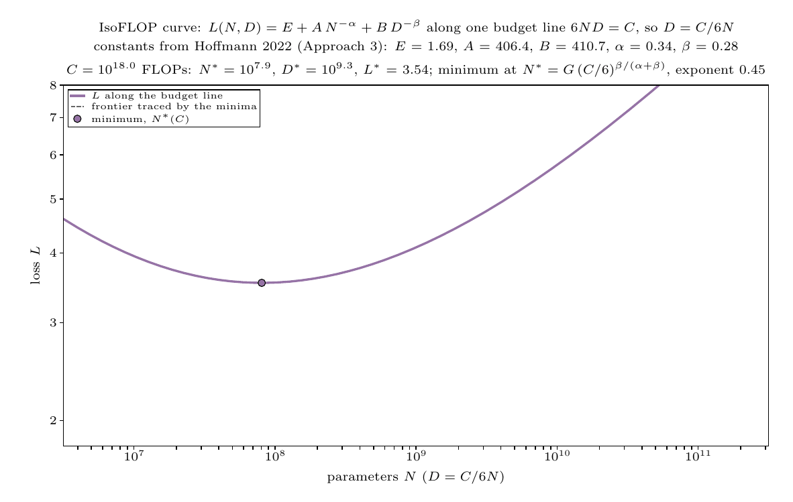
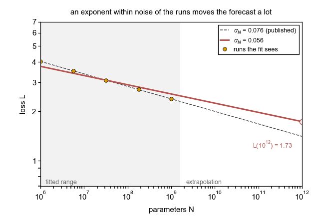

## 2026.10.09 - The two scaling-law forms, drawn to be read

Script: `experiments/041-scaling-laws/scripts/scaling_law_forms.py`. Nothing here is measured on a torchcell model; the panels draw the Kaplan 2020 (arXiv:2001.08361) and Hoffmann 2022 (arXiv:2203.15556) forms at their published constants, plus the Besiroglu 2024 refit (arXiv:2404.10102). Panel i is a synthetic fitting exercise on runs drawn from the Hoffmann form. The typeset explainer is `notes-tex/modeling/scaling-laws/` ([[scaling-laws]]), which reads this figure through `make plots` and the constants table the script writes to `tables/t1-constants.tex`.

Run from the repo root (the GIFs take a few minutes; `--no-gifs` skips them):

```bash
python experiments/041-scaling-laws/scripts/scaling_law_forms.py
```

### Figure 1 (3 x 3)



- **a, b** Kaplan single-axis laws, one exponent published and two others; on log-log axes the exponent is the slope.
- **c** The floor: `E + A N^-alpha` bends toward `E` while `L - E` stays straight. Curvature at the large end is the sign that `E` is near.
- **d** The Chinchilla surface `L(N, D)` with iso-compute diagonals `6ND = C` and the compute-optimal frontier.
- **e, f** Cuts at fixed `D` and fixed `N`: each plateaus at the term the fixed axis leaves behind.
- **g** IsoFLOP curves, a U per budget; the minima trace the frontier.
- **h** `N*` and `D*` against `C` under two fits of the same runs (`a = 0.45` vs `0.51`).
- **i** Fit on fifteen small synthetic runs, hold out the two largest, extrapolate with bootstrap bands: the pure power law (`alpha = 0.15`) misses the held-out runs, the floored fit (`alpha = 0.35`, `E = 1.71` against a generating 0.34, 1.69) lands on them. Numbers in `experiments/041-scaling-laws/results/scaling_law_forms_summary.json`.

### GIFs

Each is one sweep of one variable with everything else pinned.

**Data sweep.** `L` vs `N` while `D` rises from 10^7.5 to 10^12.5: the plateau `E + B D^-beta` drops toward `E`, and the N-curve runs into it later and later.



**Parameter sweep.** `L` vs `D` while `N` rises: the mirror image, plateau `E + A N^-alpha`.



**Compute sweep.** The IsoFLOP U while `C` rises from 10^18 to 10^23; the minimum traces the frontier, about 0.45 decades of `N*` per decade of `C`.



**Exponent sweep.** Kaplan's pure power law with `alpha_N` moving by plus or minus 0.02 about the published 0.076, pinned at the center of the fitted range (`N = 10^7.5`): every curve passes within about 7% of the runs the fit sees, which 2% replicate noise and five points cannot rule out, while the forecast at `N = 10^12` moves by about a quarter each way. This is why an interval on the exponent is the result, not the point.



### Counting D: instances, not dimensions

`D` is the number of training examples the optimizer consumed, in the unit the loss averages over (tokens for a language model, records here), times nothing: epochs are a fixed hyperparameter and repeated records count for less than fresh ones (Muennighoff 2023, arXiv:2305.16264). The dimension of a record (features, genes in the genome, sequence length) is not `D`; it changes compute per record and the input width of the model. Full argument in section 3 of the notes-tex document.
