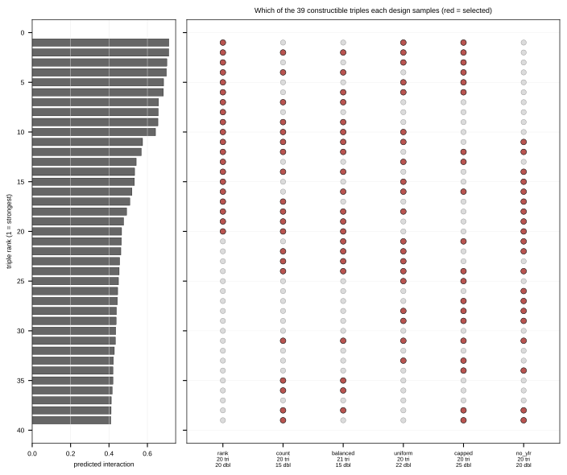
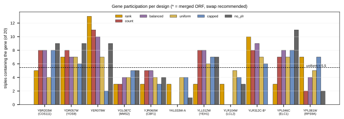

## 2026.08.23 - Strains to construct: 25 doubles + 20 triples

**45 new strains.** All are built from strains that already exist in the run-4 panel -- no
new single knockouts are needed, and **every one builds in parallel**: nothing waits on
anything else.

**The design on this sheet is `capped`.** Six selection strategies were compared over the
same 39 candidate triples; `capped` is the one being built, and every ID below comes from
it. It takes the six best-predicted triples that involve a gene the model has no trigenic
training data for, then fills the remaining fourteen from further down the ranking, which
holds those genes to six of twenty. The comparison is under
"[Where this list came from](#where-this-list-came-from)"; the full argument is in
[[experiments.W019-echo-crispr-array.next-strains-to-construct]].

Two conventions used throughout:

- **`*` on an ID** means the strain involves `YER079W` or `YLR312C-B`, the two genes with
  zero trigenic training records. Those predictions are extrapolation.
- **`routes`** is how many already-built doubles a triple can be made from. `1` means one
  parent only, so a failed cross has no backup until the matching new double is done.

Ordering suggestion: **T01--T15 first**, the fifteen at `routes` 1. T16--T20 each have a
second route.

### What already exists

From the run-4 order sheet, **12 singles, 13 doubles, 0 triples**:

```text
experiments/W019-echo-crispr-array/data/run4_doubles_2026-08-06/
  Single-and-Double-KO-Strains-List-Order.csv
```

**Singles s1--s12.** Eleven are prediction nodes and all eleven are used below. `s11`
YLR313C (SPH1) was built but was never a node in the inference panel, so it is in no
predicted triple and is not on this plate.

`fitness`, `boot SE`, `plate SD`: **run 4 measured**, 3 plates, relative to on-plate WT
(`run4_strain_bootstrap.csv`). All twelve were measured and all twelve now have a published
value to compare against. `YLR104W` (LCL2) previously showed `--`; Costanzo does publish it,
and the blank came from `build_reference_smf.py` still listing LCL1 (`YPL056C`) in the s7
slot from the pre-run-4 design. Corrected 2026.08.24.

| id  | ORF       | common | fitness | boot SE | plate SD | Costanzo SMF |
|:----|:----------|:-------|:--------|:--------|:---------|:-------------|
| s1  | YJR060W   | CBF1   | 0.5348  | 0.0506  | 0.1076   | 0.5900       |
| s2  | YPL081W   | RPS9A  | 0.9007  | 0.0515  | 0.1105   | 0.9550       |
| s3  | YDR057W   | YOS9   | 1.2430  | 0.1282  | 0.2690   | 1.0435       |
| s4  | YPL046C   | ELC1   | 1.2066  | 0.0495  | 0.1052   | 1.0433       |
| s5  | YBR203W   | COS111 | 1.1292  | 0.0679  | 0.1426   | 1.0370       |
| s6  | YGL087C   | MMS2   | 1.1628  | 0.0329  | 0.0706   | 0.9960       |
| s7  | YLR104W   | LCL2   | 1.1748  | 0.0564  | 0.1187   | 1.0322       |
| s8  | YLL012W   | YEH1   | 1.2604  | 0.0659  | 0.1402   | 0.9925       |
| s9  | YER079W   | --     | 1.3333  | 0.1504  | 0.3162   | 1.0387       |
| s10 | YKL033W-A | --     | 0.9251  | 0.0445  | 0.0954   | 1.0327       |
| s11 | YLR313C   | SPH1   | 1.0882  | 0.1471  | 0.3083   | 0.9843       |
| s12 | YLR312C-B | --     | 0.8390  | 0.0661  | 0.1397   | 1.0845       |

**Doubles d1--d13.** Eight are parents for the triples below and must be re-measured on
this plate; five are not used by any selected triple. `tier` is how the pair was classed
when the round was designed: `validation` reproduces a published interaction, `coverage`
buys triples, `novel` had never been measured by anyone.

**Fitness only, no epsilon.** Run 4's epsilon is **not reportable**: the round's
denominator rests on a single WT colony and the measured double/single ratio is 0.758
where a multiplicative model wants ~1.07, which no choice of reference can produce. The
numbers below are fitness; the diagnosis is in
[[experiments.W019-echo-crispr-array.run4-handoff]].

| id  | pair                | used | serves (rank)      | fitness | boot SE | plate SD | Costanzo DMF | tier       |
|:----|:--------------------|:-----|:-------------------|:--------|:--------|:---------|:-------------|:-----------|
| d1  | YDR057W + YPL081W   | yes  | 12, 13, 16         | 0.6071  | 0.0479  | 0.1029   | 1.0351       | coverage   |
| d2  | YPL046C + YPL081W   | no   | --                 | 0.9335  | 0.0040  | 0.0084   | --           | novel      |
| d3  | YER079W + YPL081W   | no   | --                 | 0.9496  | 0.0556  | 0.1195   | 0.8625       | validation |
| d4  | YLR312C-B + YPL081W | yes  | 1, 3, 4, 6         | 0.6480  | 0.0454  | 0.0968   | 1.0165       | coverage   |
| d5  | YDR057W + YGL087C   | yes  | 16, 39             | 0.7884  | 0.0007  | 0.0015   | 1.1372       | validation |
| d6  | YDR057W + YER079W   | no   | --                 | 0.9403  | 0.0472  | 0.0991   | 1.0963       | coverage   |
| d7  | YDR057W + YLR312C-B | no   | --                 | 0.8895  | 0.0543  | 0.1150   | 1.1783       | validation |
| d8  | YJR060W + YPL046C   | yes  | 21, 31, 33         | 0.5649  | 0.0435  | 0.0930   | 0.9663       | coverage   |
| d9  | YBR203W + YPL046C   | yes  | 24, 28, 29, 31, 34 | 0.8882  | 0.0232  | 0.0501   | 1.1179       | coverage   |
| d10 | YDR057W + YLL012W   | yes  | 25, 38, 39         | 0.9315  | 0.0269  | 0.0572   | 0.9995       | coverage   |
| d11 | YLL012W + YPL046C   | yes  | 21, 24, 27         | 0.9087  | 0.0348  | 0.0744   | 1.0251       | coverage   |
| d12 | YER079W + YJR060W   | no   | --                 | 0.6886  | 0.0650  | 0.1365   | 0.6100       | validation |
| d13 | YER079W + YLR312C-B | yes  | 2, 5               | 0.7728  | 0.0514  | 0.1084   | 1.0994       | coverage   |

The 14th designed double, `YKL033W-A x YJR060W`, failed to construct and does not exist.

### What is missing, and why

Three gaps, and none of them is a measurement that failed.

A fourth was listed here until 2026.08.24: `YLR104W` (LCL2) as "a single with no published
SMF". That was wrong. Costanzo publishes it at 1.0322, and the blank came from our own
reference panel, which was assembled for the earlier plate design carrying LCL1
(`YPL056C`) in that slot. Run 4 kept LCL2 and the panel was never rebuilt, so the gap was
in our artifact, not in the literature. Same root cause as the 10-gene / 31-target basis
being wrong: LCL2 is on the plate, and everything frozen before run 4 assumed it was not.

| what | which | why |
|:-----|:------|:----|
| a double with no published DMF | `YPL046C + YPL081W` (d2) | Tier `novel`: the only one of the 45 candidate pairs with no measurement in Costanzo 2016, Kuzmin 2018 or Kuzmin 2020. There is nothing to compare against because nobody has made it before. It was measured normally, at 0.9335. |
| a double that was designed but never built | `YKL033W-A x YJR060W` | Reported failed to construct at the 2026-08-11 handover. **Neither the attempt date nor a cause was recorded**, so no reason can be given here beyond that. Both parent singles exist and were measured. It blocks 0 of the 39 target triples, so it costs no trigenic score. |
| no triples at all | -- | Run 4 carried singles and doubles only, and no triple has been constructed in any round. The 20 in Part 2 are the first. |

*Hypothesis (untested)* on the failed cross: `YJR060W` (CBF1) is by a wide margin the
sickest single in the panel, 0.5348 against 0.8390 for the next lowest, and it was already
the weakest before this round. A cross into a background that slow is a plausible reason
for a failure, but nothing was recorded and nothing has been tested. Do not re-propose the
pair until an attempt is run and its outcome written down.

Tables and gap rows are generated, not transcribed:

```text
experiments/W019-echo-crispr-array/scripts/run4_measured_summary.py
  -> results/run4_measured_summary_singles.csv
  -> results/run4_measured_summary_doubles.csv
  -> results/run4_measured_summary_gaps.csv
```

### Part 1 -- 25 double knockouts

Cross the two singles listed. Both parents already exist.

| ID   | gene 1           | gene 2           | ID   | gene 1           | gene 2           |
|:-----|:-----------------|:-----------------|:-----|:-----------------|:-----------------|
| D01  | YBR203W (COS111) | YDR057W (YOS9)   | D14  | YGL087C (MMS2)   | YPL046C (ELC1)   |
| D02  | YBR203W (COS111) | YGL087C (MMS2)   | D15  | YGL087C (MMS2)   | YPL081W (RPS9A)  |
| D03  | YBR203W (COS111) | YJR060W (CBF1)   | D16  | YJR060W (CBF1)   | YLL012W (YEH1)   |
| D04  | YBR203W (COS111) | YKL033W-A        | D17  | YJR060W (CBF1)   | YLR104W (LCL2)   |
| D05  | YBR203W (COS111) | YLL012W (YEH1)   | D18  | YKL033W-A        | YLL012W (YEH1)   |
| D06  | YBR203W (COS111) | YLR104W (LCL2)   | D19* | YKL033W-A        | YLR312C-B        |
| D07* | YBR203W (COS111) | YLR312C-B        | D20  | YKL033W-A        | YPL046C (ELC1)   |
| D08  | YBR203W (COS111) | YPL081W (RPS9A)  | D21  | YKL033W-A        | YPL081W (RPS9A)  |
| D09  | YDR057W (YOS9)   | YKL033W-A        | D22* | YLL012W (YEH1)   | YLR312C-B        |
| D10* | YER079W          | YLL012W (YEH1)   | D23* | YLR104W (LCL2)   | YLR312C-B        |
| D11* | YER079W          | YLR104W (LCL2)   | D24  | YLR104W (LCL2)   | YPL046C (ELC1)   |
| D12  | YGL087C (MMS2)   | YLL012W (YEH1)   | D25  | YLR104W (LCL2)   | YPL081W (RPS9A)  |
| D13* | YGL087C (MMS2)   | YLR312C-B        |      |                  |                  |

### Part 2 -- 20 triple knockouts

`build from` is an **existing** double from run 4; cross it with the single in
`x third single`. `routes` counts the already-built doubles this triple could be made
from; start with the fifteen at `1`.

| ID   | gene 1           | gene 2           | gene 3           | build from                | x third single   | routes |
|:-----|:-----------------|:-----------------|:-----------------|:--------------------------|:-----------------|:-------|
| T01* | YKL033W-A        | YLR312C-B        | YPL081W (RPS9A)  | YLR312C-B + YPL081W       | YKL033W-A        | 1      |
| T02* | YER079W          | YLL012W (YEH1)   | YLR312C-B        | YER079W + YLR312C-B       | YLL012W (YEH1)   | 1      |
| T03* | YLR104W (LCL2)   | YLR312C-B        | YPL081W (RPS9A)  | YLR312C-B + YPL081W       | YLR104W (LCL2)   | 1      |
| T04* | YBR203W (COS111) | YLR312C-B        | YPL081W (RPS9A)  | YLR312C-B + YPL081W       | YBR203W (COS111) | 1      |
| T05* | YER079W          | YLR104W (LCL2)   | YLR312C-B        | YER079W + YLR312C-B       | YLR104W (LCL2)   | 1      |
| T06* | YGL087C (MMS2)   | YLR312C-B        | YPL081W (RPS9A)  | YLR312C-B + YPL081W       | YGL087C (MMS2)   | 1      |
| T07  | YBR203W (COS111) | YDR057W (YOS9)   | YPL081W (RPS9A)  | YDR057W + YPL081W         | YBR203W (COS111) | 1      |
| T08  | YDR057W (YOS9)   | YKL033W-A        | YPL081W (RPS9A)  | YDR057W + YPL081W         | YKL033W-A        | 1      |
| T09  | YDR057W (YOS9)   | YKL033W-A        | YLL012W (YEH1)   | YDR057W + YLL012W         | YKL033W-A        | 1      |
| T10  | YGL087C (MMS2)   | YLL012W (YEH1)   | YPL046C (ELC1)   | YLL012W + YPL046C         | YGL087C (MMS2)   | 1      |
| T11  | YBR203W (COS111) | YLR104W (LCL2)   | YPL046C (ELC1)   | YBR203W + YPL046C         | YLR104W (LCL2)   | 1      |
| T12  | YBR203W (COS111) | YKL033W-A        | YPL046C (ELC1)   | YBR203W + YPL046C         | YKL033W-A        | 1      |
| T13  | YJR060W (CBF1)   | YLR104W (LCL2)   | YPL046C (ELC1)   | YJR060W + YPL046C         | YLR104W (LCL2)   | 1      |
| T14  | YBR203W (COS111) | YGL087C (MMS2)   | YPL046C (ELC1)   | YBR203W + YPL046C         | YGL087C (MMS2)   | 1      |
| T15  | YBR203W (COS111) | YDR057W (YOS9)   | YLL012W (YEH1)   | YDR057W + YLL012W         | YBR203W (COS111) | 1      |
| T16  | YDR057W (YOS9)   | YGL087C (MMS2)   | YPL081W (RPS9A)  | YDR057W + YGL087C         | YPL081W (RPS9A)  | 2      |
| T17  | YJR060W (CBF1)   | YLL012W (YEH1)   | YPL046C (ELC1)   | YJR060W + YPL046C         | YLL012W (YEH1)   | 2      |
| T18  | YBR203W (COS111) | YLL012W (YEH1)   | YPL046C (ELC1)   | YBR203W + YPL046C         | YLL012W (YEH1)   | 2      |
| T19  | YBR203W (COS111) | YJR060W (CBF1)   | YPL046C (ELC1)   | YBR203W + YPL046C         | YJR060W (CBF1)   | 2      |
| T20  | YDR057W (YOS9)   | YGL087C (MMS2)   | YLL012W (YEH1)   | YDR057W + YGL087C         | YLL012W (YEH1)   | 2      |

### \* on an ID = involves a gene absent from our trigenic library

`YER079W` and `YLR312C-B` have **zero** trigenic records in the datasets the prediction
model was trained on, so predictions involving them are extrapolation. Exposure is
deliberately limited to **6 of 20 triples** (T01, T02, T03, T04, T05, T06) and **7 of 25
doubles** (D07, D10, D11, D13, D19, D22, D23).

If those two genes are later dropped, **14 triples survive and 17 of the 25 new doubles are
still needed** (D25, `YLR104W + YPL081W`, would then feed no triple). Worth settling before
starting the starred strains.

### Where this list came from

There were 39 candidate triples. The figure shows which of them each of the six strategies
would pick, strongest-predicted at the top. **Read the `capped` column: that is this
sheet.** It takes the six best-predicted triples that involve a starred gene, then fills
the rest from further down the list to hold the starred genes to six. `rank` would have
put 17 of 20 on those genes and `balanced` 15; `capped` is the only design that holds the
number to a chosen value while still covering all eleven genes.



How often each gene ends up in a triple, again reading the `capped` bars. It spreads
across all eleven genes, range 2 to 8, rather than concentrating on a few.



### Notes for the bench

- **Eleven singles are used** and all already exist: YBR203W (COS111), YDR057W (YOS9),
  YER079W, YGL087C (MMS2), YJR060W (CBF1), YKL033W-A, YLL012W (YEH1), YLR104W (LCL2),
  YLR312C-B, YPL046C (ELC1), YPL081W (RPS9A).
- **Do not attempt `YKL033W-A x YJR060W`.** It failed to construct previously and is
  deliberately not in this list. If anyone retries it, please record the attempt date and
  outcome -- we have no record of when the original attempt happened.
- **`YLR104W` (LCL2) and `YKL033W-A` both have no doubles in the current panel.** Six of
  the new doubles pair with YLR104W (D06, D11, D17, D23, D24, D25) and six with YKL033W-A
  (D04, D09, D18, D19, D20, D21); those are the first coverage either gene has had.
  YKL033W-A is at zero only because its one designed double is the pair that failed.
- **`YLR312C-B`** is a merged/deprecated ORF; there is an open question about whether to
  use it or the adjacent real gene SPH1 (YLR313C). It appears in D07, D13, D19, D22, D23
  and among the starred triples.
- The plating round also needs the existing singles plus **8 of the 13
  existing doubles** as parents.

### Plate

| | count |
|---|---|
| singles | 11 |
| doubles | 33 (8 existing + 25 new) |
| triples | 20 |
| WT (BY4741) | 1 |
| **on plate** | **65** |
| **to construct** | **45** |

5 wells per strain on one 384 layout; 65 tubes at one pick per strain.

**Why all 65 and not just the 20 triples.** A trigenic interaction consumes seven measured
fitnesses:

$$\tau_{abc} = f_{abc} - f_{ab}f_c - f_{ac}f_b - f_{bc}f_a + 2 f_a f_b f_c$$

so every triple needs its own fitness plus **all three** of its doubles and **all three** of
its singles on the same plate. Verified against the selection: after the 45 strains are
built, all 20 triples have all six supporting terms present, and the 65 strains listed here
are exactly the closure of that requirement -- no extra, none missing. What is bought is
20 computable tau values, not 20 fitness numbers.

Full rationale and measurement caveats:
[[experiments.W019-echo-crispr-array.next-strains-to-construct]]

## 2026.08.25 - Review round 1 on the bench sheet, and what it changed

Eight comments on `w019-strain-build-list-clean_2026-08-24-21-18-44_c482d47d.pdf`,
all addressed. Per-comment ledger:
`notes-tex/w019-strain-build-list/review/round-1-dispositions.md`. Revision published
to Zotero as `w019-strain-build-list-clean_2026-08-25-11-13-26_bf6e40ea.pdf`
(commit `335f0ee9`).

Three of the eight were factual and were checked against the pinned files rather than
argued:

- **Eleven usable panel genes, not twelve.** The design panel
  (`experiments/010-kuzmin-tmi/results/inference_3/singles_table_panel12_k200_queried.csv`)
  holds `YIL174W`, which was never built, and does not hold `YLR313C` (SPH1), which was.
  So eleven of the twelve built singles carry a prediction. Setting `YLR312C-B` aside
  would leave **ten**, and it is in **six of the twenty triples** (T01, T02 and four
  others), so that decision has a cost and is still open.
- **SPH1 is in zero of the twenty triples**, counted from
  `results/triple_design_rank_sampling_selection.csv` at `strategy == "capped"`: the
  twenty use eleven distinct genes and `YLR313C` is not among them. The sheet now says
  that rather than the broader "is part of no triple".
- **The Costanzo single-mutant uncertainty is a bootstrap SE, not a sample SD.** The
  column is published as a standard deviation but is the spread of bootstrapped means
  across replicate screens, settled in
  [[torchcell.datasets.scerevisiae.costanzo2016.noise-computation]] and consumed by the
  loader as `bootstrap_se`. The double-mutant column is the different statistic, a
  sample SD over four to eight colonies of one screen. Ours resamples three replicate
  plates against their seventeen screens, so a strain-by-strain SE comparison is not
  like for like.

One correction to the record in this note: the failed double `YKL033W-A x YJR060W` now
has a reported cause, **zero colonies after transformation**, given at review. The
attempt date is still unrecorded and no retry is on record, so the open item stands.

Two changes outside the sheet:

- `notes-tex/common/tcdoc.sty` prints the provenance key only in a document that
  actually uses `\external` or `\secondhand`, detected through the `.aux`. The switch
  has to be written with `\global`: `\newif` assigns locally and the `.aux` is read
  inside a group, so without it the key silently never comes back. Caught because
  microbe-perturb-seq lost its key on the first build.
- `build_list_tables.py` captions name their statistic, so the tables carry the
  distinction and not only the Terms section.
