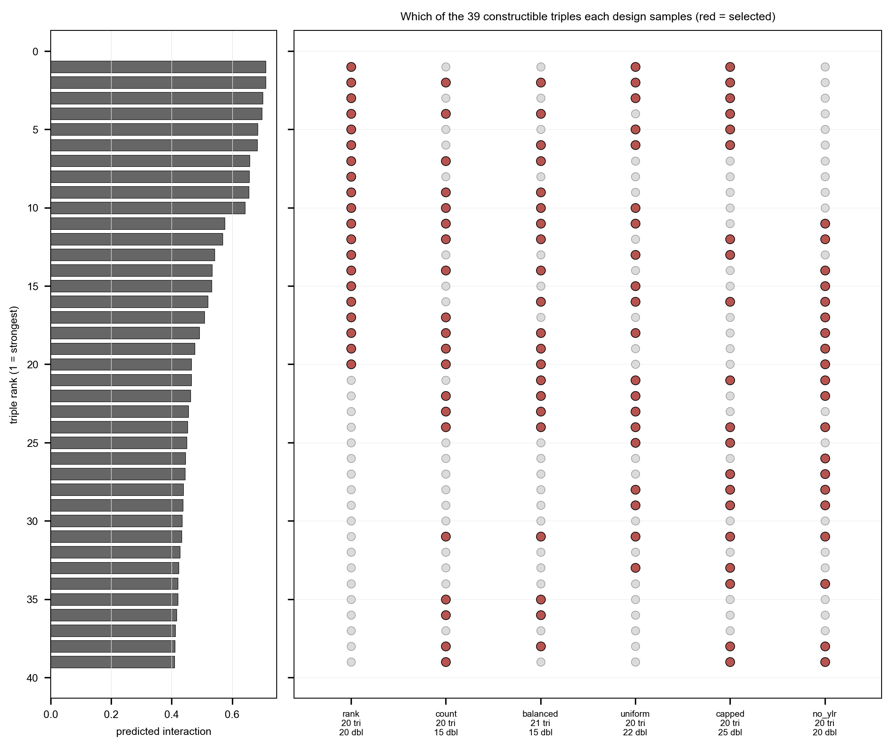
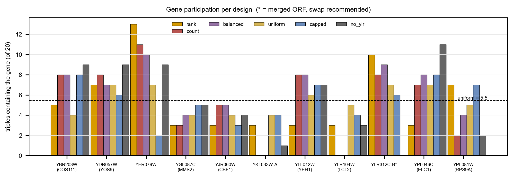

## 2026.08.23 - Capped build: 45 strains for the first trigenic round

**45 new strains: 25 doubles + 20 triples**, chosen by the `capped` strategy
(cap 6 on zero-trigenic-data genes, 20 triples).
Bench-facing list: [[experiments.W019-echo-crispr-array.build-list]]. All tables from
`experiments/W019-echo-crispr-array/scripts/triple_design_rank_sampling.py`
(`results/triple_design_rank_sampling_*.csv`, `results/triple_build_construction_check.csv`).

Supersedes the 2026.08.16 `balanced` list (36 strains), which put 15 of 21 triples on
genes the model has no training data for. See "Why capped" below.

### The finding that drives the design

The model was trained on **trigenic interactions only**. `queries/001_small_build.cql` has
every dataset block commented out except `TmiKuzmin2018Dataset` and `TmiKuzmin2020Dataset`
-- no SMF, no DMF, no DMI, no essentiality. Kuzmin record counts for the panel, counted
per gene over the LMDBs (`torchcell/datasets` builds under `$DATA_ROOT/data/torchcell/`):

**Only the trigenic column is training data.** It comes from `tmi_kuzmin2018` (91,111
records) + `tmi_kuzmin2020` (301,798), the two datasets the query pulls; every record in
both is a 3-KO. The digenic column comes from `dmi_kuzmin2018` + `dmi_kuzmin2020`
(1,043,196 records, all 2-KO) and is shown only to establish that a gene's absence is
absence from Kuzmin altogether, not an artifact of the trigenic subset. Those digenic
records were **not** in this model's training set.

| gene | trigenic | digenic | verdict |
|---|---|---|---|
| YLL012W (YEH1) | 1129 | 1140 | well supported |
| YBR203W (COS111) | 526 | 1147 | well supported |
| YPL046C (ELC1) | 493 | 1133 | well supported |
| YJR060W (CBF1) | 319 | 828 | well supported |
| YGL087C (MMS2) | 319 | 828 | well supported |
| YPL081W (RPS9A) | 10 | 21 | thin |
| YDR057W (YOS9) | 10 | 21 | thin |
| YLR104W (LCL2) | 9 | 20 | thin |
| YKL033W-A | 8 | 19 | thin |
| **YER079W** | **0** | **0** | **none -- extrapolation** |
| **YLR312C-B** | **0** | **0** | **none -- extrapolation** |

Both zero-data genes *do* have Costanzo data (YER079W 4 SMF, YLR312C-B 2 SMF and ~3,544
digenic partners) -- it was simply never in this model's training set. And node embeddings
are learned, not pre-computed, so those two genes carry embeddings that never received a
gradient from a labelled example containing them.

**They then take ranks 1--10 of the 39 targets.** Predicted interaction tracks *absence*
of training data: mean 0.4531 with no zero-data gene, 0.5300 with one, 0.6676 with two
(Spearman 0.634, p = 1.5e-05). The model is most confident exactly where it has no
evidence.

### Model calibration -- from logged val metrics only, no re-run

With zero bias $\mathrm{MSE}=\sigma_y^2+\sigma_p^2-2r\sigma_y\sigma_p$, so prediction SD
follows from val Pearson + val RMSE + the label SD ($\sigma_y=0.0535$, mean $-0.048$):

| ckpt | run | val $r$ | val RMSE | $\sigma_{pred}$ | optimal $r\sigma_y$ |
|---|---|---|---|---|---|
| M01 | `lzs9pcj3` | 0.443 | 0.0580 | 0.0563 | 0.0237 |
| M02 | `yv4r30bi` | 0.431 | 0.0591 | 0.0572 | 0.0231 |
| M03 | `c7671wgj` | 0.457 | 0.0567 | 0.0553 | 0.0245 |

**Over-dispersed 2.3x**; calibration slope $E[\tau\mid\hat\tau]\approx0.43\hat\tau+c$.
Shrunk, the raw 0.409--0.711 predictions become $\tau\approx$ **0.148--0.278** -- above
Kuzmin's intermediate (0.08) and stringent (0.12) for all 39, above very stringent (0.20)
for 15. Plausible strong interactions, not artefacts. **But that slope is fitted
in-distribution and does not license the zero-data genes at all.**

W&B group `compute-3-3-2059267_f83395...` is a **failed** run (val $r=-0.03$), not the
source of these predictions.

### What blocks the round -- our error bar, not the model

$\tau_{abc}=f_{abc}-f_{ab}f_c-f_{ac}f_b-f_{bc}f_a+2f_af_bf_c$ -- seven measured terms, so
$\mathrm{SE}(\tau)\approx\sqrt{7}\,s=2.65\,s$. At 2 picks / 3 plates $s\approx0.121$, so
$\mathrm{SE}(\tau)\approx0.32$ and the smallest callable $|\tau|$ is **0.63**. **0 of 39**
targets clear it (0 at 6 plates, floor 0.55). Kuzmin's own median $\mathrm{SE}(\tau)$,
back-solved from $\tau$ and $p$ in `tmi_kuzmin2018/2020`, is **0.031**. Closing the gap
needs per-strain SE ~0.121 -> ~0.04, roughly **9x more replication** -- the pick/plate
problem, not a model problem.

### Why capped

All six strategies at their natural size:

| | tri | new dbl | **construct** | measure | wells | gene range | YLR | zero-data tri | mean pred |
|---|---|---|---|---|---|---|---|---|---|
| rank | 20 | 20 | 40 | 62 | 5 | 3--13 | 10 | 17 | 0.6005 |
| count | 20 | 15 | 35 | 56 | 6 | 0--11 | 8 | -- | 0.5221 |
| balanced | 21 | 15 | 36 | 57 | 6 | 0--10 | 9 | 15 | 0.5329 |
| uniform | 20 | 22 | 42 | 65 | 5 | 4--7 | 7 | -- | 0.5403 |
| **capped** | **20** | **25** | **45** | **65** | 5 | 2--8 | **6** | **6** | 0.5300 |
| no_ylr | 20 | 20 | 40 | 59 | 6 | 0--11 | 0 | 0 | 0.4743 |

Capped is the only design that holds zero-data exposure to a chosen level -- **6 of 20**,
against 15 for `balanced` and 17 for `rank` -- while still covering all eleven genes. It is
the most expensive of the 20-triple designs (45 strains vs 40), because constraining the
flagged genes forces it down the ranking. That is the trade being bought: fewer results
resting on extrapolation.

**Two constraints shape the size.** Only **16 of 39** targets are clean, and only **14 of
those 16 have an existing double to build from** -- ranks 26, 32 and 37 have none, and all
three contain YLR104W (LCL2), which has zero built doubles because it sat outside the TEN
gene set the original set-cover ran on. A cap of 5 therefore tops out at 19 parallel
triples. Cap 6 reaches 20 with every strain parallel, which is why it was chosen.

The original set-cover guarantee is intact: **31 of 31** within-TEN targets have a built
parent. The three that do not are among the 8 targets YLR104W added when the basis was
corrected to eleven genes.

### The 20 triples

`*` = involves YER079W or YLR312C-B.

| rank | pred | triple | new dbl | |
|---|---|---|---|---|
| 1 | 0.7114 | YKL033W-A + YLR312C-B + YPL081W | 2 | * |
| 2 | 0.7109 | YER079W + YLL012W + YLR312C-B | 2 | * |
| 3 | 0.7012 | YLR104W + YLR312C-B + YPL081W | 2 | * |
| 4 | 0.6987 | YBR203W + YLR312C-B + YPL081W | 2 | * |
| 5 | 0.6841 | YER079W + YLR104W + YLR312C-B | 2 | * |
| 6 | 0.6831 | YGL087C + YLR312C-B + YPL081W | 2 | * |
| 12 | 0.5679 | YBR203W + YDR057W + YPL081W | 2 |  |
| 13 | 0.5415 | YDR057W + YKL033W-A + YPL081W | 2 |  |
| 16 | 0.5195 | YDR057W + YGL087C + YPL081W | 1 |  |
| 21 | 0.4644 | YJR060W + YLL012W + YPL046C | 1 |  |
| 24 | 0.4529 | YBR203W + YLL012W + YPL046C | 1 |  |
| 25 | 0.4492 | YDR057W + YKL033W-A + YLL012W | 2 |  |
| 27 | 0.4436 | YGL087C + YLL012W + YPL046C | 2 |  |
| 28 | 0.4385 | YBR203W + YLR104W + YPL046C | 2 |  |
| 29 | 0.4370 | YBR203W + YKL033W-A + YPL046C | 2 |  |
| 31 | 0.4331 | YBR203W + YJR060W + YPL046C | 1 |  |
| 33 | 0.4226 | YJR060W + YLR104W + YPL046C | 2 |  |
| 34 | 0.4204 | YBR203W + YGL087C + YPL046C | 2 |  |
| 38 | 0.4109 | YBR203W + YDR057W + YLL012W | 2 |  |
| 39 | 0.4092 | YDR057W + YGL087C + YLL012W | 1 |  |

### The 25 new doubles

| double | serves triples (rank) | |
|---|---|---|
| YBR203W + YDR057W | 12, 38 |  |
| YBR203W + YLL012W | 24, 38 |  |
| YBR203W + YPL081W | 4, 12 |  |
| YDR057W + YKL033W-A | 13, 25 |  |
| YGL087C + YLL012W | 27, 39 |  |
| YGL087C + YPL046C | 27, 34 |  |
| YGL087C + YPL081W | 6, 16 |  |
| YKL033W-A + YPL081W | 1, 13 |  |
| YLR104W + YLR312C-B | 3, 5 | * |
| YLR104W + YPL046C | 28, 33 |  |
| YBR203W + YGL087C | 34 |  |
| YBR203W + YJR060W | 31 |  |
| YBR203W + YKL033W-A | 29 |  |
| YBR203W + YLR104W | 28 |  |
| YBR203W + YLR312C-B | 4 | * |
| YER079W + YLL012W | 2 | * |
| YER079W + YLR104W | 5 | * |
| YGL087C + YLR312C-B | 6 | * |
| YJR060W + YLL012W | 21 |  |
| YJR060W + YLR104W | 33 |  |
| YKL033W-A + YLL012W | 25 |  |
| YKL033W-A + YLR312C-B | 1 | * |
| YKL033W-A + YPL046C | 29 |  |
| YLL012W + YLR312C-B | 2 | * |
| YLR104W + YPL081W | 3 |  |

### Gene participation

YBR203W 8 · YPL046C 8 · YLL012W 7 · YPL081W 7 · YDR057W 6 · YLR312C-B 6 · YGL087C 5 · YLR104W 4 · YKL033W-A 4 · YJR060W 3 · YER079W 2

All eleven genes covered, range 2--8. Contrast `balanced`, which left two genes at zero
and put 10 triples on YER079W.

### Plate

| | count | note |
|---|---|---|
| singles | 11 | all built |
| doubles | 33 | 8 existing + **25 new** |
| triples | 20 | **all new** |
| WT (BY4741) | 1 | |
| **on plate** | **65** | 5 wells/strain at one 384 layout |
| **to construct** | **45** | 25 doubles + 20 triples |

65 tubes at one pick, 135 at two. Two destination-plate designs restore ~12 wells/strain
and add the 6-plate replication gain.

### Construction feasibility -- verified

| check | result |
|---|---|
| 11 required singles built | **yes** |
| 25 new doubles, both parent singles built | **25 / 25** |
| any new double = blocked `YKL033W-A x YJR060W` | **no** |
| triples with zero already-built parent | **none** |

**All 20 build in one parallel wave.** Targets with no existing parent double are excluded
from the `capped` selection by construction. **15 of 20 have only one parent route**
(T01--T15) -- start those first.

### The contingency

If YER079W and YLR312C-B are dropped, **14 triples survive and 17 of the 25 new doubles are
still needed** -- a **31-strain** core. The six flagged triples are the top of the ranking
and the seven flagged doubles feed only those, so the flagged portion is cleanly separable
and the core can start immediately.

The one loose end: 18 of the 25 new doubles contain neither flagged gene, but
`YLR104W + YPL081W` serves only rank 3 (`YLR104W + YLR312C-B + YPL081W`). Dropping the two
genes leaves it feeding no surviving tau, so 32 strains are clean by composition and 31 are
needed. It remains a usable digenic measurement either way.

### Excluded

`YKL033W-A x YJR060W` failed to construct (reported at the 2026-08-11 handover; attempt
date never recorded) and is excluded everywhere. It blocks **0** of the 39 targets.

### Related

- [[experiments.W019-echo-crispr-array.build-list]]
- [[experiments.W019-echo-crispr-array.run4-handoff]]
- [[experiments.010-kuzmin-tmi.scripts.construction_validation_doubles]]
- [[experiments.010-kuzmin-tmi.inference-dataset-3]]
