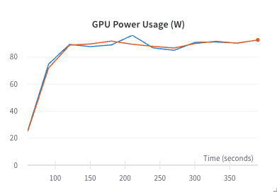

Predicting only double mutant fitness using sequence embeddings with a deep set model.

## M1 Test Run Batch 16 Very Slow

- It works, but is slow 🐢. Hopefully we see considerable speedup on GPU.

```bash
Epoch 0:   0%|▎     | 3167/664746 [2:07:04<442:25:45,  2.41s/it, v_num=kcs3]
```

## Data Loader Speed with Number of Workers for CellDataset

`M1` with `num_workers=0`, `batch_size=32`

```bash
13294866
  0%|       | 279/415465 [04:46<123:54:58,  1.07s/it]
```

`M1` with `num_workers=2`, `batch_size=32`

```bash
13294866
  0%|       | 735/415465 [08:15<72:29:10,  1.59it/s]
```

`M1` with `num_workers=4`, `batch_size=32`

```bash
13294866
  0%|      | 1121/415465 [06:26<37:27:07,  3.07it/s]
```

`M1` with `num_workers=8`, `batch_size=32`

```bash
13294866
  0%|      | 1197/415465 [04:30<23:48:54,  4.83it/s]
```

`M1` with `num_workers=10`, `batch_size=32`

```bash
13294866
  1%|▏     | 2109/415465 [06:27<17:06:33,  6.71it/s]
```

We are ripping now 🛡️💨 `M1` fans 🪭 going wild.

## Training Speed with Number of Workers for CellDataset

The training process is a bit slow. We can make it through all data once in 18 hours, which still seems a bit slow. This plus training is what is sinking 🚢 us. Will need to try to profile while exploring other methods for speed up including distributed data parallelism `dds`, etc. There is are a lot of ways to try and speed everything up.

For the subsequence tests I used this deep set model

```yaml
model:
  instance_layers: [1024, 256, 128]
  set_layers: [128, 32, 16]
```

### Training Speeding with Number of Workers for CellDataset - M1

```yaml
data_module:
  batch_size: 32
  num_workers: 10
```

### Training Speeding with Number of Workers for CellDataset - Delta Interactive GPU

failed

```yaml
data_module:
  batch_size: 32
  num_workers: 10
```

Works, but slow

```yaml
data_module:
  batch_size: 2
  num_workers: 2
```

```bash
Epoch 0:   0%|      | 196/5317946 [00:49<371:15:34,  3.98it/s, v_num=bu94]
```

```yaml
data_module:
  batch_size: 2
  num_workers: 16
```

```bash
Epoch 0:   0%|     | 1304/5317946 [04:56<335:17:15,  4.40it/s, v_num=s3q1]
```

```yaml
data_module:
  batch_size: 4
  num_workers: 16
```

```bash
Epoch 0:   0%|     | 184/2658973 [01:39<401:15:20,  1.84it/s, v_num=uifk]
```

```yaml
data_module:
  batch_size: 4
  num_workers: 10
```

```bash
Epoch 0:   0%|      | 796/2658973 [05:30<307:01:13,  2.40it/s, v_num=qqfw]
```

### Training Speeding with Number of Workers for CellDataset - Delta 2GPUs sbatch

```yaml
data_module:
  batch_size: 8
  num_workers: 32
```

Failed

```yaml
data_module:
  batch_size: 8
  num_workers: 12
```

Works!

```yaml
data_module:
  batch_size: 16
  num_workers: 12
```

Fails

### Training Speeding with Number of Workers for CellDataset - Delta 3GPUs sbatch

```yaml
data_module:
  batch_size: 16
  num_workers: 12
```

Works, but not all GPUs are running. [3 GPUs one working](https://wandb.ai/zhao-group/torchcell/runs/5ng9sjsa?workspace=user-mjvolk3)

## Training Speedup with 1e5 CellDataset

Used this deep set model

```yaml
model:
  instance_layers: [1024, 256, 128]
  set_layers: [128, 32, 16]
```

### Training Speedup with 1e5 CellDataset - 1 gpu A40x4-interactive

```yaml
data_module:
  batch_size: 4
  num_workers: 12
```

```bash
Epoch 0:   1%|▎   | 186/19999 [01:27<2:35:46,  2.12it/s, v_num=8ms8]
```

```yaml
data_module:
  batch_size: 8
  num_workers: 12
```

```bash
Epoch 0:   1%|▎   | 109/10000 [02:10<3:17:04,  1.20s/it, v_num=jipu]
```

```yaml
data_module:
  batch_size: 8
  num_workers: 12
  pin_memory: True
```

Fails

Once I pin memory, I `pl` tells me I should only be using one worker, whereas when I don't use pin memory it recommends 12 workers.

### Training Speedup with 1e5 CellDataset - 2 gpus A40x4-interactive

```bash
Epoch 0:   6%|██       | 615/10000 [08:36<2:11:15,  1.19it/s, v_num=ru49]
```

```yaml
data_module:
  batch_size: 8
  num_workers: 12
  pin_memory: false
```

Still not that fast... trying `ddp` next. Not sure if this is accurate ⛔️ because I ran without chaning the hardcoded devices from 1 to 2.

```yaml
data_module:
  batch_size: 8
  num_workers: 12
  pin_memory: false

trainer:
  max_epochs: 1
  strategy: ddp
```

```bash
Epoch 0:   3%|█▍ | 141/5000 [04:26<2:33:14,  1.89s/it, v_num=azlu]
```

This time devices, is set correctly, and `ddp` seems to be working since we see `5000` as the max iter, half of the previous with only one gpu. Still slow as the tortoise on a cold day 🐢. Since we have another GPU and with it more memory I will try to increase the batch size.

We can confirm that the both gpus are being used.


Added `sync_dist=True` to log metrics as recommended, but according to the [docs](https://lightning.ai/docs/pytorch/stable/extensions/logging.html#logging-from-a-lightningmodule) this can create some communication overhead, so if we see slow downs we can try to revert.

```yaml
data_module:
  batch_size: 16
  num_workers: 12
  pin_memory: false

trainer:
  max_epochs: 1
  strategy: ddp
```

```bash
Epoch 0:   1%|▌   | 29/2500 [02:47<3:58:31,  5.79s/it, v_num=yzxc]
```

We can handle this batch size which is good but we don't see much of a speed up.

```yaml
data_module:
  batch_size: 32
  num_workers: 12
  pin_memory: false

trainer:
  max_epochs: 1
  strategy: ddp
```

Failed, `pid` killed. Now trying pinning memory.

```yaml
data_module:
  batch_size: 16
  num_workers: 12
  pin_memory: true

trainer:
  max_epochs: 1
  strategy: ddp
```

```bash
Epoch 0:   8%|████▎     | 189/2500 [13:22<2:43:28,  4.24s/it, v_num=do1w]
```

Works but we don't see any speed improvement. I am going to try `pin_memory=False` again to make sure `sync_dist=True` isn't affecting this.

```yaml
data_module:
  batch_size: 16
  num_workers: 12
  pin_memory: false

trainer:
  max_epochs: 1
  strategy: ddp
```

I switched to using the `1e4` dataset so I could get the profile faster.

```bash
--------------------------------------------------------------------------------------------------------------------------------------------------------------------------------------------------------------------------------------------------------------------------
|  Action                                                                                                                                                               |  Mean duration (s)    |  Num calls            |  Total time (s)      |  Percentage %          |
--------------------------------------------------------------------------------------------------------------------------------------------------------------------------------------------------------------------------------------------------------------------------
|  Total                                                                                                                                                                |  -                    |  9572                 |  1156.7              |  100 %                 |
--------------------------------------------------------------------------------------------------------------------------------------------------------------------------------------------------------------------------------------------------------------------------
|  run_training_epoch                                                                                                                                                   |  938.84               |  1                    |  938.84              |  81.165                |
|  [Strategy]DDPStrategy.batch_to_device                                                                                                                                |  2.5586               |  284                  |  726.63              |  62.819                |
|  [LightningModule]RegressionTask.transfer_batch_to_device                                                                                                             |  2.5582               |  284                  |  726.54              |  62.811                |
|  run_training_batch                                                                                                                                                   |  0.33755              |  250                  |  84.388              |  7.2955                |
|  [LightningModule]RegressionTask.optimizer_step                                                                                                                       |  0.33732              |  250                  |  84.329              |  7.2904                |
|  [Strategy]DDPStrategy.training_step                                                                                                                                  |  0.32533              |  250                  |  81.332              |  7.0313                |
|  [_EvaluationLoop].val_next                                                                                                                                           |  2.2378               |  35                   |  78.324              |  6.7713                |
|  [_TrainingEpochLoop].train_dataloader_next                                                                                                                           |  0.17849              |  250                  |  44.622              |  3.8577                |
|  [Strategy]DDPStrategy.validation_step                                                                                                                                |  0.40505              |  34                   |  13.772              |  1.1906                |
|  [LightningModule]RegressionTask.on_validation_epoch_end                                                                                                              |  2.9934               |  2                    |  5.9868              |  0.51757               |
|  [Strategy]DDPStrategy.backward                                                                                                                                       |  0.010205             |  250                  |  2.5513              |  0.22056               |
|  [Callback]ModelCheckpoint{'monitor': None, 'mode': 'min', 'every_n_train_steps': 0, 'every_n_epochs': 1, 'train_time_interval': None}.on_train_epoch_end             |  0.93447              |  1                    |  0.93447             |  0.080787              |
|  [LightningModule]RegressionTask.on_train_epoch_end                                                                                                                   |  0.26693              |  1                    |  0.26693             |  0.023076              |
|  [Callback]TQDMProgressBar.on_validation_batch_end                                                                                                                    |  0.0051079            |  34                   |  0.17367             |  0.015014              |
|  [Callback]TQDMProgressBar.on_train_batch_end                                                                                                                         |  0.00047494           |  250                  |  0.11874             |  0.010265              |
|  [LightningDataModule]CellDataModule.setup                                                                                                                            |  0.053328             |  1                    |  0.053328            |  0.0046103             |
|  [LightningModule]RegressionTask.optimizer_zero_grad                                                                                                                  |  0.00015403           |  250                  |  0.038507            |  0.003329              |
|  [Callback]ModelCheckpoint{'monitor': None, 'mode': 'min', 'every_n_train_steps': 0, 'every_n_epochs': 1, 'train_time_interval': None}.setup                          |  0.034761             |  1                    |  0.034761            |  0.0030052             |
|  [Callback]TQDMProgressBar.on_validation_start                                                                                                                        |  0.014144             |  2                    |  0.028288            |  0.0024456             |
|  [LightningModule]RegressionTask.configure_gradient_clipping                                                                                                          |  2.1112e-05           |  250                  |  0.005278            |  0.00045629            |
|  [Callback]ModelCheckpoint{'monitor': None, 'mode': 'min', 'every_n_train_steps': 0, 'every_n_epochs': 1, 'train_time_interval': None}.on_train_batch_end             |  1.4285e-05           |  250                  |  0.0035712           |  0.00030873            |
|  [LightningDataModule]CellDataModule.val_dataloader                                                                                                                   |  0.0023267            |  1                    |  0.0023267           |  0.00020115            |
|  [Callback]TQDMProgressBar.on_validation_batch_start                                                                                                                  |  6.6332e-05           |  34                   |  0.0022553           |  0.00019497            |
|  [LightningModule]RegressionTask.on_validation_model_eval                                                                                                             |  0.00060559           |  2                    |  0.0012112           |  0.00010471            |
|  [Callback]ModelSummary.on_fit_start                                                                                                                                  |  0.0009569            |  1                    |  0.0009569           |  8.2726e-05            |
|  [Callback]TQDMProgressBar.on_validation_end                                                                                                                          |  0.00043656           |  2                    |  0.00087312          |  7.5483e-05            |
|  [Callback]TQDMProgressBar.on_before_zero_grad                                                                                                                        |  2.3594e-06           |  250                  |  0.00058985          |  5.0994e-05            |
|  [Callback]TQDMProgressBar.on_after_backward                                                                                                                          |  2.2074e-06           |  250                  |  0.00055186          |  4.7709e-05            |
|  [Callback]ModelSummary.on_train_batch_end                                                                                                                            |  2.164e-06            |  250                  |  0.000541            |  4.677e-05             |
|  [Callback]TQDMProgressBar.on_before_backward                                                                                                                         |  1.8817e-06           |  250                  |  0.00047042          |  4.0669e-05            |
|  [LightningModule]RegressionTask.on_validation_model_train                                                                                                            |  0.00023202           |  2                    |  0.00046405          |  4.0118e-05            |
|  [Callback]TQDMProgressBar.on_train_batch_start                                                                                                                       |  1.7781e-06           |  250                  |  0.00044452          |  3.8429e-05            |
|  [Callback]TQDMProgressBar.on_train_start                                                                                                                             |  0.00042765           |  1                    |  0.00042765          |  3.6971e-05            |
|  [Callback]TQDMProgressBar.on_before_optimizer_step                                                                                                                   |  1.4032e-06           |  250                  |  0.00035081          |  3.0328e-05            |
|  [Callback]ModelCheckpoint{'monitor': None, 'mode': 'min', 'every_n_train_steps': 0, 'every_n_epochs': 1, 'train_time_interval': None}.on_after_backward              |  1.3781e-06           |  250                  |  0.00034453          |  2.9785e-05            |
|  [Callback]TQDMProgressBar.on_train_end                                                                                                                               |  0.00032016           |  1                    |  0.00032016          |  2.7678e-05            |
|  [LightningModule]RegressionTask.on_before_batch_transfer                                                                                                             |  1.0218e-06           |  284                  |  0.00029018          |  2.5087e-05            |
|  [LightningModule]RegressionTask.on_after_batch_transfer                                                                                                              |  1.0199e-06           |  284                  |  0.00028966          |  2.5041e-05            |
|  [Callback]ModelSummary.on_after_backward                                                                                                                             |  1.1226e-06           |  250                  |  0.00028066          |  2.4263e-05            |
|  [Callback]TQDMProgressBar.on_train_epoch_start                                                                                                                       |  0.00027613           |  1                    |  0.00027613          |  2.3872e-05            |
|  [Callback]TQDMProgressBar.on_sanity_check_start                                                                                                                      |  0.00025987           |  1                    |  0.00025987          |  2.2466e-05            |
|  [LightningDataModule]CellDataModule.train_dataloader                                                                                                                 |  0.0002589            |  1                    |  0.0002589           |  2.2383e-05            |
|  [Callback]ModelCheckpoint{'monitor': None, 'mode': 'min', 'every_n_train_steps': 0, 'every_n_epochs': 1, 'train_time_interval': None}.on_before_zero_grad            |  9.5911e-07           |  250                  |  0.00023978          |  2.0729e-05            |
|  [Callback]ModelSummary.on_before_zero_grad                                                                                                                           |  9.4702e-07           |  250                  |  0.00023675          |  2.0468e-05            |
|  [LightningModule]RegressionTask.on_train_batch_end                                                                                                                   |  9.3011e-07           |  250                  |  0.00023253          |  2.0102e-05            |
|  [Strategy]DDPStrategy.on_train_batch_start                                                                                                                           |  9.161e-07            |  250                  |  0.00022902          |  1.98e-05              |
|  [LightningModule]RegressionTask.on_before_zero_grad                                                                                                                  |  8.8747e-07           |  250                  |  0.00022187          |  1.9181e-05            |
|  [Callback]ModelSummary.on_train_batch_start                                                                                                                          |  8.8476e-07           |  250                  |  0.00022119          |  1.9122e-05            |
|  [LightningModule]RegressionTask.on_after_backward                                                                                                                    |  8.7869e-07           |  250                  |  0.00021967          |  1.8991e-05            |
|  [Callback]ModelCheckpoint{'monitor': None, 'mode': 'min', 'every_n_train_steps': 0, 'every_n_epochs': 1, 'train_time_interval': None}.on_train_batch_start           |  8.6052e-07           |  250                  |  0.00021513          |  1.8598e-05            |
|  [LightningModule]RegressionTask.on_train_batch_start                                                                                                                 |  8.5177e-07           |  250                  |  0.00021294          |  1.8409e-05            |
|  [Callback]ModelSummary.on_before_optimizer_step                                                                                                                      |  8.1509e-07           |  250                  |  0.00020377          |  1.7617e-05            |
|  [Callback]ModelSummary.on_before_backward                                                                                                                            |  8.1248e-07           |  250                  |  0.00020312          |  1.756e-05             |
|  [Callback]ModelCheckpoint{'monitor': None, 'mode': 'min', 'every_n_train_steps': 0, 'every_n_epochs': 1, 'train_time_interval': None}.on_before_optimizer_step       |  7.9967e-07           |  250                  |  0.00019992          |  1.7283e-05            |
|  [Callback]ModelCheckpoint{'monitor': None, 'mode': 'min', 'every_n_train_steps': 0, 'every_n_epochs': 1, 'train_time_interval': None}.on_before_backward             |  7.7167e-07           |  250                  |  0.00019292          |  1.6678e-05            |
|  [LightningModule]RegressionTask.on_before_optimizer_step                                                                                                             |  7.1691e-07           |  250                  |  0.00017923          |  1.5495e-05            |
|  [Callback]TQDMProgressBar.on_train_epoch_end                                                                                                                         |  0.00017761           |  1                    |  0.00017761          |  1.5355e-05            |
|  [LightningModule]RegressionTask.on_before_backward                                                                                                                   |  6.8924e-07           |  250                  |  0.00017231          |  1.4897e-05            |
|  [LightningModule]RegressionTask.configure_optimizers                                                                                                                 |  9.9205e-05           |  1                    |  9.9205e-05          |  8.5765e-06            |
|  [Callback]ModelSummary.on_validation_batch_end                                                                                                                       |  2.5547e-06           |  34                   |  8.6861e-05          |  7.5093e-06            |
|  [Callback]ModelSummary.on_validation_batch_start                                                                                                                     |  1.6021e-06           |  34                   |  5.4472e-05          |  4.7092e-06            |
|  [Callback]ModelCheckpoint{'monitor': None, 'mode': 'min', 'every_n_train_steps': 0, 'every_n_epochs': 1, 'train_time_interval': None}.on_validation_end              |  2.6871e-05           |  2                    |  5.3741e-05          |  4.646e-06             |
|  [Callback]ModelCheckpoint{'monitor': None, 'mode': 'min', 'every_n_train_steps': 0, 'every_n_epochs': 1, 'train_time_interval': None}.on_validation_batch_end        |  1.0829e-06           |  34                   |  3.6819e-05          |  3.1831e-06            |
|  [LightningModule]RegressionTask.on_validation_batch_end                                                                                                              |  1.0546e-06           |  34                   |  3.5858e-05          |  3.1e-06               |
|  [Callback]ModelCheckpoint{'monitor': None, 'mode': 'min', 'every_n_train_steps': 0, 'every_n_epochs': 1, 'train_time_interval': None}.on_validation_batch_start      |  9.9598e-07           |  34                   |  3.3863e-05          |  2.9276e-06            |
|  [LightningModule]RegressionTask.on_validation_batch_start                                                                                                            |  9.6126e-07           |  34                   |  3.2683e-05          |  2.8255e-06            |
|  [Callback]ModelSummary.on_validation_start                                                                                                                           |  4.4033e-06           |  2                    |  8.8066e-06          |  7.6135e-07            |
|  [Callback]TQDMProgressBar.on_sanity_check_end                                                                                                                        |  7.594e-06            |  1                    |  7.594e-06           |  6.5652e-07            |
|  [Callback]TQDMProgressBar.setup                                                                                                                                      |  7.2327e-06           |  1                    |  7.2327e-06          |  6.2528e-07            |
|  [LightningModule]RegressionTask.on_validation_start                                                                                                                  |  2.5656e-06           |  2                    |  5.1311e-06          |  4.436e-07             |
|  [Callback]TQDMProgressBar.on_validation_epoch_end                                                                                                                    |  2.299e-06            |  2                    |  4.5979e-06          |  3.975e-07             |
|  [Strategy]DDPStrategy.on_validation_start                                                                                                                            |  2.2789e-06           |  2                    |  4.5579e-06          |  3.9404e-07            |
|  [Callback]ModelSummary.on_train_epoch_end                                                                                                                            |  4.3991e-06           |  1                    |  4.3991e-06          |  3.8031e-07            |
|  [Callback]ModelSummary.on_validation_end                                                                                                                             |  2.0387e-06           |  2                    |  4.0773e-06          |  3.5249e-07            |
|  [Callback]ModelSummary.on_train_start                                                                                                                                |  3.0352e-06           |  1                    |  3.0352e-06          |  2.624e-07             |
|  [Callback]ModelCheckpoint{'monitor': None, 'mode': 'min', 'every_n_train_steps': 0, 'every_n_epochs': 1, 'train_time_interval': None}.on_train_start                 |  3.0263e-06           |  1                    |  3.0263e-06          |  2.6163e-07            |
|  [Callback]ModelSummary.on_sanity_check_end                                                                                                                           |  2.9048e-06           |  1                    |  2.9048e-06          |  2.5112e-07            |
|  [LightningModule]RegressionTask.on_validation_end                                                                                                                    |  1.3774e-06           |  2                    |  2.7549e-06          |  2.3816e-07            |
|  [Callback]TQDMProgressBar.on_fit_end                                                                                                                                 |  2.6948e-06           |  1                    |  2.6948e-06          |  2.3297e-07            |
|  [Callback]ModelSummary.on_train_epoch_start                                                                                                                          |  2.6552e-06           |  1                    |  2.6552e-06          |  2.2955e-07            |
|  [Callback]ModelCheckpoint{'monitor': None, 'mode': 'min', 'every_n_train_steps': 0, 'every_n_epochs': 1, 'train_time_interval': None}.on_validation_start            |  1.272e-06            |  2                    |  2.5439e-06          |  2.1993e-07            |
|  [LightningModule]RegressionTask.setup                                                                                                                                |  2.4252e-06           |  1                    |  2.4252e-06          |  2.0966e-07            |
|  [Callback]TQDMProgressBar.on_validation_epoch_start                                                                                                                  |  1.1569e-06           |  2                    |  2.3139e-06          |  2.0004e-07            |
|  [Callback]ModelSummary.setup                                                                                                                                         |  2.285e-06            |  1                    |  2.285e-06           |  1.9754e-07            |
|  [Callback]TQDMProgressBar.on_fit_start                                                                                                                               |  2.1551e-06           |  1                    |  2.1551e-06          |  1.8631e-07            |
|  [Callback]ModelCheckpoint{'monitor': None, 'mode': 'min', 'every_n_train_steps': 0, 'every_n_epochs': 1, 'train_time_interval': None}.on_fit_start                   |  2.1243e-06           |  1                    |  2.1243e-06          |  1.8365e-07            |
|  [Callback]ModelSummary.on_validation_epoch_end                                                                                                                       |  1.0522e-06           |  2                    |  2.1043e-06          |  1.8192e-07            |
|  [Callback]ModelCheckpoint{'monitor': None, 'mode': 'min', 'every_n_train_steps': 0, 'every_n_epochs': 1, 'train_time_interval': None}.on_validation_epoch_end        |  9.9698e-07           |  2                    |  1.994e-06           |  1.7238e-07            |
|  [Callback]ModelSummary.on_train_end                                                                                                                                  |  1.994e-06            |  1                    |  1.994e-06           |  1.7238e-07            |
|  [LightningModule]RegressionTask.on_validation_epoch_start                                                                                                            |  9.7672e-07           |  2                    |  1.9534e-06          |  1.6888e-07            |
|  [Strategy]DDPStrategy.on_validation_end                                                                                                                              |  9.7137e-07           |  2                    |  1.9427e-06          |  1.6795e-07            |
|  [Callback]ModelSummary.on_sanity_check_start                                                                                                                         |  1.9143e-06           |  1                    |  1.9143e-06          |  1.655e-07             |
|  [LightningModule]RegressionTask.on_train_epoch_start                                                                                                                 |  1.864e-06            |  1                    |  1.864e-06           |  1.6115e-07            |
|  [LightningModule]RegressionTask.configure_callbacks                                                                                                                  |  1.7839e-06           |  1                    |  1.7839e-06          |  1.5423e-07            |
|  [LightningModule]RegressionTask.on_train_start                                                                                                                       |  1.6429e-06           |  1                    |  1.6429e-06          |  1.4203e-07            |
|  [Callback]ModelSummary.on_validation_epoch_start                                                                                                                     |  7.865e-07            |  2                    |  1.573e-06           |  1.3599e-07            |
|  [Callback]ModelCheckpoint{'monitor': None, 'mode': 'min', 'every_n_train_steps': 0, 'every_n_epochs': 1, 'train_time_interval': None}.on_validation_epoch_start      |  7.716e-07            |  2                    |  1.5432e-06          |  1.3341e-07            |
|  [Callback]TQDMProgressBar.on_save_checkpoint                                                                                                                         |  1.5432e-06           |  1                    |  1.5432e-06          |  1.3341e-07            |
|  [Callback]TQDMProgressBar.teardown                                                                                                                                   |  1.5218e-06           |  1                    |  1.5218e-06          |  1.3156e-07            |
|  [LightningDataModule]CellDataModule.teardown                                                                                                                         |  1.4021e-06           |  1                    |  1.4021e-06          |  1.2121e-07            |
|  [LightningModule]RegressionTask.configure_sharded_model                                                                                                              |  1.3732e-06           |  1                    |  1.3732e-06          |  1.1872e-07            |
|  [LightningDataModule]CellDataModule.state_dict                                                                                                                       |  1.3132e-06           |  1                    |  1.3132e-06          |  1.1353e-07            |
|  [LightningModule]RegressionTask.on_fit_end                                                                                                                           |  1.282e-06            |  1                    |  1.282e-06           |  1.1083e-07            |
|  [LightningDataModule]CellDataModule.prepare_data                                                                                                                     |  1.2321e-06           |  1                    |  1.2321e-06          |  1.0652e-07            |
|  [Callback]ModelSummary.on_fit_end                                                                                                                                    |  1.152e-06            |  1                    |  1.152e-06           |  9.9597e-08            |
|  [Callback]ModelSummary.teardown                                                                                                                                      |  1.0822e-06           |  1                    |  1.0822e-06          |  9.3558e-08            |
|  [Callback]ModelCheckpoint{'monitor': None, 'mode': 'min', 'every_n_train_steps': 0, 'every_n_epochs': 1, 'train_time_interval': None}.on_fit_end                     |  1.0622e-06           |  1                    |  1.0622e-06          |  9.1827e-08            |
|  [Callback]ModelCheckpoint{'monitor': None, 'mode': 'min', 'every_n_train_steps': 0, 'every_n_epochs': 1, 'train_time_interval': None}.on_sanity_check_end            |  1.0519e-06           |  1                    |  1.0519e-06          |  9.0941e-08            |
|  [Callback]ModelSummary.on_save_checkpoint                                                                                                                            |  1.051e-06            |  1                    |  1.051e-06           |  9.0861e-08            |
|  [Callback]ModelCheckpoint{'monitor': None, 'mode': 'min', 'every_n_train_steps': 0, 'every_n_epochs': 1, 'train_time_interval': None}.on_sanity_check_start          |  1.0221e-06           |  1                    |  1.0221e-06          |  8.8365e-08            |
|  [Strategy]DDPStrategy.on_train_end                                                                                                                                   |  9.6206e-07           |  1                    |  9.6206e-07          |  8.3172e-08            |
|  [Callback]ModelCheckpoint{'monitor': None, 'mode': 'min', 'every_n_train_steps': 0, 'every_n_epochs': 1, 'train_time_interval': None}.teardown                       |  9.6206e-07           |  1                    |  9.6206e-07          |  8.3172e-08            |
|  [Callback]ModelCheckpoint{'monitor': None, 'mode': 'min', 'every_n_train_steps': 0, 'every_n_epochs': 1, 'train_time_interval': None}.on_save_checkpoint             |  9.2108e-07           |  1                    |  9.2108e-07          |  7.9629e-08            |
|  [LightningModule]RegressionTask.on_train_end                                                                                                                         |  9.1223e-07           |  1                    |  9.1223e-07          |  7.8864e-08            |
|  [LightningModule]RegressionTask.on_fit_start                                                                                                                         |  8.9221e-07           |  1                    |  8.9221e-07          |  7.7133e-08            |
|  [Callback]ModelCheckpoint{'monitor': None, 'mode': 'min', 'every_n_train_steps': 0, 'every_n_epochs': 1, 'train_time_interval': None}.on_train_end                   |  8.9128e-07           |  1                    |  8.9128e-07          |  7.7052e-08            |
|  [Callback]ModelCheckpoint{'monitor': None, 'mode': 'min', 'every_n_train_steps': 0, 'every_n_epochs': 1, 'train_time_interval': None}.on_train_epoch_start           |  8.8196e-07           |  1                    |  8.8196e-07          |  7.6247e-08            |
|  [Strategy]DDPStrategy.on_train_start                                                                                                                                 |  8.1211e-07           |  1                    |  8.1211e-07          |  7.0209e-08            |
|  [LightningModule]RegressionTask.on_save_checkpoint                                                                                                                   |  8.0187e-07           |  1                    |  8.0187e-07          |  6.9323e-08            |
|  [LightningModule]RegressionTask.teardown                                                                                                                             |  6.5099e-07           |  1                    |  6.5099e-07          |  5.628e-08             |
|  [LightningModule]RegressionTask.prepare_data                                                                                                                         |  6.1095e-07           |  1                    |  6.1095e-07          |  5.2818e-08            |
--------------------------------------------------------------------------------------------------------------------------------------------------------------------------------------------------------------------------------------------------------------------------
```

## SLURM Lightning Instructions

[lightning cluster advanced](https://lightning.ai/docs/pytorch/stable/clouds/cluster_advanced.html)

Previously ⛔️ I wasn't matching the number of tasks to the number of devices.

```bash
SBATCH --mem=125g # Match by cost on Delta
SBATCH --nodes=1 # must match `num_nodes`
SBATCH --ntasks-per-node=2 # must match devices
SBATCH --gpus-per-node=2 # must match devices
```

```python
trainer = pl.Trainer(
    num_nodes=1
    devices=2,
    accelerator="gpu",
)
```

## Training Speedup with 1e5 CellDataset cont. 1

We are now properly using each GPU.

### Training Speedup with 1e5 CellDataset cont. 1 - 2 gpus A40x4-interactive

```yaml
data_module:
  batch_size: 16
  num_workers: 16
  pin_memory: true
```

Fails

```yaml
data_module:
  batch_size: 16
  num_workers: 12
  pin_memory: true
```

Works... maybe there is some overhead from `num_workers`

Running 2 epochs with `1e4` data, finishes in `400s`, giving `50it/s` as a conservative estimate. I show the power curve to show that both gpus are working. When the time ends the run ends.

This would allow us to have `1e5/50/60 =  33 min/epoch`. For `1.3e7`, the whole dataset, we will still need some speed up. `1.3e7/50/60/60 = 72 hr`, although it is now feasible.



Trying 4 gpus.

```yaml
data_module:
  batch_size: 16
  num_workers: 12
  pin_memory: true

trainer:
  max_epochs: 100
  strategy: ddp

model:
  instance_layers: [1024, 256, 128]
  set_layers: [128, 32, 16]
```

Models run

### Training Speedup with 1e5 CellDataset cont. 1 - 2 gpus A40x4-sbatch

```yaml
data_module:
  batch_size: 16
  num_workers: 16
  pin_memory: true
```

Fails, due to I think the `num_workers` being maxed out

```yaml
data_module:
  batch_size: 24
  num_workers: 4
  pin_memory: true
```

Works. We can have larger batch sizes if we reduce the number of workers. If we have 12 or 16 `num_workers`, this will fail with a gpu out of memory error, when this in fact seems like a cpu out of memory error. We see with batch size increase the gpu memory increases, yet still far below capacity.

## DMF stats dmf and dmf_std with low_dmf_std preprocess

After `{"preprocess": "low_dmf_std"}`

```bash
# dmf
count    1.329536e+07
mean     8.657942e-01
std      1.967366e-01
min     -2.718000e-01
25%      7.701000e-01
50%      9.359000e-01
75%      1.008600e+00
max      2.332300e+00
# dmf_std
count    1.329536e+07
mean     3.429249e-02
std      3.119908e-02
min      0.000000e+00
25%      1.580000e-02
50%      2.650000e-02
75%      4.250000e-02
max      1.193100e+00
```

## Instabilities in Overfitting Wildtype Before Training Batch
