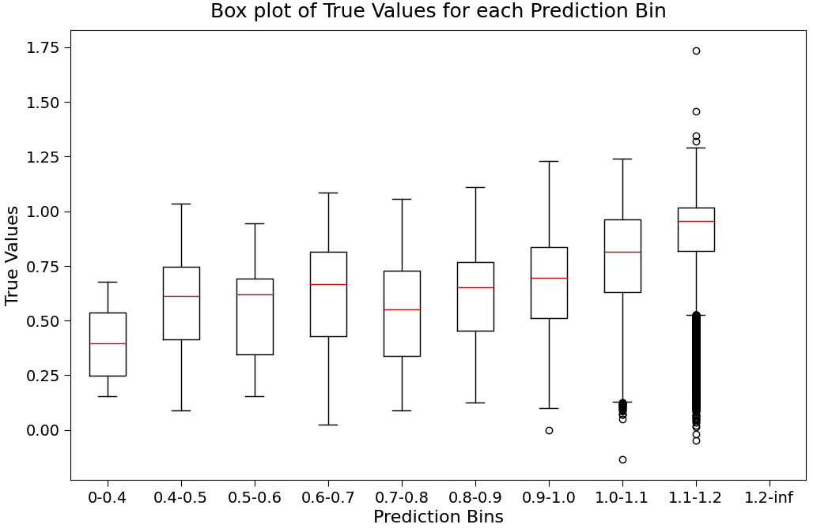
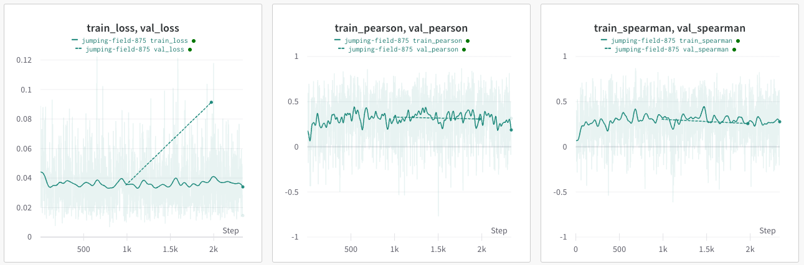

## Experimental Summary

- We can achieve a decent correlation and loss fit on `FungalCRE` model. This model uses batch norm and is trained on `x_pert`. When we use `layer norm` we get seem to always get prediction of the mean fitness value.
- [Wandb Log](https://wandb.ai/zhao-group/torchcell/groups/2482163_782109b6f2cffa508d6a1628f03256f0a43419a5628b43a0731e2daeea0c9e13/workspace?workspace=user-mjvolk3)

## Box Plot of True Fitness vs Predicted Fitness

This is after 2 epochs on `1e6` Costanzo.

## Loss and Correlations Show Promise but Noisy

