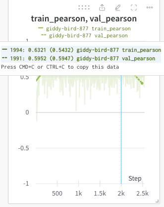

## Experimental Summary

- Total data size is `1.3e7`, but we train on `1.3e6` for faster training.
- All models use feautres from the `FungalLM`, I refer to these are as `FungalCRE` features since they describe the Fungal Cis-Regulatory-Elements. This model embeds sequences to size `768`.
  - `downstream` are embeddings of the `300 bp` downstream of the gene, (more precisely the CDS). This captures the terminator, and has been shown to be predictive of gene expression.
  - `upstream` are embeddings of the `1003 bp` upstream of the gene, (more precisely the CDS). This captures the promoter region and should contain information about transcription factor binding. They have also shown to be predictive of gene expression.

## Motivation

- Previous model development has shown that gene expression of pertubed strains (deletion mutants), can be used to predict strain growth with high correlations. Collecting gene expression data is expensive, if we can predict phenotypes (in this simple case growth), with features that can be computed from genomic sequence alone, this would be very useful. We would like to start with growth as there are good benchmarks but there are other global labels that we would like to predict. For instance cell morphology ($(e_1, e_2)$ of an ellipse).
- We model data structure as a graph, because we might do do inference at different levels of the cell. For instance, we have expression data paired with growth data for a gene deletions. We could train the node level on the expression data, the global level on the fitness data, and see if we can do any inference on expression for different gene deletions. Capturing major trends would be sufficient. One important caveat is that to maintain the ability to do any inference on nodes, or to backpropagate through nodes, we need a representation for the entire genome, not just the nodes that were removed. This poses a difficult challenge becuase the engineering edits to genomes are often small perturbations to the entire graph, we are talking 1-3 nodes in a 6000 node graph. To account for this I've attempted to learn a wildtype different embedding.

## Wildtype Difference Embedding

This model has a lot of instabilities in training. The primary issue seems to be the stabilization of the `wt` embedding.

When there is stabilization in the `wt_y_hat` the model starts to learn some and correlation starts to rise. As soon as we get another instability the model has to reset.

### Wildtype Difference Embedding - Gradient Norm Clipping

To try stabilize learning we have tried adding gradient norm clipping.

The `wt_mean` is the mean of a batch of wildtype mutants. I started using a batch to avoid conditional logic of skipping `BatchNorm` for single mutant embeddings. This fixes some of the automation of using `DDP` with torch lightning. `wt_mean = 1`, so we need the stabilization around 1. Everytime there is spiking `wt_mean`, there is corresponding spiking in the overall loss.

### Wildtype Difference Embedding - Layer Norm

We have also tried using `LayerNorm` instead of `BatchNorm`. `LayerNorm` stabilizing the learning, but the model just learns to predict the mean of the dataset $\sim 0.85$. We can see this in the boxplot and the `wt_mean`.

### Wildtype Difference Embedding - Overfit on Mean

The `wt_loss` is `MSE` for just the `wt`. In the training loop I have attempted to overfit the `wt`, before moving on to training on the rest of the data. This should solve the stabilization issue, but this is unstable. I'm thinking there might be an issue with the way I am trying to learn the difference embeddings, and there there is probably a better way.

## Perturbation Nodes Benchmark Model

To make sure this task is even possible, I have built some benchmark models, which I think are interesting in their own right. This model is trained to predict `fitness` from the embeddings of the perturbation graph alone. I still use a Deep set for this.

### Perturbation Nodes Benchmark Model - Downstream Only

- This model was only trained on `downstream` CRE. This was initally a mistake, but it turned out to look better than the model trained on both `downstream + upstream`.

These panels are starting to look comparable to the `DCell` benchmark model that train on the entire `1.3e7` dataset using the gene ontology visible neural network.

If we look at $R^2 = 0.6^2 = 0.36$, so the embeddings of the downstream DNA sequences that are deleted from the genome can explain $36\%$ of the variance in growth.

### Perturbation Nodes Benchmark Model - Downstream and Upstream Comparison

Models Trained on `downstream` and `downstream + upstream`.

#### Perturbation Nodes Benchmark Model - Adding Bug

⛔️ There is a major bug 🪲. When adding the datasets only the first element was properly added. This means that only the `downstream` dataset was included in both of the datasets provided.
