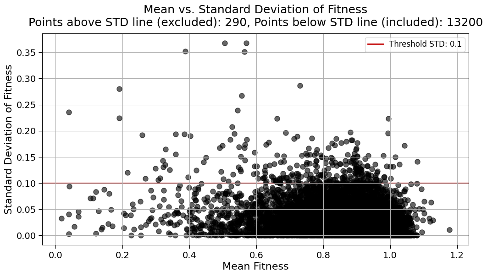

## 2024.03.21 - Setting Heap Causes Query Failure

I have been trying to speed up the query by changing [[neo4j.conf]] settings but it is probably best to dynamically set Heap and memory for Pagination.

```bash
(torchcell) michaelvolk@M1-MV torchcell % python experiments/smf-dmf-tmf-001/node_removal_domain_overlap.py             1:35
wandb: Currently logged in as: mjvolk3 (zhao-group). Use `wandb login --relogin` to force relogin
wandb: wandb version 0.16.4 is available!  To upgrade, please run:
wandb:  $ pip install wandb --upgrade
wandb: Tracking run with wandb version 0.15.8
wandb: Run data is saved locally in /Users/michaelvolk/Documents/projects/torchcell/wandb/run-20240321_013520-r2g5pzdg
wandb: Run `wandb offline` to turn off syncing.
wandb: Syncing run cerulean-glitter-11
wandb: ⭐️ View project at https://wandb.ai/zhao-group/tcdb-explore
wandb: 🚀 View run at https://wandb.ai/zhao-group/tcdb-explore/runs/r2g5pzdg
data/go/go.obo: fmt(1.2) rel(2024-01-17) 45,869 Terms
0it [00:00, ?it/s]INFO:torchcell.data.neo4j_query_raw:Fetching data from Neo4j...
INFO:torchcell.data.neo4j_query_raw:Data fetched successfully.
0it [1:10:56, ?it/s]
Traceback (most recent call last):
  File "/Users/michaelvolk/Documents/projects/torchcell/experiments/smf-dmf-tmf-001/node_removal_domain_overlap.py", line 110, in <module>
    main()
  File "/Users/michaelvolk/Documents/projects/torchcell/experiments/smf-dmf-tmf-001/node_removal_domain_overlap.py", line 76, in main
    neo4j_db = Neo4jQueryRaw(
               ^^^^^^^^^^^^^^
  File "<attrs generated init torchcell.data.neo4j_query_raw.Neo4jQueryRaw>", line 19, in __init__
    self.__attrs_post_init__()
  File "/Users/michaelvolk/Documents/projects/torchcell/torchcell/data/neo4j_query_raw.py", line 153, in __attrs_post_init__
    self.process()
  File "/Users/michaelvolk/Documents/projects/torchcell/torchcell/data/neo4j_query_raw.py", line 189, in process
    for i, record in tqdm(enumerate(self.fetch_data())):
  File "/Users/michaelvolk/opt/miniconda3/envs/torchcell/lib/python3.11/site-packages/tqdm/std.py", line 1182, in __iter__
    for obj in iterable:
  File "/Users/michaelvolk/Documents/projects/torchcell/torchcell/data/neo4j_query_raw.py", line 166, in fetch_data
    for record in result:
  File "/Users/michaelvolk/opt/miniconda3/envs/torchcell/lib/python3.11/site-packages/neo4j/work/result.py", line 188, in __iter__
    self._connection.fetch_message()
  File "/Users/michaelvolk/opt/miniconda3/envs/torchcell/lib/python3.11/site-packages/neo4j/io/_common.py", line 187, in inner
    func(*args, **kwargs)
  File "/Users/michaelvolk/opt/miniconda3/envs/torchcell/lib/python3.11/site-packages/neo4j/io/_bolt4.py", line 306, in fetch_message
    response.on_failure(summary_metadata or {})
  File "/Users/michaelvolk/opt/miniconda3/envs/torchcell/lib/python3.11/site-packages/neo4j/io/_common.py", line 245, in on_failure
    raise Neo4jError.hydrate(**metadata)
neo4j.exceptions.TransientError: {code: Neo.TransientError.General.OutOfMemoryError} {message: There is not enough memory to perform the current task. Please try increasing 'dbms.memory.heap.max_size' in the neo4j configuration (normally in 'conf/neo4j.conf' or, if you are using Neo4j Desktop, found through the user interface) or if you are running an embedded installation increase the heap by using '-Xmx' command line flag, and then restart the database.}
wandb: Waiting for W&B process to finish... (failed 1). Press Control-C to abort syncing.
wandb: 🚀 View run cerulean-glitter-11 at: https://wandb.ai/zhao-group/tcdb-explore/runs/r2g5pzdg
wandb: ️⚡ View job at https://wandb.ai/zhao-group/tcdb-explore/jobs/QXJ0aWZhY3RDb2xsZWN0aW9uOjE1MDk2MDQ0Ng==/version_details/v0
wandb: Synced 6 W&B file(s), 0 media file(s), 0 artifact file(s) and 0 other file(s)
wandb: Find logs at: ./wandb/run-20240321_013520-r2g5pzdg/logs
```

## 2024.03.21 - scerevisiae_small_kg duplicates by domain overlap

Sample from `scerevisiae_small_kg`. For duplicates according to domain representation we have a few options. The simples thing to do is take the `mean` and check if the `std` is absurd. If it is then we could decide to reject this data as it isn't in agreement. We could also decide to keep the data that comes from the largest dataset, a sort of "trust the dominate source" type bias.


