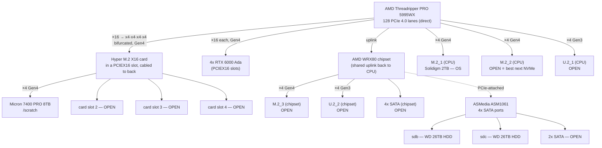

# GilaHyper — Hardware Inventory

Durable reference for the `gilahyper` workstation. Contact/serial/shipping details are intentionally omitted from this committed note.

## System / OS

| Field    | Value                        |
|----------|------------------------------|
| Hostname | gilahyper                    |
| OS       | Rocky Linux 9.5 (Blue Onyx)  |
| Kernel   | 5.14.0-503.35.1.el9_5.x86_64 |
| Arch     | x86_64                       |
| BIOS     | AMI 1602, 2024-09-04         |

## Motherboard

| Field   | Value                          |
|---------|--------------------------------|
| Vendor  | ASUSTeK                        |
| Model   | **Pro WS WRX80E-SAGE SE WIFI** |
| Rev     | 1.xx                           |
| Chipset | AMD WRX80                      |
| Socket  | sWRX8                          |

## CPU

| Field           | Value                                 |
|-----------------|---------------------------------------|
| Model           | AMD **Ryzen Threadripper PRO 5995WX** |
| Cores / Threads | 64 / 128                              |
| Sockets         | 1                                     |
| L3 cache        | 256 MiB                               |

## Memory (installed)

Verified via `sudo dmidecode -t memory` — all 8 channels populated, fully matched kit.

| Field               | Value                                     |
|---------------------|-------------------------------------------|
| Installed           | **8 × 64 GB = 512 GB**                    |
| Slots               | 8 populated / 8 total                     |
| Type                | DDR4 **RDIMM** (Registered/Buffered), ECC |
| Speed (rated / configured) | 3200 MT/s / 3200 MT/s              |
| Rank                | 2R (dual-rank)                            |
| Voltage             | 1.2 V                                     |
| Manufacturer        | Samsung                                   |
| Part Number         | **M393A8G40AB2-CWE** (all 8 identical)    |
| Channels populated  | P0 CHANNEL A – H (all 8)                  |
| ECC                 | Multi-bit ECC (72-bit total / 64-bit data) |

## GPUs

4× NVIDIA **RTX 6000 Ada Generation** (AD102GL, 48 GB each, 192 GB total VRAM). Driver 580.82.07, CUDA 13.0.

| GPU | PCIe Bus ID | VRAM  |
|-----|-------------|-------|
| 0   | 01:00.0     | 48 GB |
| 1   | 2B:00.0     | 48 GB |
| 2   | 41:00.0     | 48 GB |
| 3   | 61:00.0     | 48 GB |

All four are double-slot cards; they occupy four PCIe 4.0 x16 slots and physically block the slots between them. In practice no full-height PCIe slot remains available for add-in cards while the GPUs are installed.

## Storage — NVMe (populated)

| Device    | Model                                            | Size    | PCIe Addr | Mount / LVM                                            |
|-----------|--------------------------------------------------|---------|-----------|--------------------------------------------------------|
| `nvme0n1` | Micron **7400 PRO** (MTFDKCB7T6TDZ)              | 7.68 TB | 23:00.0   | `/scratch` (ext4, single partition)                    |
| `nvme1n1` | Solidigm **P41 Plus** (SSDPFKNU020TZ, DRAM-less) | 2 TB    | 2a:00.0   | `/boot/efi`, `/boot`, LVM VG `rl` → `/`, swap, `/home` |

Both run at full **PCIe 4.0 ×4** (`current_link_speed == max == 16 GT/s ×4`).

**Physical attachment (PCIe topology + ASUS manual §1.2):**

- **Solidigm P41 (OS)** hangs directly off a CPU GPP bridge (`20:01.2 → 2a:00.0`) → onboard **CPU** socket **M.2_1**.
- **Micron 7400 PRO (`/scratch`, the "8 TB")** sits behind the CPU bifurcation switch (`20:01.1 → Matisse Switch Upstream → 4× ×4 GPP bridges, one populated`) → it is on the bundled **ASUS Hyper M.2 X16 Gen 4 card** (x16 slot bifurcated x4x4x4x4), cabled/mounted on the back of the tray (GPUs block the x16 slots). It is **not** in an onboard M.2 socket.

**Board M.2 / U.2 inventory:** 3 onboard M.2 (Key-M, 2242–22110, PCIe 4.0 ×4 + SATA): **M.2_1, M.2_2 from CPU; M.2_3 from chipset**. Plus 2 U.2 connectors (PCIe 3.0 ×4). Sharing: **M.2_2 ↔ U.2_1**, **M.2_3 ↔ U.2_2** (populating the M.2 disables the paired U.2).

**Open NVMe headroom:**

| Where                  | Free positions | Speed         | Notes                                                            |
|------------------------|----------------|---------------|-----------------------------------------------------------------|
| Hyper M.2 X16 card     | **3**          | PCIe 4.0 ×4   | Easiest add; good airflow; slot already bifurcated              |
| Onboard M.2            | **2**          | PCIe 4.0 ×4   | M.2_2 (CPU, best) + M.2_3 (chipset); M.2_3 disables U.2_2       |
| U.2 connectors         | 2              | PCIe 3.0 ×4   | enterprise U.2 drives; share lanes with M.2_2 / M.2_3           |

→ With 3 open ×4 slots on the Hyper card, three 8 TB M.2 = 24 TB scratch — enough to hold the full ~20 TB dataset hot on NVMe.

## Storage topology — CPU vs chipset lanes

**Key idea:** M.2, U.2, and the x16 slot are all just differently-shaped **PCIe** connectors. What differs is (1) lane count, (2) PCIe generation, (3) whether lanes come from the **CPU** (direct, dedicated, low-latency) or the **chipset** (extra lanes that share one uplink to the CPU → contention + a hop of latency). "Soldered to the board" ≠ "on the CPU" — the chipset is on the board too.

### All storage connections & current occupancy

| Connector            | Form factor   | Lanes / Gen     | Source            | ≈ Bandwidth   | Status / occupant                              |
|----------------------|---------------|-----------------|-------------------|---------------|------------------------------------------------|
| PCIEX16_1..7         | x16 slot      | ×16 Gen4        | CPU               | ~32 GB/s      | 4 used by RTX 6000 Ada GPUs; 1 holds Hyper card |
| Hyper card slot 1    | M.2 (on card) | ×4 Gen4         | CPU (bifurcated)  | ~8 GB/s       | **Micron 7400 PRO 8 TB → `/scratch`**          |
| Hyper card slots 2–4 | M.2 (on card) | ×4 Gen4 each    | CPU (bifurcated)  | ~8 GB/s each  | **3× OPEN**                                     |
| M.2_1                | M.2 onboard   | ×4 Gen4         | CPU               | ~8 GB/s       | Solidigm P41 2 TB → OS                          |
| M.2_2                | M.2 onboard   | ×4 Gen4         | CPU               | ~8 GB/s       | **OPEN ⭐ best next NVMe** (disables U.2_1)     |
| M.2_3                | M.2 onboard   | ×4 Gen4         | chipset           | ~8 GB/s*      | **OPEN** (*shares chipset uplink; disables U.2_2) |
| U.2_1                | U.2 (2.5")    | ×4 Gen3         | CPU               | ~3.5 GB/s     | OPEN (shares lanes with M.2_2)                  |
| U.2_2                | U.2 (2.5")    | ×4 Gen3         | chipset           | ~3.5 GB/s     | OPEN (shares lanes with M.2_3)                  |
| SATA ×4 (chipset)    | SATA III      | —               | chipset           | ~0.55 GB/s ea | OPEN (per board spec)                           |
| SATA ×4 (ASMedia)    | SATA III      | —               | ASMedia (PCIe)    | ~0.55 GB/s ea | **2 used: `sdb`/`sdc` WD 26 TB HDD**; 2 OPEN    |

Speeds are interface ceilings (≈ usable, one direction). Note **the Micron 8 TB (Hyper card) and an SSD in M.2_2 are the same speed** — both CPU PCIe 4.0 ×4. U.2 is *slower* than the Micron here (Gen3 ×4), valued for 2.5" enterprise capacity/endurance, not peak bandwidth.

## Storage — SATA

| Controller         | PCIe Addr | Ports | In use |
|--------------------|-----------|-------|--------|
| ASMedia ASM1061/62 | 27:00.0   | 2     | 2      |
| ASMedia ASM1061/62 | 28:00.0   | 2     | 0      |

4 ASMedia SATA ports; **2 populated** (HDDs below). The board also exposes 4 chipset SATA ports (8 total per spec), not currently used.

### SATA HDDs (behind ASMedia)

| Device | Model               | Size  | Type            | Link      | FS / Mount        |
|--------|---------------------|-------|-----------------|-----------|-------------------|
| `sdb`  | WDC **WD261KRYZ**   | 26 TB | CMR HDD (7200)  | 6.0 Gbps  | raw — unformatted |
| `sdc`  | WDC **WD261KRYZ**   | 26 TB | CMR HDD (7200)  | 6.0 Gbps  | raw — unformatted |

> **IO caveat:** these are *mechanical* SATA HDDs (`rotational=1`), not SSDs. ~150–250 random IOPS and multi-ms seek latency — ~3 orders of magnitude slower than the NVMe drives for shuffled DL minibatch reads. **Do not train off them.** Role: bulk cold storage / dataset archives / checkpoints / backups (sequential workloads). Hot training data stays on NVMe; high-IO expansion targets NVMe (Hyper card / M.2_2), not SATA.

(`sda` is a 3.6 TB SanDisk Extreme USB external, not a fixed SATA disk.)

## Filesystems (`df`, as of 2026-06-19)

| Mount       | FS   | Size  | Used  | Use% |
|-------------|------|-------|-------|------|
| `/`         | xfs  | 70 G  | 61 G  | 87%  |
| `/home`     | xfs  | 1.8 T | 544 G | 30%  |
| `/boot`     | xfs  | 960 M | 530 M | 56%  |
| `/boot/efi` | vfat | 599 M | 7 M   | 2%   |
| `/scratch`  | ext4 | 7.0 T | 4.7 T | 69%  |

The 26 TB HDDs (`sdb`/`sdc`) are not yet partitioned or mounted, so they don't appear here.

## Summary of expansion headroom

| Interface           | Free                                                                |
|---------------------|---------------------------------------------------------------------|
| Hyper M.2 X16 card  | **3 ×4 slots** (PCIe 4.0) — easiest NVMe expansion, card already installed & bifurcated |
| Onboard M.2         | **2 slots** (unused CPU socket + M.2_3 chipset), PCIe 4.0 ×4; M.2_3 disables U.2_2 |
| U.2 connectors      | 2 (PCIe 3.0 ×4) — enterprise U.2 drives; share lanes with M.2_2 / M.2_3 |
| SATA                | 2 of 4 ASMedia ports used (2× 26 TB HDD); chipset adds 4 more SATA (8 total per board spec) |
| PCIe x16 (physical) | 0 usable with 4 GPUs installed (Hyper M.2 card cabled out to back)  |

## Open hardware questions

1. **NVMe:** all M.2 sockets and Hyper-card slots accept **2242–22110** (22110 enterprise M.2 is fine). Confirm the back-mounted card is the bundled Hyper M.2 X16 (4 slots + fan) and its x16 slot is set to x4x4x4x4 bifurcation in BIOS.
2. **SATA / HDDs:** confirm chassis 3.5" bays + SATA power leads available (for the 2 installed HDDs and any future additions).
3. **Tiering strategy:** hot-tier plan — (a) fill Hyper card with large M.2 to hold the full ~20 TB dataset hot, vs (b) one more big M.2 + streaming loader (MosaicML Streaming / WebDataset) reading sequentially off the HDDs. HDDs = cold/backup only (mechanical, bad random IOPS).
