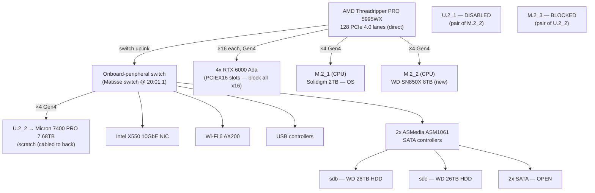

# GilaHyper — Hardware Inventory

Durable reference for the `gilahyper` workstation. Contact/serial/shipping details are intentionally omitted from this committed note.

## System / OS

| Field    | Value                        |
|----------|------------------------------|
| Hostname | gilahyper                    |
| OS       | Rocky Linux 9.5 (Blue Onyx)  |
| Kernel   | 5.14.0-503.35.1.el9_5.x86_64 |
| Arch     | x86_64                       |
| BIOS     | AMI 1602, 2024-09-04         |

## Motherboard

| Field   | Value                          |
|---------|--------------------------------|
| Vendor  | ASUSTeK                        |
| Model   | **Pro WS WRX80E-SAGE SE WIFI** |
| Rev     | 1.xx                           |
| Chipset | AMD WRX80                      |
| Socket  | sWRX8                          |

## CPU

| Field           | Value                                 |
|-----------------|---------------------------------------|
| Model           | AMD **Ryzen Threadripper PRO 5995WX** |
| Cores / Threads | 64 / 128                              |
| Sockets         | 1                                     |
| L3 cache        | 256 MiB                               |

## Memory (installed)

Verified via `sudo dmidecode -t memory` — all 8 channels populated, fully matched kit.

| Field               | Value                                     |
|---------------------|-------------------------------------------|
| Installed           | **8 × 64 GB = 512 GB**                    |
| Slots               | 8 populated / 8 total                     |
| Type                | DDR4 **RDIMM** (Registered/Buffered), ECC |
| Speed (rated / configured) | 3200 MT/s / 3200 MT/s              |
| Rank                | 2R (dual-rank)                            |
| Voltage             | 1.2 V                                     |
| Manufacturer        | Samsung                                   |
| Part Number         | **M393A8G40AB2-CWE** (all 8 identical)    |
| Channels populated  | P0 CHANNEL A – H (all 8)                  |
| ECC                 | Multi-bit ECC (72-bit total / 64-bit data) |

## GPUs

4× NVIDIA **RTX 6000 Ada Generation** (AD102GL, 48 GB each, 192 GB total VRAM). Driver 580.82.07, CUDA 13.0.

| GPU | PCIe Bus ID | VRAM  |
|-----|-------------|-------|
| 0   | 01:00.0     | 48 GB |
| 1   | 2B:00.0     | 48 GB |
| 2   | 41:00.0     | 48 GB |
| 3   | 61:00.0     | 48 GB |

All four are double-slot cards; they occupy four PCIe 4.0 x16 slots and physically block the slots between them. In practice no full-height PCIe slot remains available for add-in cards while the GPUs are installed.

## Storage — NVMe (populated)

| Device    | Model                                            | Size    | PCIe Addr | Connector             | Mount / LVM                                            |
|-----------|--------------------------------------------------|---------|-----------|-----------------------|--------------------------------------------------------|
| `nvme0n1` | Micron **7400 PRO** (MTFDKCB7T6TDZ)              | 7.68 TB | 23:00.0   | **U.2_2** (cabled)    | `/scratch` (ext4, single partition)                    |
| `nvme2n1` | WD_BLACK **SN850X** (8000 GB, consumer)          | 8 TB    | 2b:00.0   | **M.2_2** (CPU)       | raw — unformatted                                      |
| `nvme1n1` | Solidigm **P41 Plus** (SSDPFKNU020TZ, DRAM-less) | 2 TB    | 2a:00.0   | **M.2_1** (CPU)       | `/boot/efi`, `/boot`, LVM VG `rl` → `/`, swap, `/home` |

All three negotiate full **PCIe 4.0 ×4** (16 GT/s ×4) — including the Micron on U.2_2 (the manual's "U.2 = Gen3" is conservative; it runs Gen4 here).

**Physical attachment (verified via full PCIe topology):**

- **Solidigm P41 (OS)** — direct CPU GPP bridge (`20:01.2 → 2a:00.0`) → onboard socket **M.2_1**.
- **WD SN850X (new)** — direct CPU GPP bridge (`20:01.3 → 2b:00.0`) → onboard socket **M.2_2**.
- **Micron 7400 PRO (`/scratch`)** — hangs off the board's **onboard-peripheral switch** (`20:01.1 → Matisse Switch`), the *same* switch that carries the Intel X550 NIC, Wi-Fi AX200, USB, and the ASMedia SATA controllers. It is on a **U.2 connector cabled to the back of the tray** — **NOT a Hyper M.2 card** (there is no Hyper card installed; the 4 GPUs physically block every x16 slot). Since the WD in M.2_2 disables U.2_1, the working Micron must be on **U.2_2**.

**Board NVMe connectors (3 onboard M.2 + 2 U.2) with lane-sharing (ASUS manual §1.2):** **M.2_1, M.2_2, U.2_1 from CPU; M.2_3, U.2_2 from chipset.** Shared pairs (only one of each pair usable): **M.2_2 ↔ U.2_1**, **M.2_3 ↔ U.2_2**.

**NVMe headroom — effectively FULL after the WD install:**

| Connector | State                                                             |
|-----------|-------------------------------------------------------------------|
| M.2_1     | used — Solidigm (OS)                                              |
| M.2_2     | used — WD SN850X → **disables U.2_1**                            |
| U.2_2     | used — Micron `/scratch` → **blocks M.2_3**                      |
| U.2_1     | **disabled** (pair of M.2_2)                                      |
| M.2_3     | **blocked** (pair of U.2_2)                                       |
| x16 slots | physically blocked by 4 GPUs → no Hyper M.2 card possible         |

→ No free NVMe connector remains without removing a drive or freeing an x16 slot. To grow hot capacity: **stream the dataset from the 26 TB HDDs with an NVMe cache**, or **swap the Micron for a larger U.2 drive** (U.2 enterprise NVMe ships in 15–30 TB — a single 30 TB U.2 holds the full ~20 TB with no RAID). Two 8 TB NVMe combined = only ~15.6 TB, still short of 20 TB, and combining couples their failure.

## Storage topology — CPU vs chipset lanes

**Key idea:** M.2, U.2, and the x16 slot are all just differently-shaped **PCIe** connectors. What differs is (1) lane count, (2) PCIe generation, (3) whether lanes come from the **CPU** (direct, dedicated, low-latency) or the **chipset** (extra lanes that share one uplink to the CPU → contention + a hop of latency). "Soldered to the board" ≠ "on the CPU" — the chipset is on the board too.

### All storage connections & current occupancy

| Connector            | Form factor   | Lanes / Gen  | Source            | ≈ Bandwidth   | Status / occupant                               |
|----------------------|---------------|--------------|-------------------|---------------|-------------------------------------------------|
| PCIEX16_1..7         | x16 slot      | ×16 Gen4     | CPU               | ~32 GB/s      | 4 used by RTX 6000 Ada GPUs; rest blocked by GPU coolers |
| M.2_1                | M.2 onboard   | ×4 Gen4      | CPU               | ~8 GB/s       | Solidigm P41 2 TB → OS                           |
| M.2_2                | M.2 onboard   | ×4 Gen4      | CPU               | ~8 GB/s       | **WD SN850X 8 TB (new, raw)** → disables U.2_1   |
| U.2_2                | U.2 (2.5")    | ×4 Gen4      | chipset/switch    | ~8 GB/s       | **Micron 7400 PRO 7.68 TB → `/scratch`** → blocks M.2_3 |
| U.2_1                | U.2 (2.5")    | ×4           | CPU               | —             | **DISABLED** (pair of M.2_2)                     |
| M.2_3                | M.2 onboard   | ×4 Gen4      | chipset           | —             | **BLOCKED** (pair of U.2_2)                      |
| SATA ×4 (chipset)    | SATA III      | —            | chipset           | ~0.55 GB/s ea | OPEN (per board spec)                            |
| SATA ×4 (ASMedia)    | SATA III      | —            | ASMedia (PCIe)    | ~0.55 GB/s ea | **2 used: `sdb`/`sdc` WD 26 TB HDD**; 2 OPEN     |

Speeds are interface ceilings (≈ usable, one direction). All three NVMe (Micron on U.2_2, WD on M.2_2, Solidigm on M.2_1) run **PCIe 4.0 ×4** — same speed tier. There is **no Hyper M.2 card**; the Micron shares the onboard-peripheral switch with the NIC/Wi-Fi/USB/SATA. Every NVMe connector is now used or disabled by a shared-lane sibling.

## Storage — SATA

| Controller         | PCIe Addr | Ports | In use |
|--------------------|-----------|-------|--------|
| ASMedia ASM1061/62 | 27:00.0   | 2     | 2      |
| ASMedia ASM1061/62 | 28:00.0   | 2     | 0      |

4 ASMedia SATA ports; **2 populated** (HDDs below). The board also exposes 4 chipset SATA ports (8 total per spec), not currently used.

### SATA HDDs (behind ASMedia)

| Device | Model               | Size  | Type            | Link      | FS / Mount        |
|--------|---------------------|-------|-----------------|-----------|-------------------|
| `sdb`  | WDC **WD261KRYZ**   | 26 TB | CMR HDD (7200)  | 6.0 Gbps  | raw — unformatted |
| `sdc`  | WDC **WD261KRYZ**   | 26 TB | CMR HDD (7200)  | 6.0 Gbps  | raw — unformatted |

> **IO caveat:** these are *mechanical* SATA HDDs (`rotational=1`), not SSDs. ~150–250 random IOPS and multi-ms seek latency — ~3 orders of magnitude slower than the NVMe drives for shuffled DL minibatch reads. **Do not train off them.** Role: bulk cold storage / dataset archives / checkpoints / backups (sequential workloads). Hot training data stays on NVMe; high-IO expansion targets NVMe (Hyper card / M.2_2), not SATA.

(`sda` is a 3.6 TB SanDisk Extreme USB external, not a fixed SATA disk.)

## Filesystems (`df`, as of 2026-06-19)

| Mount       | FS   | Size  | Used  | Use% |
|-------------|------|-------|-------|------|
| `/`         | xfs  | 70 G  | 61 G  | 87%  |
| `/home`     | xfs  | 1.8 T | 544 G | 30%  |
| `/boot`     | xfs  | 960 M | 530 M | 56%  |
| `/boot/efi` | vfat | 599 M | 7 M   | 2%   |
| `/scratch`  | ext4 | 7.0 T | 4.7 T | 69%  |

The 26 TB HDDs (`sdb`/`sdc`) are not yet partitioned or mounted, so they don't appear here.

## Summary of expansion headroom

| Interface           | Free                                                                |
|---------------------|---------------------------------------------------------------------|
| NVMe connectors     | **0** — M.2_1, M.2_2, U.2_2 used; U.2_1 + M.2_3 disabled by shared-lane siblings |
| PCIe x16 (physical) | 0 usable — 4 GPU coolers block every x16 slot (no room for a Hyper M.2 card) |
| SATA                | 2 of 4 ASMedia ports used (2× 26 TB HDD); chipset adds 4 more SATA (8 total per board spec) |

To grow **NVMe** capacity you must free something: swap the Micron (U.2_2) for a larger U.2 drive (15–30 TB enterprise U.2 exists), or remove a GPU to open an x16 slot for a multi-M.2 card. Otherwise scale on **SATA** (cold) + streaming.

## Open hardware questions

1. **Hot-tier capacity vs the ~20 TB dataset:** two 8 TB NVMe = only ~15.6 TB combined (and combining couples failure). Options: (a) **stream** the dataset off the 26 TB HDDs with an NVMe shard-cache (MosaicML Streaming / WebDataset); (b) **swap the Micron for a single large U.2** (30 TB U.2 holds the whole set, no RAID); (c) keep the 2 NVMe as separate volumes and accept a subset is hot.
2. **New WD SN850X (M.2_2):** still raw — decide filesystem + mount (`/scratch2`?) and whether to combine with the Micron (not recommended: couples failure, still < 20 TB).
3. **SATA / HDDs:** confirm chassis 3.5" bays + SATA power leads available; the 2× 26 TB HDDs are the cold/backup + streaming-source tier (mechanical, bad random IOPS — never train off them directly).
