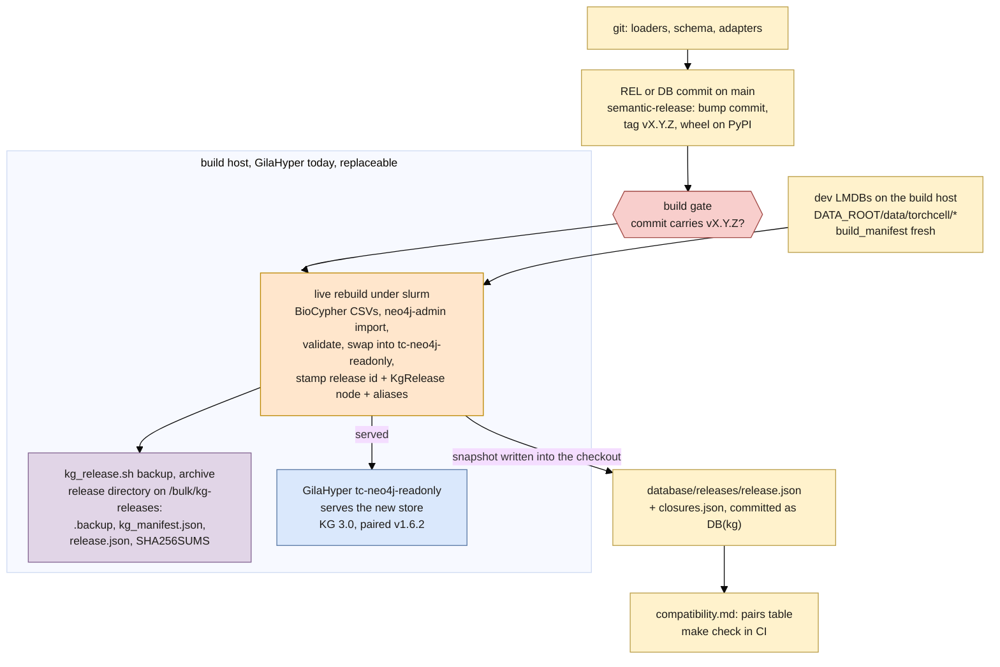

## 2026.10.06 - The build, release and serving system

Rendered by `bash notes/assets/publish/scripts/mermaid_pdf.sh notes/kg-build-system.mermaid.build-flow.md` into `notes/assets/pdf-output/kg-build-system.mermaid.build-flow.pdf`, then placed by `make diagrams` in `notes-tex/kg-build-system/figures/`. Colors follow the draw.io palette: yellow = a file in git, orange = a step on the build host, purple = the release artifact and its copies, blue = a serving host or the client, red = a gate that refuses a mismatched pair.

