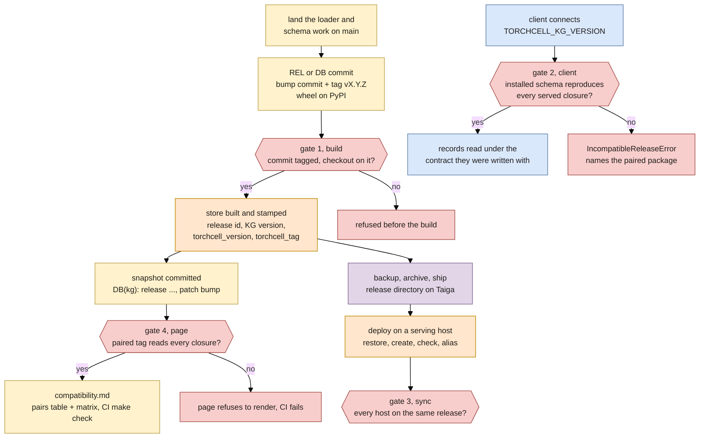

## 2026.10.06 - The life of one release

Rendered by `bash notes/assets/publish/scripts/mermaid_pdf.sh notes/kg-build-system.mermaid.release-lifecycle.md` into `notes/assets/pdf-output/kg-build-system.mermaid.release-lifecycle.pdf`, then placed by `make diagrams` in `notes-tex/kg-build-system/figures/`. Same palette as the build-flow diagram; the red diamonds are the four gates of [[versioning]] (2026.10.06 section).

