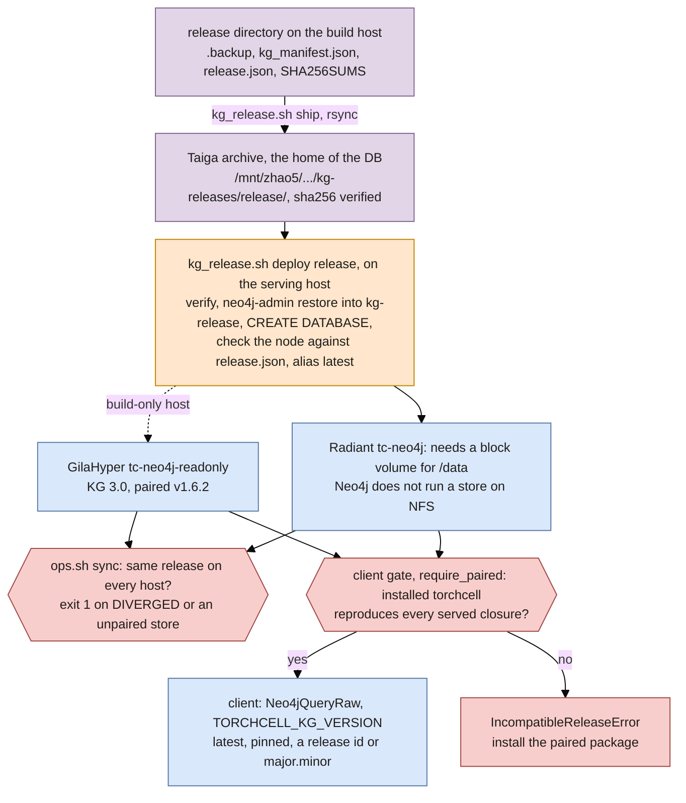

## 2026.10.06 - From release artifact to a client

Rendered by `bash notes/assets/publish/scripts/mermaid_pdf.sh notes/kg-build-system.mermaid.serve-flow.md` into `notes/assets/pdf-output/kg-build-system.mermaid.serve-flow.pdf`, then placed by `make diagrams` in `notes-tex/kg-build-system/figures/`. Same palette as [[kg-build-system.mermaid.build-flow]]: purple = the artifact and its copies, orange = a step, blue = a serving host or the client, red = a gate.

