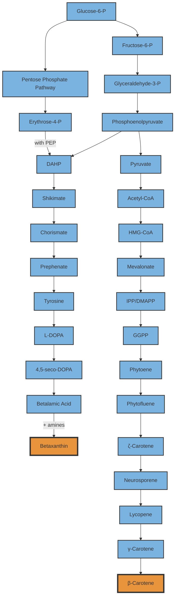

```mermaid
graph TD
  %% Central carbon metabolism
  G6P[Glucose-6-P] --> F6P[Fructose-6-P]
  G6P --> PPP[Pentose Phosphate Pathway]
  F6P --> G3P[Glyceraldehyde-3-P]
  G3P --> PEP[Phosphoenolpyruvate]
  PEP --> PYR[Pyruvate]

  %% PPP branch
  PPP --> E4P[Erythrose-4-P]

  %% Shikimate Pathway → Betaxanthin
  E4P -- with PEP --> DAHP[DAHP]
  PEP --> DAHP
  DAHP --> Shikimate --> Chorismate
  Chorismate --> Prephenate --> Tyrosine
  Tyrosine --> LDOPA[L-DOPA]
  LDOPA --> SecoDOPA[4,5-seco-DOPA]
  SecoDOPA --> BetalamicAcid[Betalamic Acid]
  BetalamicAcid -- + amines --> Betaxanthin:::highlight

  %% Mevalonate pathway (yeast)
  PYR --> AcCoA[Acetyl-CoA]
  AcCoA --> HMGCoA[HMG-CoA] --> Mevalonate
  Mevalonate --> IPP[IPP/DMAPP]
  IPP --> GGPP[GGPP]

  %% Carotenoid biosynthesis
  GGPP --> Phytoene --> Phytofluene
  Phytofluene --> ZetaCarotene[ζ-Carotene]
  ZetaCarotene --> Neurosporene --> Lycopene
  Lycopene --> GammaCarotene[γ-Carotene]
  GammaCarotene --> BetaCarotene[β-Carotene]:::highlight

  classDef default fill:#7BB3E0,stroke:#333,stroke-width:2px;
  classDef highlight fill:#E8943D,stroke:#333,stroke-width:4px;
```
