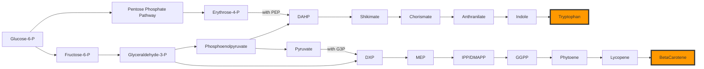

```mermaid
graph LR
  %% Central carbon metabolism
  G6P[Glucose-6-P] --> F6P[Fructose-6-P]
  G6P --> PPP[Pentose Phosphate Pathway]
  F6P --> G3P[Glyceraldehyde-3-P]
  G3P --> PEP[Phosphoenolpyruvate]
  PEP --> PYR[Pyruvate]
  
  %% PPP branch
  PPP --> E4P[Erythrose-4-P]
  
  %% Shikimate Pathway
  E4P -- with PEP --> DAHP[DAHP]
  PEP --> DAHP
  DAHP --> Shikimate --> Chorismate
  Chorismate --> Anthranilate --> Indole
  Indole --> Tryptophan:::highlight
  
  %% Terpenoid pathway
  PYR -- with G3P --> DXP[DXP]
  G3P --> DXP
  DXP --> MEP[MEP] --> IPP[IPP/DMAPP]
  IPP --> GGPP[GGPP]
  GGPP --> Phytoene --> Lycopene
  Lycopene --> BetaCarotene:::highlight
  
  classDef highlight fill:#FF9900,stroke:#333,stroke-width:4px;
```