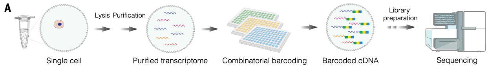
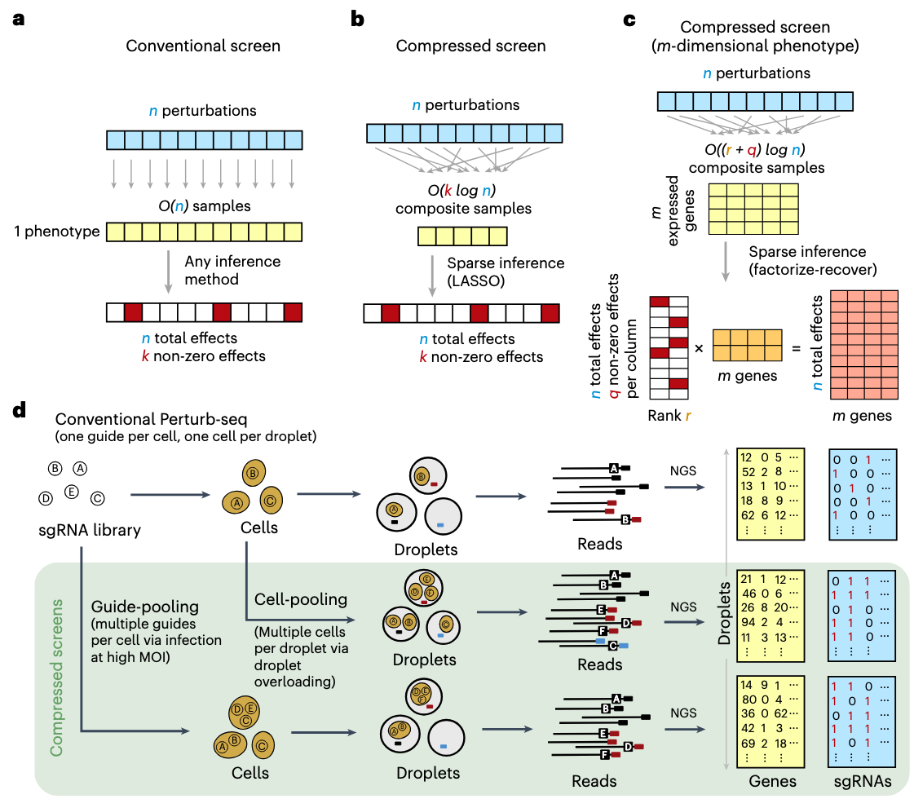
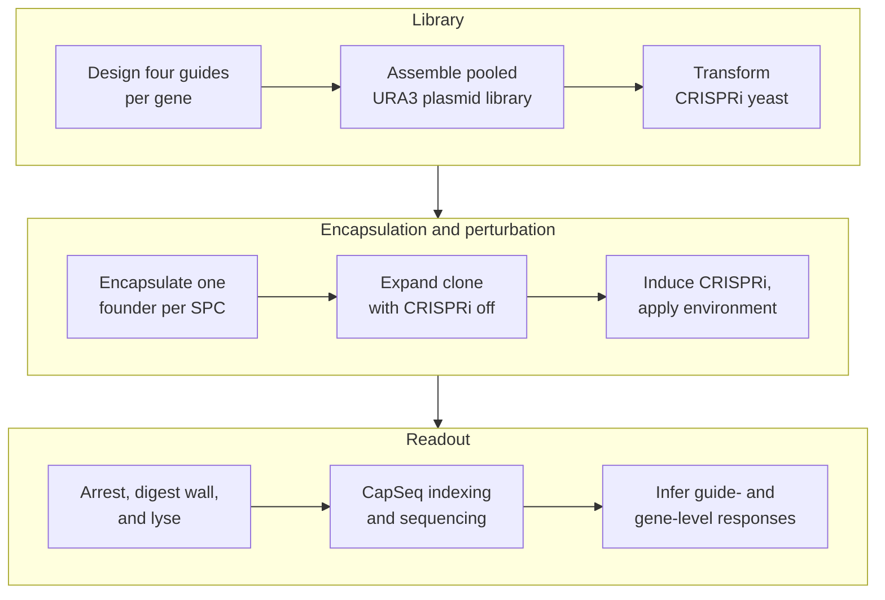

## 2026.08.14 - Precursor to the method review

**This is the precursor note to
[[microbe-perturb-seq.method-review-and-costing]]**, the typeset document at
`notes-tex/microbe-perturb-seq/main.pdf`. It was written first, as a design
sketch for reading a pooled CRISPRi screen out of semipermeable capsules
(Atrandi SPC + CapSeq) with clonal in-capsule expansion.

What carried forward into the review, and what did not, is worth stating because
the two documents reach different conclusions. The review costs the two chemistries
that have actually been run in a microbe -- split-pool and droplet -- and treats
SPC as a forward-looking option, because a capsule cannot be aliquoted and small
molecules leak through a 30 nm pore, which rules out the paired transcriptome plus
metabolome readout this sketch was reaching for. The framing that did carry
forward is the one this note opens with: the estimand is a perturbation-by-gene
matrix rather than a hit list, and the design question is how many cells share a
perturbation rather than how deeply any one is read.

Kept as written, timestamps and all, because it records what was believed before
the costing was done.

## Reference Figures

CapSeq combinatorial barcoding -- <https://doi.org/10.1126/science.ady7227>



Scalable screening by Perturb-seq -- <https://doi.org/10.1038/s41587-023-01964-9>



## Objective

Build a pooled CRISPRi platform for **industrial microbes** in which one library
cell is isolated per semipermeable capsule (SPC), expanded into a small clonal
population, perturbed, and analyzed by capsule-resolved RNA sequencing. Clonal
expansion supplies more RNA than a single microbial cell, while combinatorial
CapSeq barcoding preserves the connection between a perturbation and its
transcriptome.

The two primary hosts are *Saccharomyces cerevisiae* and *Pichia kudriavzevii*.
*S. cerevisiae* is the chemistry-development chassis because its CRISPRi
architecture, guide libraries, and reference transcriptome are already
established; *P. kudriavzevii* is the industrial target of interest, valued for
its acid, thermal, and osmotic tolerance and its use as an organic-acid and
biofuel production host. The platform is designed so that the capsule workflow
is shared and only the genetic parts differ between them. Other non-conventional
yeasts and, with a changed capture chemistry, bacteria follow the same pattern.
See [Host Scope](#host-scope).

Each observation is

$$
(b_c,\; g_c,\; e_c,\; \mathbf{y}_c),
$$

where $b_c$ is the capsule barcode, $g_c$ is the CRISPRi guide, $e_c$ is the
environment (medium, drug, time point), and $\mathbf{y}_c$ is the
clonal-population transcriptome. The environment index $e_c$ is what turns a
single screen into the experiment classes of
[Experiment Classes](#experiment-classes); the formal structure of the
$\mathbf{y}_c$ is given in [Data Model](#data-model-the-matrix-that-comes-out).

```{=latex}
\setkeys{Gin}{width=0.62\linewidth}
```



```{=latex}
\setkeys{Gin}{width=\linewidth}
```

## SPC Platform Capabilities

Every number below is from Baronas et al. 2026 (*Science* 391:1138,
[10.1126/science.ady7227](https://doi.org/10.1126/science.ady7227)) unless
marked otherwise. These are the measured properties the design must respect.

| Property | Measured value | Design consequence |
| --- | --- | --- |
| Capsule size | 35--260 $\mu$m achievable; 70 $\pm$ 3.0 $\mu$m typical | Room for a microcolony; size is a tunable, not a fixed format |
| Shell thickness | 2.0 $\mu$m (GelMA, photo-cross-linked) | Tunable via GelMA concentration |
| Nucleic acid retention | Complete for fragments $>300$ bp | Sets the minimum length of any RNA used as an identifier |
| Permeability | Enzymes and proteins up to $\approx160$ kDa enter; 500-kDa dextran does not | RT (71 kDa), Taq (97 kDa), and wall enzymes can be delivered |
| Pore size | $<30$ nm | Basis of the size cutoff |
| Mechanical resilience | Survives pipetting, centrifugation, freeze--thaw, thermocycling, solvents | Standard bench handling; no microfluidics after generation |
| Swelling | Up to $10\times$ in volume without bursting as cells proliferate | Clonal expansion is accommodated by design |
| Microbial expansion | Bacteria and yeast expand into isogenic microcolonies | **Direct validation of the clonal-expansion premise for our hosts** |
| Cryopreservation | Capsules freeze and recover with minimal viability loss | A perturbed library can be banked mid-experiment |
| Cell release | Brief protease/collagenase treatment dissolves the shell, releasing viable cells | Hits can be recovered as live strains |
| FACS compatibility | Capsules sort on conventional instruments | Enables phenotype-first enrichment before sequencing |
| CapSeq depth | 20,000 reads/cell $\rightarrow$ $>10{,}000$ UMIs, $>3{,}000$ genes (K562); 88.85\% mapping | Sets the read budget used throughout this note |
| Barcode space | $>10^7$ combinations; $>100{,}000$ cells per run at $\approx 1\%$ multiplet rate | Baseline; see [4-round extension](#capseq-barcode-logic) |

Two capabilities deserve emphasis because they change what experiments are
possible, not merely how well they run.

**Yeast and bacteria already expand into isogenic microcolonies inside SPCs.**
This is the single assumption our design most depends on, and it is reported
rather than hypothesized. What remains unvalidated for us is not *whether*
microcolonies form but whether the transcriptome survives wall digestion intact.

**Capsules are sortable and cells are recoverable.** Baronas et al. sorted
capsules on an RNA marker by amplifying a target inside the capsule with
fluorescent primers, then sequenced the enriched fraction. Combined with
protease release of live cells, this closes a loop that a plate-based screen
cannot: measure a transcriptome, select on it, and recover the strain that
produced it.

## Host Scope

The capsule workflow -- generation, expansion, barcoding, sequencing -- is
host-independent. What changes between hosts is the genetic parts, the lysis
chemistry, and whether oligo(dT) capture works at all.

| Host | Class | Industrial interest | What changes |
| --- | --- | --- | --- |
| *S. cerevisiae* | Yeast | Reference chassis; ethanol, heterologous protein | Baseline: established dCas9-Mxi1 CRISPRi, genome-scale guide library, CEN/ARS + URA3 |
| *P. kudriavzevii* | Non-conventional yeast | Organic acids, biofuels; acid, thermal, osmotic tolerance | Host-active promoters and markers; episomal replication is less reliable, so a broad-host ARS or genomic integration is needed; thicker/different wall may need a modified digestion |
| *Y. lipolytica*, *K. phaffii* | Non-conventional yeast | Lipids, secreted protein | Same class of substitutions as *P. kudriavzevii* |
| *E. coli*, *B. subtilis* | Bacteria | Chemicals, enzymes | **Capture chemistry changes fundamentally** -- see below |

**The bacterial case is not a parts swap.** Bacterial mRNA is not
polyadenylated, so the oligo(dT) priming that CapSeq is built on captures
nothing. A bacterial version requires either in-capsule polyadenylation before
RT, random-primed capture with rRNA depletion, or a targeted probe panel.
Two further differences compound this: rRNA is roughly 95\% of bacterial total
RNA, so undepleted libraries waste most of their depth; and bacterial mRNA
half-lives are on the order of minutes, so the arrest step that is merely
important in yeast becomes the dominant source of artifact. Bacteria should be
treated as a separate development track, not a later milestone of the yeast one.

For the two primary yeasts, the *S. cerevisiae* arm develops and validates the
chemistry, and the *P. kudriavzevii* arm inherits it. Running both through the
same capsule workflow also gives a free and unusually clean control, described
under [Development Plan](#pilot-establish-chemistry).

## System Design

### CRISPRi Host

Use a $ura3^{-}$ strain carrying genomically integrated *dCas9*-Mxi1 and TetR.
The library plasmid supplies the guide and URA3 selection. This follows the
established yeast CRISPRi architecture of an integrated effector and episomal,
tet-inducible guides.

Induction is retained as experimental control, not as a requirement. The
preferred workflow is to expand each founder for approximately five to seven
doublings with CRISPRi off, then induce inside the SPC. This preserves guides
against essential genes and prevents perturbation-dependent growth from
eliminating the low-RNA advantage before measurement. A second arm can induce
from the founder stage to measure chronic, growth-coupled responses.

### Guide Library

Use four independent plasmids, each carrying one guide, per target gene. Select
guides preferentially in the approximately 200-bp region immediately upstream of
the transcription start site, with high chromatin accessibility, low nucleosome
occupancy, and minimal predicted off-target activity.

The published genome-scale yeast CRISPRi library contains about ten guides for
most genes. Its empirical rankings can be used to select four guides per gene
rather than redesigning the entire library.

### Plasmid Architecture

Use a CEN/ARS low-copy plasmid, not a $2\mu$ vector:

$$
\boxed{\ \text{CEN/ARS} + \text{URA3} + \text{inducible sgRNA} + \text{poly(A) perturbation-ID reporter}\ }
$$

$2\mu$ vectors are high-copy and heterogeneous, commonly reaching tens of copies
per cell. That variability would affect guide dosage, reporter counts, URA3
expression, cellular burden, and the measured transcriptome. CEN/ARS is the
appropriate low-copy class, although it should not be assumed to be exactly one
physical molecule per cell. The requirement is one plasmid genotype per founder;
multiple identical copies are acceptable.

### Perturbation Identification

The native sgRNA is only about 100 nt, well below the $>300$ bp at which SPCs
retain nucleic acids completely. It should not be the primary perturbation
identifier. (The published retention curve is measured on DNA fragments, so the
threshold for a structured single-stranded RNA should be confirmed empirically
rather than assumed equal; the sgRNA is short enough that it fails either way.)

Instead, each plasmid should express a moderately abundant, polyadenylated
reporter RNA approximately 700 to 1000 nt long. Place the guide's 20-nt target
sequence, or a sequence-verified linked barcode, near the reporter's 3' end:

$$
\text{moderate Pol II promoter}
-\text{neutral RNA body}
-\text{guide ID}
-\text{poly(A) signal}.
$$

The CapSeq oligo(dT) primer then captures both endogenous yeast mRNA and the
perturbation-ID reporter. After capsule barcoding, the cDNA can be divided into a
whole-transcriptome library and a small targeted perturbation-ID library.
Capsules with two strong guide IDs are classified as multiplets.

Targeted amplification of retained plasmid DNA can be evaluated as an orthogonal
backup, but it requires additional custom indexing chemistry.

## Experiment Classes

The perturbation axis $\mathcal{L}$ and the environment axis $\mathcal{E}$ are
independent, so the platform is not one screen but a family of them. A study is
a choice of subset $\mathcal{L}' \times \mathcal{E}'$, and its capsule demand is
$N = r\,|\mathcal{L}'|\,|\mathcal{E}'|$ for target replication $r$. Environments
multiply capsule demand linearly, which is the main thing to budget for.

### Media and Growth Conditions

The capsule shell is permeable to small molecules, so the medium can be changed
after encapsulation without losing capsule identity. Capsules can also be split
into aliquots after expansion and given different treatments, so one
encapsulation supports several environments.

Conditions worth building the first panel from: carbon source (glucose,
glycerol, ethanol, xylose, and for *K. phaffii* methanol); nitrogen limitation;
low pH and organic-acid stress, which is the condition that makes
*P. kudriavzevii* industrially interesting in the first place; elevated
temperature; osmotic and ethanol stress. The readout is not growth but the
transcriptome, so a knockdown that is neutral for fitness but shifts the stress
program is still visible -- which is precisely the class of gene that
growth-based pooled screens miss.

### Antifungal and Chemogenomic Targets

Dose a sub-inhibitory concentration of an antifungal (azoles, echinocandins,
polyenes, or a candidate compound) as one of the environments. Each capsule then
reports a transcriptome under a defined knockdown and a defined drug exposure,
and the quantity of interest is the difference of differences

$$
\varepsilon_{\ell j} \;=\; \theta^{\text{drug}}_{\ell j} - \theta^{\text{ctrl}}_{\ell j},
$$

where $\theta_{\ell j}$ is the log fold change of gene $j$ under element $\ell$.
A nonzero $\varepsilon$ means the knockdown changes how the cell responds to the
drug: chemogenomic interaction, in exactly the epistasis form this project
already uses for genetic interactions. Sensitizers (targets whose knockdown
potentiates the drug) and resistance determinants fall out of the same tensor.

Two readouts come free alongside the transcriptome. Capsule depth $n_c$ is a
biomass proxy, so a growth-based chemogenomic profile is recoverable from the
same data (with the caveat that $n_c$ also absorbs capture efficiency and needs
a spike-in or a matched control to be trusted). And because capsules are
FACS-sortable, a strong sensitizer can be enriched before sequencing rather than
found afterward.

### Fluorescent and Transcriptional Reporters

A GFP or other reporter cassette serves three distinct roles here, and it is
worth keeping them separate.

1. **As a sequenced feature.** The reporter mRNA is polyadenylated, so CapSeq
   counts it like any other gene: it is simply an extra column of the matrix.
   Because it is read as sequence rather than light, reporters do **not**
   compete for spectral bandwidth -- dozens of pathway reporters can be
   multiplexed in one strain, which no FACS-based design can do.
2. **As a sortable phenotype.** Fluorescent protein still enables capsule
   sorting and ONYX imaging, so a reporter can define a selected subpopulation
   for enrichment before the sequencing spend.
3. **As a calibration standard.** A constitutive reporter at known copy number
   gives a per-capsule internal control for capture efficiency, which is what
   makes the $n_c$ biomass proxy above interpretable.

Reporters worth installing early: an unfolded-protein-response reporter (a
*KAR2* or *HAC1* promoter fusion) for secretion-burden work, an oxidative-stress
reporter, and a pathway-flux or titer proxy for whichever product the host is
being engineered toward.

### Selection and Strain Recovery

Because the shell dissolves under brief protease treatment and releases viable
cells, a capsule identified as interesting can be reopened and its clone
recovered. The screen therefore terminates in strains, not only in a data
matrix. This is the step that turns a descriptive screen into a strain-design
loop, and it is worth validating early even though it is not needed for the
first production run.

## Experimental Workflow

1. **Library construction.** Assemble pooled guide plasmids from an oligo pool,
   maintaining the guide and reporter ID in the same construct.
2. **Library validation.** Sequence after bacterial assembly and after yeast
   transformation to measure guide representation, dropout, abundance skew, and
   guide-ID linkage.
3. **Yeast transformation.** Transform the integrated CRISPRi host under
   noninducing conditions. Maintain at least 50- to 100-fold yeast transformant
   coverage per library element.
4. **Single-founder encapsulation.** Load the pooled library at low occupancy and
   use ONYX imaging to optimize singlet recovery. Multi-guide capsules are removed
   computationally.
5. **Clonal expansion.** Grow in selective SC-Ura medium for approximately five to
   seven doublings, producing roughly 32 to 128 cells per capsule.
6. **CRISPRi induction.** Add anhydrotetracycline through the SPC shell. Initial
   time points should distinguish a proximal response (approximately 3 h) from a
   more developed response (approximately 6 to 8 h).
7. **Transcriptome arrest and wall digestion.** Rapidly arrest the culture, add
   osmotic support, digest the cell wall with zymolyase or lyticase, lyse the
   resulting spheroplasts, and wash inhibitors through the capsule shell.
8. **CapSeq.** Add BC1 and a UMI during reverse transcription, followed by two
   split-pool ligation barcodes and a final sublibrary PCR index.
9. **Sequencing and analysis.** Assign reads to capsules, assign each capsule to a
   guide, reject multiplets, and estimate guide- and gene-level effects.

The wall-digestion interval is the largest biological risk because the cells may
continue changing their transcriptome during spheroplasting. Matched conventional
rapid-extraction controls are required to quantify this bias.

## CapSeq Barcode Logic

A capsule receives a barcode trajectory

$$
b_c = \mathrm{BC1}_i \Vert \mathrm{BC2}_j
\Vert \mathrm{BC3}_k \Vert \mathrm{BC4}_l.
$$

Published CapSeq uses three barcoding rounds -- BC1 during reverse
transcription, then BC2 and BC3 by split-pool ligation -- followed by BC4 as a
sublibrary index added during PCR. For $R$ rounds of 96-well barcoding and $S$
sublibrary indexes the barcode space is $B = 96^R \times S$, and for $n$
capsules the approximate per-capsule collision probability is

$$
P_{\mathrm{collision}}
\;\approx\; 1-\exp\left(-\frac{n-1}{B}\right).
$$

Evaluated at $n=100{,}000$ capsules:

| Design | Barcode space $B$ | $P_{\mathrm{collision}}$ |
| --- | --- | --- |
| $96^3$, no sublibrary index | 884,736 | 10.7\% |
| $96^3 \times 12$ (published CapSeq) | 10,616,832 | 0.94\% |
| $96^4$, no sublibrary index | 84,934,656 | 0.12\% |
| $96^4 \times 12$ | 1,019,215,872 | 0.01\% |

The published three-round design is right at the edge: it is what makes 100,000
capsules a natural run size, and it is why pushing past that number requires
more barcode space rather than merely more reagent. **A fourth 96-well round
lifts the ceiling by roughly two orders of magnitude.** At $96^4 \times 12$, one
million capsules still collide at only

$$
1-\exp\left(-\frac{10^6-1}{1.019\times10^9}\right) \approx 0.1\%,
$$

so barcode space stops being the binding constraint on run size entirely. This
has a direct consequence for the genome-scale design, taken up under
[Scale](#scale).

The fourth round is not free. Each split-pool ligation loses material, so a
fourth round trades barcode space against molecular recovery, and the loss
should be measured in the pilot before it is committed to. It also adds a full
96-well plate cycle of handling per run.

**Two different failure modes are both near 1\%, and they should not be
conflated.** A *multiplet* is two founders physically sharing one capsule; it is
set by the Poisson loading rate $\lambda$ and is fixed by loading more dilutely.
A *barcode collision* is two distinct capsules receiving the same barcode
trajectory; it is set by $B$ relative to $n$ and is fixed by adding rounds. They
are independent, and a design can be limited by either.

The capsule barcode identifies the physical clonal population; the reporter RNA
identifies its perturbation. These are separate identifiers.

## Data Model: The Matrix That Comes Out

### Index Sets

$$
\begin{aligned}
c &\in \mathcal{C}=\{1,\dots,N\} &&\text{capsules (clonal populations) passing QC}\\
\ell &\in \mathcal{L}=\{1,\dots,L\} &&\text{library elements (guides and controls)}\\
e &\in \mathcal{E}=\{1,\dots,E\} &&\text{environments (medium, drug, time point)}\\
j &\in \mathcal{J}=\{1,\dots,G\} &&\text{measured features}
\end{aligned}
$$

The feature axis is the host transcriptome plus what we engineer into it:

$$
G \;=\; \underbrace{G_{\text{endo}}}_{\text{host genes}}
\;+\; \underbrace{G_{\text{rep}}}_{\text{reporters}}
\;+\; \underbrace{1}_{\text{perturbation ID}} .
$$

For *S. cerevisiae* $G_{\text{endo}} \approx 6{,}000$; *P. kudriavzevii* is
similar at roughly 5,000 to 5,500; *E. coli* roughly 4,400. **This is the
dimension of a single observation**: one capsule is a point in $G$-dimensional
count space, so the transcriptome vector has about six thousand coordinates, not
six thousand cells' worth of anything.

### The Primary Observable and Its Domain

$$
\mathbf{Y} = [y_{cj}] \in \mathbb{Z}_{\ge 0}^{\,N \times G}.
$$

$y_{cj}$ is the number of distinct mRNA molecules of gene $j$ recovered from
capsule $c$, after UMI deduplication. Three properties matter and are easy to
get wrong:

- **The entries are non-negative integers, not positive reals.** They are
  molecule counts, so $\mathbb{Z}_{\ge0}$ is the correct domain. Modeling them
  requires a count distribution -- negative binomial, or Poisson with a
  gene-level overdispersion term -- not a Gaussian.
- **Zero is common and ambiguous.** A zero is either structural (the gene is
  off) or sampling (the gene is on but was not captured at this depth). These
  are different events and no transformation distinguishes them.
- **The row sum is a nuisance parameter.** $n_c = \sum_j y_{cj}$ is the capsule
  depth, and it varies with clone size and capture efficiency, so raw rows are
  not comparable across capsules without normalization.

Only after processing do the values become real-valued, and the domain changes
at each step:

$$
\underbrace{\mathbf{Y} \in \mathbb{Z}_{\ge0}^{N\times G}}_{\text{UMI counts}}
\;\xrightarrow{\;\times\,10^4/n_c\;}\;
\underbrace{\mathbb{R}_{\ge0}^{N\times G}}_{\text{depth-normalized}}
\;\xrightarrow{\;\log(1+\cdot)\;}\;
\underbrace{\mathbb{R}_{\ge0}^{N\times G}}_{\text{log scale}}
\;\xrightarrow{\;\text{center}\;}\;
\underbrace{\mathbb{R}^{N\times G}}_{\text{signed}}
$$

So the answer to "are they positive reals" is: the measurement is a non-negative
integer; the normalized expression value is a non-negative real; and only the
effect size is a signed real. Effect sizes are the end product,

$$
\boldsymbol{\Theta} = [\theta_{\ell j}] \in \mathbb{R}^{\,L \times G},
\qquad
\theta_{\ell j} = \log_2\frac{\mu_{\ell j}}{\mu_{\text{ctrl},\,j}},
$$

the log fold change of gene $j$ under element $\ell$ against the non-targeting
controls. These are genuinely all of $\mathbb{R}$: sign carries the direction of
regulation.

### Perturbation Assignment and Perturbations per Capsule

Assignment is a binary matrix $\mathbf{Z} \in \{0,1\}^{N\times L}$, where
$z_{c\ell}=1$ if capsule $c$ carries element $\ell$. In the intended design each
capsule is clonal, so $\|\mathbf{z}_c\|_1 = 1$ exactly: **one perturbation per
capsule, by construction.** Multi-guide capsules are a defect, not a feature.

The realized average follows from Poisson loading. If founders are loaded at
mean occupancy $\lambda$, a capsule receives $k \sim \text{Poisson}(\lambda)$
founders, and the mean number of perturbations among *occupied* capsules is

$$
\mathbb{E}[k \mid k \ge 1] \;=\; \frac{\lambda}{1-e^{-\lambda}}
\;\approx\; 1 + \frac{\lambda}{2}.
$$

| $\lambda$ | Perturbations per occupied capsule | Singlet fraction | Capsules generated per usable singlet |
| --- | --- | --- | --- |
| 0.05 | 1.025 | 97.5\% | 21.0 |
| 0.10 | 1.051 | 95.1\% | 11.1 |
| 0.20 | 1.103 | 90.3\% | 6.1 |

So the honest answer to "how many perturbations per capsule" is **just above
one** -- about 1.05 at a 10\% loading rate -- and the entire cost of keeping it
there is generating roughly eleven capsules for every one you use. Since capsule
generation is fast and cheap relative to sequencing, this is the right trade.

Replication is the complementary quantity:

$$
r \;=\; \frac{N}{L\,E},
$$

the mean number of capsules per (element, environment) cell of the design.

### Size of the Final Matrices

Take the first production screen: $N=100{,}000$ capsules, $L=4{,}200$ elements,
$G=6{,}000$ features, one environment, at 20,000 reads per capsule (which
Baronas et al. report yields $>10{,}000$ UMIs and $>3{,}000$ genes per cell).

| Object | Shape | Entries | Domain | Size |
| --- | --- | --- | --- | --- |
| Capsule $\times$ gene counts $\mathbf{Y}$ | $100{,}000 \times 6{,}000$ | $6.0\times10^8$ | $\mathbb{Z}_{\ge0}$ | 1.2 GB as `uint16` |
| Element pseudobulk $\mathbf{P}$ | $4{,}200 \times 6{,}000$ | $2.5\times10^7$ | $\mathbb{Z}_{\ge0}$ | 101 MB as `float32` |
| Gene-level effects $\boldsymbol{\Theta}$ | $1{,}000 \times 6{,}000$ | $6.0\times10^6$ | $\mathbb{R}$ | 24 MB |
| Raw sequencing | $2\times10^9$ read pairs | -- | -- | about 150--250 GB gzipped |

Genome-scale changes only the leading dimension: $\boldsymbol{\Theta}$ becomes
$6{,}000 \times 6{,}000$, a **square gene-by-gene causal response matrix** of
$3.6\times10^7$ coefficients at 144 MB. Adding environments multiplies through,
giving a tensor $\boldsymbol{\Theta} \in \mathbb{R}^{L\times E\times G}$.

Two observations about the capsule-level matrix that affect how it is stored.
Expected occupancy is

$$
\mathbb{E}[\#\{j : y_{cj} > 0\}] \;=\; \sum_{j=1}^{G}\left(1-e^{-n_c p_j}\right),
$$

with $p_j$ the relative abundance of gene $j$; at $n_c \approx 10^4$ against
$G\approx6{,}000$ this should land near 40 to 70\% density, far denser than
mammalian scRNA-seq, because clonal expansion averages away the per-cell
dropout that dominates single-cell data. The exact value must come from a
downsampling curve, not from this formula's assumptions. Consequently sparse
CSR storage (about 1.8 GB at 50\% density, carrying a 4-byte index per value)
is *larger* than the 1.2 GB dense `uint16` array. **Store this matrix dense** --
the usual single-cell sparse-matrix reflex is wrong here. `uint16` is safe
because no single gene's count can exceed the capsule depth $n_c \approx 10^4$,
well under the 65,535 ceiling.

### What the Screen Yields

The measured quantity is one effect size per (perturbation, gene) pair, so a
genome-scale run in one environment produces on the order of

$$
L \times G \;\approx\; 24{,}500 \times 6{,}000 \;\approx\; 1.5\times10^8
$$

guide-level coefficients, collapsing to $3.6\times10^7$ gene-level ones. This is
the object that makes the screen worth running: not a list of hits, but a dense
directed map from every perturbation to every transcriptional consequence, in a
defined environment.

## Scale

For $T$ targeted genes, four guides per gene, and $C$ control elements, the
library size is

$$
L = 4T + C,
$$

and the capsule requirement for target replication $r$ across $E$ environments
is $N = r\,L\,E$. ($T$ is the number of genes *targeted*; $G$ from the
[Data Model](#index-sets) is the number of genes *measured*. At genome scale
they coincide numerically, but they are different axes of the design.)

| Target scope $T$ | Elements $L$ | Capsules at $r=12$ | Capsules at $r=24$ | Reads at $r=12$ |
| --- | --- | --- | --- | --- |
| 1,000 genes | about 4,200 | 50,400 | 100,800 | $1.0\times10^9$ |
| 2,000 genes | about 8,250 | 99,000 | 198,000 | $2.0\times10^9$ |
| 6,000 genes (genome-scale) | about 24,500 | 294,000 | 588,000 | $5.9\times10^9$ |

### Genome Scale Fits in One Run with Four Barcoding Rounds

An earlier version of this design called for three separate 100,000-capsule runs
at genome scale. **That recommendation was an artifact of the three-round
barcode ceiling, and a fourth barcoding round removes it.** The reasoning is
worth stating explicitly because it is the largest simplification available
here:

- The 100,000-capsule run size is not a machine limit. It is where
  $96^3\times12$ barcode combinations put the collision rate at about 1\%.
- At $96^4\times12 \approx 1.02\times10^9$ combinations, one million capsules
  collide at roughly 0.1\%, so run size stops being barcode-limited.
- Genome-scale at $r=12$ needs 294,000 capsules, comfortably inside that.
- Sequencing does not re-impose the limit: $5.9\times10^9$ read pairs fits a
  single high-output flow cell (a NovaSeq X 10B delivers roughly $10^{10}$).
- Capsule generation does not re-impose it either: at 10\% loading, 294,000
  usable singlets require generating about 3.3 million capsules, under an hour
  of instrument time at either quoted generation rate.

So genome-scale becomes **one library, one run, one sequencing submission**, at
the cost of one additional split-pool round. What must be verified in the pilot
is the molecular yield lost to that fourth ligation, since that is the only term
arguing the other way. Splitting into three runs remains the fallback if the
fourth round proves lossy, but it should no longer be the plan of record.

### Depth and Capsule Format

The 20,000 reads per capsule used throughout is calibrated to single mammalian
cells and should not simply be inherited. A clonal population of 32 to 128 yeast
cells has both more input RNA and a smaller transcriptome ($\approx6{,}000$
genes against $\approx20{,}000$), so its saturation point will differ, plausibly
downward. Establish it by downsampling and saturation analysis in the pilot: per
capsule depth multiplies straight through the largest cost term, so this is the
single most valuable number the pilot can produce.

Baronas et al. report SPCs from 35 to 260 $\mu$m, with 70 $\pm$ 3.0 $\mu$m
typical, that swell up to tenfold as cells proliferate. Larger capsules give a
growing microcolony more room; smaller ones generate faster and consume less
reagent. Choose the working format in the pilot by measuring singlet recovery
and final colony size at two or three diameters. (Generation rates on the order
of 2300 Hz for small capsules and 300 Hz for large ones have been quoted to us
but do not appear in the published paper -- confirm against a current Atrandi
specification before they enter a budget.)

## Cost Structure and Why the Library Should Be Built Full-Size Once

The three cost terms scale with entirely different quantities, and confusing
them leads to a staging plan that spends more to do less.

| Cost term | Scales with | Effect of library size $L$ |
| --- | --- | --- |
| Oligo pool synthesis | Per *pool*, weakly with member count | Essentially flat |
| Cloning, transformation, QC sequencing | Coverage $\times$ $L$ | Mild |
| Split-pool barcoding (plates, enzymes, oligos) | Wells $\times$ rounds $\times$ runs | **None** |
| Sequencing | Capsules $\times$ depth | **None** |

The barcoding and sequencing terms -- which dominate -- do not depend on library
size at all. A 96-well round costs the same whether the pool contains 500
elements or 25,000, because you pay per well. **The marginal cost of screening a
larger library at fixed capsule count is close to zero.**

This inverts the usual staging instinct. Synthesizing a small pilot library and
later synthesizing a genome-scale one pays the synthesis and cloning setup
twice, and the pilot's savings come out of the one term that was already cheap.
The better structure is:

1. **Synthesize the genome-scale pool once**, with orthogonal primer-binding
   sites flanking defined subpools (by chromosome, by functional category, or by
   an arbitrary partition).
2. **Amplify out whichever subpool a given experiment needs.** A 500-element
   validation screen is then a PCR off the existing synthesis, not a new order.
3. **Choose experiment scope by how many capsules you process**, not by how many
   elements you cloned. Scope is a run-time decision, and $r = N/(LE)$ is the
   knob.

Two consequences follow. Sequencing depth per capsule is the term worth
optimizing hardest, because it multiplies the largest cost by the largest count
-- which is why the saturation analysis above earns its place in the pilot.
And underfilling a run is the main way to waste money: if the plates and the
flow cell are committed, capsules left ungenerated are capacity paid for and
not used.

These are structural claims about which costs scale with what, not a budget.
Absolute figures need current quotes for oligo pool synthesis, CapSeq reagents,
and sequencing before any of this becomes a number.

## Wet-Lab Implementation

ONYX supplies controlled SPC generation, capsule-size monitoring, and occupancy
optimization. Biofoundry liquid handling covers the 96-well distribution,
pooling, redistribution, RT, ligations, sublibrary formation, cleanup, and QC --
the split-pool rounds are exactly the kind of repetitive plate work that
automation absorbs without added cost, which is what makes a fourth barcoding
round cheap in labor terms.

ONYX and the SPC Innovator Kit do not by themselves provide a publicly listed
turnkey RNA CapSeq workflow. Before purchase, confirm with Atrandi: access to
the CapSeq oligos and barcode plates, the RNA chemistry itself, support for
yeast wall digestion, whether a fourth split-pool round is supported by their
barcode plate sets, and compatibility with a custom perturbation-ID reporter.

## Development Plan

### Pilot: Establish Chemistry

The pilot's purpose is to obtain **ground truth** -- results the capsule
workflow can be scored against, which a pooled screen by construction cannot
provide, because in a pool you never independently know what was in a given
capsule. Three deliberately different control designs supply it.

**Arrayed known-genotype panel (10 to 20 strains).** Build 10 to 20 strains
individually rather than as a pool, each carrying a single sequence-verified
guide, and process each strain through the capsule workflow *separately*.
Because every capsule in a given batch has a known genotype, the sequencing
result can be checked against a known answer. Choose targets whose knockdown
phenotype is already published and easy to read out:

- three or four genes with large, well-documented transcriptional responses
  (for example *GAL4*, *HAP4*, *MSN2/4*), so the expected direction is known;
- two or three essential genes, to confirm the expand-then-induce schedule
  actually rescues guides that would otherwise drop out;
- two or three genes with no expected expression phenotype, as negative
  controls;
- several non-targeting guides, which become the $\theta$ denominator later.

Score three things per strain: does the intended target gene go down (the
on-target check), does the rest of the transcriptome match bulk RNA-seq from the
same strain grown conventionally (the fidelity check), and does the
perturbation-ID reporter get recovered at the expected rate (the assignment
check).

**Species-mixing control.** Co-encapsulate *S. cerevisiae* and
*P. kudriavzevii*, then count capsules whose reads map to both genomes. Since
the two species are unambiguous by sequence, this measures the combined
multiplet-plus-collision rate empirically with no genetics required, and it
calibrates the loading rate $\lambda$ against a real number instead of a Poisson
assumption. Running the two primary hosts as the mixing pair means the control
also demonstrates that both hosts survive one shared workflow.

**Guide-mixing control.** Mix two strains carrying distinguishable
perturbation-ID reporters at 1:1 and measure the fraction of capsules reporting
both. This isolates multiplet rate specifically in the reporter channel that
the real screen will depend on, which the species control cannot do.

Together these establish, in order of how likely each is to fail:

- transcriptome fidelity across wall digestion, against bulk RNA-seq;
- long-RNA retention during lysis and washing;
- wall-enzyme permeability and spheroplast formation in both yeasts;
- perturbation-ID recovery and correct capsule assignment;
- multiplet and barcode-collision rates, measured rather than assumed;
- single-founder loading, clonal expansion, and final colony size by capsule
  diameter;
- plasmid maintenance under SC-Ura selection through the expansion;
- the read-depth saturation curve, which sets the per-capsule budget;
- yield lost to a fourth split-pool barcoding round, if that round is adopted.

### Small Pooled Validation

Amplify a defined subpool of approximately 100 genes with four guides per gene
plus approximately 100 controls, giving about 500 elements, **out of the
genome-scale synthesis** rather than ordering a separate small library. At
20,000 usable capsules this provides about 40 capsule replicates per element,
enough to measure guide concordance and technical variance -- and the subpool
primer sites mean the same synthesis serves every later stage.

### First Production Screen

Target 1,000 genes: approximately 4,200 elements. At $r=24$ this is about
100,000 capsules and $2\times10^9$ reads. Well inside a three-round barcode
design, so this stage can run before the fourth round is validated.

This is also the natural place to add the second axis: with $E=2$ or $3$
environments (a carbon-source shift, an antifungal at sub-MIC), the same 1,000
genes at $r=12$ per condition needs 50,400 capsules per environment. Whether
that fits one run depends on whether the fourth barcoding round is in place --
which is the concrete reason to validate it during this stage rather than later.

### Genome-Scale Screen

Target approximately 6,000 genes with four guides each plus controls, about
24,500 elements. **With four barcoding rounds this is one run**: 294,000
capsules at $r=12$, roughly $5.9\times10^9$ read pairs, one flow cell. The
three-run split is the fallback if the fourth ligation round costs too much
yield, not the default plan.

## Decision Gates

Proceed to scale-up only if the pilot demonstrates:

- reliable guide assignment for at least 90 to 95% of usable capsules;
- acceptable multi-guide and capsule-barcode collision rates;
- sufficient RNA and gene recovery after clonal expansion;
- limited transcriptome distortion from wall digestion;
- reproducible knockdown and concordant responses across guides;
- manageable guide-dependent differences in capsule population size;
- a saturation curve that fixes per-capsule read depth, since this sets the
  dominant cost term;
- for the four-round design specifically, molecular yield after the fourth
  split-pool ligation high enough to keep single-run genome scale worthwhile.

## Open Questions

- **Wall digestion is the dominant biological risk.** Everything else has either
  been demonstrated in the published SPC work or is standard yeast genetics; the
  transcriptome's stability across spheroplasting has not been shown and is
  measured only by the bulk-RNA-seq comparison in the pilot.
- **Retention of structured single-stranded RNA** is extrapolated from a
  DNA-fragment retention curve. The reporter design has a wide margin above the
  300 bp threshold, but the threshold itself should be confirmed for RNA.
- **CEN/ARS behavior in *P. kudriavzevii*** is not established the way it is in
  *S. cerevisiae*; a broad-host origin or genomic guide integration may be
  required, which would change the plasmid architecture for that host.
- **Bacterial capture chemistry** is an open development track, not a
  configuration change. Nothing in this note's poly(A) design carries over.
- **Vendor throughput and CapSeq kit availability** need confirmation in writing
  before a budget or purchase, as noted under Wet-Lab Implementation.

## References

- D. Baronas, S. Norvaisis, J. Zvirblyte, G. Leonaviciene, V. Mikulenaite,
  K. Goda, V. Kaseta, K. Sablauskas, L. Griskevicius, S. Juzenas, L. Mazutis.
  High-throughput single-cell omics using semipermeable capsules. *Science*
  **391**, 1138 (2026). <https://doi.org/10.1126/science.ady7227>
  (SPC properties, CapSeq chemistry and performance, clonal expansion, FACS
  sorting and cell release. Source of every measured value in
  [SPC Platform Capabilities](#spc-platform-capabilities).)
- Scalable screening by Perturb-seq. *Nat. Biotechnol.* (2023).
  <https://doi.org/10.1038/s41587-023-01964-9>
  (Pooled perturbation with transcriptomic readout at scale; the design pattern
  this note adapts to capsules and microbial hosts.)
