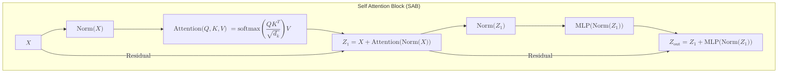
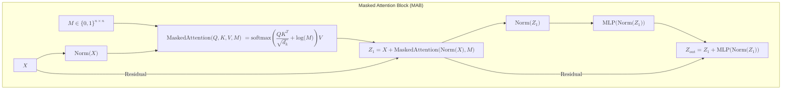

```mermaid
flowchart TD
    subgraph "Self Attention Block (SAB)"
        X["$$\mathbf{X}$$"] --> Norm["$$\text{Norm}(\mathbf{X})$$"]
        Norm --> DPA["$$\text{Attention}(\mathbf{Q}, \mathbf{K}, \mathbf{V}) \\ = \text{softmax}\left(\frac{\mathbf{Q}\mathbf{K}^T}{\sqrt{d_k}}\right)\mathbf{V}\quad$$"]
        DPA --> Add1["$$\mathbf{Z}_1 = \mathbf{X} + \text{Attention}(\text{Norm}(\mathbf{X}))$$"]
        X -- "$$\text{Residual}$$" --> Add1
        Add1 --> Norm2["$$\text{Norm}(\mathbf{Z}_1)$$"]
        Norm2 --> MLP["$$\text{MLP}(\text{Norm}(\mathbf{Z}_1))$$"]
        MLP --> Add2["$$\mathbf{Z}_{\text{out}} = \mathbf{Z}_1 + \text{MLP}(\text{Norm}(\mathbf{Z}_1))$$"]
        Add1 -- "$$\text{Residual}$$" --> Add2
    end
```

```mermaid
flowchart TD
    subgraph "Masked Attention Block (MAB)"
        X["$$\mathbf{X}$$"] --> Norm["$$\text{Norm}(\mathbf{X})$$"]
        EdgeMask["$$\mathbf{M} \in \{0,1\}^{n \times n}$$"] --> MDPA
        Norm --> MDPA["$$\text{MaskedAttention}(\mathbf{Q}, \mathbf{K}, \mathbf{V}, \mathbf{M}) \\ = \text{softmax}\left(\frac{\mathbf{Q}\mathbf{K}^T}{\sqrt{d_k}} + \log(\mathbf{M})\right)\mathbf{V}\quad$$"]
        MDPA --> Add1["$$\mathbf{Z}_1 = \mathbf{X} + \text{MaskedAttention}(\text{Norm}(\mathbf{X}), \mathbf{M})$$"]
        X -- "$$\text{Residual}$$" --> Add1
        Add1 --> Norm2["$$\text{Norm}(\mathbf{Z}_1)$$"]
        Norm2 --> MLP["$$\text{MLP}(\text{Norm}(\mathbf{Z}_1))$$"]
        MLP --> Add2["$$\mathbf{Z}_{\text{out}} = \mathbf{Z}_1 + \text{MLP}(\text{Norm}(\mathbf{Z}_1))$$"]
        Add1 -- "$$\text{Residual}$$" --> Add2
    end
```