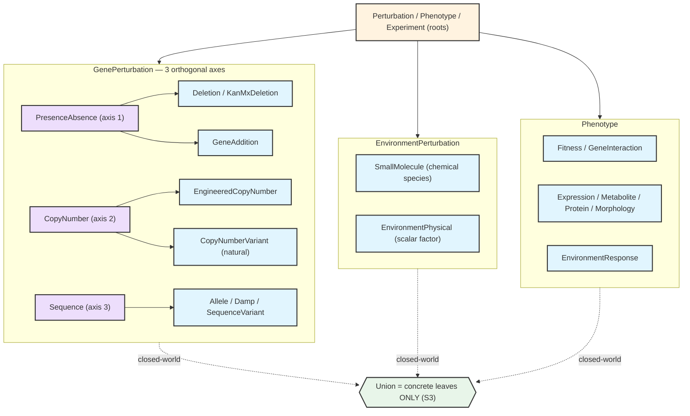
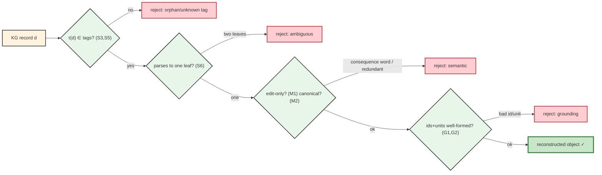

# Ontological Enforcement of the TorchCell Experiment Ontology

## Purpose

TorchCell models every experiment as a typed record `genotype × environment → phenotype`
with provenance. This note states the **invariants that keep that ontology coherent** —
the properties we *test programmatically* so the schema stays a well-formed, unambiguous,
queryable substrate as it grows to cover broad phenotypes. Each rule is given in plain
language, in logical/mathematical notation, with what it **allows** and **forbids**, and
two examples. It is the source for the manuscript's ontology-integrity figures.

**Two kinds of correctness.** *Structural* rules make the type system well-formed (the
"Figure 1A" directed-acyclic structure, disjointness, completeness). *Semantic* rules
constrain what a type is allowed to *mean* (a perturbation is an edit, never its
consequence; one biological state has one encoding). A schema can be perfectly
well-formed and still semantically wrong — the `stress_type` field was structurally valid
yet semantically a category error — so we enforce both.

**Why it matters operationally.** The knowledge graph stores serialized records; when we
query it we must reconstruct the correct pydantic object. Reconstruction is a function of
the discriminator tag:
$$\operatorname{reconstruct}(d) \;=\; C \quad\text{where}\quad \tau(C) = d.\texttt{type}.$$
This is well-defined **iff** tags are unique (S5), every leaf is in the union (S3), and no
record parses two ways (S6). The integrity tests are precisely what make KG→object
round-trips sound.

## Notation

- $\mathcal{C}$ — schema classes; $\prec$ — direct is-a (subclass); $\preccurlyeq$ — its
  reflexive-transitive closure; $\prec^{+}$ — transitive closure.
- $\mathcal{C} = \mathcal{A} \sqcup \mathcal{L}$ — abstract bases $\mathcal{A}$ and
  concrete leaves $\mathcal{L}$.
- Roots $R \in \{\textsf{GenePerturbation}, \textsf{EnvironmentPerturbation},
  \textsf{Phenotype}, \textsf{Experiment}, \textsf{Genome}, \textsf{Genotype},
  \textsf{Environment}\}$; $\mathcal{L}_R = \{C \in \mathcal{L} : C \preccurlyeq R\}$.
- $\tau : \mathcal{L} \to \mathcal{T}$ — the discriminator tag (`perturbation_type`,
  `experiment_type`, …).
- $U_R$ — the pydantic union used to (de)serialize $R$; $\mu(U_R)$ — its members.
- $\llbracket C \rrbracket$ — the set of records valid as $C$; $\operatorname{dump}$,
  $\operatorname{parse}_{U}$ — serialize / deserialize.
- $\rhd$ — has-a (composition): $A \rhd B$ iff a field of $A$ has schema-type $B$.

## The hierarchy (Figure 1A)

Purple = abstract organizing bases (never instantiated, never in a union); blue = concrete
leaves (the only union members); orange = roots; green = an enforcement gate.

---

## Family I — Structural integrity

### S1 · is-a is acyclic (a tree)

**Intent.** Following "is-a" arrows never returns to the start, so "what kind of thing is
this?" always terminates. We keep it a *tree* (one semantic parent) — the strictest DAG.
$$\forall C \in \mathcal{C}:\ \lnot\,(C \prec^{+} C) \qquad\wedge\qquad \forall C \neq R:\ |\{P : C \prec P,\ P \text{ semantic}\}| = 1.$$
**Allows** single-parent leaves. **Forbids** inheritance cycles / multiple conceptual
parents. *✓ `KanMxDeletion ≺ Deletion ≺ PresenceAbsence ≺ GenePerturbation`.*
*✗ a class that is-a Deletion and is-a SmallMolecule (two parents, ambiguous identity).*

### S2 · has-a is acyclic (finite composition)

**Intent.** No object transitively contains itself, so records are finite and
serializable.
$$(\mathcal{C}, \rhd)\ \text{acyclic}:\quad \forall C:\ \lnot\,(C \rhd^{+} C).$$
**Allows** `Experiment ▷ Genotype ▷ Perturbation`. **Forbids** `Phenotype ▷ … ▷ Phenotype`.
*✓ Experiment contains Genotype, Environment, Phenotype — a DAG.*
*✗ a Phenotype whose field is a list of Phenotypes containing itself (infinite record).*

### S3 · Closed-world completeness (union = leaves)

**Intent.** The (de)serialization union equals *exactly* the concrete leaves, so a new
leaf can't silently drift out of the union and fail to reconstruct from the KG.
$$\mu(U_R) \;=\; \mathcal{L}_R \;=\; \{C \in \operatorname{desc}(R) : C \text{ concrete}\}.$$
**Allows** deserializing any stored leaf. **Forbids** an orphan leaf.
*✓ adding `EngineeredCopyNumber` also adds it to `GenePerturbationType`.*
*✗ define `EngineeredCopyNumber` but forget the union → its KG records raise on parse.*

### S4 · Liskov substitutability

**Intent.** Every union member really is a subtype of the base, so a slot typed as the base
accepts any leaf.
$$\mu(U_R) \subseteq \{C : C \preccurlyeq R\}.$$
*✓ every member of `PhenotypeType` subclasses `Phenotype`.*
*✗ a `Genome` class accidentally listed in `PhenotypeType`.*

### S5 · Discriminator uniqueness + ownership

**Intent.** Each leaf owns a unique tag, so the tag alone selects the class to rebuild.
$$\tau|_{\mathcal{L}_R}\ \text{injective}\qquad\wedge\qquad \forall C \in \mathcal{L}_R:\ \texttt{"...\_type"} \in \operatorname{own\_fields}(C).$$
**Allows** unambiguous `reconstruct`. **Forbids** duplicated or inherited tags.
*✓ `SgaKanMxDeletion` declares `"sga_kanmx_deletion"`.*
*✗ `SgaDamp` inherits `"damp"` from abstract `Damp` — collides if `Damp` ever becomes a
leaf (this is a current defect).*

### S6 · Unique parse (leaf disjointness)

**Intent.** A dumped record parses back to exactly its own leaf — no record is valid as two
leaves.
$$\forall C \in \mathcal{L}_R,\ \forall x \in \llbracket C \rrbracket:\ \operatorname{parse}_{U_R}(\operatorname{dump}(x)) \in \llbracket C \rrbracket \quad\Longleftrightarrow\quad \llbracket C\rrbracket \cap \llbracket C'\rrbracket = \emptyset\ (C\neq C').$$
*✓ `dump(MetabolitePhenotype)` re-parses to `MetabolitePhenotype`.*
*✗ a record that validates as both `Metabolite` and `ProteinAbundance` (KG mislabels it).*

### S7 · Abstract exclusion

**Intent.** Organizing bases are scaffolding, never records; they carry no tag a leaf uses.
$$\mathcal{A} \cap \mu(U_R) = \emptyset \qquad\wedge\qquad \forall A \in \mathcal{A}:\ \tau(A) \notin \tau(\mathcal{L}).$$
*✓ `Deletion` (abstract) is excluded from `GenePerturbationType`.*
*✗ a bare `Phenotype` instance stored as data (overlaps every child — see S6).*

### S8 · Axis partition (perturbations)

**Intent.** Every gene-perturbation leaf sits under exactly one of the three orthogonal
axes (presence/absence · copy-number · sequence) — makes the "3-axis" claim provable.
$$\{A_1, A_2, A_3\}\ \text{partitions}\ \mathcal{L}_{\text{gene}}:\quad \forall C \in \mathcal{L}_{\text{gene}}\ \exists!\, i:\ C \preccurlyeq A_i.$$
*✓ once a `CopyNumber` ABC exists, both CNV leaves sit under it.*
*✗ (current) `CopyNumberVariant` hangs directly off the root with no axis genus.*

---

## Family II — Semantic integrity

### M1 · Edit ⊥ consequence

**Intent.** A perturbation names the **edit**, never the **phenotypic consequence**.
$$\forall C \in \text{Perturbations},\ \forall n \in \operatorname{names}(C):\ \operatorname{tok}(n) \cap \mathcal{V}_{\text{consequence}} = \emptyset \ \ (\text{mod allowlist}),$$
with $\mathcal{V}_{\text{consequence}} = \{\textsf{stress}, \textsf{sensitive},
\textsf{tolerant}, \textsf{essential}, \textsf{lethal}, \textsf{resistant}, \dots\}$.
**Allows** describing what was changed. **Forbids** encoding the outcome.
*✓ `DeletionPerturbation` (the edit); H₂O₂ as `SmallMolecule(inchikey=…)`.*
*✗ `EssentialGeneDeletionPerturbation`; `PhysicalStress(stress_type="oxidative")` — "stress"
is a genotype-conditioned outcome, not the edit. It moves to `EnvironmentResponse.category`
(`sensitive`/`tolerant`) and the compound's ChEBI **role** (oxidising agent).*

### M2 · Canonical form (no redundant encoding)

**Intent.** One biological state has exactly one encoding, so the model never sees the same
state two ways (a representation mismatch that harms learning).
$$\text{the meaning map}\ \mu_{\mathrm{sem}} : \mathcal{L} \to \text{States}\ \text{is injective on canonical records:}\quad \forall s\ \ |\{C : C \text{ canonically encodes } s\}| = 1.$$
**Allows** a single leaf per state. **Forbids** two leaves for one state.
*✓ "gene absent" ⟹ `NaturalGeneAbsence(state=absent)` (the one canonical form).*
*✗ the same loss as `CopyNumberVariant(copy_number=0)` — forbidden by a validator
`CNV ⇒ copy_number > 0`, so absence never has a second encoding.*

### M3 · Orthogonal factorization (provenance ⊥ axis ⊥ mechanism)

**Intent.** A perturbation's type space factors into independent dimensions; none leaks into
another.
$$\text{TypeSpace} \;\cong\; \text{Axis} \times \text{Provenance} \times \text{Mechanism},\qquad \text{provenance} \in \{\textsf{engineered}, \textsf{natural}\}\ \text{a free field on each axis}.$$
*✓ `EngineeredCopyNumber` vs `CopyNumberVariant` differ only in provenance.*
*✗ folding "engineered vs natural" or a mechanism into the class name so the axes can't be
compared.*

### M4 · Derived-not-stored

**Intent.** Anything functionally determined by structure is computed, not stored — storing
it is a redundant encoding that can desync.
$$\forall\, q\ \text{with}\ q = g(\text{record}):\quad q \notin \operatorname{stored\_fields}.$$
**Allows** computing on read. **Forbids** a field duplicating derivable info.
*✓ interaction order $k = |\text{perturbations}|$ ⟹ ε at $k=2$, τ at $k=3$, computed.*
*✗ a stored `interaction_kind = "tau"` that can contradict the genotype's arity.*

---

## Family III — Grounding and measurement typing

*Internal* grounding (below) lives in pydantic and is enforced now. *External* grounding —
mapping classes to **Biolink** categories/predicates — is the **BioCypher** layer
(`torchcell_schema_config.yaml`, `is_a:` lines, Phase B): $\phi : \mathcal{C} \to
\text{Biolink}$, which lets the KG be queried by walking common-ontology edges. The schema's
job is to carry well-formed ids/units that $\phi$ can project.

### G1 · Identifier well-formedness (membership, not just shape)

$$\forall\, \text{mech}:\ \texttt{so\_id} \in \mathrm{SO}_{\text{pinned}} \ \wedge\ \operatorname{name}(\texttt{so\_id}) = \texttt{so\_name}; \qquad \forall\, \text{compound}:\ \texttt{inchikey} \models P_{\text{InChIKey}}.$$
*✓ `(SO:0000159, "deletion")` — a pinned pair; compound keyed by validated InChIKey +
redundant `{pubchem\_cid, chebi\_id}`.* *✗ `SO:9999999` (not a real term) or
`(SO:0000159,"banana")` (id/name desync).*

### G2 · Unit typing

$$\forall\, \text{quantity}:\ \texttt{unit} \in \mathcal{U}\ (\text{typed, UO-aligned enum}),\ \text{not a free string}.$$
*✓ `unit = micromolar` (enum).* *✗ `"uM"` and `"µM"` and `"micromolar"` silently coexisting
across datasets.*

### G3 · Phenotype measurement contract

**Intent.** Every quantitative phenotype declares *what the number is* and *its units +
shape* — the typed signature that makes records comparable (and, later, a well-defined
domain/codomain if conversions are ever added; the conversion registry itself is deferred).
$$\forall\, P \in \text{QuantPhenotype}:\ (\texttt{measurement\_type} \in \mathcal{M},\ \texttt{units} \in \mathcal{U},\ \texttt{shape})\ \text{present}.$$
*✓ `EnvironmentResponse(measurement_type=log2_ratio, units=…)`.* *✗ `Fitness` / `Microarray`
carrying the convention only in a docstring (current gap → fix now).*

### G4 · Uncertainty typing (exemplar, already enforced)

$$\forall\, \text{uncertainty}:\ (\text{typed statistic kind},\ \text{SE derived not guessed}).$$
*✓ `sample_sd` with $\mathrm{SE}=\mathrm{SD}/\sqrt{n}$.* *✗ an unlabelled error bar of unknown
kind.*

---

## Enforcement gates (what passes, what is rejected)

---

## Design decisions (rules applied to the hard cases)

- **`stress_type` → deleted (M1).** Compound chemistry → ChEBI *role* on the molecule;
  physical variable → neutral `factor` (temperature/pH/osmolarity); "is it stress?" →
  `EnvironmentResponse.category`.
- **`CopyNumberVariant(0)` → forbidden (M2).** Absence has one canonical leaf; a validator
  enforces `CNV ⇒ copy_number > 0`. Removes the two-encodings-of-absence hazard.
- **`Sga*` prefixes → collapse (S5 + M1-adjacent).** "SGA" is the *assay method*, not the
  edit (a DAMP allele isn't intrinsically SGA — it was *used* in SGA studies). Method moves
  to experiment/provenance metadata; `Sga*` leaves fold into their parents, which also fixes
  the inherited-tag defect.
- **ε / τ → derived (M4).** Interaction order = genotype arity; not a stored field.
- **`ts` / `suppressor` → identity handle, allowlisted (M1 exception, documented).** These
  names are *pointers to published reagent collections* (they let us fetch the real allele
  **sequence** from the literature later for sequence modelling), so they carry identity,
  not just consequence. Kept as an allele **source/identity**; the temperature-conditionality
  / rescue *claim* is realized via `Environment` (restrictive temp) + phenotype. Recorded on
  M1's explicit allowlist with this justification, so the exception is a reviewed decision,
  not silent drift.

## Enforcement status

| Rule | Gene tree | Env / Phenotype / Experiment trees |
| :-- | :-- | :-- |
| S1 is-a DAG · S2 has-a DAG | ✅ tested | ✅ (S2 global) / ✅ S4 subclass-of-root |
| S3 closed-world · S6 unique parse | ✅ | ✅ S3 all trees; S6 env (pheno/exp via dataset L0–L4) |
| S5 discriminator unique+owned | 🔨 (4 `Sga*` inherit) | ✅ unique (env/exp/ref) |
| S7 abstract exclusion · S4 Liskov | ✅ | ✅ (root grandfathered on pheno/exp/ref) |
| S8 axis partition | 🔨 (no CNV genus) | n/a |
| M1 edit⊥consequence · M2 canonical | ⬜ gene (Tier 2 xfail) / M2 ✅ | ✅ M1 env; ✅ M2 copy_number>0 |
| M3 orthogonality · M4 derived-not-stored | ✅ | ✅ |
| G1 ids · G2 units · G3 phenotype contract | ✅ SO-pair allowlist | ✅ InChIKey/ChEBI/CID; ✅ unit enums; ✅ G3 (str-typed pheno = Tier-2 xfail) |
| G4 uncertainty typing | ✅ exemplar | ✅ |

Legend: ✅ enforced · 🔨 partial/defect · ⬜ to add. External Biolink grounding = BioCypher
(Phase B), not pydantic. **Tier-1 tests** live in
`tests/torchcell/datamodels/test_ontology_all_trees.py` (S3–S7 across trees + M1–M4 +
G1–G3) alongside the gene-tree `test_ontology_invariants.py`; deferred gene-tree M1 and
phenotype measurement-typing are `strict=True` xfails so Tier 2 flips them green.

---

## Detailed test specifications (implementable)

Each rule maps to a concrete pytest. `_concrete(R)` = BFS over `__subclasses__()` from root
`R` minus an explicit `ABSTRACT` frozenset; `τ(C)` = `C.model_fields[<tag>].default`;
`FACTORY[C]` = a minimal valid instance per leaf (extend the existing gene-tree factory to
all roots).

- **S1 is-a DAG / single-root.** `@parametrize(root in ROOTS)`: for every `C ∈ _concrete(root)`
  assert `root in C.__mro__` and that `C` has exactly one non-mixin base (mixins = `{ModelStrict}`).
  Python C3 makes cycles impossible; the test guards single-parenthood. *Fails if* a leaf is
  given two semantic parents.
- **S2 has-a DAG.** Keep `test_model_composition_is_acyclic`: build a digraph over every schema
  model's field annotations (unwrap `list[...]`, `dict[...]`, `Optional`, `Union` to schema
  models), run 3-colour DFS, assert no grey→grey back-edge.
- **S3 closed-world.** `@parametrize(root in ROOTS)`: `assert _concrete(root) == set(get_args(U_root)) - {root}`.
  This is the biggest new coverage — port the gene-only test to `PhenotypeType`,
  `ExperimentType`, `ExperimentReferenceType`, `EnvironmentPerturbationType`.
- **S4 Liskov.** `for m in get_args(U_root): assert issubclass(m, root)`.
- **S5 discriminator unique + owned.** `tags=[τ(C) for C in _concrete(root)]; assert len(tags)==len(set(tags))`;
  and `for C in _concrete(root): assert "<tag>" in C.__annotations__` (owned, not inherited).
  *Fails today* on `SgaDamp/SgaTsAllele/SgaAllele/SgaSuppressor` (Tier 2 fix).
- **S6 unique parse.** `A=TypeAdapter(U_root); for C: x=FACTORY[C]; assert type(A.validate_python(x.model_dump()))
  is C`. Proves KG→object reconstruction is exact.
- **S7 abstract exclusion.** `assert ABSTRACT ∩ set(get_args(U_root)) == ∅`; and
  `for A in ABSTRACT: assert τ(A) ∉ {τ(C) for C in leaves}`.
- **S8 axis partition.** `AXES={PresenceAbsence, CopyNumber, Sequence}; for C in _concrete(GenePerturbation):
  assert sum(issubclass(C,a) for a in AXES)==1`. *Fails* until the `CopyNumber` ABC exists (Tier 2).
- **M1 edit⊥consequence.** `BANNED={stress,sensitive,tolerant,resistant,essential,lethal,damaging,
  toxic,inhibitory,suppressor}`; `ALLOWLIST={}` (or `{TsAllele*, SuppressorAllele*}` with the
  identity-handle justification, Tier 2). For each perturbation subclass not in ALLOWLIST, tokenize
  `{class name} ∪ field names ∪ enum member names/values` (split on `_`/`-`, lowercase) and assert
  `∩ BANNED == ∅`. Scan *names*, not descriptions. `ALLOWED_VALUES={IC30,IC50,MIC,fixed}` exempt
  (dose provenance, not phenotype).
- **M2 canonical form.** Field validator on `CopyNumberVariant`/`EngineeredCopyNumber`:
  `assert copy_number > 0` (construct with `0.0` ⇒ expect `ValidationError`). Plus
  `test_absence_single_encoding`: the only leaf whose canonical meaning is "gene absent" is the
  presence/absence absence leaf — assert no CNV leaf can represent copy_number 0.
- **M3 orthogonality.** Assert `provenance` is a declared field on `GenePerturbation` taking both
  `{engineered,natural}`, that each axis has at least one leaf of each provenance, and that
  `mechanism_so_*` is a separate field from `state`/`copy_number`.
- **M4 derived-not-stored.** Assert `GeneInteractionPhenotype` has NO stored `interaction_kind`/
  `order` field; add a helper `interaction_order(genotype)=len(perturbations)` and a test that
  ε↔k=2, τ↔k=3 are computed from arity, never stored.
- **G1 identifier well-formedness.** Pin `SO_ALLOWED={"SO:0000159":"deletion","SO:0000667":"insertion",
  "SO:0001060":"sequence_variant","SO:0001483":"SNV","SO:0001019":"copy_number_variation"}`;
  validator asserts `so_id ∈ SO_ALLOWED and SO_ALLOWED[so_id]==so_name` (upgrade the shape-only
  check). `Compound.inchikey` validated against `^[A-Z]{14}-[A-Z]{10}-[A-Z]$`; `pubchem_cid:int`;
  `chebi_id` against `^CHEBI:\d+$`.
- **G2 unit typing.** Assert `Concentration.unit`/`Temperature.unit`/phenotype `units` fields are
  `StrEnum`-typed (UO-aligned), not `str`; test the field annotation `is` the unit enum.
- **G3 phenotype measurement contract.** `@parametrize(P in quantitative phenotype leaves)`: assert
  `measurement_type` is enum-typed and present, `units` present, value shape declared.
- **G4 uncertainty typing.** Existing `test_uncertainty_ontology.py` (SE derived by kind); keep as
  the exemplar the above imitate.

## Tiering (implementation order)

- **Tier 1 — THIS branch (`ws15-env-chemogenomic`), before merge.** Everything that concerns the
  new/environment work and is additive-or-env-scoped: env-perturbation refactor
  (`SmallMolecule`+`EnvironmentPhysical`, drop stress vocab), `Compound` identity block, typed
  units, **M2 `copy_number>0` validator**, the new integrity tests ported to env/phenotype/experiment
  trees (S3–S7), M1 lint, M3/M4/G1/G2/G3 as far as they don't force re-verifying landed
  Costanzo/Kuzmin/Kemmeren. Rebuild the 4 env datasets. Streaming `post_process` + build
  Hoepfner/FitDb/Lee/Nadal.
- **Tier 2 — IMMEDIATELY AFTER MERGE of the environmental studies (separate branch).** Everything
  that re-verifies landed genetic datasets: `Sga*` collapse (→ assay method as experiment metadata;
  fixes S5), gene-side `suppressor`/`ts` decision (allowlist vs demote to phenotype), `CopyNumber`
  axis ABC (S8), phenotype-typing backfill on `Fitness`/`GeneInteraction`/`Microarray` (rebuilds
  Costanzo/Kuzmin/Kemmeren/Sameith), and any conversion-registry work (still deferred). Picked up
  right after WS15 merges.
