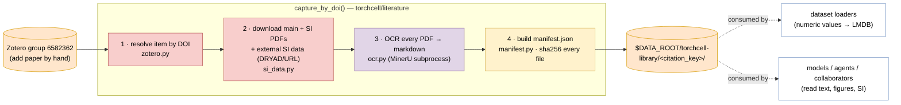
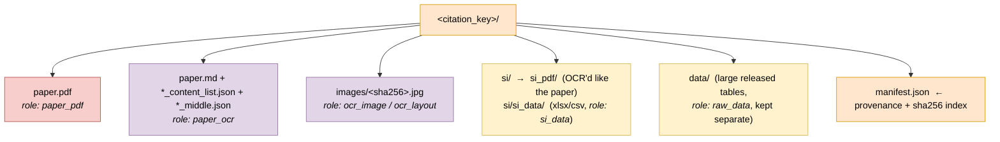

## 2026.07.14 - OCR Literature Database: Data Description

Related: [[paper.north-star]] · [[literature-provenance-subsystem]] · code in `torchcell/literature/`

### Summary

We maintain a **provenance-anchored OCR literature mirror**: for every paper backing a
torchcell dataset, the source PDF(s) and their machine-readable OCR are captured into a
single citation-key-addressed directory alongside a `manifest.json` that hash-pins every
byte. This is the substrate a model (or a collaborator) reads from when it needs the *text
of the method*, a *figure*, or a *supplementary table* — not just the extracted numeric
values that live downstream in the dataset LMDBs. The mirror is **incremental and
incomplete by design**: it grows one paper at a time as datasets are added, and OCR /
manifest coverage lags the raw PDF (see *Coverage* below).

Mirror root: `$DATA_ROOT/torchcell-library/` (currently `/scratch/projects/torchcell-scratch/torchcell-library`, **~5.4 GB, 38 citation keys**).

### Ingestion pipeline (method)

The single entry point is `capture_by_doi(lib, doi, …)` in `torchcell/literature/capture.py`.
The DOI is the join key; everything else is derived. The flow is strictly ordered so the
manifest, written last, observes every produced file.



**OCR engine.** OCR runs MinerU in an **isolated conda env** (`swanki-mineru`) invoked as
a subprocess (`ocr.py` → `_run_mineru.py`), never imported into torchcell — MinerU pins
`torch<2.11` + PaddleOCR and would collide with the ML env. Backend (`pipeline` |
`vlm-auto-engine`), page DPI, and device are parameterised via env vars
(`TORCHCELL_MINERU_*`); dense tables get the high-DPI VLM path. Each PDF yields `paper.md`
(reading-order markdown), `paper_content_list.json` (typed text/image/table blocks, e.g.
483 blocks for Messner), a `paper_middle.json` layout dump, and cropped figure/table
images under `images/` (hash-named JPGs).

### Per-key artifact layout

Every paper is one directory keyed by its Better-BibTeX citation key. Not all slots are
always present — SI and `data/` appear only when the paper ships them.



Live example (`smithQuantitativeCRISPRInterference2016/`) — paper OCR'd, SI shipped as
Excel, provenance recorded:

```text
smithQuantitativeCRISPRInterference2016/
├── paper.pdf                      # source (paper_pdf)
├── paper.md                       # OCR markdown (paper_ocr)
├── paper_content_list.json        # typed blocks
├── paper_middle.json              # layout dump
├── images/                        # 5 cropped figure JPGs (ocr_image)
├── si/
│   └── si_data/                   # 6 × *_ESM.xlsx (si_data — NOT OCR'd)
└── manifest.json                  # sha256 index + provenance
```

### Provenance model (pydantic, `manifest.py`)

`manifest.json` is a `Manifest` model. Each file is an `ArtifactRecord` carrying `path`,
`role`, `bytes`, `sha256`, `source` URL, `zotero_md5`, plus optional `retrieval` and
`processing` records:

- **`RetrievalRecord`** — `method` (enum: `springer_esm | zotero_attachment | pmc_oa_api |
  direct_url | radiant_endpoint`), `source_url`, `retriever` (dotted path), `params`,
  `sha256`, `retrieved_at`, and a `last_check` for drift detection.
- **`ProcessingRecord`** — `tool` (`mineru | pdftotext | …`), `version`, `params`,
  `input_sha256[]` — makes OCR deterministic and re-runnable.

The **stored bytes + sha256 are canonical, the URL is only retrieval metadata** — on
rebuild we replay the retrieval command and verify the hash; drift is detected, never
silently followed (per repo provenance policy).

> Note the `radiant_endpoint` retrieval-method slot (issue #20): a *pre-existing design
> hook* for serving artifacts from a hosted endpoint rather than a live publisher URL —
> directly relevant to the network-hosting decision below.

### Coverage (as of 2026.07.14 — deliberately incomplete)

| Slot | Count / 38 | Notes |
|---|---|---|
| Source PDF present | 37 | only `xue2025` is data-only (no PDF) |
| OCR `paper.md` | 35 | missing: `costanzo…2016` (only `SOM.pdf`), `lopez…2024` (data-only), `xue2025` |
| `manifest.json` | 20 | **18 keys OCR'd *before* provenance was formalised → no manifest yet** |
| `si/` directory | 8 | SI mostly shipped as raw `xlsx`/`csv` (`si_data`), only a few SI PDFs OCR'd (`si_ocr`) |
| `data/` (large tables) | 13 | released quantitative tables, kept beside the paper |
| Cropped OCR images | 361 total | hash-named, deduped by content |

**Two real gaps the user flagged:** (1) **manifest backfill** — 18 keys have OCR but no
`manifest.json`; (2) **SI is under-OCR'd** — most supplements are stored as spreadsheets
(`si_data`), and only a handful of SI *PDFs* have been OCR'd (`si_ocr` role appears 3×).
Both are additive to fix; neither blocks read access to what is already there.

### Access today (before any hosting)

The mirror is a plain directory tree on GilaHyper, so anything with filesystem access —
including Claude Code in this repo via `$DATA_ROOT` — can already `grep`/read `paper.md`
and open the SI. There is **no index or semantic search yet**; retrieval is filename +
full-text grep. Semantic search over `paper.md` / `content_list` blocks is a deliberate
*later* layer.

### Hosting options (to decide — not yet built)

Two axes the user raised, kept here as the decision surface:

1. **`rsync` mirror to the M1 Mac** — simplest; a Claude Code skill wrapping
   `rsync` between `$DATA_ROOT/torchcell-library` (GilaHyper) and a Mac path, both from
   env vars. Cheap at 5.4 GB today, but couples every consumer to a full local copy and
   does not generalise to outside collaborators.
2. **Keyed network endpoint on GilaHyper** — serve the mirror (read API + auth keys
   settable on the Mac) so data is pulled on demand and *other people* can be granted the
   raw artifacts (e.g. to swap out pipeline stages). This is what the `radiant_endpoint`
   provenance slot already anticipates, and the direction that enables collaboration.

Recommendation to weigh next session: do **both, layered** — endpoint as the source of
truth, optional `rsync`/skill as a convenience cache — since the manifest's sha256 index
lets either mode verify integrity identically.

## 2026.07.14 - Delivered: keyed endpoint + manifest backfill

Plan: [[plan.literature-keyed-endpoint.2026.07.14]]. Landed via worktree
`feat/literature-keyed-endpoint`. **Option 2 (keyed network endpoint) is the chosen and
now-built path**, a **private** service hosted on **GilaHyper** (where the 5.4 GB mirror
physically lives; not exposed to the public internet — LAN + SSH-tunnel access only).

**Naming note (distinct from Radiant).** This literature endpoint is its own thing:
`TC_LIT_*` env vars, a `LiteratureKeys` auth model, and the `lit-pull` client skill. It is
*not* the `radiant_endpoint` `RetrievalMethod` slot (issue #20) — Radiant is the NCSA VM
dedicated to the graph database + ML-dataset querying, and its `radiant_endpoint` slot
(reserved for serving library-rebuild artifacts) stays untouched and unfilled here.

### Manifest backfill — coverage now 41/41

`torchcell/literature/backfill.py` (`build_manifest`-based, idempotent) regularized every
citation-key directory. The mirror had grown to **41 dirs** (dynamic scan, never a
hardcoded list); 23 already had manifests, **18 were written this run** — 17 enriched from
the Zotero group (doi/title/library_id/zotero_item_key/collections + per-attachment md5),
and **1 offline** (`xue2025`, a data-only dissertation source not in Zotero). Offline
manifests carry `provenance_complete=False` — every byte is still sha256-pinned; only the
upstream retrieval chain is marked unknown, never fabricated. Verified: 41/41 present,
zero missing, spot-checked sha256s match disk. Run it again anytime:

```bash
python -m torchcell.literature.backfill            # enrich from Zotero (needs ZOTERO_*)
python -m torchcell.literature.backfill --no-zotero # offline only
```

New: `_role_for` now classifies `data/*` → `raw_data`, loose `si/*` non-pdf/md → `si_data`,
and top-level `thesis.pdf`/`.txt` → `paper_pdf`/`paper_ocr` (previously all `"other"`); a
`provenance_complete` field was added to `Manifest` (defaults `True`, back-compatible).

### The endpoint — `torchcell/literature/server.py` (FastAPI, read-only)

| Route | Auth | Returns |
|---|---|---|
| `GET /health` | no | `{status, n_keys, mirror_root}` |
| `GET /keys` | yes | citation keys present (dynamic; new papers appear with no restart) |
| `GET /keys/{ck}/manifest` | yes | the `Manifest` (roles + sha256); 404 if not backfilled |
| `GET /keys/{ck}/files` | yes | `[{path, role, bytes, sha256}]` (manifest, or live if none) |
| `GET /keys/{ck}/artifact/{rel_path}` | yes | file stream + `X-Artifact-SHA256` header |
| `GET /search?q=` | yes | substring hits over citation keys + `paper.md` (**not** semantic) |

**Auth.** Named API keys (multiple, so a collaborator gets a distinct **revocable** key),
stored as **sha256 hashes** in a JSON keys file, compared constant-time (`hmac.compare_digest`);
key values are never logged. Missing/unknown key → 401. Path traversal (`../`) → 400,
verified server-side. A client fetch is a scriptable retrieval whose bytes hash-verify
against the manifest exactly like `direct_url`; the client key travels only in the
`X-API-Key` header (never in `RetrievalRecord.params`). No new retriever was registered —
building a client-side retriever that rebuilds a key locally is deferred, and the
`radiant_endpoint` slot is left for the Radiant VM's own rebuild path.

### Env vars (GilaHyper server side)

```
DATA_ROOT=/scratch/projects/torchcell-scratch          # mirror = $DATA_ROOT/torchcell-library
TC_LIT_KEYS_FILE=~/.config/torchcell/tc_lit_keys.json # {name: sha256hex}; preferred
# or, quick-start only (plaintext, visible via ps): TC_LIT_API_KEYS=name:key,name2:key2
TC_LIT_HOST=0.0.0.0
TC_LIT_PORT=8723
```

### Set up a key + run the server

**Foolproof key mint (server side).** `--gen-key` prints the plaintext key AND its hash, but
hand-copying the hash into the keys file is error-prone (a stale `<placeholder>` there → 401
for every key). Instead derive + store the hash automatically; only the plaintext is handled:

```bash
mkdir -p ~/.config/torchcell
KEY=$(~/miniconda3/envs/torchcell/bin/python -c "import secrets; print(secrets.token_urlsafe(32))")
printf '{"mac-m1": "%s"}\n' "$(printf '%s' "$KEY" | sha256sum | awk '{print $1}')" \
  > ~/.config/torchcell/tc_lit_keys.json
chmod 600 ~/.config/torchcell/tc_lit_keys.json
echo "==> PUT THIS ON THE MAC as TC_LIT_API_KEY:  $KEY"
```

The keys file stores only `{name: sha256hex}`; `printf '%s' KEY | sha256sum` matches the
server's `_hash_key`. Additional collaborators = more `{name: hash}` entries in the same JSON.

Run (Docker is the durable path — see the 2026.07.15 section; bare recipe below for a quick run):

```bash
bash -lc 'cd /home/michaelvolk/Documents/projects/torchcell && \
  TC_LIT_KEYS_FILE=~/.config/torchcell/tc_lit_keys.json \
  ~/miniconda3/envs/torchcell/bin/python -m torchcell.literature.server \
  --host 0.0.0.0 --port 8723'
```

Console scripts also installed: `tc-lit-server` and `tc-lit-backfill`.

### Pull from the M1 Mac

Put `TC_LIT_URL` and `TC_LIT_API_KEY` (the **plaintext** key) in the client `.env`, then
load just those two (a safe partial-source that ignores the rest of `.env`):

```bash
# .env:  TC_LIT_URL=http://192.168.1.17:8723
#        TC_LIT_API_KEY=<plaintext key>
set -a; source <(grep -E '^(TC_LIT_URL|TC_LIT_API_KEY)=' "${TC_LIT_ENV:-.env}"); set +a
curl -H "X-API-Key: $TC_LIT_API_KEY" "$TC_LIT_URL/keys"
curl -H "X-API-Key: $TC_LIT_API_KEY" "$TC_LIT_URL/keys/<ck>/artifact/paper.md" -o paper.md
```

The `lit-pull` Claude Code skill (`.claude/skills/lit-pull/`) wraps this `.env` load + the
list/pull/verify flow. 401 self-check: `printf '%s' "$TC_LIT_API_KEY" | sha256sum` must equal
the hash in the server's keys file.

**LAN exposure note.** No TLS on a trusted LAN initially; for off-LAN access put it behind
an SSH tunnel or reverse proxy. Rotate a key = edit the keys file + restart. Because keys
are hashed at rest, a leaked keys file does not leak usable keys.

### Verified end-to-end (2026.07.14)

- `pytest tests/torchcell/literature/` → 34 passed, 3 skipped (network-gated); ruff + mypy
  (strict) clean on all new/changed files.
- Real backfill → 41/41 manifests, sha256 spot-checks match disk.
- Live server (real mirror): `/health` no-auth OK; bad/missing key → 401; good key → 200,
  `n_keys=41`; `paper.md` download where **downloaded sha256 == `X-Artifact-SHA256` ==
  manifest**; raw `../../etc/passwd` → 400, no leak; `/search` returns hits.

### Still deferred (explicitly)

Semantic search over `paper.md`/`content_list` blocks; a full client-side `radiant_endpoint`
retriever that rebuilds a key locally; the optional `rsync` convenience-cache skill; SI-PDF
OCR completeness (most SI is still raw `xlsx`).

## 2026.07.15 - Docker deployment (containerized service)

The endpoint now ships as a **container**, matching how the Neo4j graph DB is served
(`docker-compose.yml`) — auto-restart, pinned deps, clean start/stop — instead of a bare
uvicorn process. Files: `Dockerfile.tc-lit` + `docker-compose.tc-lit.yml` (repo root).

**Slim by design.** `torchcell.literature` imports nothing heavy (verified: zero of
torch/PyG/numpy/pandas load), so the image is `python:3.13-slim` + only the 7 real deps
(`fastapi`, `uvicorn[standard]`, `pydantic`, `python-dotenv`, `pyzotero`, `httpx`,
`unidecode`) with the package `COPY`'d in and `PYTHONPATH=/app` — **~180 MB**, not the
multi-GB ML env a `pip install .` would drag in.

**Read-only all the way down.** The mirror and keys file are bind-mounted `:ro`; a
read-only server backed by a read-only mount cannot mutate the 5.4 GB mirror under any
bug or key. Config is 100% env-driven (`DATA_ROOT`, `TC_LIT_KEYS_FILE`), so the same code
runs bare or containerized. A `HEALTHCHECK` probes `/health` via stdlib urllib (no curl in
slim).

Own compose file (not wedged into the Neo4j build/import/deploy pipeline) so it
starts/stops independently:

```bash
# requires DATA_ROOT + TC_LIT_KEYS_FILE + TC_LIT_PORT in a .env here or the shell env
# 1. mint a key (writes nothing; prints the key + hash line for the keys file):
docker compose -f docker-compose.tc-lit.yml run --rm tc-lit-endpoint \
  python -m torchcell.literature.server --gen-key mac-m1
# 2. start (builds on first run):
docker compose -f docker-compose.tc-lit.yml up -d --build
docker compose -f docker-compose.tc-lit.yml logs -f     # tail
docker compose -f docker-compose.tc-lit.yml down         # stop
```

**Verified end-to-end (containerized, real mirror):** image builds to 180 MB; container
`/health` → `n_keys=41`; bad key → 401, good key → 200; `paper.md` download where
**downloaded sha256 == `X-Artifact-SHA256` == manifest**; raw `../` traversal → 400;
Docker `HEALTHCHECK` → `healthy`; and a write into the mounted mirror fails with
`Read-only file system` (RO enforced). The bare-uvicorn recipe above still works for a
quick run; Docker is the durable path.
