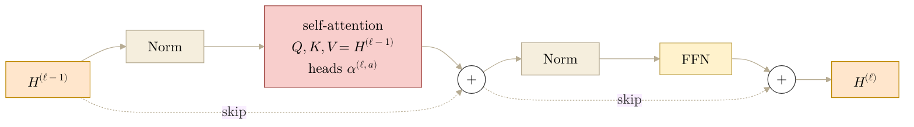
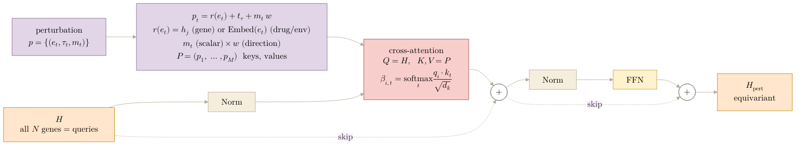
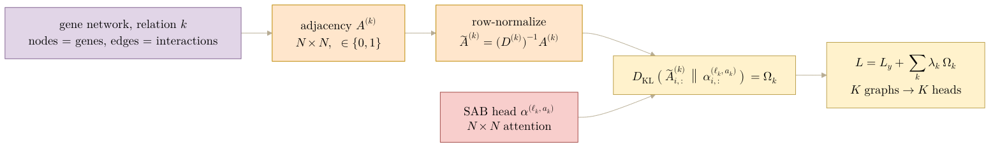
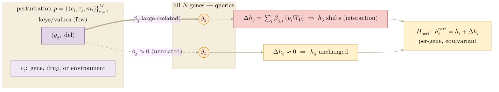

Block-diagrams for **Fig 1 panels d–f** of the CGT paper, drawn in the
Set-Transformer block style (self-attention block SAB, and the base cross-attention
block MAB; Lee et al. 2019) the co-authors shared. Companion to the general-case math
in [[paper.nature-biotech.fig1.perturbation-operator]] and the [[paper.methods]]
equations. The mermaid blocks are draw.io-ready sketches; render to a vector with
`bash notes/assets/publish/scripts/mermaid_pdf.sh notes/paper.nature-biotech.fig1.block-diagrams.md`.

## 2026.06.29 - CGT as Set-Transformer blocks (encoder · perturbation operator · graph regularization)

### Block vocabulary

The CGT reuses two Set-Transformer attention primitives, specialised to the cell; the
readouts are plain mean-pool + MLP (no learned pooling block):

| panel    | component                               | block           | what it is                                        |
|----------|-----------------------------------------|-----------------|---------------------------------------------------|
| d        | cell encoder $F_\theta$                 | **SAB ×L**      | self-attention over gene tokens                   |
| e        | perturbation operator $\mathcal T_\psi$ | **cross-attn (CAB)**   | cross-attention: cells query the perturbation set |
| readouts | invariant heads                         | **mean-pool + MLP** | average gene rows, then a per-task MLP        |
| f        | graph regularization                    | *(not a block)* | a training-time KL on a SAB attention head        |

**Caution — soft, not masked.** The "Masked Attention Block (edge mask)" is the *hard*
graph-convolution we reject. Our encoder is an **unmasked SAB**; the graph enters only as a
**soft KL target** (panel f), so data can overrule a wrong or untested edge. Do not draw an
edge mask in the encoder. We also avoid the label "MAB" for the operator: in the
Set-Transformer paper MAB is the *Multihead* Attention Block (the base cross-attention block,
with $\mathrm{SAB}(X)=\mathrm{MAB}(X,X)$), whereas the shared figure relabels MAB as a
*Masked* Attention Block — a different thing. Our operator is cross-attention and is **never
masked**, so we call it a cross-attention block (CAB). (The three perturbation operations — del / OE / KD — are not three
operators here; they are the three values of the type $\tau$, carried by the token
embedding $\mathbf t_\tau$ into a single $\mathcal T_\psi$.)

### d — Cell encoder: SAB ×L

$$H^{(\ell)}=\mathrm{SAB}\big(H^{(\ell-1)}\big),\qquad H^{(0)}=\mathrm{Embed}(G),\qquad H=H^{(L)}.$$

Pre-norm self-attention, then MLP, each with a residual ([[paper.methods]] eq. qkv / attn /
layer). Selected heads $\alpha^{(\ell,a)}$ are softly aligned to graphs (panel f); no mask.

### e — Perturbation operator: cross-attention block (CAB)

The perturbation operation: every gene (a query) attends to the perturbation context (the
keys and values), a transformation inside embedding space. Build the keys/values from the
perturbation set, then cross-attend with a residual:

$$
\mathbf{p}_t=r(e_t)+\mathbf t_{\tau_t}+m_t\,\mathbf w,\qquad \mathbf{P}=(\mathbf{p}_1,\dots,\mathbf{p}_M),
$$
$$
\beta_{i,t}=\operatorname*{softmax}_{t\in[M]}\frac{(h_iW_Q)\cdot(\mathbf{p}_tW_K)}{\sqrt{d_k}},\qquad
\Delta h_i=\sum_{t=1}^{M}\beta_{i,t}\,(\mathbf{p}_tW_V),\qquad
H_{\mathrm{pert}}=\mathcal T_\psi(H,p).
$$

Many queries (all $N$ genes), few keys ($\lvert p\rvert$); output is equivariant and feeds
the readouts; $\mathcal T_\psi$ generalises from gene tokens to drug / environment tokens by widening $p$.
Full treatment (properties, cartoon, generalisation): [[paper.nature-biotech.fig1.perturbation-operator]].

### f — Attention–graph regularization (graph → adjacency + attention matrix → regularize)

A gene graph becomes an $N\times N$ adjacency, the same shape as a gene–gene attention head,
so the two are aligned row by row with a KL penalty:

$$
\tilde A^{(k)}=(D^{(k)})^{-1}A^{(k)},\qquad
\Omega_k=\sum_{i\in\mathcal I_k}D_{\mathrm{KL}}\!\big(\tilde A^{(k)}_{i,:}\,\big\|\,\alpha^{(\ell_k,a_k)}_{i,:}\big),\qquad
\mathcal L=\mathcal L_y+\sum_{k=1}^{K}\lambda_k\,\Omega_k.
$$

One graph supervises one head. In experiment 010 these are $K=9$ gene–gene graphs (physical,
regulatory, TFLink, six STRING channels); metabolism is bipartite, has no $N\times N$
adjacency, and is excluded. The load-bearing point for the panel: $\tilde A^{(k)}$ and the
attention head are the **same $N\times N$ square**, so draw both as matching gene×gene
heatmaps with a KL between them.

### Readouts — mean-pool + MLP (if shown in the panel)

Invariant heads **average** the gene rows and pass the mean through a per-task MLP: fitness
averages all $N$ genes, and the interaction head concatenates the whole-cell CLS token with
the mean of the perturbed-gene rows. Equivariant heads (expression, protein) are per-gene
MLPs; gene-set heads (morphology) average a fixed gene set $\mathcal G_s$. There is **no
learned pooling / seed query** (no PMA) — the pooling is a plain arithmetic mean
([[paper.methods]] eq. fit / int / expr / morph).

## 2026.07.01 - Perturbation operator: intuition panel (soft routing, replaces the CAB wiring)

The CAB wiring above (§e) shows the *plumbing* — but the operator's plumbing is just a
cross-attention block; its **point is the behavior**, which the wiring hides. Keep the SAB
**wiring** for the cell-encoder panel (self-attention *is* the honest picture there), but
draw the perturbation panel as the **soft-routing / spotlight** view below. This promotes the
A/B/C cartoon of [[paper.nature-biotech.fig1.perturbation-operator]] from an inset to the panel.

**What it shows (the four key features at a glance):**

- **Broadcast, few→many.** A *small* perturbation set $p$ (keys/values) is queried by *all*
  $N$ genes — the many-queries ← few-keys asymmetry.
- **Soft routing, not lookup.** Each gene pulls the effect **by relevance** $\beta_{i,t}$:
  genes close to the perturbed one in $H$ (functionally related) get large $\beta$ and their
  embedding **shifts**; unrelated genes get $\beta\approx0$ and stay put. The shift **is** the
  (genetic) interaction.
- **The update.** the per-gene update is the $\beta$-weighted blend of the token values
  $\mathbf{p}_tW_V$: $\Delta h_i=\sum_t\beta_{i,t}(\mathbf{p}_tW_V)$, added residually,
  $h_i^{\mathrm{pert}}=h_i+\Delta h_i$.
- **Generality.** $p$ holds gene tokens *and* drug/environment tokens — $e_t$ ranges over
  gene / drug / environment; a larger $p$, no new module.
- **Equivariant output.** one row per gene → $H_{\mathrm{pert}}$.

Uses the shared 5-node toy cell (delete $g_2$; its neighbour $g_3$ is *related* and shifts,
non-neighbour $g_5$ is *unrelated* and does not). Residual/FFN plumbing drops to a caption
("cross-attention block; full wiring in Methods / §e").

### Related

- [[paper.nature-biotech.fig1.perturbation-operator]] — operator general case (gene / drug / env tokens).
- [[paper.nature-biotech.fig1.gat-cgt-equivalence]] — panel g GAT ↔ CGT equivalence + operator advantages.
- [[paper.methods]] — markdown ideation; canonical text in `paper/nature-biotech/sections/methods.tex`.
