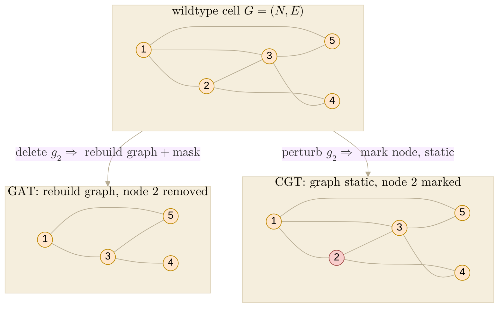

Note for **Fig 1 panel g — GAT ↔ CGT functional equivalence** (why we push the
biological graph into the *loss* as a soft prior instead of *masking* attention with it),
plus the two structural advantages of the perturbation operator that follow. Companion to
[[paper.nature-biotech.fig1.block-diagrams]] (panels d–f),
[[paper.nature-biotech.fig1.perturbation-operator]], and [[paper.information-accounting]];
the math mirrors the `Graph-regularised attention` and `Perturbation operator` subsections
of `paper/nature-biotech/sections/methods.tex`.

## 2026.07.01 - GAT ↔ CGT functional equivalence, and why static structure belongs in the loss

### The claim (panel g)

CGT's **regularised self-attention** is *functionally equivalent* to GAT's **masked
graph-attention**: both make a gene attend along the biological graph. The difference is
*where* the graph acts — GAT as a **hard mask on the attention logits** (every forward
pass), CGT as a **soft KL prior in the objective** (once). The soft form is not a weaker
version of the same idea; it is the *correct* form here, because the graph is **invariant
across perturbations**, so it belongs in the objective rather than in the forward pass. The
panel makes this concrete on a single perturbation — delete gene 2 — by contrasting the two
pipelines.

### GAT — masked graph-attention (graph at every forward pass)

Node $i$ attends only over its graph neighbours $\mathcal N(i)=\{j:A_{ij}=1\}$:
$$
\alpha^{\mathrm{GAT}}_{ij}=\operatorname*{softmax}_{j}\big(s_{ij}+M_{ij}\big),\qquad
M_{ij}=\begin{cases}0,&A_{ij}=1\\ -\infty,&A_{ij}=0,\end{cases}
$$
with any attention score $s_{ij}$ (GAT uses $s_{ij}=\mathrm{LeakyReLU}(a^\top[Wh_i\,\|\,Wh_j])$).
The adjacency $A$ is a **hard structural input**: the support of the attention is exactly
$\mathcal N(i)$. Two costs follow:

- **Preprocess.** $A$ must be turned into neighbour lists / masks before attention runs.
- **Rebuild per perturbation.** Deleting gene $j_0$ changes $A$ and every neighbourhood
  containing $j_0$, so the graph — and the mask — is **reconstructed for each of the
  ${\sim}10^{4\text{–}6}$ strains**.

### CGT — regularised self-attention (graph only in the loss)

Node $i$ attends over **all** nodes; there is no mask:
$$
\alpha^{\mathrm{CGT}}_{ij}=\operatorname*{softmax}_{j}\!\Big(\tfrac{q_i\cdot k_j}{\sqrt{d_k}}\Big),
\qquad q_i=h_iW_Q,\ \ k_j=h_jW_K .
$$
The graph enters **only** through the training objective, row-normalised into a distribution
over neighbours $\tilde A=(D)^{-1}A$ (degree matrix $D=\operatorname{diag}(A\mathbf 1)$):
$$
\min_{\theta}\ \ \mathcal L_y\;+\;\lambda\sum_{i} D_{\mathrm{KL}}\!\big(\tilde A_{i,:}\,\big\|\,\alpha^{\mathrm{CGT}}_{i,:}\big).
$$
No graph touches the forward pass, and the **perturbation is carried by the operator**
$\mathcal T_\psi$ (mark the node in embedding space) — not by editing the graph.

### Functional equivalence (the annotation math)

Strong regularisation drives the free self-attention onto exactly the graph neighbourhood.
The forward KL $D_{\mathrm{KL}}(\tilde A_{i,:}\,\|\,\cdot)$ is minimised uniquely at
$\alpha=\tilde A$, so
$$
\lambda\to\infty:\quad \alpha^{\mathrm{CGT}}_{i,:}\ \longrightarrow\ \tilde A_{i,:}
\quad\Longrightarrow\quad
\operatorname{supp}\alpha^{\mathrm{CGT}}_{i,:}=\mathcal N(i)=\operatorname{supp}\alpha^{\mathrm{GAT}}_{i,:}.
$$
So **CGT contains GAT as its $\lambda\to\infty$ limit** — the same neighbour-structured
attention. The value is at **finite $\lambda$**, where the prior is soft in a deliberately
*asymmetric* way (a consequence of the KL direction):

- **Discovery is free.** For a non-edge, $\tilde A_{ij}=0$ so its KL term is
  $0\log(0/\alpha_{ij})=0$: the prior places **no penalty on off-graph attention**. A head
  that keeps large $\alpha_{ij}$ where $A_{ij}=0$ **proposes a missing interaction** at no
  cost to the prior.
- **Overruling a listed edge is possible but paid.** For an edge, $\tilde A_{ij}>0$, so
  dropping $\alpha_{ij}\to0$ costs $+\infty$ *to the prior*; at finite $\lambda$ the
  supervised loss $\mathcal L_y$ can still pull attention off a **wrong** edge, trading
  prior cost for data fit.

A hard mask allows **neither** — it forbids off-graph mass and cannot be overruled.

### Why static structure belongs in the loss (the core argument)

The adjacency $A$ is **perturbation-invariant**: deleting a gene does not rewire the
reference network; the structural connections are stable across the entire strain library. A
constraint that is **constant across examples** is naturally an *objective term*, not a
*per-example mask*:

|                        | hard mask (GAT / edge-masking) | soft prior in loss (CGT)        |
|------------------------|--------------------------------|---------------------------------|
| where the graph acts   | every forward pass             | once, in the objective          |
| per-perturbation cost  | rebuild graph + mask           | none (operator marks the node)  |
| forward pass           | needs the graph                | graph-free                      |
| overrule a wrong edge? | no (structural)                | yes (finite $\lambda$)          |
| propose a new edge?    | no                             | yes (off-graph attention, free) |
| minimal input          | a graph                        | a genome (entity set)           |

The edge-masking framing (e.g. the Set-Transformer "masked attention block") bakes the
static graph into *every* step; because our graph never changes with the perturbation, that
is redundant work **and** it forecloses discovery. Putting the static structure in the loss
and the dynamic perturbation in the operator **separates structure from intervention** — the
conceptual core of the design.

### Precision / caveats (don't overclaim in the caption)

- The equivalence is at the level of **attention support / neighbour-structure**. GAT
  additionally learns *non-uniform* weights *within* $\mathcal N(i)$; the CGT prior's target
  $\tilde A$ is *uniform* over neighbours. At finite $\lambda$, CGT's actual
  $\alpha^{\mathrm{CGT}}$ is data-shaped within the softly-enforced neighbourhood, so neither
  is uniform in practice — but "same neighbours, learned weights" is the honest shared
  claim; "identical weights" is not.
- "Functional equivalence" is a **learned** correspondence (trained to reproduce the
  graph-structured attention / the perturbed state), not a mathematical identity.

### The two operator advantages (recap — already in methods)

1. **No per-strain graph construction** (systems / reparametrisation). Encode the wildtype
   once, $H=F_\theta(G)$ at $\mathcal O(BL)$; obtain every strain by $\mathcal T_\psi(H,p)$ —
   no perturbed graph is built or re-encoded, avoiding $\mathcal O(BL\lvert E\rvert)$. The
   operator is a learned, functionally-equivalent stand-in for re-encoding.
2. **No graph required** (representation / minimal criteria). Genes are tokens; $\{A^{(k)}\}$
   is an optional soft prior, never a message-passing substrate. Minimal input is a
   **genome** — a set of encodable entities — so a network *sharpens* the model where
   available but is not a prerequisite. This lowers the minimal data criterion and enlarges
   the usable data universe ([[paper.information-accounting]]).

Both are now stated in `sections/methods.tex` (operator subsection). The GAT↔CGT equivalence
above is the *mechanistic reason* advantage 2 is safe: dropping the graph from the forward
pass costs nothing that regularisation cannot recover.

### Panel g — how to draw it

Three cells in a row, one perturbation (delete gene 2):

- **middle:** wildtype cell graph $G=(N,E)$, all 5 nodes.
- **left ← GAT:** node 2 **removed** → operate on the 4-node subgraph. Arrow label
  *"delete gene 2 ⇒ rebuild graph."* Caption math:
  $\alpha^{\mathrm{GAT}}=\operatorname{softmax}(s+M),\ M_{ij}=-\infty$ if $A_{ij}=0$ — *graph
  = hard mask, preprocessed, rebuilt per perturbation.*
- **right → CGT:** all 5 nodes kept, node 2 **marked** (red). Arrow label *"perturb gene 2
  ⇒ mark node, graph static."* Caption math:
  $\alpha^{\mathrm{CGT}}=\operatorname{softmax}(q_ik_j^\top/\sqrt{d_k})$; graph in loss
  $\min\mathcal L_y+\lambda\sum_i D_{\mathrm{KL}}(\tilde A_{i,:}\|\alpha_{i,:})$.
- **center-bottom (payoff):**
  $\lambda\to\infty\Rightarrow\alpha^{\mathrm{CGT}}\to\tilde A\Rightarrow$ *same support as
  GAT*; finite $\lambda\Rightarrow$ *soft (overrule / discover edges); static graph ⇒ no
  rebuild, no mask.*

**Label it GAT, not "GNN".** The clean masked-softmax equivalence is specific to GAT;
"GNN" pulls in convolution / message-passing — a *different* claim — and muddies the
equivalence.

### Figure structure — bottom row = 5 model-architecture panels

Move old **g** (metabolism / iBioFoundry DBTL) to its **own figure** (application ≠ method;
it also de-densifies Fig 1). Bottom row of Fig 1 becomes:

| panel | content                                                                                                                            |
|-------|------------------------------------------------------------------------------------------------------------------------------------|
| **d** | overview — ENC → PERT → DEC pipeline                                                                                               |
| **e** | perturbation operator — mechanism + generality (gene / drug / env; the drug token enters from *outside* = advantage 2 made visual) |
| **f** | graph regularisation — **how** (KL between $\tilde A$ and the attention head; the matrices panel)                                  |
| **g** | **why** reg not mask — GAT ↔ CGT equivalence + "no rebuild" (this note)                                                            |
| **h** | cell-encoder self-attention (SAB) — the attention that f/g regularise                                                              |

Reads L→R as *encode → perturb → enforce graph (how) → why that way → the attention it acts
on*. **Fork:** give the **operator** two panels (mechanism + generality) instead of an
encoder panel at **h** — decide based on whether the operator's generality or the encoder's
attention needs more room.

### Mermaid sketch (panel g)

Structural companion only — the draw.io is the real, horizontal layout (GAT ← wildtype →
CGT) with the caption math under each cell (see *how to draw it*). Edges match the panel-f
toy cell (degrees $1{:}3,2{:}3,3{:}4,4{:}2,5{:}2$). Render:
`bash notes/assets/publish/scripts/mermaid_pdf.sh notes/paper.nature-biotech.fig1.gat-cgt-equivalence.md`.

### Related

- [[paper.nature-biotech.fig1.block-diagrams]] — panels d/e/f block sketches (mermaid).
- [[paper.nature-biotech.fig1.perturbation-operator]] — operator general case (gene / drug / env tokens).
- [[paper.information-accounting]] — entities/instances cut; minimal-criteria / data-universe argument.
- [[paper.methods]] — markdown ideation; canonical text in `paper/nature-biotech/sections/methods.tex`.
