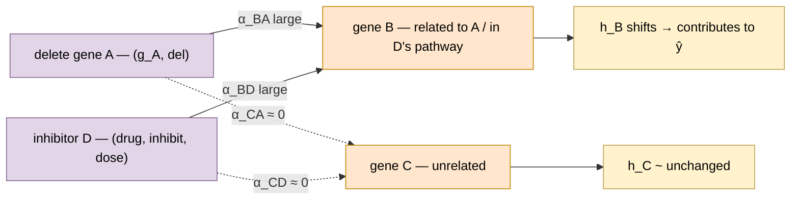
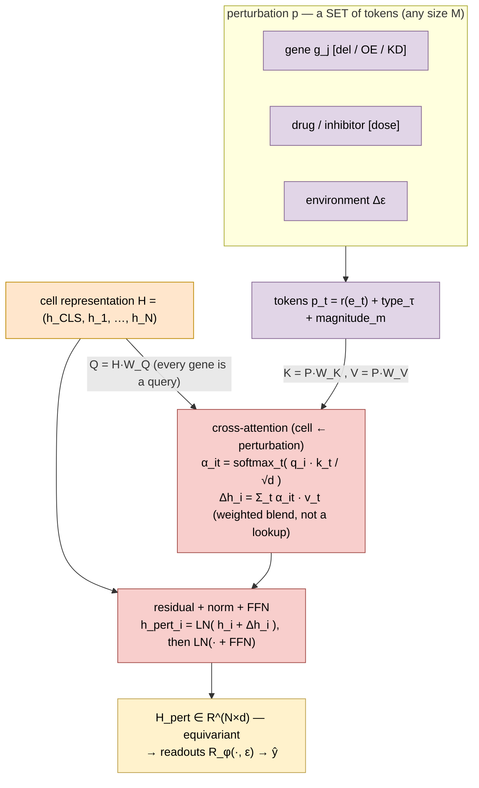
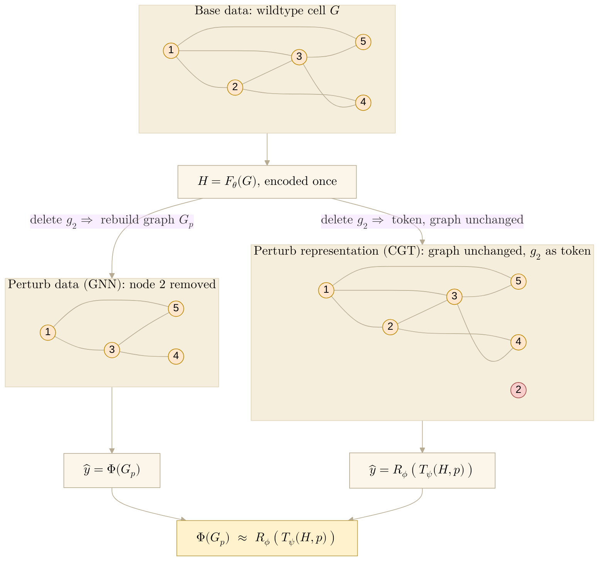

Math for **Fig 1 panel e — the perturbation operator** $\mathcal T_\psi$, written
in the **general case** (one operator for genes, drugs/inhibitors, and environment).
Notation follows the paper Methods table (`paper/nature-biotech/sections/methods.tex`,
Table `tab:notation`): perturbation set $p$, encoder $F_\theta$, operator
$\mathcal T_\psi$, decoder $\mathcal R_\phi$. (Sibling notes
[[paper.information-accounting]] and
[[torchcell.models.equivariant_cell_graph_transformer.perturbation-operator]] still write
the perturbation as $S$; **$p$ is canonical** — align new writing to it.) Map the
equations to the panel; the mermaid at the bottom is the data-flow sketch.

## 2026.06.28 - Perturbation operator (general case)

### What this captures (the point)

The phenotype is **one** function of the cell, its perturbation, and its environment:
$$
\hat y=\mathcal R_\phi\big(\mathcal T_\psi(H,\,p),\,\varepsilon\big).
$$
Because $p$ is a single set that can hold **genetic** tokens (gene del/OE/KD) *and*
**chemical / environmental** tokens (drug, inhibitor, media shift), one operator spans
the whole **genotype $\times$ environment** grid. Assays that today live apart — KO
libraries (vary genotype), drug / inhibitor screens (vary chemistry), media panels
(vary $\varepsilon$) — all become supervision for the *same* $\mathcal T_\psi$. That
sharing is the payoff: more of the scarce label budget
([[paper.information-accounting]]) is usable, because every condition trains one operator.

### Inputs

- **Cell representation** from the encoder $F_\theta$:
$$
H=(h_{\mathrm{CLS}},\,h_1,\dots,h_N)\in\mathbb R^{(N+1)\times d}.
$$
- **Perturbation** $p$ — a finite **set** of perturbation tokens (any size $M\ge1$):
$$
p=\big\{(e_t,\tau_t,m_t)\big\}_{t=1}^{M},\qquad e_t\in\mathcal U,
$$
where $e_t$ is the perturbed **entity** (a gene $g_j$, a small molecule / drug, or an
environment factor), $\tau_t$ its **type**, and $m_t$ its **magnitude / dose**.

| entity $e_t$                     | type $\tau_t$                                  | magnitude $m_t$      |
|----------------------------------|------------------------------------------------|----------------------|
| gene $g_j$                       | $\mathrm{del}$ / $\mathrm{OE}$ / $\mathrm{KD}$ | —                    |
| small molecule (drug, inhibitor) | $\mathrm{inhibit}$ / $\mathrm{activate}$       | concentration / dose |
| environment factor               | shift                                          | $\Delta\varepsilon$  |

### Perturbation tokens

Embed each $(e_t,\tau_t,m_t)$ into the cell's $d$-space:
$$
\mathbf{p}_t \;=\; r(e_t)\;+\;\mathbf t_{\tau_t}\;+\;m_t\,\mathbf w,
\qquad \mathbf{P}=(\mathbf{p}_1,\dots,\mathbf{p}_M)\in\mathbb R^{M\times d},
$$
$$
r(e_t)=
\begin{cases}
h_{j} & e_t=g_j\ \text{(in-cell gene: reuse its encoded row)}\\[2pt]
\mathrm{Embed}(e_t) & \text{external entity (drug / env): encode from }\mathcal U
\end{cases}
$$
with $\mathbf t_{\tau}$ a learned **type** embedding and $\mathbf w$ a learned
**magnitude** direction. (Genes already live in $H$; drugs/environment enter through
the shared multimodal $\mathrm{Embed}$ — same encoders as the rest of the model.)

**What $\tau$ is.** $\tau_t$ is the perturbation **type** — *how* the entity is
perturbed. It is a categorical mode that indexes a learned embedding $\mathbf t_{\tau}$
carrying the **direction / sign** of the effect, so the *same* entity under a different
type is a *different* token: $(g_A,\mathrm{del})$ (loss of function) vs
$(g_A,\mathrm{OE})$ (gain of function) share $r(g_A)$ but get opposite $\mathbf t_\tau$
and therefore opposite shifts. Types so far: genes
$\{\mathrm{del},\mathrm{OE},\mathrm{KD}\}$, drugs $\{\mathrm{inhibit},\mathrm{activate}\}$,
environment $\{\mathrm{shift}\}$ — extend the set as new perturbation modes appear.

### Operator $=$ cross-attention (cell $\leftarrow$ perturbation), $a=1,\dots,h$ heads

$$
Q^{a}=H\,W_Q^{a},\qquad K^{a}=\mathbf{P}\,W_K^{a},\qquad V^{a}=\mathbf{P}\,W_V^{a},
\qquad d_k=d/h.
$$
Queries are **all genes**; keys/values are the **perturbation context only**:
$$
\alpha^{a}_{i,t}=\operatorname*{softmax}_{t\in[M]}\!\left(\frac{q^{a}_i\!\cdot\,k^{a}_t}{\sqrt{d_k}}\right),
\qquad
\Delta h^{a}_i=\sum_{t=1}^{M}\alpha^{a}_{i,t}\,v^{a}_t .
$$
$$
\Delta h_i=\big[\,\Delta h^{1}_i\,\Vert\cdots\Vert\,\Delta h^{h}_i\,\big]\,W_O .
$$

The update $\Delta h_i=\sum_t\alpha_{i,t}v_t$ is a **soft, weighted blend** over the
whole set $p$ (with $\sum_t\alpha_{i,t}=1$) — content-based retrieval, **not** a
dictionary index. The only index is upstream: selecting which entities are in $p$.

### Residual $+$ FFN $\to$ perturbed representation

$$
\tilde h_i=\mathrm{LN}\!\big(h_i+\Delta h_i\big),
\qquad
h^{\mathrm{pert}}_i=\mathrm{LN}\!\big(\tilde h_i+\mathrm{FFN}(\tilde h_i)\big).
$$
$$
\boxed{\,H_{\mathrm{pert}}=\mathcal T_\psi(H,\,p)\in\mathbb R^{(N+1)\times d}\,},
\qquad
\psi=\{W_Q,W_K,W_V,W_O,\mathrm{FFN},\mathrm{LN},\mathbf t_\tau,\mathbf w\}.
$$
Then the readouts (environment $\varepsilon$ conditions the head):
$$
\hat y=\mathcal R_\phi\!\big(H_{\mathrm{pert}},\,\varepsilon\big).
$$

### Properties (why one operator covers the general case)

- **Set input.** $p$ is a set $\Rightarrow$ $\mathcal T_\psi$ is **permutation-invariant**
  in the perturbation tokens and accepts **any cardinality** $M$ (1 gene; 2–3 genes;
  gene $+$ drug; drug $+\Delta\varepsilon$) with **no architectural change** — adding a
  drug is adding a token, not a module.
- **Soft, not lookup.** every token contributes, weighted by relevance $\alpha_{i,t}$.
- **Gene-equivariant.** permuting genes permutes $H_{\mathrm{pert}}$ identically;
  per-gene structure is preserved $\Rightarrow$ feeds multitask $\mathcal R_\phi$.
- **Whole-cell channel.** $h^{\mathrm{pert}}_{\mathrm{CLS}}$ carries a global summary of $p$
  $\Rightarrow$ feeds the genetic-interaction head (concatenated with the perturbed-gene
  mean); the fitness head is a mean over all gene rows ([[paper.methods]] eq. fit / int).

### Cartoon example: one operator, two perturbation kinds, same propagation

Cell with genes $A,B$ **functionally related** (same complex / pathway) and $C$
unrelated.

1. **Genotype — delete $A$:** $p=\{(g_A,\mathrm{del})\}$. $B$'s query aligns with $A$'s
   key (they sit close in $H$), so $\alpha_{B,A}$ is large and
   $h^{\mathrm{pert}}_B=h_B+\alpha_{B,A}v_A$ **shifts**; $C$ aligns weakly
   ($\alpha_{C,A}\!\approx\!0$) so $h_C$ is ~unchanged. The shift in $B$ from losing $A$
   **is** a genetic interaction.
2. **Environment — add an inhibitor $D$ of $B$'s pathway:**
   $p=\{(D,\mathrm{inhibit},\text{dose})\}$ with $r(D)=\mathrm{Embed}(D)$. Now
   $\alpha_{B,D}$ is large (the drug embedding aligns with the pathway) so $h_B$ shifts;
   off-pathway $C$ barely moves.

Same operator, same softmax-weighted propagation — only the **token kind** differs
(genome vs environment). One $\mathcal T_\psi$ therefore reaches a related gene whether
the perturbation is a deletion or a drug.

### For the panel (what the math says to draw)

- **lead message:** one operator → phenotypes across **genotype $\times$ environment**
  (gene KOs *and* drugs / media share one $p$).
- use the **cartoon** above as the intuition inset (del $A$ → related $B$ strong, $C$
  weak; drug $D$ → related $B$).
- queries = the full gene row (all $N$); keys/values = the **small** set $p$ — show the
  asymmetry (many queries $\leftarrow$ few perturbation tokens).
- the perturbation set holds **gene + drug + environment** tokens (general case).
- the $\sum_t\alpha_{i,t}v_t$ step = several **weighted** arrows summing into $h_i$ (a
  blend), never one "fetch" arrow.
- output stays per-gene (equivariant) and flows to $\mathcal R_\phi$.

### Data-flow (mermaid)

## 2026.07.01 - Panel e: perturb the *representation*, not the *data* (the $F(\cdot)\approx F(\cdot)$ claim)

**Notation (this section).** Paper Methods table: cell graph $G$, perturbation set
$p=\{(e_t,\tau_t,m_t)\}_{t=1}^M$, environment $\varepsilon$, encoder $H=F_\theta(G)$,
operator $H_{\mathrm{pert}}=\mathcal T_\psi(H,p)$, decoder
$\hat y=\mathcal R_\phi(H_{\mathrm{pert}},\varepsilon)$. Two symbols are **new here**
(the paper names them only in prose): the **perturbed graph** $G_p$ and the
deterministic **rebuild map** $\rho:(G,p)\mapsto G_p$ that materializes it. $\Phi,\Psi$
denote arbitrary (measurable) target maps.

**What panel e says.** Do **not** perturb the underlying data structure — rebuild the
graph as $G_p$ and re-encode, the GNN way. Keep the base graph fixed and **learn the
effect** of $p$ in representation space. Panel e's $F()\approx F()$ is the formal
promise that this costs nothing in expressivity, and buys three things: cheaper
training, epistemic humility about the graph, and the scarce-label budget of
[[paper.information-accounting]]. It is the proved, general-case form of the "Core
Reparametrization" the notes so far only **assert**
([[torchcell.models.equivariant_cell_graph_transformer]] L19-35;
[[torchcell.models.equivariant_cell_graph_transformer.perturbation-operator]] L21), and
it mirrors the learned-equivalence template in
[[paper.nature-biotech.fig1.gat-cgt-equivalence]].

### Two ways to predict a phenotype under a perturbation $p$

- **Perturb the data (GNN).** Materialize $G_p=\rho(G,p)$ (delete/rewire vertices and
  edges), then encode: $\hat y=\Phi(G_p)$. The graph is a **hard constraint** — message
  passing *is* the adjacency — and $\rho$ runs per sample.
- **Perturb the representation (CGT).** Encode once, then operate:
  $\hat y=\mathcal R_\phi\big(\mathcal T_\psi(F_\theta(G),p),\varepsilon\big)$. The graph
  is a **soft suggestion** — it enters only through $F_\theta$; $F_\theta$ runs once and
  $H$ is reused across all $p$.

### Proposition

Let $\mathcal H_{\text{data}}=\{\Phi\circ\rho\}$ be the maps expressible by perturbing
the data, and $\mathcal H_{\text{rep}}=\{\Psi:\mathcal G\times\mathcal P\to\mathcal Y\}$
those expressible as a function of $(G,p)$ directly (the amortized/CGT family). Then
$$\mathcal H_{\text{data}}\subseteq\mathcal H_{\text{rep}},$$
with **equality iff $\rho$ is injective on $\operatorname{supp}D$**. So the two learning
problems target the same function class; the amortized form never loses and is strictly
larger whenever the rebuild destroys information.

**Proof.**

- *Sufficiency (exact).* $\rho$ is deterministic, so $(G,p)$ fixes $G_p$. For any target
  $\Phi^\star$, $\Phi^\star(G_p)=(\Phi^\star\circ\rho)(G,p)=:\Psi^\star(G,p)$ — an
  **equality**, giving $\mathcal H_{\text{data}}\subseteq\mathcal H_{\text{rep}}$.
- *Strictness.* The converse needs $\sigma(G_p)=\sigma(G,p)$. Rebuilding is
  information-destroying: $p$ is generally not recoverable from $G_p$, so
  $\sigma(G_p)\subsetneq\sigma(G,p)$ when $\rho$ is non-injective, and some
  $\Psi\in\mathcal H_{\text{rep}}\setminus\mathcal H_{\text{data}}$ exists. $\;\square$

### Toy example (concrete, both directions)

Three genes; base graph $G$ = the path $A\!-\!B\!-\!C$ (two edges).

- *Sufficiency.* Delete $B$: $p=\{(g_B,\mathrm{del})\}$, and $\rho$ drops $B$ with its
  edges, so $G_p=\{A,\,C\}$ (both isolated). The perturbed-graph target
  $\Phi(G_p)=\#\text{edges}=0$ is reproduced **without any rebuild** by
  $\Psi(G,p)=\#\text{edges}(G)-\#\{\text{edges incident to }B\}=2-2=0$. Function of
  (base, perturbation) $=$ function of the rebuilt graph.
- *Strictness.* Overexpress $B$ at two doses: $p_1=\{(g_B,\mathrm{OE},1)\}$ vs
  $p_2=\{(g_B,\mathrm{OE},3)\}$. Neither changes topology, so
  $\rho(G,p_1)=\rho(G,p_2)=G$ — **identical rebuilt graphs**. Hence any $\Phi(G_p)$
  returns one value for both, yet dose-response phenotypes differ. $(G,p)$ still carries
  $m\in\{1,3\}$, so it separates them: continuous dose (and, likewise, the type $\tau$)
  lives in $p$, not in a bare rebuilt topology. This is
  $\mathcal H_{\text{rep}}\setminus\mathcal H_{\text{data}}$ made concrete — the same
  type/magnitude limitation flagged in
  [[torchcell.models.equivariant_cell_graph_transformer.perturbation-operator]].

### Corollary — where the figure's $\approx$ comes from

The ideal amortizer is $\Psi^\star=\Phi^\star\circ\rho$. CGT realizes it not by that
literal composition but by the learned $\mathcal R_\phi\circ\mathcal T_\psi$ acting on
$H=F_\theta(G)$. Two conditions make the realization approximate the ideal to any
accuracy:

1. **Lossless encoder.** $F_\theta$ is injective (bi-Lipschitz) on
   $\operatorname{supp}D$, so $(H,p)$ carries the same information as $(G,p)$. For a
   fixed gene set this is free — $H$ keeps one identifiable row per gene.
2. **Universal amortizer.** Cross-attention over the perturbation set followed by an MLP
   readout is a universal approximator of permutation-equivariant / -invariant
   set-conditioned maps on a compact domain, so for any $\epsilon>0$ there exist
   $\psi,\phi$ with
   $$\sup_{(G,p)}\big\|\,\mathcal R_\phi\big(\mathcal T_\psi(F_\theta(G),p),\varepsilon\big)-\Psi^\star(G,p)\,\big\|<\epsilon.$$

Combining with sufficiency,
$$\boxed{\;\mathcal R_\phi\big(\mathcal T_\psi(F_\theta(G),p),\varepsilon\big)\;\approx\;\Phi\big(\rho(G,p)\big)=\Phi(G_p)\;}$$
which is exactly panel e: $F(G_p)\approx\mathcal T_\psi\!\big(F(G),p\big)$.

**Precision.** Keep the two claims separate, as
[[paper.nature-biotech.fig1.gat-cgt-equivalence]] does for GAT↔CGT: the reparameterization is
**exact** (a set-theoretic identity, since $\rho$ is deterministic); the trained
$F(G_p)\approx\mathcal T_\psi(F(G),p)$ is a **learned correspondence, not a mathematical
identity** — good only to the extent $F_\theta$ is lossless and
$\mathcal T_\psi,\mathcal R_\phi$ can fit $\Phi^\star\circ\rho$. Do not write the
$\approx$ as $=$.

**Citation.** The reparameterization needs no citation (deterministic composition); only
the amortizer's realizability does — **Zaheer et al., *Deep Sets*, NeurIPS 2017** (universality
of permutation-invariant functions) and **Yun et al., ICLR 2020** (attention is a universal
approximator of permutation-equivariant seq→seq maps). The "condition on the modification
instead of re-fitting on modified data" pattern is amortization / **HyperNetworks (Ha et
al., ICLR 2017)**.

### Why prefer the amortized side (equivalence alone doesn't say which to pick)

Expressivity is equal; these three say why CGT is the one to train (SI content).

1. **Cost.** The GNN path pays $\rho$ (rebuild the multi-graph) **and** a fresh
   $F_\theta$ pass per sample: over $B$ strains and $L$ layers, $\mathcal O(B\,L\,|E|)$
   plus materialized storage for each of $\sim\!10^6$ instances. The amortized path runs
   $F_\theta$ **once** on the shared $G$ and reuses $H$: $\mathcal O(B\,L)$, per-sample
   cost collapsing to the thin operator $\mathcal T_\psi$ ($|p|\!\times\!N$ attention,
   $\sim\!5\times10^4$ params). Matches the Methods (`methods.tex` L201-203,
   $\mathcal O(BL|E|)\!\to\!\mathcal O(BL)$; the pipeline never builds a perturbed
   graph). Rebuilding large graphs is a real training bottleneck.
2. **Epistemic humility.** In the GNN path a wrong edge is a wrong *computation* (the
   adjacency is baked into message passing), and $A_{ij}=0$ is committed to as "no
   interaction" when it usually means *not yet tested*. In the amortized path $G$ enters
   only through $F_\theta$ and, via the KL graph prior ([[paper.methods]] L248-257), as a
   *soft* attention bias the data can overrule — a persistent off-graph $\alpha_{ij}$
   even flags a candidate missing edge. Discovery is free, overruling a listed edge is
   possible; a hard mask allows neither
   ([[paper.nature-biotech.fig1.gat-cgt-equivalence]]). We admit the graphs could be wrong.
3. **Label budget.** Rebuilding graphs adds **zero** supervision; it only spends compute
   on the things-side. The amortized cut keeps the scarce phenotype labels
   ($B\sim10^6$–$10^7$ bits) on the thin operator $+$ readout — the
   $\mathcal U\,\vert\,\mathcal I$ cut at $H$ ([[paper.information-accounting]],
   $C_{\text{fit}}=|\psi|+|\phi|\ll B$).

### Panel e mermaid (perturb-data vs perturb-representation + the equivalence)

Structural companion (draw.io is the real horizontal layout). Reuses the shared 5-node
toy cell of [[paper.nature-biotech.fig1.gat-cgt-equivalence]] so panels e/f/g match. Gene
deletion only here — drugs/environment ($\varepsilon$) are the general case above, left
out to keep the panel clean. **Left path is GNN, not GAT** (panel e's claim is
perturb-data-vs-representation, general to any GNN; the GAT attention-support equivalence
is panel g). Render:
`bash notes/assets/publish/scripts/mermaid_pdf.sh notes/paper.nature-biotech.fig1.perturbation-operator.md`.

### Related

- [[paper.nature-biotech.fig1.block-diagrams]] — panels d/e/f block sketches (mermaid).
- [[paper.nature-biotech.fig1.gat-cgt-equivalence]] — panel g GAT ↔ CGT equivalence + operator advantages.
- [[paper.information-accounting]] — entities/instances cut; minimal-criteria / data-universe argument.
- [[paper.methods]] — markdown ideation; canonical text in `paper/nature-biotech/sections/methods.tex`.
