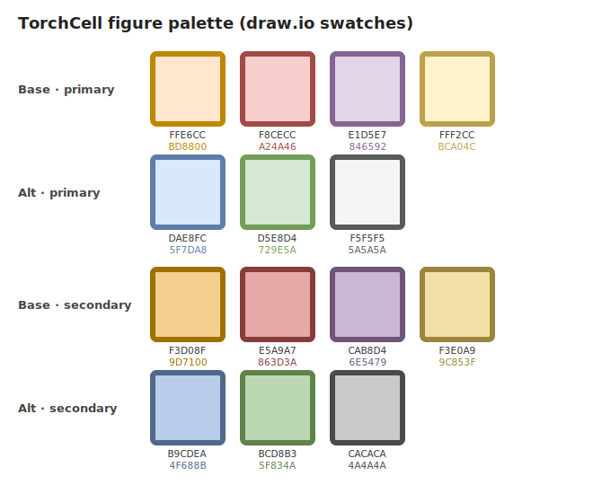
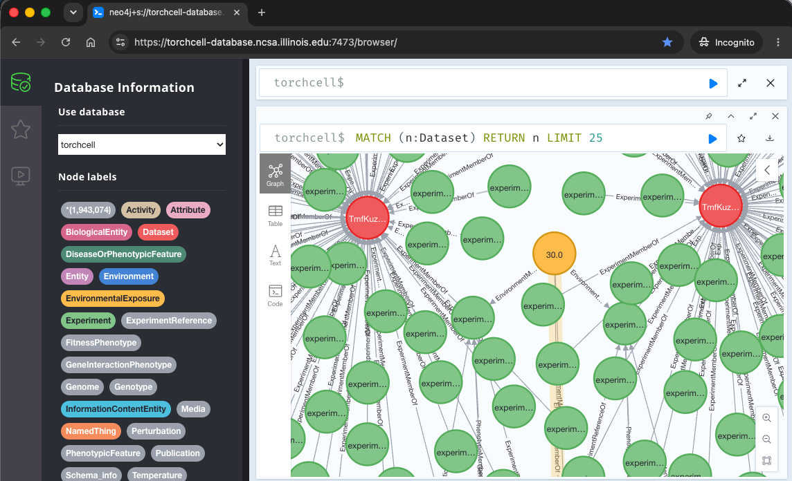
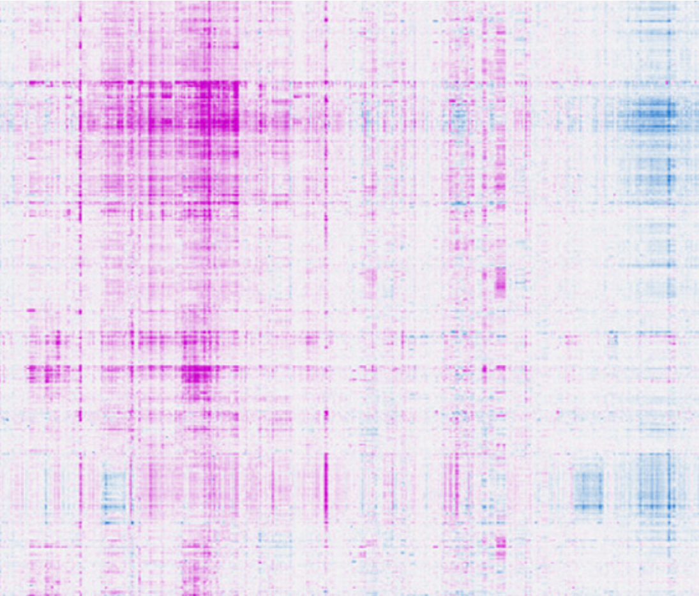
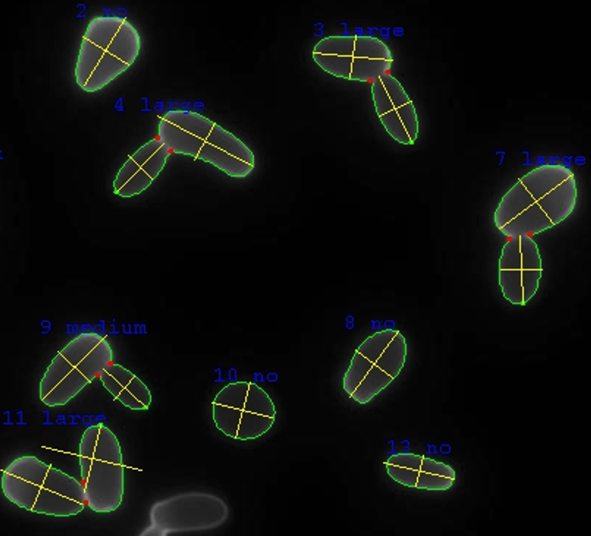
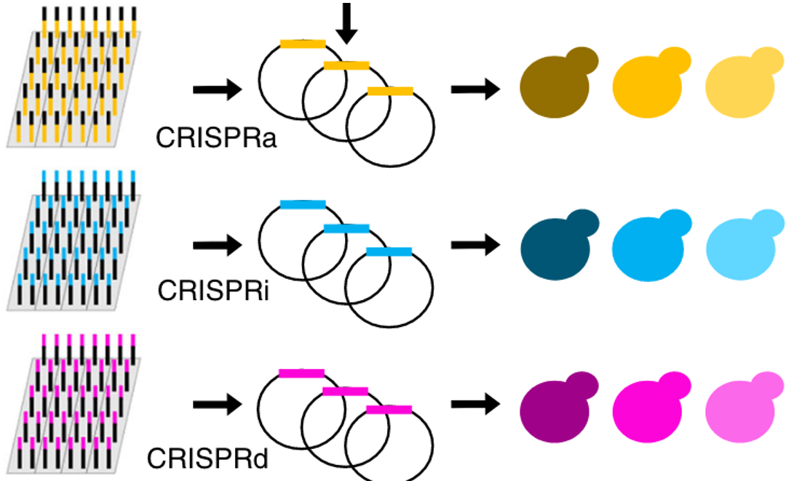
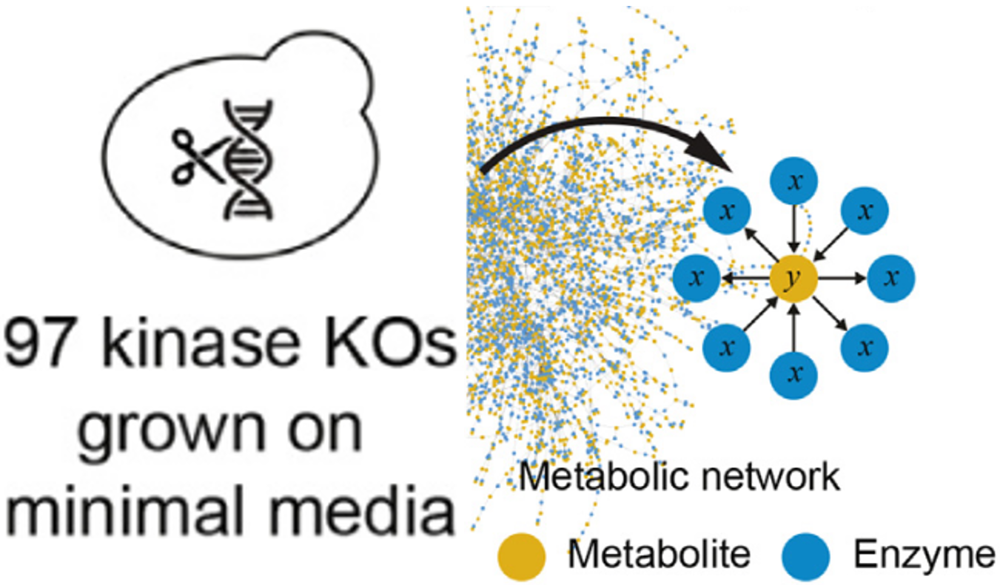
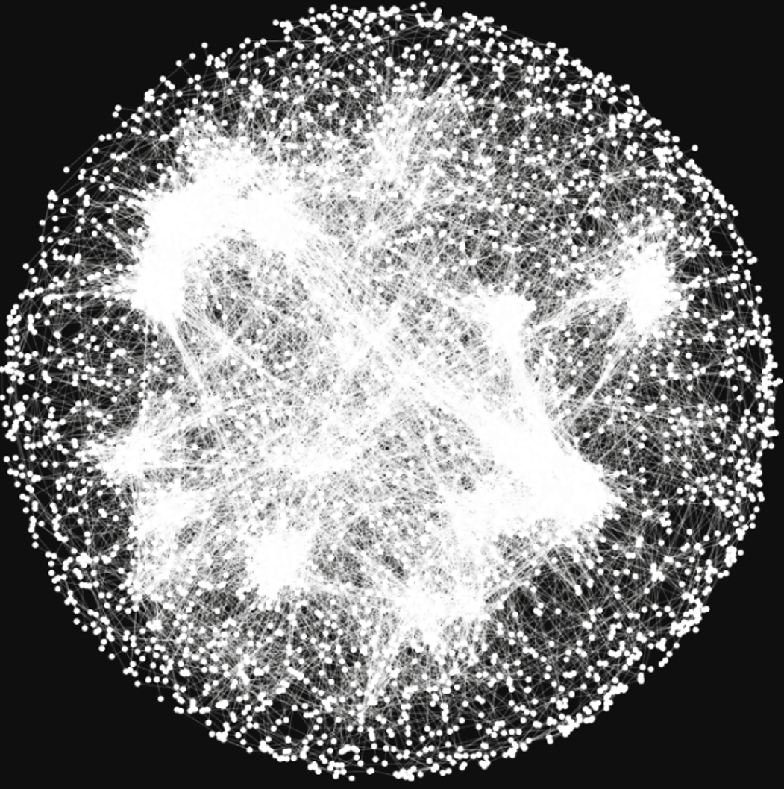

## 2026.06.18 - Paper figure workflow + asset catalog

Catalog and workflow for the Nature Biotechnology manuscript figures (`paper/nature-biotech/`).
Paper editing is now done **locally on the M1 Mac**; experiments run on gilahyper. This note
documents how figures are produced and links every figure asset so the work can continue on M1.
Related: [[paper.overleaf-workflow]].

### Workflow

draw.io source (`notes/assets/drawio/NAME.drawio.png`) -> `make fig` exports
`paper/nature-biotech/figures/NAME.pdf` -> `checkfigs` verifies it fits the print box and is
unscaled -> `\tcfig{figures/NAME.pdf}` places it true-size -> `make paper` builds the three views
(gated on `checkfigs`) -> `make paper-sync` publishes the curated set to Overleaf.

Commands (from repo root):

- `make paper-fig` -- force re-export every figure referenced in the `.tex` + size/scale check.
- `make paper` -- build submission/editing/twocolumn (refuses to build if any figure is out of spec).
- `make paper-sync` / `make paper-pull` -- push to / merge from Overleaf.

Nature constraints: figure width <=180 mm (column 88 mm), height <=170 mm; in-figure text 5-7 pt;
panel labels **8 pt bold lowercase Arial**. Figures are placed **true-size** (no scaling) via `\tcfig`,
so the size/font drawn in draw.io is what prints. The gate is [[paper.nature-biotech.check-figures]].

### Continuing on M1

- Edit `.drawio.png` sources with the VSCode draw.io extension (or draw.io desktop on Mac).
- Tooling: draw.io (set `DRAWIO` to the desktop/AppImage binary), Tectonic, poppler (`pdfinfo`),
  and `mermaid-cli` (`mmdc`) for the CGT mermaid diagrams.
- After editing a source: `make paper-fig` (re-export + check) then `make paper-sync`.

### Color palette

[[torchcell.models.equivariant_cell_graph_transformer.mermaid.colors]] -- the draw.io-aligned palette
(base primary/secondary + alternates). Swatch: 
Source: `notes/assets/drawio/color-palette.drawio`.

### Main-text figures (`paper/nature-biotech/figures/`)

- **Fig 1** -- TorchCell overview (database + software). Source: `notes/assets/drawio/Fig1-torchcell-overview.drawio.png` (panels a-f, assembled from the source images below).
- **Fig 2** -- Trigenic gene-gene interactions (placeholder).
- **Fig 3** -- Expression, morphology, fitness (placeholder).
- **Fig 4** -- Natural variation vs DL design (placeholder; panels to confirm from handwritten plan).
- **Fig 5** -- Metabolism (placeholder; panels to confirm from handwritten plan).

### Fig 1 panel source images (`notes/assets/images/`)








### draw.io sources (`notes/assets/drawio/`)

- `Fig1-torchcell-overview.drawio.png` -- Fig 1 (assembled overview).
- `src.drawio.png` -- master multi-panel source (reference/experiment data, nested-set cell representation).
- `color-palette.drawio` -- palette swatch (draw.io form).
- `figure-limits.drawio` -- Nature print-box reference card (exports `figure-limits.pdf`, shared to Overleaf).
- `nature-figure-templates.drawio` -- figure size/boundary templates.
- SI figure sources: `TorchCell-Supervised-Learning-and-Teacher-Forcing-Generic-Phenotypes.drawio.png`,
  `fungal_up_down_transformer_upstream_1003bp_pad_for_undersized.drawio.png`,
  `neo4j_cell-conversion-deduplication-aggregation.drawio.png`,
  `ontology_pydantic_hourglass_data_model.drawio.png`,
  `s288c_selecting_gene_sequence.drawio.png`,
  `uncharacterized-genes-profile-enricment.drawio.png`.

### CGT mermaid diagrams

- [[torchcell.models.equivariant_cell_graph_transformer.mermaid]] -- source diagrams.
- [[torchcell.models.equivariant_cell_graph_transformer.mermaid.type-i-ii]] -- recolored Type I/II diagram; vector PDF export `notes/assets/pdf-output/torchcell.models.equivariant_cell_graph_transformer.mermaid.type-i-ii.pdf` (drop this PDF into the Fig 1 panel C draw.io). Older name `equivariant-cell-graph-transformer-type-i-ii.pdf` is superseded.

## 2026.06.21 - Standalone mermaid -> PDF pipeline (matched naming)

Reusable pipeline for turning a standalone mermaid diagram into a vector PDF for
placement in a draw.io figure. Use this whenever a `.md` holds a mermaid block we
want as a figure asset.

**Script:** `notes/assets/publish/scripts/mermaid_pdf.sh`

```bash
bash notes/assets/publish/scripts/mermaid_pdf.sh <path/to/file.md> [bg]
# default bg = transparent
```

**What it does / conventions:**

- Renders with the **global `mmdc`** (`@mermaid-js/mermaid-cli` v11+), *not* the
  pandoc `mermaid-filter` path. mermaid v11 ships **KaTeX**, so `$$...$$` math in
  node / cluster / edge labels typesets correctly (mmdc -> headless Chromium ->
  print-to-PDF = true vector, crisp/selectable math). `--pdfFit` fits the page to
  the diagram (no whitespace margin).
- **Output name matches the md file** (Dendron fname), in `notes/assets/pdf-output/`.
  e.g. `notes/foo.bar.md` -> `notes/assets/pdf-output/foo.bar.{pdf,svg,png}`. mmdc
  names single-diagram output `<base>-1.pdf`; the script renames it to `<base>.pdf`.
  Multi-diagram files keep the numeric `-N` suffixes (no SVG/PNG sidecar).
- Emits three artifacts: `.pdf` (fitted vector), `.svg` (outlined vector for
  draw.io), `.png` (high-DPI raster fallback).

**Putting the diagram into a draw.io figure (IMPORTANT):** do **NOT** use draw.io
"Import PDF" -- it parses the PDF content stream into scattered editable text boxes
(every glyph becomes its own text run), which is why importing "just imports text".
Instead **embed the `.svg` as an image**: in draw.io drag the `.svg` in (or
Extras/Edit > ... Insert) and choose **embed as image**, not import/convert to
shapes. The SVG is outlined by `pdftocairo` (glyphs are paths, zero `<text>`), so
it stays vector, needs no fonts, and exports cleanly to the final Nature vector
PDF. If an SVG embed misbehaves, fall back to the `.png`.

**Label authoring rule (so math renders cleanly):** make the *entire* label one
KaTeX block -- do **not** mix plain text and `$$...$$` on one line (mermaid eats
the space at the HTML/KaTeX seam). Use `\text{...}` for words and `\` for explicit
gaps.

**Multi-line labels with math -- use TRIPLE backslash `\\\`:** mermaid pre-parses
the label and collapses `\\` -> `\` before handing it to KaTeX, so a normal
`\begin{gathered}...\\...\end{gathered}` renders on ONE line (mermaid warns "`\\`
does nothing in display mode"). Writing the row separator as **`\\\`** (three
backslashes) makes mermaid pass `\\` to KaTeX, which then breaks the line. So:
`$$\begin{gathered}\text{Line 1}\\\ \text{Line 2}\end{gathered}$$`. This is a known
mermaid bug (mermaid-js/mermaid #7194, #5941; discussion #5885) -- the `\\\`
workaround lets us keep crisp KaTeX *and* wrap boxes (controls figure width).
`<br>` only breaks between pure-text segments; it is dropped next to `$$...$$`.
See [[torchcell.models.equivariant_cell_graph_transformer.mermaid.type-i-ii]] for a
fully-converted example (every box wraps via `\\\`).

**Why not `mermaid-filter`/pandoc here:** the bundled (older) puppeteer in
`mermaid-filter` currently times out launching Chromium (30s), so the standalone
`mmdc` route is the reliable one for figure assets.

## 2026.07.15 - Figure-building reference assets (START HERE)

The single go-to reference when composing ANY manuscript figure. Refer to this note by
name: **[[paper.nature-biotech.figures]]**.

**Sizing template -- compose panels at true Nature scale.**
`notes/assets/drawio/figure-sizing-template.drawio.svg` -- draw.io canvas with the Nature
print-size boxes (full **180 mm** / column **88 mm**, height **<=170 mm**) and the standard
panel-width guides. Open with the VSCode draw.io extension (or draw.io desktop); drop
exported panels onto it to check fit before export. Committed `124ec416` (2026.07.15) so it
syncs to gilahyper via `git pull origin paper/figures-fig1`.

**Color palette -- one ordered source of truth (green-free).**

- Swatch: `notes/assets/images/color-palette.svg` (generated by
  `notes/assets/scripts/generate_color_palette.py`).
- Code: `torchcell.utils.PLOT_PALETTE` / `PLOT_PALETTE_FILL` -- 18 ordered colors, hue order
  orange-red-purple-yellow-blue-gray repeated x3; a series of N takes the FIRST N (so vivid
  primaries are spent before blue/gray). draw.io Fig 1 object colors = slots 1-6 (line,fill).

**Panel widths + true-size export (do not eyeball).**

- `torchcell.utils.PANEL_WIDTHS_MM` = {full 179, wide 118.9, half_plus 88.5, half 88,
  third 57.8, sixth 28.3} mm; `MAX_HEIGHT_MM` = 170. `mm_to_in()` for `figsize`;
  `savefig_true_size_svg(fig, path)` rescales matplotlib's 72-dpi pts to draw.io's 100
  units/inch so the SVG imports at true mm.
- Full repo plotting rules: **CLAUDE.md "Figure & Plotting Standards (repo-wide)"**
  (palette use, black patterns, tenth gridlines, boxed spines, Arial 6 pt, `svg.fonttype`).

**Representation display names (plot labels only).**
`torchcell.utils.display_label` / `REPRESENTATION_DISPLAY_NAMES` -- code keeps internal names;
plots relabel, e.g. `fudt_upstream/downstream` -> `species_lm_five_prime/three_prime`
(the Gagneur-lab SpeciesLM).
