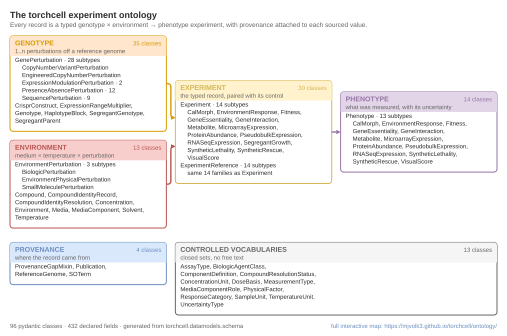

## 2026.07.19 - Schema/ontology diagram from the live pydantic models

A visualization of the entire torchcell schema/ontology — the typed
`genotype × environment → phenotype` experiment record — introspected directly from
the pydantic models so it can never drift from the code.

### What it is

The schema has a real shape: an **hourglass** whose waist is
`Experiment = (Genotype × Environment) → Phenotype`. On the wide left sit the deep
perturbation trees (what was changed in the cell); on the wide right sit the phenotype
trees (what was measured); underneath sit the provenance objects and the controlled
vocabularies. The layout is domain-aware (one titled, colored lane per domain) rather
than a generic graphviz hairball, so the hourglass is the first thing you see.

Colors come straight from `torchcell.utils.PLOT_PALETTE`: the six domains take the six
primary palette slots (genotype = amber, environment = brick, phenotype = lilac,
experiment = wheat, provenance = steel blue, vocabularies = gray). Green-free, warm
primaries first, exactly as the repo figure standard requires.

### Generating script

`paper/nature-biotech/scripts/generate_ontology_diagram.py`
([[paper.nature-biotech.scripts.generate_ontology_diagram]]) — run from the repo root:

```bash
python paper/nature-biotech/scripts/generate_ontology_diagram.py
```

Two reusable modules back it (so the graph and the renderer are testable on their own):

- `torchcell/paper/ontology_graph.py` — `build_ontology_graph()` reads the live models
  in `torchcell.datamodels.{schema,media,pydant}` and returns a typed `OntologyGraph`
  (pydantic) of classes, inheritance parents, own vs inherited fields, enum members,
  and composition edges. Wide discriminated unions (e.g. `Genotype.perturbations`, a
  union of 19 perturbation classes) collapse to `list[one of 19]` for width but are
  still drawn as composition edges, so nothing is lost.
- `torchcell/paper/ontology_svg.py` — lays the graph out into lanes (`build_layout`) and
  serialises three renders.

### Outputs (`$ASSET_IMAGES_DIR/schema-ontology/`)

| File | What it is | Use |
| --- | --- | --- |
| `torchcell-ontology-schematic.svg` | Legible 6-domain structural panel, all type ≥ 6 pt, 179 × ~95 mm | **the paper figure** |
| `torchcell-ontology-overview.svg` | Every class as a name-only box, hourglass topology, 179 × 74 mm (fits the 170 mm ceiling) | compact figure / SI |
| `torchcell-ontology.svg` | The full map — every field on every class, ~3850 × 3050 units | SI / link source; too tall to print as one page |
| `torchcell-ontology-explorer.html` | Self-contained pan / zoom / search / lane-filter explorer wrapping the full SVG | **the "leave a link to" artifact** |

Why three SVGs: 95 classes across 179 mm forces class labels to ~1.2 pt (5× under
Nature's 6 pt floor), so the full map cannot itself be a printed figure. The schematic
is the legible print panel; the full map is the zoomable link; the overview bridges them.

### The explorer (infinite-scroll reading)

`torchcell-ontology-explorer.html` is one self-contained file (inline SVG + CSS + JS, no
external requests). It gives the "very zoomed out, then explore" behaviour asked for:

- **Level of detail** — zoomed out you see the six domain blocks and the hourglass;
  zoom past a threshold and every class's field rows fade in.
- **Lane rail** — the legend doubles as a filter; click a domain to isolate it.
- **Search** — matches class names, field names, types, and enum values; Enter jumps to
  the first hit.
- **Detail drawer** — click any class for a catalog card: docstring, `inherits from`,
  `specialised by`, declared + inherited field counts, and `holds` (composition) chips
  that navigate the graph.
- Deep-linkable via `#ClassName`; warm-paper light theme + warm-dark theme.

`EXPLORE_URL` in the script (currently `https://torchcell.org/ontology`) is printed on
the figures as the pointer to the interactive map — update it once the explorer is
published at its final home.

### Regeneration guarantee

Because the graph is introspected at runtime, adding, renaming, or re-parenting a schema
class shows up in all four artifacts on the next run — no hand-editing. The counts on the
figure (e.g. "13 typed experiment/reference pairs") are computed from the graph, not
typed in.



## 2026.07.30 - Corrections: the panel was hand-authored, and the URL was fictional

Regenerating against `main` (199 commits on from the 07.19 snapshot) exposed three real
defects in the 07.19 version. All are fixed here; the 07.19 section above is left in
place for history but its "Regeneration guarantee" claim was **only ever true of the full
map, the overview, and the explorer** -- not of the printed schematic.

### 1. The schematic's body text was typed by hand

`render_schematic_svg` carried a literal list of exemplar lines under a comment claiming
*"Exemplars are read off the graph so a renamed or newly added class cannot leave a stale
label behind."* Exactly one line was computed (the experiment/reference pair count);
roughly thirty were string literals. It had already drifted:

- **PROVENANCE** printed `SourcedValue`, which lives in `torchcell.verification.sourced`
  and is not introspected at all, and omitted `ProvenanceGapMixin`, which is -- while the
  block header printed a *computed* "4 classes" beside the stale list of four.
- **ENVIRONMENT** header said 11 classes over 4 typed lines; **CONTROLLED VOCABULARIES**
  said 11 over 6 named, silently dropping `AssayType`, `BiologicAgentClass`,
  `MeasurementType`, `TemperatureUnit`.

Every body line is now derived by `_lane_body_lines()`: lane roots, lane-scoped subtype
counts, and, where a family shares its parent's name as a suffix (`FitnessPhenotype`,
`CalMorphPhenotype`, ...), the stripped names comma-wrapped so all thirteen fit. When the
lines exceed the block budget the panel says how many it dropped. The only editorial
strings left on the figure are `LANE_HEADINGS` and `LANE_SUBTITLES`.

Guarded by `tests/torchcell/paper/test_ontology_graph.py`
([[tests.torchcell.paper.test_ontology_graph]]): every CamelCase token printed on the
panel must resolve to a class in the live graph, and every "N subtypes" count must equal
the real lane-scoped subtree. The test was checked against the old `SourcedValue` string
to confirm it is not vacuous.

### 2. `EXPLORE_URL` pointed at a domain that does not exist

`https://torchcell.org/ontology` was a placeholder printed on the figure as though live.
`torchcell.org` has **no DNS record**. The explorer is now published by the docs workflow
to GitHub Pages, which the repo already runs, and `EXPLORE_URL` is the real address:

**`https://mjvolk3.github.io/torchcell/ontology/`**

Wiring: `docs/source/conf.py` gains `html_extra_path = ["_extra"]` (Sphinx copies that
tree verbatim into the site root), and `.github/workflows/docs.yaml` renders the explorer
into `docs/source/_extra/ontology/index.html` immediately before `sphinx-build`. The page
is **generated in CI, never committed** (`docs/source/_extra/.gitignore`) so the published
map cannot lag `torchcell.datamodels` -- a snapshot would reintroduce exactly the drift
described above. A generator failure deliberately breaks the docs build.

Note `peaceiris/actions-gh-pages` replaces the `gh-pages` branch on each deploy, so a
file hand-committed to that branch would be wiped by the next merge to `main`. Publishing
*must* go through the Sphinx build.

### 3. The backbone arrows were painted over

The three hourglass arrows were appended to `parts` **before** the block rectangles,
which are opaque white. With `col_w`-wide columns separated by a 9-unit gutter and
vertical offsets of 50-90 units, a bezier with control points at the horizontal midpoint
became a near-vertical squiggle, and the blocks then covered all but the sliver inside
the gutter -- which is why the arrows read as misplaced hooks. They are now orthogonal
elbows routed down the middle of the gutter (horizontal out, vertical run, horizontal in,
3-unit rounded corners) and drawn *after* the blocks. Arrival is horizontal by
construction, which is what makes the fixed right-pointing arrowhead correct.

Related: child rows are indented by shifting the text `x`, not by prefixing spaces --
SVG renderers collapse leading whitespace in a text node (rsvg drops it, and U+00A0 is
honoured inconsistently), which flattened the parent/child structure.

### 4. Two smaller fixes

- `torchcell.datamodels.compound_identity` is now introspected (+2 models, +1 enum);
  the map is 90 models + 12 enums, 404 declared fields.
- `_lane_for()` **raises** instead of falling through to `return "provenance"`. The
  catch-all would file any new top-level class under Provenance and the figure would look
  correct while quietly misplacing it.

### Current artifacts

| File | Size |
| --- | --- |
| `torchcell-ontology-schematic.svg` | 179 × 113.2 mm, all type ≥ 6 pt |
| `torchcell-ontology-overview.svg` | 179 × 78.0 mm (under the 170 mm ceiling) |
| `torchcell-ontology.svg` | 4458 × 3113 units |
| `torchcell-ontology-explorer.html` | 277 kB, self-contained |


## 2026.08.25 - CI now fails when the committed SVGs go stale

The 07.30 work left an asymmetry that was backwards from what matters most. The
**explorer** is regenerated on every docs build, so it can never lag the schema. The
three **SVGs** under `notes/assets/images/schema-ontology/` are committed repo files,
and nothing regenerated them, so they drifted silently as `torchcell.datamodels`
changed. One of them, `torchcell-ontology-schematic.svg`, is the paper figure.

CI cannot close this by regenerating and committing back, but it can refuse to stay
quiet. `.github/workflows/docs.yaml` gains a step that renders the full set into
`$RUNNER_TEMP` and byte-compares all three against what is committed. On a mismatch it
emits a `::error file=` annotation naming the stale file and the command that fixes it,
and fails the build. It runs on pull requests as well as pushes to `main`, so drift is
caught before a merge rather than after.

A byte comparison is only defensible because the render is deterministic. These SVGs are
built by plain string concatenation: no matplotlib, and no font measurement (label widths
come from a fixed character-ratio in `_text_w`), so the only inputs are the schema and
the palette constants. Verified before wiring it up: two consecutive renders are
byte-identical, and a fresh render matched all three committed files. The failure path
was verified too, by perturbing a copy and confirming the step exits 1 and names the
right file.

What this does NOT do: it will not tell you the figure is ugly, only that it no longer
matches the schema. Regenerating is still `python
paper/nature-biotech/scripts/generate_ontology_diagram.py` by hand, and the panel still
needs a human to look at it when the schema grows enough to change the layout.
