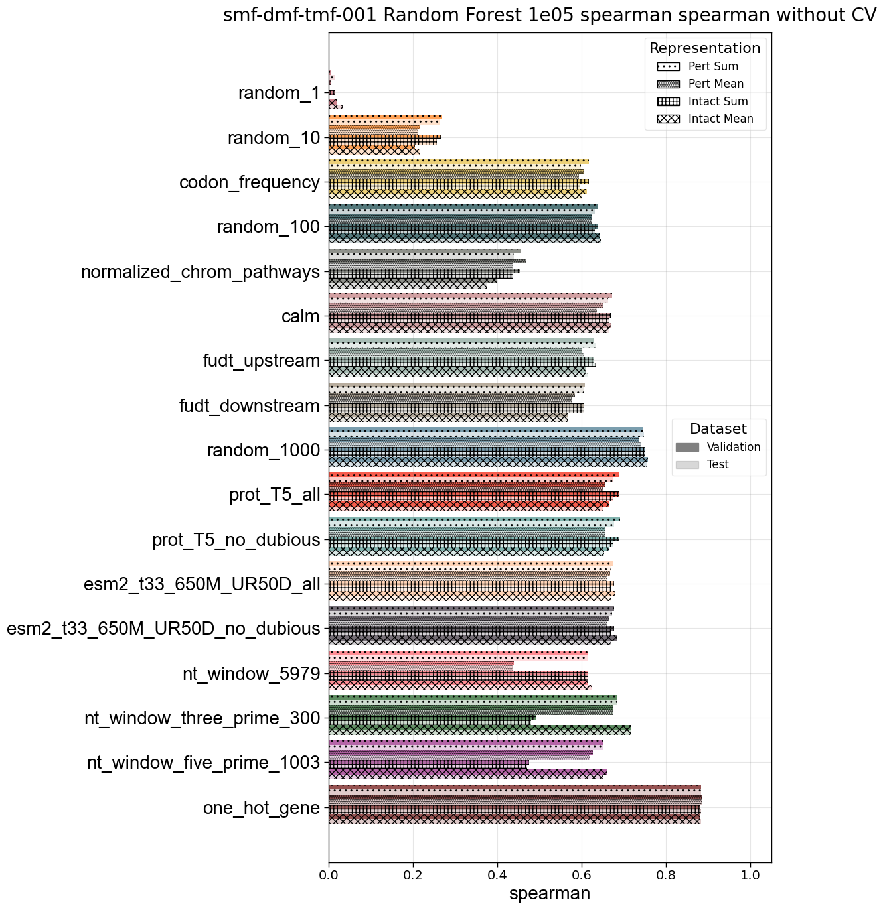
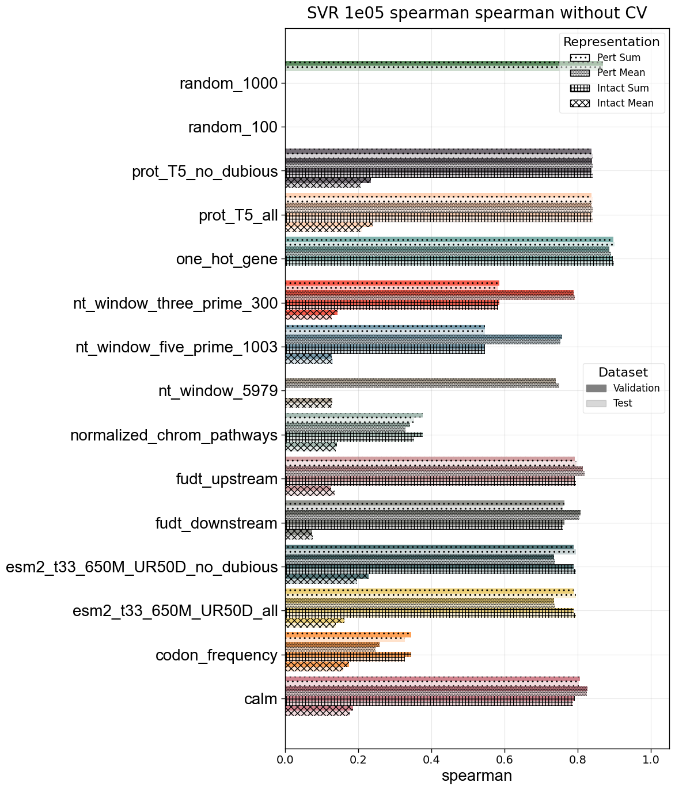
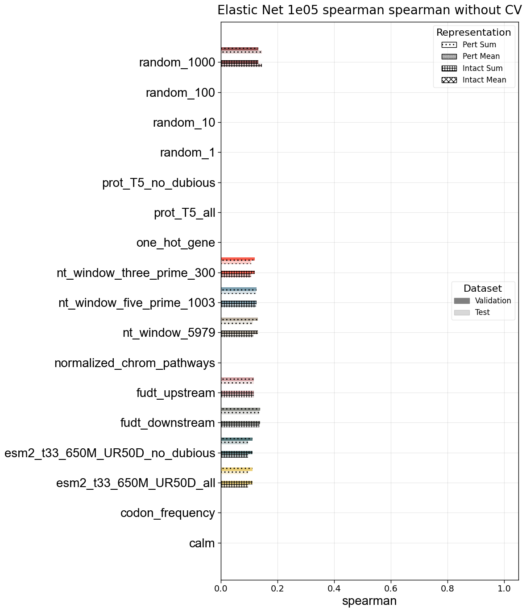
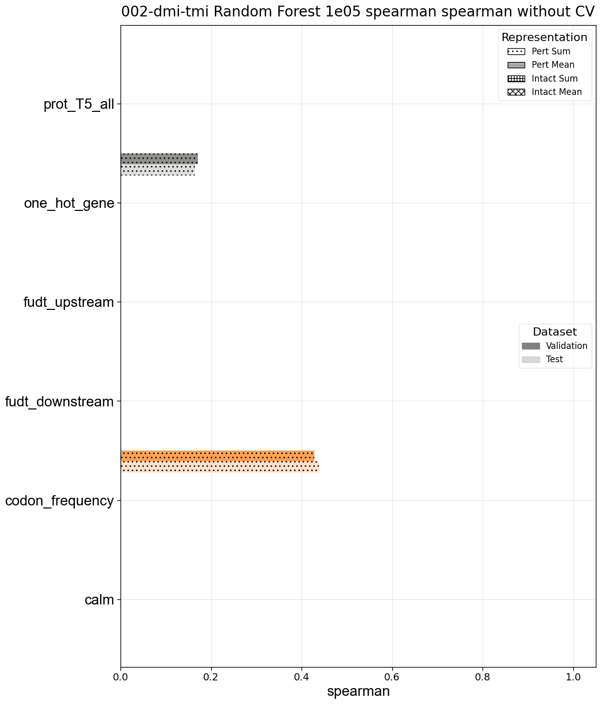
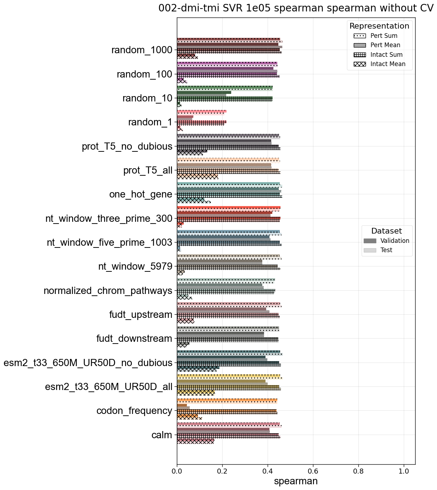
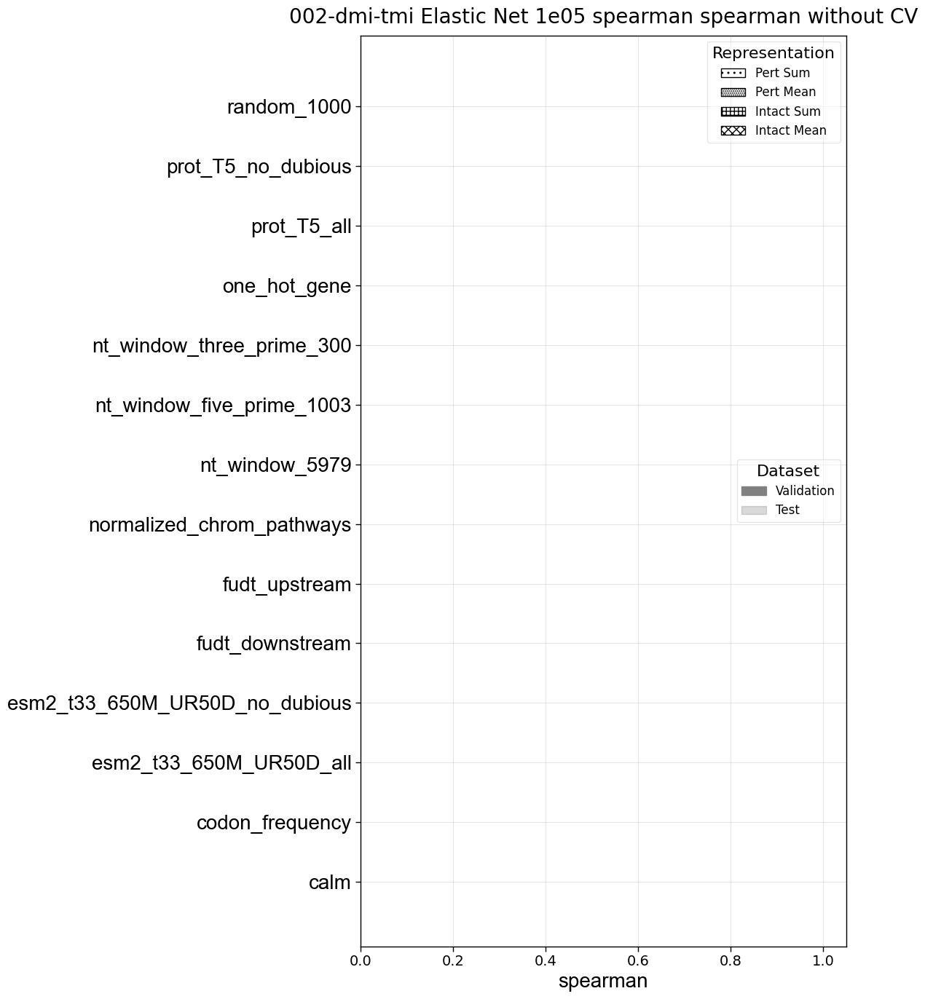
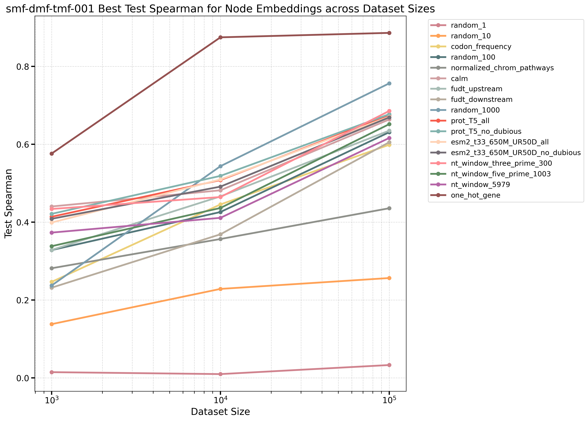
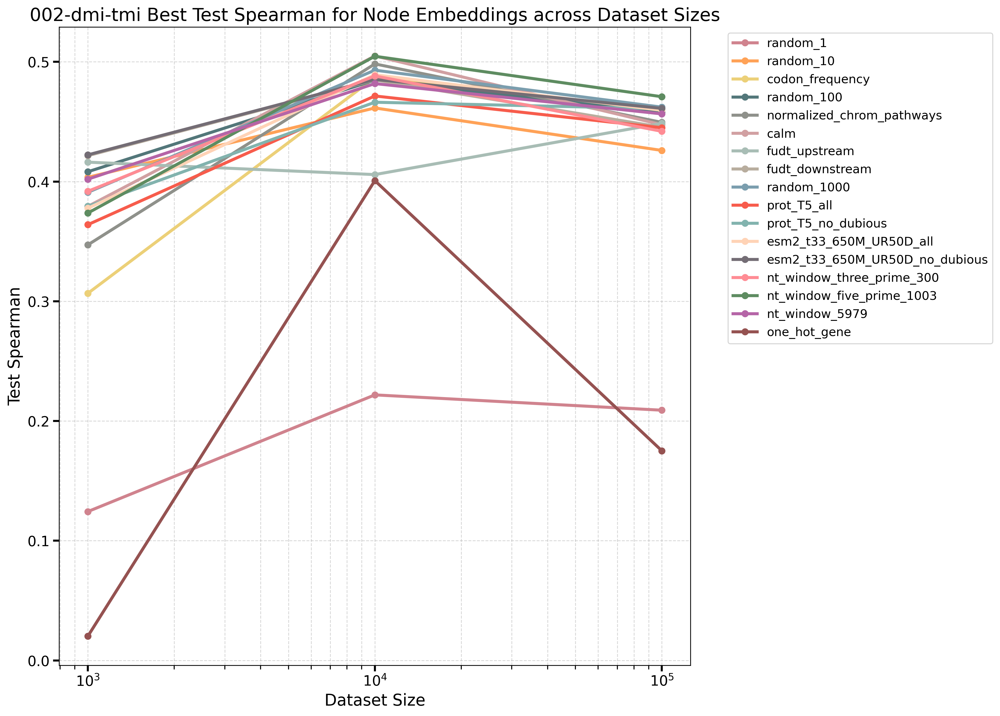

# Supplementary Note — Traditional ML baselines motivate the Cell Graph Transformer

Working (thesis-raw) write-up of the classical-ML mini-study that motivates the CGT.
The paper narrative already reserves this as **Supplementary Fig. S1 / Supplementary
Note** (`paper.nature-biotech-cgt-outline`, Intro beat 2 + Results R3). Plan: build the
full argument + all data here, keep the raw form for the thesis, then cut to a polished
subset for the paper (drop Elastic-Net; keep RF + SVR → **6 bar panels** total).
Supersedes and absorbs the scratch note `scratch.2026.07.08.traditional-ml-cgt-motivation`
(delete that). Related: [[cgt-paper-fig1-methods-state]], [[paper.proof-writing-standard]],
[[paper.nature-biotech.figures]].

> **Status (2026.07.09):** database is being **rebuilt**; the interaction dataset in
> particular will change. All numbers here are provisional against the current result
> CSVs. **No reruns are wired up.** This note (1) collects every figure/CSV, (2) completes
> the tables (value ± CV std) as far as current data allows, (3) records exactly what is
> still missing.

## Plain-English summary

Traditional models (random forest, SVR, elastic net) were trained to predict two yeast
phenotypes from a per-strain feature vector, over ~17 gene encodings and three dataset
sizes ($10^3/10^4/10^5$). Two results carry the argument:

1. **Fitness is essentially solved by gene identity alone.** At $10^5$, one-hot gene
   encoding reaches **Pearson ≈ 0.87 (RF) / 0.90 (SVR)** — a random per-gene code matches
   or beats every pretrained biological embedding once its dimension is large enough, and
   biological content adds nothing. If the goal is predicting multiplexed-deletion fitness,
   a simple model given only *which genes are deleted* has largely won.
2. **Interactions are not solved and do not improve with better encodings.** Every encoding
   plateaus at **Pearson ≈ 0.34–0.39 (Spearman ≈ 0.47)** at $10^5$; the encoding is
   irrelevant. This is a ceiling of the *featurization + model class*, not of the data —
   and it motivates a more general, identity-preserving, attention-based model (the CGT).

---

## 1. Data and experimental design

### 1.1 The two datasets and their queries

Both datasets are pulled from the Neo4j knowledge graph by Cypher, filtered to deletion
perturbations in YEPD at 30 °C, parameterized by a `$gene_set`.

- **Fitness** — `experiments/smf-dmf-tmf-001/` (query in
  `traditional_ml_dataset.py` / [[experiments.smf-dmf-tmf-001.query]]). Selects
  `Genotype`s whose perturbations are **all deletions**, with a **global** `smf`/`dmf`/`tmf`
  fitness phenotype and a **quality filter `fitness_std < 0.15`**; single/double/triple
  deletion strains. Size column `cell_dataset.max_size`.
- **Interaction** — `experiments/002-dmi-tmi/queries/dmi-tmi_1e0{3..6}.cql`. This is the
  key structural caveat: the query is a **`UNION ALL` of `TmiKuzmin2018Dataset` (trigenic,
  `LIMIT 50132`) and `DmiKuzmin2018Dataset` (digenic, `LIMIT 50132`)** at `graph_level =
  'edge'`. So the "$10^5$" interaction set is a **~50/50 mix of digenic and trigenic
  interactions**. Size column `cell_dataset.size`. The per-side `LIMIT` sets the size:
  **500 / 5001 / 50132 per dataset** for $10^3/10^4/10^5$ (so ≈50/50 digenic/trigenic at
  every size; total ≈$10^3/10^4/10^5$), ordered by `e.id` (≈random). Both are Kuzmin 2018
  [cite: Kuzmin et al. 2018, Science] deletion strains.

### 1.2 Construction, subsampling, and splits

- Subsampled to `max_size` ∈ {1000, 10000, 100000} (ordered by `e.id`, "essentially a
  random ordering"). Saved as `X.npy`/`y.npy` under `train/`, `val/`, `test/`, `all/`.
- **Cross-validation:** `random_forest.py` etc. run **5-fold `KFold(n_splits=5,
  shuffle=True, random_state=42)`** on the `all` split when `is_cross_validated` — giving
  the per-fold metrics whose mean±std are reported below. **`test` is a separate held-out
  split (single estimate, no std).** *Val/test check (done):* `random_forest.py` computes
  metrics over `for split in ['all','train','val','test']`, so the reported `test_*` numbers
  are genuinely from the held-out **test** split (`val_*` from `val`). We report what was
  run; if any size turns out scored on `val` only, reporting its `val` value is acceptable.
- **No CV at $10^5$:** `is_cross_validated` was off at $10^5$ (compute), so
  `fold_*_val_*` is empty there for *every* model/dataset. Error bars at $10^5$ therefore
  do not exist in current data.

### 1.3 Featurization

Per-strain feature $\phi = Mx$: $x\in\{0,1\}^N$ ($N=6607$) marks perturbed genes;
$M\in\mathbb{R}^{d\times N}$ has per-gene columns. Encodings: **one-hot** ($M=I$),
**random** (iid `torch.rand`, dims 1/10/100/1000; `torchcell/datasets/random_embedding.py`),
**biological** (ESM2, ProtT5, CaLM, nucleotide-transformer windows, fungal up/down-stream
`fudt`), and hand-crafted (`codon_frequency`, `normalized_chrom_pathways`). Aggregation
over the gene set ∈ {`sum`, `mean`} × {perturbed genes `is_pert=True`, intact genome
`is_pert=False`} → 4 representation variants per encoding (the four hatch styles in the bar
charts).

### 1.4 Data-distribution and split figures (fitness)

Fitness has label-distribution and gene-coverage figures per split (interaction 002 does
not yet — see to-do). Notes: [[experiments.smf-dmf-tmf-001.dataset_size_histograms]],
[[experiments.smf-dmf-tmf-001.dataset_genes_bar_plot]].

- Label distribution per split: `assets/images/smf-dmf-tmf-traditional-ml_{1e03,1e04,1e05}-{train,val,test,all}-histogram.png`
- Gene-count per split: `assets/images/smf-dmf-tmf-traditional-ml_gene-count_{1e03,1e04,1e05}-{all,train,val,test}-bar.png`

### 1.5 Interpretation caveat — the interaction ceiling is blurred

**How the interaction set was selected (from the CQL).** Each size draws, by `LIMIT`,
equal counts from the two Kuzmin 2018 datasets ordered by `e.id` (≈uniform random):
`TmiKuzmin2018Dataset` (trigenic) ⊎ `DmiKuzmin2018Dataset` (digenic), **500/5001/50132 per
side** for $10^3/10^4/10^5$. So every size is a ~50/50 digenic/trigenic mixture drawn at
random from the full pools; the trigenic pool is the larger (~$4\times10^5$).

**Why the ceiling is blurred.** Because the recordable target mixes the two interaction
orders, the achievable-metric ceiling is ill-defined. Experimental measurement noise
propagates less for digenic than for trigenic scores, so the empirical reproducibility
ceiling on a Pearson-style metric is **higher for digenic (≈0.8; cite: Costanzo et al.
2016, Science — leave citation space)** than for trigenic (lower; leave space for the
Kuzmin 2018 trigenic reproducibility figure). A 50/50 mixture therefore sits between the
two — naively a length-weighted combination lands **≈0.8-ish**, but the exact value depends
on the digenic/trigenic reproducibilities and the mix, so we do **not** claim a single
sharp ceiling. This is exactly why interaction saturation (~0.4 Pearson here) must be read
against a *range*, not a point. **A clean trigenic-only comparison** (subset the
~$4\times10^5$ trigenic instances; run $10^5$ or the full ~$4\times10^5$) gives a
well-defined ceiling and is the natural artifact to fold directly into **Fig 2C**. Deferred
to post-rebuild.

---

## 2. Results — data tables

All values = **test metric of the validation-selected best config** per (dataset, model,
size, embedding), i.e. per group take the config with max `val_spearman`, then report its
`test_*` and its 5-fold CV `mean±std`. `—` = run absent/all-NaN (a gap; see coverage).
`test` has **no std** (single split); `±` = CV std over 5 folds, available only at
$10^3/10^4$. Reconstructable directly from
`experiments/{DS}/results/traditional_ml_summary_with_std.csv` (produced by
`traditional_ml-summary_table.py`).

### 2.1 Coverage / gap map (#embeddings with a value / 17)

| dataset·model | $10^3$ | $10^4$ | $10^5$ |
| --- | --: | --: | --: |
| fitness·RF | 17 | 17 | 17 |
| fitness·SVR | 17 | 17 | **14** |
| fitness·EN | **9** | **9** | **8** |
| interaction·RF | 17 | 17 | 17 |
| interaction·SVR | 17 | 17 | 17 |
| interaction·EN | **7** | **2** | **0** |

Complete: fitness·RF, interaction·RF, interaction·SVR. **RF is the safest single model to
show** (17/17 everywhere). EN is a near-useless linear baseline and is the big hole.

### 2.2 Test-Spearman ± CV std, by model across scale

**fitness · RF**

| embedding (dim) | $10^3$ | $10^4$ | $10^5$ |
| --- | --: | --: | --: |
| random_1 (1) | 0.013±0.044 | 0.036±0.015 | 0.033 |
| random_10 (10) | 0.138±0.058 | 0.229±0.023 | 0.263 |
| codon_frequency | 0.384±0.055 | 0.452±0.014 | 0.599 |
| random_100 (100) | 0.248±0.057 | 0.422±0.029 | 0.646 |
| chrom_pathways | 0.208±0.053 | 0.353±0.020 | 0.436 |
| calm | 0.435±0.067 | 0.510±0.016 | 0.662 |
| fudt_upstream | 0.296±0.114 | 0.453±0.027 | 0.635 |
| fudt_downstream | 0.232±0.110 | 0.391±0.008 | 0.605 |
| random_1000 (1000) | 0.367±0.053 | 0.565±0.021 | 0.756 |
| prot_T5_all | 0.414±0.050 | 0.522±0.032 | 0.675 |
| prot_T5_no_dub | 0.421±0.052 | 0.520±0.030 | 0.677 |
| esm2_all | 0.427±0.049 | 0.510±0.017 | 0.669 |
| esm2_no_dub | 0.399±0.061 | 0.506±0.014 | 0.669 |
| nt_5979 | 0.330±0.038 | 0.427±0.031 | 0.623 |
| nt_3prime_300 | 0.367±0.066 | 0.477±0.024 | 0.716 |
| nt_5prime_1003 | 0.348±0.061 | 0.432±0.033 | 0.650 |
| **one_hot (6607)** | **0.561±0.064** | **0.872±0.002** | **0.886** |

**fitness · SVR**

| embedding (dim) | $10^3$ | $10^4$ | $10^5$ |
| --- | --: | --: | --: |
| random_1 (1) | −0.168±0.036 | 0.044±0.018 | — |
| random_10 (10) | 0.075±0.030 | 0.210±0.016 | — |
| codon_frequency | 0.282±0.043 | 0.286±0.014 | 0.328 |
| random_100 (100) | 0.532±0.066 | 0.642±0.011 | — |
| chrom_pathways | 0.336±0.060 | 0.307±0.020 | 0.353 |
| calm | 0.400±0.054 | 0.719±0.016 | 0.825 |
| fudt_upstream | 0.356±0.036 | 0.687±0.012 | 0.818 |
| fudt_downstream | 0.427±0.030 | 0.651±0.013 | 0.804 |
| random_1000 (1000) | 0.461±0.046 | 0.763±0.010 | 0.870±0.002 |
| prot_T5_all | 0.453±0.080 | 0.737±0.010 | 0.840 |
| prot_T5_no_dub | 0.453±0.080 | 0.738±0.010 | 0.841 |
| esm2_all | 0.479±0.043 | 0.774±0.018 | 0.795 |
| esm2_no_dub | 0.384±0.031 | 0.777±0.018 | 0.796 |
| nt_5979 | 0.300±0.043 | 0.802±0.015 | 0.749 |
| nt_3prime_300 | 0.400±0.061 | 0.797±0.007 | 0.792 |
| nt_5prime_1003 | 0.358±0.051 | 0.788±0.016 | 0.753 |
| **one_hot (6607)** | **0.445±0.060** | **0.803±0.009** | **0.900** |

**fitness · EN** (linear baseline; sparse — kept only to show linear fails)

| embedding (dim) | $10^3$ | $10^4$ | $10^5$ |
| --- | --: | --: | --: |
| random_100 (100) | 0.176±0.070 | 0.137±0.024 | — |
| fudt_upstream | 0.304±0.068 | 0.154±0.012 | 0.117 |
| fudt_downstream | 0.129±0.090 | 0.140±0.021 | 0.136 |
| random_1000 (1000) | 0.297±0.056 | 0.245±0.043 | 0.146±0.011 |
| esm2_all | 0.130±0.096 | 0.125±0.019 | 0.096 |
| esm2_no_dub | 0.129±0.096 | 0.125±0.019 | 0.096 |
| nt_5979 | 0.223±0.080 | 0.143±0.019 | 0.114 |
| nt_3prime_300 | 0.224±0.107 | 0.114±0.037 | 0.108 |
| nt_5prime_1003 | 0.152±0.114 | 0.119±0.019 | 0.125 |

**interaction · RF**

| embedding (dim) | $10^3$ | $10^4$ | $10^5$ |
| --- | --: | --: | --: |
| random_1 (1) | 0.183±0.045 | 0.218±0.022 | 0.209 |
| random_10 (10) | 0.366±0.120 | 0.461±0.020 | 0.422 |
| codon_frequency | 0.432±0.089 | 0.487±0.015 | 0.459 |
| random_100 (100) | 0.411±0.067 | 0.492±0.013 | 0.451 |
| chrom_pathways | 0.301±0.092 | 0.487±0.019 | 0.450 |
| calm | 0.327±0.081 | 0.514±0.021 | 0.461 |
| fudt_upstream | 0.404±0.057 | 0.485±0.009 | 0.468 |
| fudt_downstream | 0.388±0.064 | 0.485±0.014 | 0.460 |
| random_1000 (1000) | 0.322±0.075 | 0.498±0.015 | 0.466 |
| prot_T5_all | 0.376±0.065 | 0.485±0.021 | 0.466 |
| prot_T5_no_dub | 0.353±0.064 | 0.478±0.021 | 0.468 |
| esm2_all | 0.387±0.062 | 0.501±0.019 | 0.461 |
| esm2_no_dub | 0.369±0.061 | 0.490±0.016 | 0.464 |
| nt_5979 | 0.435±0.090 | 0.453±0.014 | 0.462 |
| nt_3prime_300 | 0.408±0.124 | 0.500±0.017 | 0.461 |
| nt_5prime_1003 | 0.329±0.070 | 0.502±0.013 | **0.467** |
| one_hot (6607) | 0.193±0.051 | 0.401±0.022 | 0.446 |

**interaction · SVR**

| embedding (dim) | $10^3$ | $10^4$ | $10^5$ |
| --- | --: | --: | --: |
| random_1 (1) | 0.240±0.090 | 0.226±0.017 | 0.209 |
| random_10 (10) | 0.378±0.100 | 0.470±0.019 | 0.422 |
| codon_frequency | 0.381±0.078 | 0.486±0.016 | 0.443 |
| random_100 (100) | 0.415±0.063 | 0.472±0.022 | 0.445 |
| chrom_pathways | 0.267±0.080 | 0.446±0.025 | 0.431 |
| calm | 0.359±0.096 | 0.484±0.019 | 0.461 |
| fudt_upstream | 0.448±0.081 | 0.492±0.016 | 0.461 |
| fudt_downstream | 0.401±0.067 | 0.477±0.017 | 0.452 |
| random_1000 (1000) | 0.451±0.088 | 0.458±0.383 | 0.467 |
| prot_T5_all | 0.332±0.103 | 0.493±0.012 | 0.455 |
| prot_T5_no_dub | 0.332±0.103 | 0.493±0.012 | 0.455 |
| esm2_all | 0.395±0.083 | 0.506±0.017 | 0.466 |
| esm2_no_dub | 0.395±0.083 | 0.506±0.017 | 0.466 |
| nt_5979 | 0.377±0.081 | 0.491±0.014 | 0.461 |
| nt_3prime_300 | 0.359±0.078 | 0.485±0.007 | 0.454 |
| nt_5prime_1003 | 0.375±0.085 | 0.461±0.012 | 0.462 |
| one_hot (6607) | 0.294±0.078 | 0.478±0.018 | 0.464 |

**interaction · EN** (near-empty — see gap map)

| embedding (dim) | $10^3$ | $10^4$ | $10^5$ |
| --- | --: | --: | --: |
| fudt_upstream | 0.398±0.092 | 0.460±0.018 | — |
| fudt_downstream | 0.427±0.072 | 0.458±0.021 | — |
| esm2_all | 0.379±0.082 | — | — |
| esm2_no_dub | 0.378±0.082 | — | — |
| nt_5979 | 0.377±0.090 | — | — |
| nt_3prime_300 | 0.382±0.100 | — | — |
| nt_5prime_1003 | 0.421±0.080 | — | — |

> Anomaly to clean later: interaction·SVR random_1000 @ $10^4$ = 0.458±**0.383** (one
> degenerate fold). Re-fit or drop that fold before publishing.

### 2.3 Pearson headline (the saturation argument)

| dataset·model | embedding | $10^3$ | $10^4$ | $10^5$ |
| --- | --- | --: | --: | --: |
| fitness·RF | one_hot | 0.589±0.090 | 0.873±0.010 | **0.871** |
| fitness·RF | random_1000 | 0.446±0.100 | 0.502±0.022 | 0.689 |
| fitness·RF | nt_3prime_300 | 0.328±0.069 | 0.482±0.017 | 0.696 |
| fitness·SVR | one_hot | 0.491±0.055 | 0.844±0.013 | **0.902** |
| fitness·SVR | random_1000 | 0.448±0.039 | 0.791±0.007 | 0.881±0.004 |
| interaction·RF | one_hot | 0.131±0.073 | 0.288±0.040 | 0.343 |
| interaction·RF | random_1000 | 0.213±0.106 | 0.401±0.033 | **0.390** |
| interaction·RF | esm2_all | 0.280±0.083 | 0.389±0.037 | 0.368 |
| interaction·SVR | esm2_all | 0.270±0.085 | 0.405±0.037 | 0.382 |

Fitness → **Pearson ≈ 0.87–0.90** from identity; interaction → **≈ 0.34–0.39** for
everything (and against a blurred ceiling, §1.5).

---

## 3. Interpretation — the argument for the CGT

### 3.1 Fitness is saturated by gene identity

At $10^5$ a simple model that knows only *which genes are deleted* predicts multiplexed
(single/double/triple) deletion fitness at Pearson ≈ 0.9. Biological embeddings do not
beat identity; a random code matches it once wide enough. **For the goal of predicting
knockout fitness, there is little left to do with more clever features or bigger classical
models** — identity + enough data suffices. This is a "baseline is already strong" result,
not a failure.

### 3.2 Interactions are unsolved, and better encodings don't help

Interaction prediction plateaus at Pearson ≈ 0.4 (Spearman ≈ 0.47) for *every* encoding,
already by $10^5$, and does not rise with dataset size the way fitness does. Two
consequences:

- **You need more data and a more general model.** The classical models are already slow
  to fit at $10^5$ and gain nothing from richer encodings; the ceiling is structural.
- **The engineering/generality argument.** Building a separate small model per subset /
  per phenotype is not general by design. A single more-general method that absorbs the
  cross-correlated structure across entities (genes, interactions, environments) is easier
  to build, reason about, and extend, and has a better chance of discovering relationships
  across the modeled entities. This is the modeling posture of the CGT: model only what we
  know is present and (partly) controllable, so the trained model supports **in-silico
  perturbation → phenotype** experimentation — the virtual-cell component: manipulate the
  model, read the predicted phenotype, inspect trade-offs. The eventual target (tens–
  hundreds of coordinated gene changes for bioreactor-ready strains — cell engineering more
  than single-gene metabolic engineering) needs exactly this generality.

### 3.3 The two levers (barrier to information flow, Fig 1C)

The mini-study localizes the barrier to two design choices at the reductionist→instance
boundary, and the CGT changes both.

- **Lever 1 — representation (columns of $M$).** For the phenotypes classical ML can
  touch, **identity, not biological content, is the active ingredient**: one-hot ≫ biology
  on fitness; all tie on interaction; random ≈ biology once wide enough. So do **not**
  hard-code a biological prior at the boundary — preserve identity with a learnable/random
  per-gene token and let the model learn to use reductionist knowledge if it helps.
- **Lever 2 — pooling.** Additive `sum`/`mean` pooling is permutation-invariant and
  additive: it keeps the *bag* of perturbed genes but destroys the *combination* structure
  epistasis is defined by. No $M$ can restore what the pool discarded — this is why
  interactions are encoding-agnostic and stuck. **Replace pooling with attention over the
  gene set** so higher-order structure survives to the readout. The ~0.47 ceiling is
  evidence that the *encoder+pool* is the barrier, not that the phenotype is unpredictable.

### 3.4 Why we do not use a larger random vector

The feature is $\phi = Mx$: $x$ marks the $\le 3$ perturbed genes ($k$-sparse, $N=6607$)
and $M$ is the encoding. "one-hot is literally the limit" was a hand-wave; the sourced
version has two stacked effects.

1. **Information — why random improves with dimension (JL + compressed sensing).** A random
   dense code is a Johnson–Lindenstrauss image of the one-hot basis; distinct genes collide
   at small $d$ but become near-orthogonal (pairwise inner products $\sim\mathcal N(0,1/d)$)
   once $d\gtrsim\varepsilon^{-2}\log N$ (Johnson & Lindenstrauss 1984; feature hashing is
   the sparse-projection version, Weinberger et al. 2009). Because only $k\le3$ genes are
   active, **compressed sensing** sharpens this: the sparse identity is exactly recoverable
   from $d\gtrsim k\log(N/k)$ random measurements via the restricted isometry property
   (Candès & Tao 2005; Candès–Romberg–Tao 2006) — for $k=3,N\approx6607$ that is *tens* of
   coordinates. So `random_100→1000` already plateaus: there is **no more identity
   information to add**, and one-hot ($d=N$) is just the trivial exact code.

2. **Inductive bias — why one-hot still wins for trees (rotation sensitivity).** A random
   projection is an (approximate) rotation: no coordinate is a gene. Axis-aligned greedy
   learners (CART, random forests) are **not rotationally invariant** — a split isolates
   one coordinate, and one-hot aligns coordinates with gene identity, so trees exploit it
   perfectly; a rotation destroys that alignment (Grinsztajn et al. 2022; Rotation Forest,
   Rodríguez et al. 2006). Rotationally-invariant learners (kernels, random-feature ridge,
   MLPs — Ng 2004; Rahimi & Recht 2007) are indifferent to the basis, so for kernel-SVR
   random $\approx$ one-hot in the large-$d$ limit (JL preserves distances). Hence a larger
   random vector approaches a ceiling **below** one-hot for RF, and only **≈** one-hot for
   SVR — never above.

**On the "one-hot = size limit / least information density" intuition** (your framing —
partly right, and the density half is backwards). one-hot *is* the maximum-dimension,
exactly-orthogonal ($\mu=0$ coherence) limit, and a dense random vector does pack the same
identity into fewer coordinates, so per-coordinate it is "denser." But denser ≠ more
informative: by the **Welch bound** $\mu\ge\sqrt{(N-d)/(d(N-1))}$ you cannot pack $N>d$
identities into $d$ dimensions without introducing mutual coherence (interference), met
with equality only by equiangular tight frames (Welch 1974; Strohmer & Heath 2003). So a
compressed random code carries **at most** the identity information of one-hot, generally
slightly less — it is the *low-dimension, lossy* end of the continuum, not a
higher-information one. Precisely: one-hot maximizes dimension, coordinate-sparsity, and
fidelity ($\mu=0$); random maximizes per-coordinate packing at the cost of $\mu>0$. So
one-hot is the **maximum-fidelity limit**, and "least information density" conflates
per-coordinate packing with total recoverable information (which points the other way).

**Conclusion:** a larger random vector **cannot beat the one-hot it is approaching** (below
for trees, ≈ for kernels) and only costs compute. The sweep was diagnostic — performance
tracks identity *capacity* (dimension), not biological content — and `random_1→1000`
already makes that point. `random_10000` would only confirm the plateau: at most one RF
point later, never on soon-to-be-stale data. *(References to add to `references.bib`:
Johnson–Lindenstrauss 1984; Candès–Tao 2005 / Candès–Romberg–Tao 2006 (RIP/CS); Weinberger
et al. 2009 (feature hashing); Welch 1974 and Strohmer–Heath 2003 (Welch bound/ETFs);
Rahimi–Recht 2007 (random features); Ng 2004, Grinsztajn et al. 2022, Rodríguez et al. 2006
(rotation (in)variance).)*

---

## 4. Figure inventory

**For the paper: 6 bar panels** = {RF, SVR} × {fitness, interaction} at $10^5$
(spearman-selected). EN shown here for completeness, dropped from the paper.

Bar charts (pattern `{prefix}{Model}_{size}_{sel}_{metric}_{cv}.png`; prefix is
`smf-dmf-tmf-001_` for RF-fitness, **empty** for SVR/EN-fitness, `002-dmi-tmi_` for all
interaction):

Fitness (identity wins):

Interaction (encoding-agnostic ~0.47):

Progression across dataset size (the planned Fig-2-style graphic: two curves, changeover
with size; ⚠ current PNGs select by `val_r2` — the §2 tables are the corrected
`val_spearman` version):

Data construction (fitness): label histograms
`assets/images/smf-dmf-tmf-traditional-ml_{1e03,1e04,1e05}-{train,val,test,all}-histogram.png`;
gene-count bars
`assets/images/smf-dmf-tmf-traditional-ml_gene-count_{1e03,1e04,1e05}-{all,train,val,test}-bar.png`.

All-metric bar charts (spearman/pearson/r2/mse/mae/rmse), both `add_cv` (1e3/1e4 only) and
`no_cv`, sel ∈ {mse, spearman}: counts — FIT RF/SVR/EN 60 each, INT RF 78, INT SVR/EN 60.

---

## 5. Source paths

- **Models:** `experiments/{smf-dmf-tmf-001,002-dmi-tmi}/…/{random_forest,svr,elastic_net,
  traditional_ml_dataset}.py`. Random encoding: `torchcell/datasets/random_embedding.py`.
- **Queries:** `experiments/002-dmi-tmi/queries/dmi-tmi_1e0{3..6}.cql`; fitness query in
  `traditional_ml_dataset.py`.
- **Plot scripts:** `traditional_ml-plot_{random_forest,svr,elastic_net}.py` (bars),
  `…-best_performance_vs_dataset_size.py` (progression), `…-num_params.py` (diagnostics).
- **Result CSVs:** `experiments/{DS}/results/{model}/deduplicated_combined_df_spearman_1e{3,4,5}[_add_cv].csv`.
- **Summary tables (value ± std, this study):**
  `experiments/{smf-dmf-tmf-001,002-dmi-tmi}/results/traditional_ml_summary_with_std.csv`,
  produced by **`experiments/smf-dmf-tmf-001/traditional_ml-summary_table.py`** — point
  people here to reconstruct the tables.
- **Markdown table producer:** `scratchpad/tradml_tables.py`
  (`table_by_size` / `table_by_model`, metric-aware bolding). Promote into an experiment
  `scripts/` dir when finalized.
- **W&B (fill path):** `zhao-group/torchcell_smf-dmf-tmf-001_trad-ml_{random-forest,svr,
  elastic-net}_1e0{3,4,5}` (mirror for 002).

---

## 6. Gaps / to-do (deferred — DB rebuilding; no reruns now)

1. **Drop Elastic-Net for the paper** (keep as a one-line "linear fails" note); it is the
   biggest coverage hole (interaction EN 7/2/**0**). For the thesis, optionally complete it.
2. **fitness·SVR $10^5$** missing `random_1/10/100` (SVR JL curve incomplete at $10^5$) —
   fill from W&B if present.
3. **±std at $10^5$** does not exist (no CV run at $10^5$). Either accept single-split
   points there or rerun $10^5$ with 5-fold CV after the rebuild.
4. **Clean trigenic-only interaction comparison** (subset the ~4×10⁵ trigenic; run $10^5$
   or full 4×10⁵) → well-defined ceiling; candidate for **Fig 2C**.
5. **Data-distribution / split figures.** Fitness has label-histogram + gene-count-per-split
   figures (§1.4); 002 does not. **Cannot regenerate via the loaders now** — the schema
   changed and the index is being rebuilt, so the current dataset loaders won't deserialize
   the old data. To reconstruct without the loaders, read the **raw deserialized LMDB**
   directly (bypass the dataset classes) and recompute, per split (train/val/test), the
   label distribution and the digenic-vs-trigenic composition; pair with the CQL selection
   write-up (§1.5) to show "random sample of size X, ~50/50 digenic/trigenic." Deferred until
   the rebuild settles or a raw-LMDB reader is written (best-effort; not blocking).
6. **Selection-criterion mismatch:** progression PNGs use `val_r2`; bars + §2 use
   `val_spearman`. Regenerate PNGs on `val_spearman`.
7. **Naming:** prefix SVR/EN fitness images with `smf-dmf-tmf-001_`; prefix num_params.
8. **random_10000:** optional single RF point later; will not beat one-hot (§3.4). Not now.
9. **Fill vs rerun:** recover every `—` from **W&B** first; rerun only what's missing, only
   post-rebuild.
10. **Promote** this note's helper scripts into a committed `scripts/` location; delete the
    scratch note `scratch.2026.07.08.traditional-ml-cgt-motivation`.

## 2026.07.09 - Ported into the manuscript as Supplementary Note 5

- **Now live in `sections/backmatter.tex`** as **Supplementary Note 5** ("a classical-machine-
  learning case study on gene representation and pooling") — placed **after the theory Notes**
  (empirical follows theoretical), with a lead high-level paragraph + `\notesec` blocks
  (Setup / Representation is about identity / The barrier is pooling). Reuses the existing
  `fig:classical-ml` float as its figure (**Fig S4**) and adds the results table (**Table S2**).
  Title deliberately "case study", not "motivation" (too broad); motivation is drawn out inside.
- **Final paper table** `\label{tab:classical-ml-results}` (Table S2): test Spearman at $10^5$,
  RF+SVR × {fitness, interaction}, EN dropped, one-hot bold on both fitness columns. Generated
  by `experiments/smf-dmf-tmf-001/traditional_ml-summary_table.py` **`--latex`** (regenerate to
  rescale/remetric); data behind it in `traditional_ml_summary_with_std.csv`.
- **SI numbering shifted:** classical-ML table is Table S2 (datasets→S3, databases→S4);
  classical-ML figure is Fig S4 (was a loose "S1" in prose). Contents block updated.
- **Open:** author composes the actual Fig S4 from the six bar charts (data preserved in the
  summary CSVs + `tradml_tables.py`); fill the `[cite: ...]` placeholders (Kuzmin 2018,
  Costanzo 2016, Johnson–Lindenstrauss 1984, Candès–Tao 2005, Grinsztajn 2022) into `references.bib`.

## 2026.07.09 - Figure sizing: Nature WYSIWYG (adhered to for all classical-ML panels)

We author these figures **what-you-see-is-what-you-get** at true print size, so what the
script emits is placed 1:1 in the figure (no rescaling).

**Nature print box** (`paper/nature-biotech/figures/README.md`, `figure-limits.pdf`):
full-width **180 mm**, single-column **88 mm**, **max height 170 mm**.

**Width options for any plot** (use the smallest that stays legible):

- **three-panel ≈ 57.8 mm** (the 3×3-grid cell in
  `notes/assets/drawio/paper-full-page-3x3grid.drawio.svg` is **57.8 mm W × 55.9 mm H**;
  three across ≈ 173 mm < 180 mm);
- **two-panel ≈ 88 mm** (single column);
- **full ≈ 180 mm**.

**These classical-ML panels are vertical** (17 encodings on the y-axis), so **width is the
binding constraint and height is flexible** (≤ 170 mm). Same-size panels can share one
y-label column and be aligned by cropping the labels off all but the leftmost.

**Style rules (all `*_palette.py` scripts):** **Arial**, **6 pt** everywhere (Nature minimum
font size); vector **SVG** with `svg.fonttype=none` (text stays Arial, editable in draw.io);
`savefig.bbox='standard'` overriding the project mplstyle's `tight` default (which otherwise
breaks true sizing). Metrics reduced to spearman/pearson/mse.

**First-guess sizes chosen:** bar panels **57.8 mm W × 165 mm H**; progression **88 mm W ×
65 mm H** (kept `bbox=tight` so its 17-entry legend is included). Base figure canvas started
in `notes/assets/drawio/Fig7-Traditional-ML-justification-of-CGT.drawio.svg`.

**Known first-guess layout items (for the next pass):** at 57.8 mm the long y-labels
dominate (abbreviate the encoding names); the in-plot title overflows (shorten or drop for
panelized figures — the caption labels the panel); the Representation/Dataset legends overlap
the bars (move to a shared external legend).
