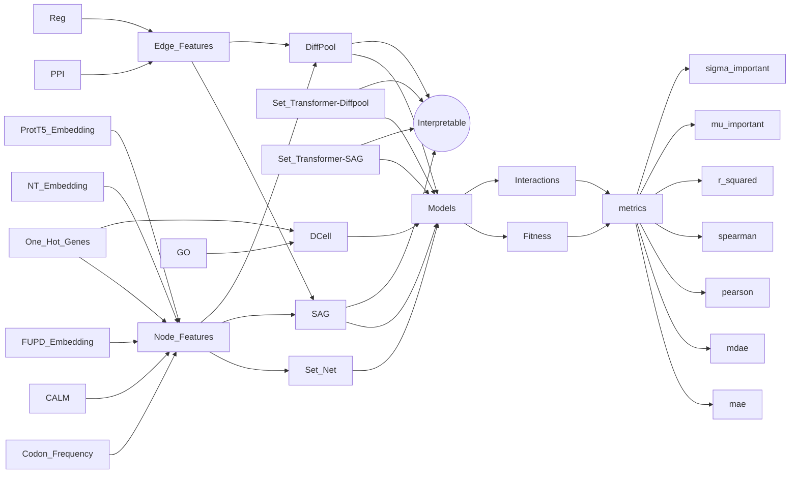

  | id                                        | model                      | nodes features $(\mathcal{N})$    | edge features $(\mathcal{E})$ | mae | mdae | pearson | spearman | $r^2$ | $\mu$(1.0-1.1) | $\sigma$(1.0-1.1) | $\mu$(1.1-1.2) | $\sigma$(1.1-1.2) |
  |:------------------------------------------|:---------------------------|:----------------------------------|:------------------------------|:----|:-----|:--------|:---------|:------|:---------------|:------------------|:---------------|:------------------|
  | "DCell.One_Hot_Genes"                     | DCell                      | One Hot Genes                     | -                             |     |      |         |          |       |                |                   |                |                   |
  | "Set_Net.One_Hot_Genes"                   | Set Net                    | One Hot Genes                     | -                             |     |      |         |          |       |                |                   |                |                   |
  | "Set_Net.Codon_Freq"                      | Set Net                    | Codon Frequency                   | -                             |     |      |         |          |       |                |                   |                |                   |
  | "Set_Net.CALM"                            | Set Net                    | CALM                              | -                             |     |      |         |          |       |                |                   |                |                   |
  | "Set_Net.FUDT_Embedding"                  | Set Net                    | Fungal-UTR-Transformer Embeddings | -                             |     |      |         |          |       |                |                   |                |                   |
  | "Set_Net.NT_Embeddings"                   | Set Net                    | Nucleotide-Transformer Embeddings | -                             |     |      |         |          |       |                |                   |                |                   |
  | "Set_Net.Prot_T5"                         | Set Net                    | Prot T5                           | -                             |     |      |         |          |       |                |                   |                |                   |
  | "Set_Transformer-SAG.One_Hot_Genes"       | Set Transformer - SAG      | One Hot Genes                     | -                             |     |      |         |          |       |                |                   |                |                   |
  | "Set_Transformer-SAG.Codon_Freq"          | Set Transformer - SAG      | Codon Frequency                   | -                             |     |      |         |          |       |                |                   |                |                   |
  | "Set_Transformer-SAG.CALM"                | Set Transformer - SAG      | CALM                              | -                             |     |      |         |          |       |                |                   |                |                   |
  | "Set_Transformer-SAG.FUDT_Embedding"      | Set Transformer - SAG      | Fungal-UTR-Transformer Embeddings | -                             |     |      |         |          |       |                |                   |                |                   |
  | "Set_Transformer-SAG.NT_Embedding"        | Set Transformer - SAG      | Nucleotide-Transformer Embeddings | -                             |     |      |         |          |       |                |                   |                |                   |
  | "Set_Transformer-SAG.Prot_T5"             | Set Transformer - SAG      | Prot T5                           | -                             |     |      |         |          |       |                |                   |                |                   |
  | "Set_Transformer-DiffPool.One_Hot_Genes"  | Set Transformer - DiffPool | One Hot Genes                     | -                             |     |      |         |          |       |                |                   |                |                   |
  | "Set_Transformer-DiffPool.Codon_Freq"     | Set Transformer - DiffPool | Codon Frequency                   | -                             |     |      |         |          |       |                |                   |                |                   |
  | "Set_Transformer-DiffPool.CALM"           | Set Transformer - DiffPool | CALM                              | -                             |     |      |         |          |       |                |                   |                |                   |
  | "Set_Transformer-DiffPool.FUDT_Embedding" | Set Transformer - DiffPool | Fungal-UTR-Transformer Embeddings | -                             |     |      |         |          |       |                |                   |                |                   |
  | "Set_Transformer-DiffPool.NT_Embeddings"  | Set Transformer - DiffPool | Nucleotide-Transformer Embeddings | -                             |     |      |         |          |       |                |                   |                |                   |
  | "Set_Transformer-DiffPool.Prot_T5"        | Set Transformer - DiffPool | Prot T5                           | -                             |     |      |         |          |       |                |                   |                |                   |
  | "SAG.One_Hot_Genes.Physical               | SAG                        | One Hot Genes                     | PPI                           |     |      |         |          |       |                |                   |                |                   |
  | "SAG.Codon_Freq.Physical"                 | SAG                        | Codon Frequency                   | PPI                           |     |      |         |          |       |                |                   |                |                   |
  | "SAG.CALM.Physical"                       | SAG                        | CALM                              | PPI                           |     |      |         |          |       |                |                   |                |                   |
  | "SAG.FUDT_Embeddings.Physical"            | SAG                        | Fungal-UTR-Transformer Embeddings | PPI                           |     |      |         |          |       |                |                   |                |                   |
  | "SAG.NT_Embeddings.Physical"              | SAG                        | Nucleotide-Transformer Embeddings | PPI                           |     |      |         |          |       |                |                   |                |                   |
  | ...                                       | SAG                        | Prot T5                           | PPI                           |     |      |         |          |       |                |                   |                |                   |
  |                                           | DiffPool                   | One Hot Genes                     | PPI                           |     |      |         |          |       |                |                   |                |                   |
  |                                           | DiffPool                   | Codon Frequency                   | PPI                           |     |      |         |          |       |                |                   |                |                   |
  |                                           | DiffPool                   | CALM                              | PPI                           |     |      |         |          |       |                |                   |                |                   |
  |                                           | DiffPool                   | Fungal-UTR-Transformer Embeddings | PPI                           |     |      |         |          |       |                |                   |                |                   |
  |                                           | DiffPool                   | Nucleotide-Transformer Embeddings | PPI                           |     |      |         |          |       |                |                   |                |                   |
  |                                           | DiffPool                   | Prot T5                           | PPI                           |     |      |         |          |       |                |                   |                |                   |
  |                                           | SAG                        | One Hot Genes                     | Reg                           |     |      |         |          |       |                |                   |                |                   |
  |                                           | SAG                        | Codon Frequency                   | Reg                           |     |      |         |          |       |                |                   |                |                   |
  |                                           | SAG                        | CALM                              | Reg                           |     |      |         |          |       |                |                   |                |                   |
  |                                           | SAG                        | Fungal-UTR-Transformer Embeddings | Reg                           |     |      |         |          |       |                |                   |                |                   |
  |                                           | SAG                        | Nucleotide-Transformer Embeddings | Reg                           |     |      |         |          |       |                |                   |                |                   |
  |                                           | SAG                        | Prot T5                           | Reg                           |     |      |         |          |       |                |                   |                |                   |
  |                                           | DiffPool                   | One Hot Genes                     | Reg                           |     |      |         |          |       |                |                   |                |                   |
  |                                           | DiffPool                   | Codon Frequency                   | Reg                           |     |      |         |          |       |                |                   |                |                   |
  |                                           | DiffPool                   | CALM                              | Reg                           |     |      |         |          |       |                |                   |                |                   |
  |                                           | DiffPool                   | Fungal-UTR-Transformer Embeddings | Reg                           |     |      |         |          |       |                |                   |                |                   |
  |                                           | DiffPool                   | Nucleotide-Transformer Embeddings | Reg                           |     |      |         |          |       |                |                   |                |                   |
  |                                           | DiffPool                   | Prot T5                           | Reg                           |     |      |         |          |       |                |                   |                |                   |

