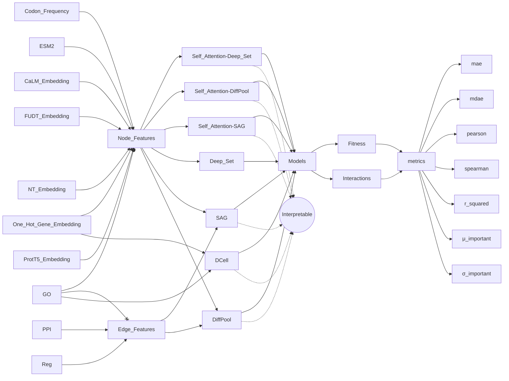

  | id | model                      | nodes features $(\mathcal{N})$    | edge features $(\mathcal{E})$ | mae | mdae | pearson | spearman | $r^2$ | $\mu$(1.0-1.1) | $\sigma$(1.0-1.1) | $\mu$(1.1-1.2) | $\sigma$(1.1-1.2) |
  |:---|:---------------------------|:----------------------------------|:------------------------------|:----|:-----|:--------|:---------|:------|:---------------|:------------------|:---------------|:------------------|
  |    | DCell                      | One Hot Genes                     | -                             |     |      |         |          |       |                |                   |                |                   |
  |    | Set Net                    | One Hot Genes                     | -                             |     |      |         |          |       |                |                   |                |                   |
  |    | Set Net                    | Codon Frequency                   | -                             |     |      |         |          |       |                |                   |                |                   |
  |    | Set Net                    | CALM                              | -                             |     |      |         |          |       |                |                   |                |                   |
  |    | Set Net                    | Fungal-UTR-Transformer Embeddings | -                             |     |      |         |          |       |                |                   |                |                   |
  |    | Set Net                    | Nucleotide-Transformer Embeddings | -                             |     |      |         |          |       |                |                   |                |                   |
  |    | Set Net                    | Prot T5                           | -                             |     |      |         |          |       |                |                   |                |                   |
  |    | Set Transformer- SAG       | One Hot Genes                     | -                             |     |      |         |          |       |                |                   |                |                   |
  |    | Set Transformer - SAG      | Codon Frequency                   | -                             |     |      |         |          |       |                |                   |                |                   |
  |    | Set Transformer - SAG      | CALM                              | -                             |     |      |         |          |       |                |                   |                |                   |
  |    | Set Transformer - SAG      | Fungal-UTR-Transformer Embeddings | -                             |     |      |         |          |       |                |                   |                |                   |
  |    | Set Transformer - SAG      | Nucleotide-Transformer Embeddings | -                             |     |      |         |          |       |                |                   |                |                   |
  |    | Set Transformer - SAG      | Prot T5                           | -                             |     |      |         |          |       |                |                   |                |                   |
  |    | Set Transformer - DiffPool | One Hot Genes                     | -                             |     |      |         |          |       |                |                   |                |                   |
  |    | Set Transformer - DiffPool | Codon Frequency                   | -                             |     |      |         |          |       |                |                   |                |                   |
  |    | Set Transformer - DiffPool | CALM                              | -                             |     |      |         |          |       |                |                   |                |                   |
  |    | Set Transformer - DiffPool | Fungal-UTR-Transformer Embeddings | -                             |     |      |         |          |       |                |                   |                |                   |
  |    | Set Transformer - DiffPool | Nucleotide-Transformer Embeddings | -                             |     |      |         |          |       |                |                   |                |                   |
  |    | Set Transformer - DiffPool | Prot T5                           | -                             |     |      |         |          |       |                |                   |                |                   |
  |    | SAG                        | One Hot Genes                     | PPI                           |     |      |         |          |       |                |                   |                |                   |
  |    | SAG                        | Codon Frequency                   | PPI                           |     |      |         |          |       |                |                   |                |                   |
  |    | SAG                        | CALM                              | PPI                           |     |      |         |          |       |                |                   |                |                   |
  |    | SAG                        | Fungal-UTR-Transformer Embeddings | PPI                           |     |      |         |          |       |                |                   |                |                   |
  |    | SAG                        | Nucleotide-Transformer Embeddings | PPI                           |     |      |         |          |       |                |                   |                |                   |
  |    | SAG                        | Prot T5                           | PPI                           |     |      |         |          |       |                |                   |                |                   |
  |    | DiffPool                   | One Hot Genes                     | PPI                           |     |      |         |          |       |                |                   |                |                   |
  |    | DiffPool                   | Codon Frequency                   | PPI                           |     |      |         |          |       |                |                   |                |                   |
  |    | DiffPool                   | CALM                              | PPI                           |     |      |         |          |       |                |                   |                |                   |
  |    | DiffPool                   | Fungal-UTR-Transformer Embeddings | PPI                           |     |      |         |          |       |                |                   |                |                   |
  |    | DiffPool                   | Nucleotide-Transformer Embeddings | PPI                           |     |      |         |          |       |                |                   |                |                   |
  |    | DiffPool                   | Prot T5                           | PPI                           |     |      |         |          |       |                |                   |                |                   |
  |    | SAG                        | One Hot Genes                     | Reg                           |     |      |         |          |       |                |                   |                |                   |
  |    | SAG                        | Codon Frequency                   | Reg                           |     |      |         |          |       |                |                   |                |                   |
  |    | SAG                        | CALM                              | Reg                           |     |      |         |          |       |                |                   |                |                   |
  |    | SAG                        | Fungal-UTR-Transformer Embeddings | Reg                           |     |      |         |          |       |                |                   |                |                   |
  |    | SAG                        | Nucleotide-Transformer Embeddings | Reg                           |     |      |         |          |       |                |                   |                |                   |
  |    | SAG                        | Prot T5                           | Reg                           |     |      |         |          |       |                |                   |                |                   |
  |    | DiffPool                   | One Hot Genes                     | Reg                           |     |      |         |          |       |                |                   |                |                   |
  |    | DiffPool                   | Codon Frequency                   | Reg                           |     |      |         |          |       |                |                   |                |                   |
  |    | DiffPool                   | CALM                              | Reg                           |     |      |         |          |       |                |                   |                |                   |
  |    | DiffPool                   | Fungal-UTR-Transformer Embeddings | Reg                           |     |      |         |          |       |                |                   |                |                   |
  |    | DiffPool                   | Nucleotide-Transformer Embeddings | Reg                           |     |      |         |          |       |                |                   |                |                   |
  |    | DiffPool                   | Prot T5                           | Reg                           |     |      |         |          |       |                |                   |                |                   |
