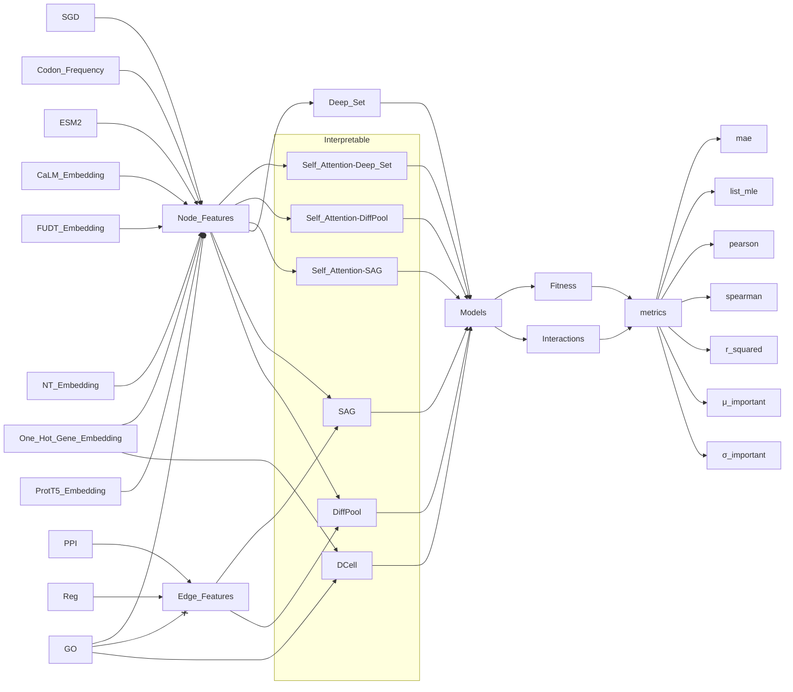

```mermaid
graph LR
    Deep_Set --> Models
    Self_Attention-Deep_Set --> Models
    Node_Features --> Self_Attention-Deep_Set
    Node_Features --> Self_Attention-DiffPool
    Node_Features --> Self_Attention-SAG
    Self_Attention-DiffPool --> Models
    Self_Attention-SAG --> Models
    SAG --> Models
    DiffPool --> Models
    SGD --> Node_Features
    One_Hot_Gene_Embedding --> Node_Features
    Codon_Frequency --> Node_Features
    ESM2 --> Node_Features
    CaLM_Embedding --> Node_Features
    FUDT_Embedding --> Node_Features
    NT_Embedding --> Node_Features
    ProtT5_Embedding --> Node_Features
    Node_Features --> Deep_Set
    Node_Features --> SAG
    Node_Features --> DiffPool
    Edge_Features --> SAG
    Edge_Features --> DiffPool
    PPI --> Edge_Features 
    Reg --> Edge_Features 
    GO --o Node_Features
    GO --x Edge_Features
    GO --> DCell
    One_Hot_Gene_Embedding --> DCell
    DCell --> Models
    Models --> Fitness
    Models --> Interactions
    Interactions --> metrics
    Fitness --> metrics 
    metrics --> mae
    metrics --> list_mle
    metrics --> pearson
    metrics --> spearman
    metrics --> r_squared
    metrics --> μ_important
    metrics --> σ_important
    subgraph Interpretable
        DCell
        SAG
        DiffPool
        Self_Attention-DiffPool
        Self_Attention-SAG
        Self_Attention-Deep_Set
    end
```
