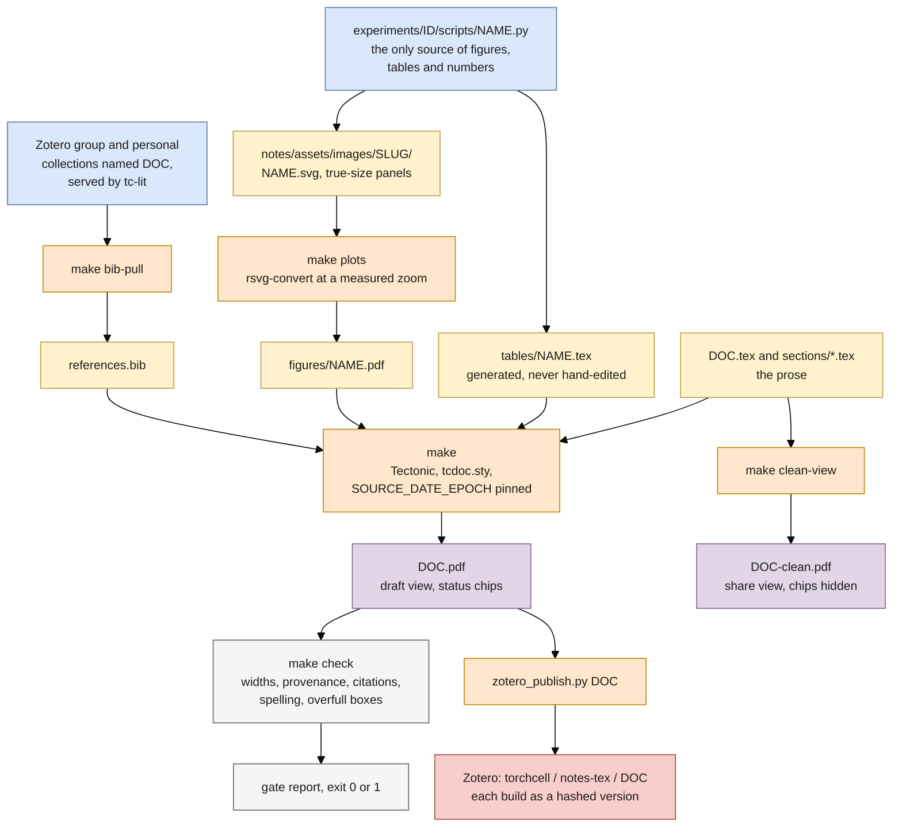

## 2026.09.15 - What `make` builds for a typeset note

Rendered by `bash notes/assets/publish/scripts/mermaid_pdf.sh notes/publishing-system.mermaid.notes-tex-build.md` into `notes/assets/pdf-output/publishing-system.mermaid.notes-tex-build.pdf`, then placed by `make diagrams` in `notes-tex/publishing-system/figures/`. Same colors as the manuscript diagram; gray = the gate, which builds nothing.

