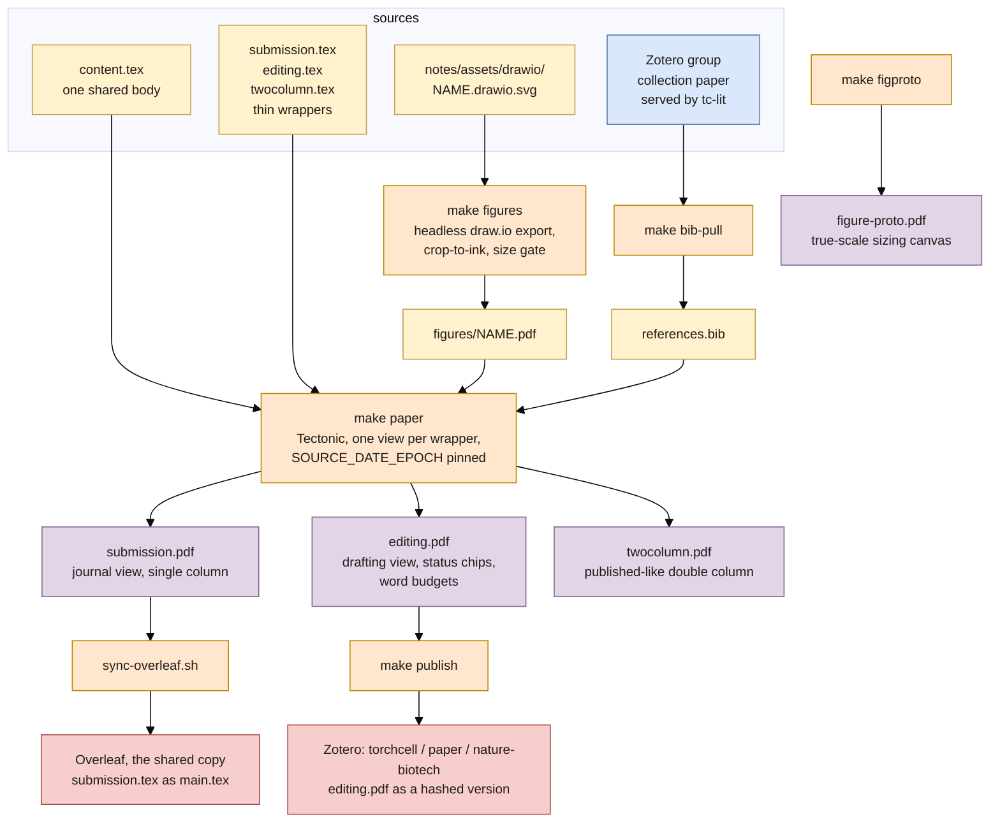

## 2026.09.15 - What `make` builds for the manuscript

Rendered by `bash notes/assets/publish/scripts/mermaid_pdf.sh notes/publishing-system.mermaid.paper-build.md` into `notes/assets/pdf-output/publishing-system.mermaid.paper-build.pdf`, then placed by `make diagrams` in `notes-tex/publishing-system/figures/`. Colors follow the draw.io palette: yellow = a source file, orange = a make target, purple = a built PDF, blue = outside the repo, red = a publish step.

