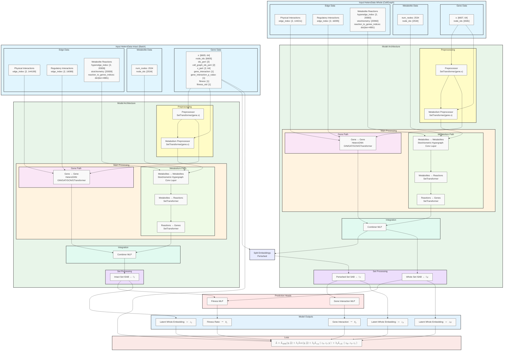

```mermaid
graph TD
  subgraph InputDataWhole["Input HeteroData Whole (CellGraph)"]
    direction TB
    subgraph GeneDataWhole["Gene Data"]
      gene_data_whole["x: [6607, 64]<br>node_ids: [6581]<br>"]
    end
    subgraph MetaboliteDataWhole["Metabolite Data"]
      met_data_whole["num_nodes: 2534<br>node_ids: [2534]"]
    end
    subgraph EdgeDataWhole["Edge Data"]
      phys_edge_whole["Physical Interactions<br>edge_index: [2, 144211]"]
      reg_edge_whole["Regulatory Interactions<br>edge_index: [2, 16095]"]
      met_edge_whole["Metabolite Reactions<br>hyperedge_index: [2, 20960]<br>stoichiometry: [20960]<br>reaction_to_genes_indices: dict(len=4881)"]
    end
  end
  
  subgraph MainProcWhole["Model Architecture"]
    direction TB
    subgraph PreProcWhole["Preprocessing"]
      pre_whole["Preprocessor<br>SetTransformer(gene.x)"]
      met_pre_whole["Metabolism Preprocessor<br>SetTransformer(gene.x)"]
    end
  
    subgraph ParallelPathsWhole["Main Processing"]
      direction LR
      subgraph GenePathWhole["Gene Path"]
        gnn_whole["Gene → Gene<br>HeteroGNN <br>GIN/GAT/GCN/GTransformer"]
      end

      subgraph MetPathWhole["Metabolism Path"]
        met_conv_whole["Metabolites → Metabolites<br>Stoichiometric Hypergraph Conv Layer"]
        met2rxn_whole["Metabolites → Reactions<br>SetTransformer"]
        rxn2gene_whole["Reactions → Genes<br>SetTransformer"]
      end
    end

    subgraph IntegrationWhole["Integration"]
      combiner_whole["Combiner MLP"]
    end

    subgraph SetProcWhole["Set Processing"]
      whole["Whole Set ISAB → $$\; z_W$$"]
      perturbed_whole["Perturbed Set SAB → $$\; z_P$$"]
    end
  end
  
  split["Split Embeddings<br>Perturbed"]

  %% 
  subgraph InputDataIntact["Input HeteroData Intact (Batch)"]
    direction TB
    subgraph GeneDataIntact["Gene Data"]
      gene_data_intact["x: [6605, 64]<br>node_ids: [6605]<br>ids_pert: [2]<br>cell_graph_idx_pert: [2]<br>x_pert: [2, 64]<br>gene_interaction: [1]<br>gene_interaction_p_value: [1]<br> fitness: [1]<br>fitness_std: [1]<br>"]
    end
    subgraph MetaboliteDataIntact["Metabolite Data"]
      met_data_intact["num_nodes: 2534<br>node_ids: [2534]"]
    end
    subgraph EdgeDataIntact["Edge Data"]
      phys_edge_intact["Physical Interactions<br>edge_index: [2, 144199]"]
      reg_edge_intact["Regulatory Interactions<br>edge_index: [2, 16089]"]
      met_edge_intact["Metabolite Reactions<br>hyperedge_index: [2, 20939]<br>stoichiometry: [20939]<br>reaction_to_genes_indices: dict(len=4881)"]
    end
  end

  subgraph MainProcIntact["Model Architecture"]
    direction TB
    subgraph PreProcIntact["Preprocessing"]
      pre_intact["Preprocessor<br>SetTransformer(gene.x)"]
      met_pre_intact["Metabolism Preprocessor<br>SetTransformer(gene.x)"]
    end
    
    subgraph ParallelPathsIntact["Main Processing"]
      direction LR
      subgraph GenePathIntact["Gene Path"]
        gnn_intact["Gene → Gene<br>HeteroGNN <br>GIN/GAT/GCN/GTransformer"]
      end

      subgraph MetPathIntact["Metabolism Path"]
        met_conv_intact["Metabolites → Metabolites<br>Stoichiometric Hypergraph Conv Layer"]
        met2rxn_intact["Metabolites → Reactions<br>SetTransformer"]
        rxn2gene_intact["Reactions → Genes<br>SetTransformer"]
      end
    end

    subgraph IntegrationIntact["Integration"]
      combiner_intact["Combiner MLP"]
    end

    subgraph SetProcIntact["Set Processing"]
      intact["Intact Set ISAB → $$\; z_I$$"]
    end

  end
  
  subgraph PredHeadsIntact["Prediction Heads"]
    fitness["Fitness MLP"]
    gene_int["Gene Interaction MLP"]
  end
  
  subgraph ModelOutputs["Model Outputs"]
    output1["Fitness Ratio $$:= \; y_1$$"]
    output2["Gene Interaction $$:= \; y_2$$"]
    z_W["Latent Whole Embedding $$:= \; z_W$$"]
    z_I["Latent Whole Embedding $$:= \; z_I$$"]
    z_P["Latent Whole Embedding $$:= \; z_P$$"]
  end
  
  subgraph Loss["Loss"]
     loss["$$\mathcal{L}=\mathcal{L}_{\text {MSE}}(y, \hat{y})+\lambda_1 \mathcal{L}_{\operatorname{div}}(y, \hat{y})+\lambda_2 \mathcal{L}_{\text {con}}\left( z_P, z_I, y\right)+\lambda_3 \mathcal{L}_{\text {cell }}\left(z_W, z_P, z_I\right)$$"]
  end

  %% Connections

  %% Whole
  gene_data_whole --> pre_whole
  gene_data_whole --> met_pre_whole
  phys_edge_whole & reg_edge_whole --> gnn_whole
  met_edge_whole --> met_conv_whole
  met_data_whole --> met_conv_whole

  pre_whole --> met_pre_whole
  pre_whole --> gnn_whole
  met_pre_whole --> met_conv_whole
  met_conv_whole --> met2rxn_whole
  met2rxn_whole --> rxn2gene_whole
  gnn_whole & rxn2gene_whole --> combiner_whole
  combiner_whole --> split
  combiner_whole --> whole
  split -->  perturbed_whole
  whole --> fitness
  perturbed_whole --> gene_int

  %% Intact
  gene_data_intact --> pre_intact
  gene_data_intact --> met_pre_intact
  phys_edge_intact & reg_edge_intact --> gnn_intact
  met_edge_intact --> met_conv_intact
  met_data_intact --> met_conv_intact

  pre_intact --> met_pre_intact
  pre_intact --> gnn_intact
  met_pre_intact --> met_conv_intact
  met_conv_intact --> met2rxn_intact
  met2rxn_intact --> rxn2gene_intact
  gnn_intact & rxn2gene_intact --> combiner_intact
  combiner_intact --> intact
  intact --> fitness

  %% Whole to Intact
  gene_data_intact --> split

  %% Labels 

  fitness --> output1
  gene_int --> output2

  %% Outputs
  intact --> z_I
  whole --> z_W
  perturbed_whole --> z_P
  
  %% Loss
  output1 --> loss
  output2 --> loss
  
  z_I --> loss
  z_W --> loss
  z_P --> loss
  gene_data_intact --> loss

  %% Styling
  classDef default fill:#f9f9f9,stroke:#333,stroke-width:1px
  classDef input fill:#e1f5fe,stroke:#333,stroke-width:2px
  classDef process fill:#e8f5e9,stroke:#333,stroke-width:2px
  classDef pred_head fill:#ffe8e8,stroke:#333,stroke-width:2px
  classDef split fill:#e8ebff,stroke:#333,stroke-width:2px
  classDef parallel_paths fill:#fff3e0,stroke:#333,stroke-width:2px
  classDef integration fill:#e1faf0,stroke:#333,stroke-width:2px
  classDef set_processing fill:#eddefc,stroke:#333,stroke-width:2px
  classDef pre fill:#fffcc7,stroke:#333,stroke-width:2px
  classDef gene_path fill:#fae6f6,stroke:#333,stroke-width:2px
  classDef met_path fill:#eefae6,stroke:#333,stroke-width:2px
  classDef model_outputs fill:#e3f2fd,stroke:#333,stroke-width:2px
  classDef loss fill:#fbe9e7,stroke:#333,stroke-width:2px

  class InputDataWhole,GeneDataWhole,MetaboliteDataWhole,EdgeDataWhole input
  class InputDataIntact,GeneDataIntact,MetaboliteDataIntact,EdgeDataIntact input
  
  class MainProcWhole process
  class MainProcIntact, process

  class GenePathWhole,GenePathIntact gene_path
  class MetPathWhole,MetPathIntact met_path

  class PreProcWhole,PreProcIntact pre
  class ParallelPathsWhole,ParallelPathsIntact parallel_paths
  class IntegrationWhole,IntegrationIntact integration
  class SetProcWhole,SetProcIntact set_processing


  class split split
  class PredHeadsWhole,PredHeadsIntact pred_head

  class ModelOutputs model_outputs
  class Loss loss
```