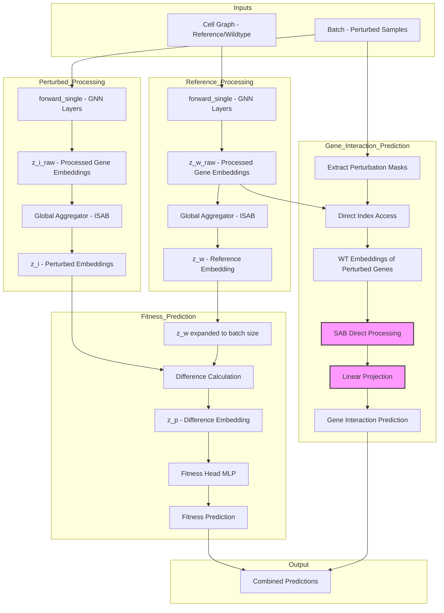

```mermaid
graph TD
    subgraph Inputs
        cell_graph[Cell Graph - Reference/Wildtype]
        batch[Batch - Perturbed Samples]
    end

    subgraph Reference_Processing
        cell_graph --> forward_single_ref[forward_single - GNN Layers]
        forward_single_ref --> z_w_raw[z_w_raw - Processed Gene Embeddings]
        z_w_raw --> global_agg_ref[Global Aggregator - ISAB]
        global_agg_ref --> z_w[z_w - Reference Embedding]
    end

    subgraph Perturbed_Processing
        batch --> forward_single_pert[forward_single - GNN Layers]
        forward_single_pert --> z_i_raw[z_i_raw - Processed Gene Embeddings]
        z_i_raw --> global_agg_pert[Global Aggregator - ISAB]
        global_agg_pert --> z_i[z_i - Perturbed Embeddings]
    end

    subgraph Fitness_Prediction
        z_w --> z_w_exp[z_w expanded to batch size]
        z_i --> diff_calc[Difference Calculation]
        z_w_exp --> diff_calc
        diff_calc --> z_p[z_p - Difference Embedding]
        z_p --> fitness_head[Fitness Head MLP]
        fitness_head --> fitness[Fitness Prediction]
    end

    subgraph Gene_Interaction_Prediction
        batch --> extract_pert_masks[Extract Perturbation Masks]
        z_w_raw --> direct_index[Direct Index Access]
        extract_pert_masks --> direct_index
        direct_index --> pert_gene_embeds[WT Embeddings of Perturbed Genes]
        pert_gene_embeds --> pert_gene_sab[SAB Direct Processing]
        pert_gene_sab --> gi_proj[Linear Projection]
        gi_proj --> gene_interaction[Gene Interaction Prediction]
    end

    subgraph Output
        fitness --> predictions[Combined Predictions]
        gene_interaction --> predictions
    end

    classDef highlight fill:#f9f,stroke:#333,stroke-width:2px;
    class pert_gene_sab,gi_proj highlight;
```
