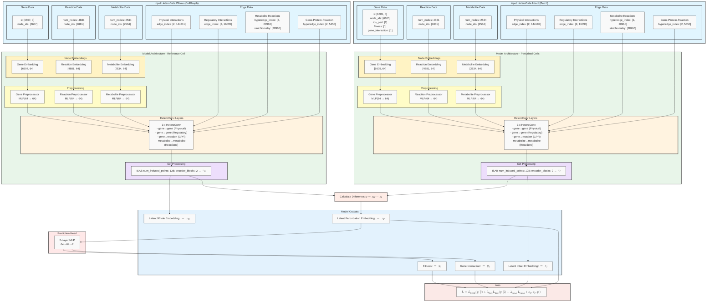

```mermaid
graph TD
  subgraph InputDataWhole["Input HeteroData Whole (CellGraph)"]
    direction TB
    subgraph GeneDataWhole["Gene Data"]
      gene_data_whole["x: [6607, 0]<br>node_ids: [6607]"]
    end
    subgraph MetaboliteDataWhole["Metabolite Data"]
      met_data_whole["num_nodes: 2534<br>node_ids: [2534]"]
    end
    subgraph ReactionDataWhole["Reaction Data"]
      react_data_whole["num_nodes: 4881<br>node_ids: [4881]"]
    end
    subgraph EdgeDataWhole["Edge Data"]
      phys_edge_whole["Physical Interactions<br>edge_index: [2, 144211]"]
      reg_edge_whole["Regulatory Interactions<br>edge_index: [2, 16095]"]
      met_edge_whole["Metabolite Reactions<br>hyperedge_index: [2, 20960]<br>stoichiometry: [20960]"]
      gpr_edge_whole["Gene-Protein-Reaction<br>hyperedge_index: [2, 5450]"]
    end
  end
  
  subgraph MainProcWhole["Model Architecture - Reference Cell"]
    direction TB
    subgraph EmbeddingsWhole["Node Embeddings"]
      gene_emb_whole["Gene Embedding<br>[6607, 64]"]
      react_emb_whole["Reaction Embedding<br>[4881, 64]"]
      met_emb_whole["Metabolite Embedding<br>[2534, 64]"]
    end
    
    subgraph PreProcWhole["Preprocessing"]
      gene_pre_whole["Gene Preprocessor<br>MLP(64 → 64)"]
      react_pre_whole["Reaction Preprocessor<br>MLP(64 → 64)"]
      met_pre_whole["Metabolite Preprocessor<br>MLP(64 → 64)"]
    end
  
    subgraph ConvLayersWhole["HeteroConv Layers"]
      conv_whole["3 x HeteroConv<br>- gene→gene (Physical)<br>- gene→gene (Regulatory)<br>- gene→reaction (GPR)<br>- metabolite→metabolite (Reactions)"]
    end

    subgraph SetProcWhole["Set Processing"]
      whole["ISAB<br>num_induced_points: 128; <br>encoder_blocks: 2<br>→ $$\; z_W$$"]
    end
  end
  
  compute_diff["Calculate Difference<br>$$z_P = z_W - z_I$$"]
  
  subgraph InputDataIntact["Input HeteroData Intact (Batch)"]
    direction TB
    subgraph GeneDataIntact["Gene Data"]
      gene_data_intact["x: [6605, 0]<br>node_ids: [6605]<br>ids_pert: [2]<br>fitness: [1]<br>gene_interaction: [1]"]
    end
    subgraph MetaboliteDataIntact["Metabolite Data"]
      met_data_intact["num_nodes: 2534<br>node_ids: [2534]"]
    end
    subgraph ReactionDataIntact["Reaction Data"]
      react_data_intact["num_nodes: 4881<br>node_ids: [4881]"]
    end
    subgraph EdgeDataIntact["Edge Data"]
      phys_edge_intact["Physical Interactions<br>edge_index: [2, 144102]"]
      reg_edge_intact["Regulatory Interactions<br>edge_index: [2, 16090]"]
      met_edge_intact["Metabolite Reactions<br>hyperedge_index: [2, 20960]<br>stoichiometry: [20960]"]
      gpr_edge_intact["Gene-Protein-Reaction<br>hyperedge_index: [2, 5450]"]
    end
  end

  subgraph MainProcIntact["Model Architecture - Perturbed Cells"]
    direction TB
    subgraph EmbeddingsIntact["Node Embeddings"]
      gene_emb_intact["Gene Embedding<br>[6605, 64]"]
      react_emb_intact["Reaction Embedding<br>[4881, 64]"]
      met_emb_intact["Metabolite Embedding<br>[2534, 64]"]
    end
    
    subgraph PreProcIntact["Preprocessing"]
      gene_pre_intact["Gene Preprocessor<br>MLP(64 → 64)"]
      react_pre_intact["Reaction Preprocessor<br>MLP(64 → 64)"]
      met_pre_intact["Metabolite Preprocessor<br>MLP(64 → 64)"]
    end
    
    subgraph ConvLayersIntact["HeteroConv Layers"]
      conv_intact["3 x HeteroConv<br>- gene→gene (Physical)<br>- gene→gene (Regulatory)<br>- gene→reaction (GPR)<br>- metabolite→metabolite (Reactions)"]
    end

    subgraph SetProcIntact["Set Processing"]
      intact["ISAB<br>num_induced_points: 128;<br>encoder_blocks: 2<br>→ $$\; z_I$$"]
    end
  end
  
  subgraph PredHeadIntact["Prediction Head"]
    pred_head["2-Layer MLP<br>64→64→2"]
  end
  
  subgraph ModelOutputs["Model Outputs"]
    output1["Fitness $$:= \; y_1$$"]
    output2["Gene Interaction $$:= \; y_2$$"]
    z_W["Latent Whole Embedding $$:= \; z_W$$"]
    z_I["Latent Intact Embedding $$:= \; z_I$$"]
    z_P["Latent Perturbation Embedding $$:= \; z_P$$"]
  end
  
  subgraph Loss["Loss"]
     loss["$$\mathcal{L}=\mathcal{L}_{\text{MSE}}(y, \hat{y})+\lambda_{\text{dist}} \mathcal{L}_{\text{dist}}(y, \hat{y})+\lambda_{\text{supcr}} \mathcal{L}_{\text{supcr}}\left(z_P, z_I, y\right)$$"]
  end

  %% Connections (Whole)
  gene_data_whole --> gene_emb_whole
  met_data_whole --> met_emb_whole
  react_data_whole --> react_emb_whole
  
  gene_emb_whole --> gene_pre_whole
  react_emb_whole --> react_pre_whole
  met_emb_whole --> met_pre_whole
  
  gene_pre_whole & react_pre_whole & met_pre_whole --> conv_whole
  phys_edge_whole & reg_edge_whole & met_edge_whole & gpr_edge_whole --> conv_whole
  
  conv_whole --> whole
  whole --> compute_diff
  whole --> z_W
  
  %% Connections (Intact)
  gene_data_intact --> gene_emb_intact
  met_data_intact --> met_emb_intact
  react_data_intact --> react_emb_intact
  
  gene_emb_intact --> gene_pre_intact
  react_emb_intact --> react_pre_intact
  met_emb_intact --> met_pre_intact
  
  gene_pre_intact & react_pre_intact & met_pre_intact --> conv_intact
  phys_edge_intact & reg_edge_intact & met_edge_intact & gpr_edge_intact --> conv_intact
  
  conv_intact --> intact
  intact --> compute_diff
  intact --> z_I
  
  %% Connections for Perturbation and Prediction
  compute_diff --> z_P
  z_P --> pred_head
  
  pred_head --> output1
  pred_head --> output2
  
  %% Loss Connections
  output1 & output2 & z_I & z_P --> loss
  
  %% Styling
  classDef default fill:#f9f9f9,stroke:#333,stroke-width:1px
  classDef input fill:#e1f5fe,stroke:#333,stroke-width:2px
  classDef embedding fill:#fff3c4,stroke:#333,stroke-width:2px
  classDef process fill:#e8f5e9,stroke:#333,stroke-width:2px
  classDef pred_head fill:#ffe8e8,stroke:#333,stroke-width:2px
  classDef parallel_paths fill:#fff3e0,stroke:#333,stroke-width:2px
  classDef preprocessing fill:#fffcc7,stroke:#333,stroke-width:2px
  classDef set_processing fill:#eddefc,stroke:#333,stroke-width:2px
  classDef compute fill:#ffece6,stroke:#333,stroke-width:2px
  classDef model_outputs fill:#e3f2fd,stroke:#333,stroke-width:2px
  classDef loss fill:#fbe9e7,stroke:#333,stroke-width:2px
  
  class InputDataWhole,GeneDataWhole,MetaboliteDataWhole,ReactionDataWhole,EdgeDataWhole input
  class InputDataIntact,GeneDataIntact,MetaboliteDataIntact,ReactionDataIntact,EdgeDataIntact input
  class EmbeddingsWhole,EmbeddingsIntact embedding
  class MainProcWhole,MainProcIntact process
  class PreProcWhole,PreProcIntact preprocessing
  class ConvLayersWhole,ConvLayersIntact parallel_paths
  class SetProcWhole,SetProcIntact set_processing
  class compute_diff compute
  class PredHeadIntact pred_head
  class ModelOutputs model_outputs
  class Loss loss
```
